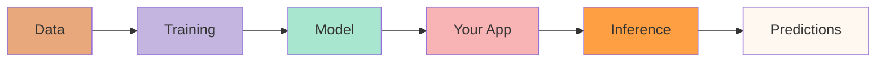
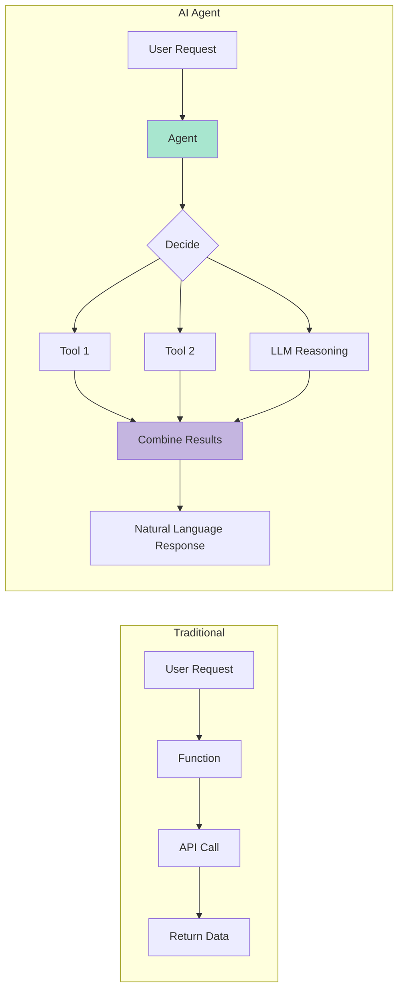
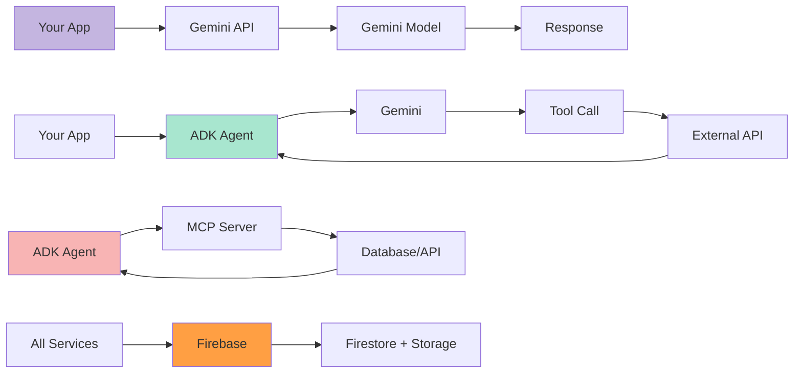
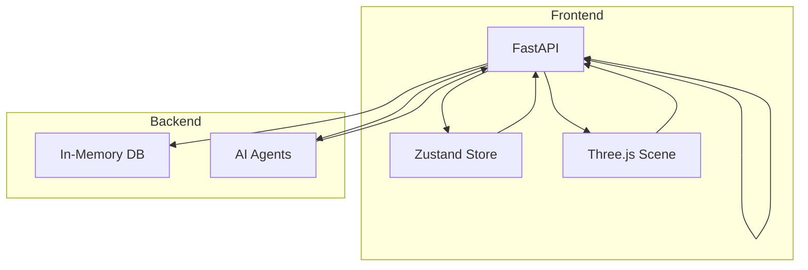

# AI Development for Flutter & Laravel Developers

## A Complete Hands-On Course Using Google Cloud AI & Agent Development Kit

---

**Consolidated Edition - All 30 Chapters + 5 Appendices**

---

## Table of Contents

### Part 1: AI Foundations
- Chapter 1: Welcome to AI Development
- Chapter 2: AI Concepts for Developers
- Chapter 3: Google Cloud AI Platform

### Part 2: Quick Start
- Chapter 4: Setting Up Your Workspace
- Chapter 5: Hello AI - Your First AI Application
- Chapter 6: The Way Back Home Demo Introduction

### Part 3: Gemini Masterclass
- Chapter 7: Understanding Large Language Models
- Chapter 8: Text Generation
- Chapter 9: Image Generation
- Chapter 10: Multimodal AI
- Chapter 11: Chat Sessions

### Part 4: Agent Development
- Chapter 12: Introduction to AI Agents
- Chapter 13: Your First Agent
- Chapter 14: State Management
- Chapter 15: Tools

### Part 5: Multi-Agent Systems
- Chapter 16: Sequential Agents
- Chapter 17: Parallel Agents
- Chapter 18: Orchestration

### Part 6: MCP Protocol
- Chapter 19: Understanding MCP
- Chapter 20: Custom MCP Servers
- Chapter 21: OneMCP

### Part 7: Real-World Features
- Chapter 22: Hybrid Search
- Chapter 23: Event-Driven Architecture
- Chapter 24: Real-Time Communication
- Chapter 25: Deployment

### Part 8: Advanced Topics
- Chapter 26: Memory & Persistence
- Chapter 27: Security
- Chapter 28: Testing AI Agents
- Chapter 29: Monitoring & Observability

### Part 9: Capstone Project
- Chapter 30: Build Your Application

### Appendices
- Appendix A: Python Crash Course
- Appendix B: Glossary
- Appendix C: SDK Reference
- Appendix D: Code Examples
- Appendix E: Next Steps

---


---


# Chapter 1: Welcome to AI Development

## Your Journey from Developer to AI Engineer Begins Here

---

## You're Already Halfway There

**Here's a secret:** As a Flutter or Laravel developer, you already possess most of the skills needed to become an AI engineer. You understand:
- ✅ How to structure applications
- ✅ How to work with APIs
- ✅ How to manage data flow
- ✅ How to ship production code

**AI development is just programming** - with some new tools and concepts. Let's bridge that gap.

---

## The Great Paradigm Shift: From Code to Agents

### Understanding the AI Hierarchy

Before we dive into mindset shifts, let's understand where we are in the AI landscape:

```
┌─────────────────────────────────────────────────────────────────┐
│                        ARTIFICIAL INTELLIGENCE                   │
│  (Any technique that enables computers to mimic human behavior)  │
│  ┌───────────────────────────────────────────────────────────┐  │
│  │                    MACHINE LEARNING                       │  │
│  │     (Systems that learn patterns from data)               │  │
│  │  ┌─────────────────────────────────────────────────────┐  │  │
│  │  │              DEEP LEARNING                          │  │  │
│  │  │   (Neural networks with multiple layers)            │  │  │
│  │  │  ┌───────────────────────────────────────────────┐  │  │  │
│  │  │  │          GENERATIVE AI                        │  │  │  │
│  │  │  │  (Creates new content: text, images, code)    │  │  │  │
│  │  │  │  ┌─────────────────────────────────────────┐  │  │  │  │
│  │  │  │  │        AGENTIC AI                       │  │  │  │  │
│  │  │  │  │  (Reasons, plans, executes autonomously) │  │  │  │  │
│  │  │  │  └─────────────────────────────────────────┘  │  │  │  │
│  │  │  └───────────────────────────────────────────────┘  │  │  │
│  │  └─────────────────────────────────────────────────────┘  │  │
│  └───────────────────────────────────────────────────────────┘  │
└─────────────────────────────────────────────────────────────────┘
```

**You're not learning "AI" - you're learning Agentic AI, the most advanced layer.**

---

## The Three Eras of AI Development

### Era 1: The Traditional Developer Mindset (Where You Are Now)

You write **explicit, deterministic logic**. Every path is defined by you:

```php
// Laravel: You define every branch
function processOrder($order) {
    if ($order->total > 100 && $order->customer->isPremium()) {
        return applyDiscount($order, 0.15);
    }
    if ($order->items->count() > 5) {
        return applyDiscount($order, 0.10);
    }
    return $order;
}
```

```dart
// Flutter: Every outcome is predictable
Widget build(BuildContext context) {
  if (user.isAuthenticated) {
    return DashboardScreen();
  } else {
    return LoginScreen();
  }
}
```

**The Mindset:** "I must anticipate every scenario and code every path."

**Strengths:** Predictable, testable, debuggable
**Limitations:** Can't handle ambiguity, requires explicit rules for everything

---

### Era 2: The Prompt Engineering Mindset (The ChatGPT Era)

Then came Large Language Models. The pattern shifted:

```
User: "Process this order and apply appropriate discounts"
AI:   "I've applied a 15% premium discount because..."
```

**The Mindset:** "I craft the right prompt, AI figures out the rest."

```python
# The prompt engineering approach
response = model.generate_content("""
You are an order processor.
Apply appropriate discounts based on:
- Premium customers get 15% off orders over $100
- Orders with 5+ items get 10% off
- Discounts don't stack

Order: {order_data}
Process this order and explain your reasoning.
""")
```

**The Problem:** This feels magical, but it's **fragile**:
- ❌ You can't reliably test it
- ❌ You can't debug when it fails
- ❌ Results vary between runs
- ❌ No structured output guarantees
- ❌ AI has no access to your real tools/data

**The Mindset Trap:** Many developers get stuck here, thinking prompt engineering is the destination. It's just a stepping stone.

---

### Era 3: The Agentic AI Mindset (Where We're Going)

Now we're entering the age of **autonomous agents** - systems that:
- **Reason** about complex problems
- **Plan** multi-step solutions
- **Execute** using real tools
- **Learn** from outcomes
- **Collaborate** with other agents

```python
# The agentic approach with Google ADK
order_agent = Agent(
    model="gemini-2.5-flash",
    tools=[
        apply_discount,        # Your actual PHP/Laravel function
        check_inventory,       # Your database query
        notify_warehouse,      # Your API call
        check_customer_status  # Your business logic
    ],
    instructions="""
    You are an order processing agent.
    Process orders efficiently while maximizing customer satisfaction.
    Apply discounts according to company policy.
    Escalate to human support for orders over $1000.
    """,
    output_key="processed_order"  # Structured output
)

# The agent decides:
# 1. What tools to use (and in what order)
# 2. How to handle edge cases you didn't anticipate
# 3. When to ask for help
# 4. What to report back
result = await order_agent.run(order)
```

**The New Mindset:** "I design the architecture, define the guardrails, and the agent makes intelligent decisions within them."

---

## The Mindset Shift: A Side-by-Side Comparison

| Aspect | Traditional | Prompt Engineering | Agentic AI |
|--------|-------------|-------------------|------------|
| **Who decides the path?** | You code every branch | AI guesses from prompt | AI reasons and plans |
| **How to handle edge cases?** | Write more `if/else` | Hope prompt covers it | Agent adapts dynamically |
| **Access to real tools?** | ✅ Direct function calls | ❌ Text-only responses | ✅ Tool execution |
| **Testability** | ✅ Unit tests | ❌ Unpredictable | ✅ Agent behavior tests |
| **Debuggability** | ✅ Stack traces | ❌ Black box | ✅ Reasoning traces |
| **Scalability** | Linear with complexity | Degrades with complexity | Handles complexity well |

---

## The Key Insight: You're Not Being Replaced, You're Being Promoted

### What AI Cannot Do (And Never Will)

- ❌ Understand your business context
- ❌ Know your company's unwritten rules
- ❌ Make ethical judgments
- ❌ Design system architecture
- ❌ Navigate office politics
- ❌ Understand user needs deeply

### What You Will Do Differently

| Before (Traditional) | After (Agentic) |
|---------------------|-----------------|
| Write every `if/else` | Define agent instructions and guardrails |
| Handle each edge case manually | Give agent tools to handle edge cases |
| Hardcode business rules | Let agent learn from examples |
| Build single-purpose functions | Build composable agent tools |
| Debug code line-by-line | Review agent reasoning traces |

**You're not being replaced. You're being promoted from "coder" to "AI architect."**

---

## The Deeper Mindset Shift: From Control to Orchestration

### The Hardest Thing to Unlearn

As developers, we're trained to **control everything**:
- Every variable is initialized
- Every branch is handled
- Every error is caught
- Every output is predictable

This training is valuable. It makes us good at what we do.

**But with AI agents, this mindset becomes a limitation.**

### The Control Spectrum

```
┌─────────────────────────────────────────────────────────────────────────────┐
│                        THE CONTROL SPECTRUM                                 │
│                                                                             │
│  FULL CONTROL                                              NO CONTROL       │
│  ◄─────────────────────────────────────────────────────────────────────►    │
│                                                                             │
│  Traditional          Prompt           AI Workflows         AI Agents       │
│  Programming        Engineering         (RAG)              (Autonomous)     │
│       │                 │                  │                    │           │
│       ▼                 ▼                  ▼                    ▼           │
│  ┌─────────┐       ┌─────────┐        ┌─────────┐          ┌─────────┐     │
│  │ You     │       │ You     │        │ You +   │          │ Agent   │     │
│  │ control │       │ craft   │        │ AI      │          │ decides │     │
│  │ all     │       │ prompts │        │ share   │          │ most    │     │
│  │ paths   │       │         │        │ control │          │ things  │     │
│  └─────────┘       └─────────┘        └─────────┘          └─────────┘     │
│                                                                             │
│  High predictability     Low predictability    Medium          Emergent     │
│  Low flexibility         Medium flexibility    predictability  behavior     │
│                                                High flexibility             │
│                                                                             │
└─────────────────────────────────────────────────────────────────────────────┘
```

### The Psychological Barrier

Many developers resist AI agents because they feel like **loss of control**.

> "How can I trust code that I didn't write?"
> "What if the agent does something unexpected?"
> "I need to know exactly what will happen."

**These are valid concerns.** The answer isn't to ignore them—it's to shift how you think about control.

### From Controlling "What" to Controlling "How"

| Traditional Mindset | Agentic Mindset |
|---------------------|-----------------|
| "I control **what** happens" | "I control **how** the agent operates" |
| Every line of code is mine | Every guardrail and tool is mine |
| Predict every output | Define acceptable output ranges |
| Handle every edge case | Give agent tools to handle edge cases |
| Debug the code | Debug the agent's reasoning |

**The shift:** You're not giving up control—you're exercising it at a higher level.

### The Gardener vs. The Clockmaker

Think of it this way:

**The Clockmaker (Traditional Developer)**
- Every gear is precisely placed
- Every movement is predictable
- If something breaks, you fix the gear
- Complexity = more gears

**The Gardener (AI Agent Developer)**
- You prepare the soil (data, tools)
- You define the boundaries (guardrails)
- You guide growth (instructions, examples)
- The plant adapts to conditions you didn't anticipate
- Complexity = richer ecosystem

```
┌──────────────────────────────────────────────────────────────────┐
│                                                                  │
│   CLOCKMAKER                     GARDENER                        │
│   ──────────                     ────────                        │
│                                                                  │
│   • Precision                    • Preparation                   │
│   • Predictability               • Boundaries                    │
│   • Mechanical                   • Organic                       │
│   • You build it                 • You cultivate it              │
│   • Fixed behavior               • Adaptive behavior             │
│   • Debug the mechanism          • Debug the environment         │
│                                                                  │
│   Traditional Code               AI Agents                       │
│                                                                  │
└──────────────────────────────────────────────────────────────────┘
```

---

## Mental Models for Agentic Thinking

These three mental models will transform how you approach AI agent development. Master them, and the rest becomes intuitive.

---

### Mental Model 1: The Agent is a Brilliant but Context-Starved Junior Developer

Think of your agent as a **brilliant junior developer who just joined your company yesterday**:

**What they have:**
- ✅ Strong technical skills (can read, reason, write)
- ✅ Ability to use any tool you give them
- ✅ Can ask clarifying questions
- ✅ Can explain their reasoning
- ✅ Can handle ambiguity better than traditional code

**What they lack:**
- ❌ No knowledge of your business domain
- ❌ No understanding of company culture or unwritten rules
- ❌ No awareness of historical context ("we tried that in 2019")
- ❌ No intuition about which stakeholders to consult
- ❌ No sense of what's "obvious" to your team

#### The Junior Developer Test

Before deploying an agent, ask yourself: **"Would I give these instructions to a smart junior developer on their first day?"**

```python
# ❌ FAILS THE JUNIOR TEST: Too vague
# Junior would ask: "What does 'process' mean? What's a refund policy?"
agent = Agent(
    instructions="Process refunds appropriately."
)

# ❌ FAILS THE JUNIOR TEST: Assumes context
# Junior would ask: "Who's the manager? What's the approval process?"
agent = Agent(
    instructions="Process refunds. Get manager approval for large amounts."
)

# ✅ PASSES THE JUNIOR TEST: Complete, specific, actionable
agent = Agent(
    instructions="""
    You are the Refund Processing Agent for ACME Corporation.

    ═══════════════════════════════════════════════════════════════
    YOUR ROLE
    ═══════════════════════════════════════════════════════════════
    Process customer refund requests according to company policy.
    You are authorized to approve refunds up to $500 automatically.
    Refunds above $500 require manager approval.

    ═══════════════════════════════════════════════════════════════
    REFUND POLICY (Effective January 2024)
    ═══════════════════════════════════════════════════════════════

    ELIGIBILITY:
    • Standard customers: 30 days from purchase date
    • Premium customers: 60 days from purchase date
    • Digital products: No refunds after download confirmed
    • Gift cards: Never refundable (company policy since 2019)

    REFUND METHODS (in order of preference):
    1. Original payment method (default)
    2. Store credit (if customer requests, add 10% bonus)
    3. Check by mail (only if original payment was cash)

    SPECIAL CASES:
    • Defective items: Full refund + $20 inconvenience credit
    • Wrong item shipped: Full refund + free return shipping
    • Customer complaint on social media: Escalate to PR team

    ═══════════════════════════════════════════════════════════════
    APPROVAL WORKFLOW
    ═══════════════════════════════════════════════════════════════

    Amount ≤ $500:
      → Process automatically
      → Email confirmation to customer
      → Log in refund_audit table

    Amount > $500:
      → DO NOT process yet
      → Create approval request with: order_id, amount, reason
      → Email manager: refunds-team@acme.com
      → Wait for approval (check every 30 minutes)
      → Once approved, process normally

    ═══════════════════════════════════════════════════════════════
    ESCALATION RULES
    ═══════════════════════════════════════════════════════════════

    Escalate to human support if:
    • Customer mentions: "lawyer", "lawsuit", "BBB", "attorney"
    • Same customer has requested 3+ refunds in 30 days
    • Order contains items flagged for fraud review
    • Refund amount > $2,000 (requires director approval)

    ═══════════════════════════════════════════════════════════════
    EXAMPLE INTERACTIONS
    ═══════════════════════════════════════════════════════════════

    Customer: "I want a refund on order #12345, it's been 2 weeks"
    Your response:
    1. Look up order #12345 using get_order tool
    2. Check if within 30-day window
    3. Verify no prior refund on this order
    4. Process refund to original payment method
    5. Send confirmation email
    6. Log the transaction

    Customer: "This is ridiculous, I'm calling my lawyer!"
    Your response:
    1. DO NOT process refund
    2. Immediately escalate to human support
    3. Tag with "legal-threat" priority
    4. Acknowledge to customer: "I'm connecting you with our team"
    """
)
```

#### Common Mistakes When Treating Agents Like Seniors

| Mistake | What You Did | What the Agent Does | Fix |
|---------|--------------|---------------------|-----|
| **Vague instructions** | "Handle customer complaints" | Guesses at what "handle" means | Define specific actions and outcomes |
| **Assumed context** | "Follow our usual process" | No idea what "usual" is | Document the actual steps |
| **Implicit priorities** | "Do what's best" | Optimizes for wrong metric | State priorities explicitly |
| **Undocumented exceptions** | "Unless it's a VIP" | Treats everyone the same | List all exceptions upfront |

#### Leveling Up Your "Junior"

The good news: Your junior developer never gets tired, never forgets instructions, and can handle thousands of tasks simultaneously.

```
┌──────────────────────────────────────────────────────────────────┐
│               THE JUNIOR DEVELOPER PROGRESSION                   │
│                                                                  │
│   WEEK 1: Learning the Ropes                                     │
│   ─────────────────────────                                      │
│   • Give extremely detailed instructions                         │
│   • Monitor every decision                                       │
│   • Correct mistakes immediately                                 │
│   • Document edge cases as they arise                            │
│                                                                  │
│   WEEK 2-4: Gaining Confidence                                   │
│   ─────────────────────────────                                  │
│   • Instructions become slightly more high-level                 │
│   • Spot-check decisions instead of monitoring all               │
│   • Add new tools as capabilities expand                         │
│   • Refine instructions based on observed behavior               │
│                                                                  │
│   MONTH 2+: Trusted Team Member                                  │
│   ────────────────────────────────                               │
│   • High-level goals, not step-by-step                           │
│   • Only review escalations and exceptions                       │
│   • Agent handles novel situations gracefully                    │
│   • You focus on architecture, not execution                     │
│                                                                  │
└──────────────────────────────────────────────────────────────────┘
```

---

### Mental Model 2: The Agent is a Tool User, Not a Code Writer

This is the most important mental shift: **Your agent doesn't write logic. It uses tools you've built.**

#### The Tool-First Mindset

```
┌──────────────────────────────────────────────────────────────────┐
│           TRADITIONAL: You Write the Logic                       │
│                                                                  │
│   User Request                                                   │
│       │                                                          │
│       ▼                                                          │
│   ┌─────────────────────────────────────────────────────────┐   │
│   │                    YOUR CODE                             │   │
│   │                                                         │   │
│   │   if request.type == "refund":                          │   │
│   │       if request.amount > 500:                          │   │
│   │           get_manager_approval()                        │   │
│   │       else:                                             │   │
│   │           process_refund()                              │   │
│   │   elif request.type == "exchange":                      │   │
│   │       check_inventory()                                 │   │
│   │       # ... more branching logic                        │   │
│   │                                                         │   │
│   └─────────────────────────────────────────────────────────┘   │
│       │                                                          │
│       ▼                                                          │
│   Result                                                         │
│                                                                  │
└──────────────────────────────────────────────────────────────────┘

┌──────────────────────────────────────────────────────────────────┐
│           AGENTIC: You Build Tools, Agent Uses Them              │
│                                                                  │
│   User Request                                                   │
│       │                                                          │
│       ▼                                                          │
│   ┌─────────────────────────────────────────────────────────┐   │
│   │                    YOUR AGENT                            │   │
│   │                                                         │   │
│   │   "Let me think about this request..."                  │   │
│   │   "I should check the refund policy..."                 │   │
│   │   "The amount is $600, I need approval..."              │   │
│   │   [Uses tools: get_policy, request_approval, etc.]      │   │
│   │                                                         │   │
│   └─────────────────────────────────────────────────────────┘   │
│       │                                                          │
│       │  uses                                                    │
│       ▼                                                          │
│   ┌──────────┐ ┌──────────┐ ┌──────────┐ ┌──────────┐          │
│   │get_policy│ │request_  │ │process_  │ │send_     │          │
│   │   ()     │ │approval()│ │refund()  │ │email()   │          │
│   └──────────┘ └──────────┘ └──────────┘ └──────────┘          │
│        ▲             ▲             ▲             ▲              │
│        │             │             │             │              │
│        └─────────────┴─────────────┴─────────────┘              │
│                              │                                   │
│                     YOU BUILT THESE                              │
│                                                                  │
└──────────────────────────────────────────────────────────────────┘
```

#### What Makes a Great Tool?

Great tools are **atomic, well-documented, and safe**.

```python
# ❌ BAD TOOL: Does too much, unclear what it does
@tool
async def handle_refund_stuff(order_id: str) -> dict:
    """Handles refund-related things."""
    # This is a "God Tool" - avoid!
    pass

# ✅ GOOD TOOL: Atomic, clear purpose, well-documented
@tool
async def get_order_details(order_id: str) -> OrderDetails:
    """
    Retrieve order details from the database.

    Args:
        order_id: The unique order identifier (format: ORD-XXXXX)

    Returns:
        OrderDetails object containing:
        - customer_id: str
        - items: list of {product_id, name, quantity, price}
        - total: float
        - status: str (pending, completed, refunded, cancelled)
        - created_at: datetime
        - payment_method: str

    Raises:
        OrderNotFoundError: If order_id doesn't exist

    Example:
        >>> get_order_details("ORD-12345")
        OrderDetails(customer_id="CUST-001", total=149.99, ...)
    """
    return await db.orders.find_one(order_id)

# ✅ GOOD TOOL: Safe, read-only, side-effect free
@tool
async def check_refund_eligibility(order_id: str) -> EligibilityResult:
    """
    Check if an order is eligible for refund WITHOUT processing it.

    This is a read-only operation - it will not modify any data.

    Args:
        order_id: The order to check

    Returns:
        EligibilityResult with:
        - is_eligible: bool
        - reason: str (explanation if not eligible)
        - days_since_purchase: int
        - refund_window: int (days allowed for refund)
    """
    order = await get_order_details(order_id)
    policy = await get_refund_policy()

    days_since = (datetime.now() - order.created_at).days

    if order.status == "refunded":
        return EligibilityResult(
            is_eligible=False,
            reason="Order already refunded",
            days_since_purchase=days_since,
            refund_window=policy.standard_window_days
        )

    if days_since > policy.standard_window_days:
        if not await is_premium_customer(order.customer_id):
            return EligibilityResult(
                is_eligible=False,
                reason=f"Refund window expired ({policy.standard_window_days} days)",
                days_since_purchase=days_since,
                refund_window=policy.standard_window_days
            )

    return EligibilityResult(
        is_eligible=True,
        reason="Within refund window",
        days_since_purchase=days_since,
        refund_window=policy.standard_window_days
    )

# ✅ GOOD TOOL: Destructive operation with safety checks
@tool
async def process_refund(order_id: str, amount: float, reason: str) -> RefundResult:
    """
    Process a refund for an order.

    ⚠️ DESTRUCTIVE OPERATION: This will actually refund money!

    SAFETY CHECKS (performed automatically):
    1. Verifies order exists and hasn't been refunded
    2. Confirms amount doesn't exceed order total
    3. Requires prior eligibility check (via check_refund_eligibility)
    4. Creates audit log entry

    Args:
        order_id: Order to refund
        amount: Refund amount (must be ≤ order total)
        reason: Customer-facing reason for refund

    Returns:
        RefundResult with:
        - success: bool
        - refund_id: str
        - processed_at: datetime
        - message: str
    """
    # Safety check: Must have checked eligibility first
    if not context.state.get("eligibility_checked"):
        raise SafetyError("Must call check_refund_eligibility before processing")

    # Proceed with refund
    result = await payment_gateway.refund(order_id, amount)
    await audit_log.record(order_id, "refund", amount, reason)

    return RefundResult(
        success=True,
        refund_id=result.id,
        processed_at=datetime.now(),
        message=f"Refunded ${amount} to original payment method"
    )
```

#### Tool Design Principles

| Principle | Description | Example |
|-----------|-------------|---------|
| **Atomic** | One tool, one purpose | `get_order` not `get_and_process_order` |
| **Documented** | Agent reads docs to understand | Include args, returns, examples |
| **Safe by default** | Read operations > write operations | `check_eligibility` before `process_refund` |
| **Composable** | Tools work together | `get_order` + `check_eligibility` + `process_refund` |
| **Observable** | Easy to trace what happened | Return detailed results, log actions |
| **Idempotent** | Same input = same result | Calling `process_refund` twice won't double-refund |

#### Common Tool Anti-Patterns

```
┌──────────────────────────────────────────────────────────────────┐
│                    TOOL ANTI-PATTERNS                            │
│                                                                  │
│  ❌ THE "SWISS ARMY KNIFE"                                       │
│     One tool that does everything                                │
│                                                                  │
│     @tool                                                        │
│     def do_refund_stuff(action, order_id, ...):                  │
│         if action == "check": ...                                │
│         elif action == "process": ...                            │
│         elif action == "email": ...                              │
│                                                                  │
│     PROBLEM: Agent can't discover what it does                   │
│     FIX: Split into separate tools                               │
│                                                                  │
│  ─────────────────────────────────────────────────────────────  │
│                                                                  │
│  ❌ THE "SIDE EFFECT SURPRISE"                                   │
│     Tool does more than it says                                  │
│                                                                  │
│     @tool                                                        │
│     def get_customer(customer_id):                               │
│         customer = db.get(customer_id)                           │
│         analytics.track("customer_viewed")  # Surprise!          │
│         email.notify(customer.email, "Viewed")  # Surprise!      │
│         return customer                                          │
│                                                                  │
│     PROBLEM: Agent doesn't know it's sending emails              │
│     FIX: Keep tools focused, no hidden effects                   │
│                                                                  │
│  ─────────────────────────────────────────────────────────────  │
│                                                                  │
│  ❌ THE "MYSTERY BOX"                                            │
│     No documentation, agent guesses                              │
│                                                                  │
│     @tool                                                        │
│     def process_data(data):                                      │
│         """Process the data."""                                  │
│         # 200 lines of unclear logic                             │
│                                                                  │
│     PROBLEM: Agent doesn't know what data format to provide      │
│     FIX: Document inputs, outputs, and examples                  │
│                                                                  │
└──────────────────────────────────────────────────────────────────┘
```

#### The Tool Economy

Think of your agent's tools as an **economy**:

```
┌──────────────────────────────────────────────────────────────────┐
│                    THE TOOL ECONOMY                              │
│                                                                  │
│   INVESTMENT (Your Time)                                         │
│   ─────────────────────                                          │
│   • Time spent building good tools                               │
│   • Time writing clear documentation                             │
│   • Time adding safety checks                                    │
│                                                                  │
│   RETURNS (Agent Capability)                                     │
│   ────────────────────────                                       │
│   • Agent can handle more scenarios                              │
│   • Fewer escalations to humans                                  │
│   • Faster development of new features                           │
│   • Lower maintenance burden                                     │
│                                                                  │
│   THE MATH:                                                      │
│   ═════════                                                      │
│   Build 10 great tools → Agent handles 100+ scenarios            │
│   Build 10 mediocre tools → Agent handles 10 scenarios, poorly   │
│                                                                  │
│   Every minute spent on tool quality saves hours of debugging.   │
│                                                                  │
└──────────────────────────────────────────────────────────────────┘
```

---

### Mental Model 3: The Agent is an Explorer in a Bounded Space

Your agent **explores** the solution space you define. It finds paths you didn't anticipate, but never leaves the boundaries you set.

#### The Solution Space Visualization

```
┌──────────────────────────────────────────────────────────────────┐
│                    THE SOLUTION SPACE                            │
│                                                                  │
│   ╔════════════════════════════════════════════════════════════╗ │
│   ║  SAFE ZONE: Where agent can operate autonomously           ║ │
│   ║                                                            ║ │
│   ║      ┌─────────┐                                          ║ │
│   ║      │  START  │                                          ║ │
│   ║      │ (User   │                                          ║ │
│   ║      │ Request)│                                          ║ │
│   ║      └────┬────┘                                          ║ │
│   ║           │                                               ║ │
│   ║           ▼                                               ║ │
│   ║    ┌──────────────┐                                       ║ │
│   ║    │  UNDERSTAND  │ ◄── Agent analyzes request           ║ │
│   ║    │   INTENT     │                                       ║ │
│   ║    └──────┬───────┘                                       ║ │
│   ║           │                                               ║ │
│   ║     ┌─────┴─────┐                                         ║ │
│   ║     │           │                                         ║ │
│   ║     ▼           ▼                                         ║ │
│   ║ ┌────────┐  ┌────────┐                                    ║ │
│   ║ │ SIMPLE │  │COMPLEX │ ◄── Agent chooses path            ║ │
│   ║ │  PATH  │  │  PATH  │     based on request              ║ │
│   ║ └───┬────┘  └───┬────┘                                    ║ │
│   ║     │           │                                         ║ │
│   ║     │      ┌────┴────┐                                    ║ │
│   ║     │      │         │                                    ║ │
│   ║     │      ▼         ▼                                    ║ │
│   ║     │  ┌──────┐ ┌──────┐                                  ║ │
│   ║     │  │GATHER│ │ANALYZE│ ◄── Parallel exploration       ║ │
│   ║     │  │ DATA │ │ DATA │                                  ║ │
│   ║     │  └──┬───┘ └──┬───┘                                  ║ │
│   ║     │     │        │                                      ║ │
│   ║     │     └────┬───┘                                      ║ │
│   ║     │          │                                          ║ │
│   ║     │          ▼                                          ║ │
│   ║     │    ┌──────────┐                                     ║ │
│   ║     │    │SYNTHESIZE│                                     ║ │
│   ║     │    └────┬─────┘                                     ║ │
│   ║     │         │                                           ║ │
│   ║     └────┬────┘                                           ║ │
│   ║          │                                                ║ │
│   ║          ▼                                                ║ │
│   ║    ┌───────────┐                                          ║ │
│   ║    │  EXECUTE  │ ◄── Agent takes action                   ║ │
│   ║    │  RESULT   │                                          ║ │
│   ║    └─────┬─────┘                                          ║ │
│   ║          │                                                ║ │
│   ║          ▼                                                ║ │
│   ║    ┌───────────┐                                          ║ │
│   ║    │   DONE    │                                          ║ │
│   ║    │  (Goal)   │                                          ║ │
│   ║    └───────────┘                                          ║ │
│   ║                                                            ║ │
│   ╠════════════════════════════════════════════════════════════╣ │
│   ║  GUARDRAILS: Hard boundaries the agent cannot cross       ║ │
│   ║                                                            ║ │
│   ║  ✋ NO: Delete customer data                               ║ │
│   ║  ✋ NO: Send emails > $1000 without approval               ║ │
│   ║  ✋ NO: Access other customers' information                ║ │
│   ║  ✋ NO: Modify system configuration                        ║ │
│   ║  ✋ NO: Execute raw SQL                                    ║ │
│   ║                                                            ║ │
│   ╠════════════════════════════════════════════════════════════╣ │
│   ║  ESCALATION ZONE: Requires human involvement              ║ │
│   ║                                                            ║ │
│   ║  ⚠️ Legal threats mentioned                               ║ │
│   ║  ⚠️ Refund > $2,000                                       ║ │
│   ║  ⚠️ Customer flagged for fraud                            ║ │
│   ║  ⚠️ Novel situation not in training examples              ║ │
│   ║                                                            ║ │
│   ╚════════════════════════════════════════════════════════════╝ │
│                                                                  │
└──────────────────────────────────────────────────────────────────┘
```

#### Guardrail Design Patterns

Guardrails are **safety mechanisms** that prevent the agent from taking harmful actions.

```python
# Pattern 1: TOOL-LEVEL GUARDRAILS
# The tool itself enforces safety

@tool
async def delete_user(user_id: str) -> Result:
    """
    Delete a user account.

    ⚠️ This tool has built-in guardrails:
    - Cannot delete admin users
    - Cannot delete users with active subscriptions
    - Requires confirmation parameter
    """
    user = await get_user(user_id)

    # Guardrail 1: No deleting admins
    if user.is_admin:
        return Result(
            success=False,
            error="Cannot delete admin users. This requires database-level access."
        )

    # Guardrail 2: No deleting active customers
    if user.has_active_subscription:
        return Result(
            success=False,
            error="Cannot delete users with active subscriptions. Cancel subscription first."
        )

    # Guardrail 3: Require explicit confirmation
    if not context.state.get("deletion_confirmed"):
        return Result(
            success=False,
            error="Deletion not confirmed. Set confirmation flag first."
        )

    # Safe to proceed
    await db.users.delete(user_id)
    return Result(success=True, message=f"User {user_id} deleted")


# Pattern 2: AGENT-LEVEL GUARDRAILS
# Instructions define what the agent should never do

agent = Agent(
    instructions="""
    You are a customer support agent.

    ═══════════════════════════════════════════════════════════════
    HARD RULES (NEVER VIOLATE):
    ═══════════════════════════════════════════════════════════════

    1. NEVER share one customer's data with another customer
    2. NEVER process refunds > $2,000 without human approval
    3. NEVER promise legal or financial advice
    4. NEVER access the database directly (use tools only)
    5. NEVER send emails on behalf of executives

    If a request would require violating these rules, respond:
    "I'm not able to help with that. Let me connect you with a human agent."

    ═══════════════════════════════════════════════════════════════
    """
)


# Pattern 3: CALLBACK GUARDRAILS
# Code that runs before/after agent actions

async def before_tool_callback(tool_name: str, args: dict) -> bool:
    """Runs before every tool execution. Return False to block."""

    # Log all actions
    await audit_log.record(
        agent_id=context.agent_id,
        tool=tool_name,
        args=args,
        timestamp=datetime.now()
    )

    # Block dangerous combinations
    if tool_name == "process_refund":
        if args.get("amount", 0) > 2000:
            await notify_manager(f"Large refund attempted: ${args['amount']}")
            return False  # Block the tool execution

    return True  # Allow the tool execution


agent = Agent(
    instructions="...",
    tools=[...],
    before_tool_callback=before_tool_callback
)
```

#### The Exploration Mindset

The key insight: **You don't program the path. You design the space.**

| Traditional Programming | Agentic Programming |
|------------------------|---------------------|
| "If X, then do Y" | "Here's the space of valid actions" |
| Predict every path | Define valid destinations |
| Code the decision tree | Give the agent a map |
| Handle each case explicitly | Provide tools and let agent figure it out |

```python
# Traditional: You program every path
def handle_customer_request(request):
    if request.type == "refund":
        if request.amount <= 500:
            return process_refund(request)
        else:
            return escalate_to_manager(request)
    elif request.type == "exchange":
        if inventory_available(request.item):
            return process_exchange(request)
        else:
            return suggest_alternatives(request)
    elif request.type == "complaint":
        if request.severity == "high":
            return escalate_to_manager(request)
        else:
            return handle_complaint(request)
    # ... 50 more branches ...


# Agentic: You design the space
customer_agent = Agent(
    tools=[
        process_refund,        # The agent decides when to use this
        process_exchange,      # and in what order
        check_inventory,
        suggest_alternatives,
        escalate_to_manager,
        handle_complaint
    ],
    instructions="""
    You handle customer requests.

    Your goal: Resolve customer issues efficiently while protecting company interests.

    Available tools and when to use them:
    - process_refund: Customer wants money back
    - process_exchange: Customer wants different item
    - check_inventory: Before any exchange
    - escalate_to_manager: Complex situations, large amounts, unhappy customers

    You decide the best approach. When in doubt, escalate.
    """
)

# The agent explores the solution space and finds the best path
result = await customer_agent.run(request)
```

#### When Exploration Goes Wrong (And How to Fix It)

```
┌──────────────────────────────────────────────────────────────────┐
│              TROUBLESHOOTING AGENT BEHAVIOR                      │
│                                                                  │
│  PROBLEM: Agent takes unexpected path                           │
│                                                                  │
│  SYMPTOMS:                                                       │
│  • Agent uses wrong tool for the job                            │
│  • Agent asks unnecessary questions                             │
│  • Agent escalates too often (or not enough)                    │
│  • Agent gets stuck in loops                                    │
│                                                                  │
│  DIAGNOSIS QUESTIONS:                                            │
│  1. Are the tools well-documented?                              │
│  2. Are the instructions clear about priorities?                │
│  3. Are there conflicting signals in instructions?              │
│  4. Is the solution space too large (too many tools)?           │
│                                                                  │
│  FIXES:                                                          │
│                                                                  │
│  ┌────────────────────────────────────────────────────────────┐ │
│  │ Agent uses wrong tool                                       │ │
│  │ FIX: Improve tool documentation, add usage examples         │ │
│  └────────────────────────────────────────────────────────────┘ │
│                                                                  │
│  ┌────────────────────────────────────────────────────────────┐ │
│  │ Agent asks too many questions                               │ │
│  │ FIX: Give more context in instructions, add defaults        │ │
│  └────────────────────────────────────────────────────────────┘ │
│                                                                  │
│  ┌────────────────────────────────────────────────────────────┐ │
│  │ Agent escalates too often                                   │ │
│  │ FIX: Lower escalation threshold, give more autonomy         │ │
│  └────────────────────────────────────────────────────────────┘ │
│                                                                  │
│  ┌────────────────────────────────────────────────────────────┐ │
│  │ Agent stuck in loops                                        │ │
│  │ FIX: Add max_iterations limit, improve termination logic    │ │
│  └────────────────────────────────────────────────────────────┘ │
│                                                                  │
└──────────────────────────────────────────────────────────────────┘
```

---

## Bringing It All Together: The Three Models in Practice

Here's how these three mental models work together:

```
┌──────────────────────────────────────────────────────────────────┐
│              THE THREE MODELS, UNIFIED                           │
│                                                                  │
│   MODEL 1: JUNIOR DEVELOPER                                     │
│   ────────────────────────                                      │
│   → Guides HOW YOU WRITE INSTRUCTIONS                           │
│   → Be specific, be clear, give context                         │
│   → Don't assume knowledge                                      │
│                                                                  │
│   MODEL 2: TOOL USER                                            │
│   ─────────────────                                             │
│   → Guides HOW YOU BUILD CAPABILITIES                           │
│   → Build atomic, documented, safe tools                        │
│   → Let agent decide when to use them                           │
│                                                                  │
│   MODEL 3: EXPLORER                                             │
│   ─────────────────                                             │
│   → Guides HOW YOU DESIGN THE SYSTEM                            │
│   → Define the solution space, set guardrails                   │
│   → Trust the agent to find the path                            │
│                                                                  │
│  ─────────────────────────────────────────────────────────────  │
│                                                                  │
│   THE RESULT:                                                   │
│                                                                  │
│   You become an AI ARCHITECT:                                   │
│   • You design the environment (tools + guardrails)             │
│   • You communicate clearly (instructions)                      │
│   • You trust but verify (monitoring + tracing)                 │
│   • You iterate and improve (refine based on behavior)          │
│                                                                  │
└──────────────────────────────────────────────────────────────────┘
```

---

## Common Mental Blocks (And How to Overcome Them)

### Block 1: "But I Need to Know Exactly What Will Happen"

**The fear:** If I can't predict every outcome, how can I ship this?

**The reframing:** You already ship code with unpredictable outcomes:
- User input you didn't anticipate
- Race conditions you didn't foresee
- Third-party API changes
- Edge cases you missed

**The difference with agents:** The unpredictability is more visible, but also more observable.

```python
# Traditional code: Silent failure
try:
    result = complex_operation()
except Exception:
    pass  # Silent failure, hard to debug

# Agent: Observable reasoning
# You can see exactly what the agent thought and why
```

**Action:** Start with low-stakes agents where mistakes are acceptable. Build confidence.

### Block 2: "The Agent Might Do Something Wrong"

**The fear:** What if the agent sends the wrong email, deletes the wrong data?

**The reframing:** This is a valid concern! But it's solvable with **guardrails**:

```python
# Layer 1: Read-only tools for sensitive operations
@tool
async def preview_email(recipient: str, subject: str, body: str) -> str:
    """Preview email without sending. Returns formatted preview."""
    return f"To: {recipient}\nSubject: {subject}\n\n{body}"

@tool
async def send_email(preview_id: str) -> str:
    """Send a previously previewed email. Requires human approval."""
    # Requires separate human approval step
    pass

# Layer 2: Human-in-the-loop for critical actions
agent = Agent(
    tools=[preview_email, send_email],
    instructions="""
    Always preview emails before sending.
    For emails to executives, require explicit human approval.
    """
)

# Layer 3: Approval workflows
async def requires_approval(action: str, context: dict) -> bool:
    if context.get("recipient", "").endswith("@executive.com"):
        return True
    if "confidential" in context.get("body", "").lower():
        return True
    return False
```

**Action:** Implement guardrails proportional to risk. Low risk = more autonomy. High risk = more oversight.

### Block 3: "This Feels Like I'm Not Really Coding"

**The fear:** Writing instructions feels less "real" than writing code.

**The reframing:** You're coding at a higher level of abstraction:

| Abstraction Level | What You Write |
|-------------------|----------------|
| Assembly | `MOV AX, 5` |
| C | `int x = 5;` |
| Python | `x = 5` |
| Framework | `User.create(name="John")` |
| **Agent Instructions** | `Create a user named John and send welcome email` |

Each level feels "less like coding" to the previous generation. But each level is more powerful.

**Action:** Embrace the abstraction. Your instructions are code—they're just code that compiles to agent behavior.

### Block 4: "What If Someone Asks How It Works?"

**The fear:** If I can't explain every line, how can I defend my code?

**The reframing:** You can explain it better than traditional ML:

| System | Explainability |
|--------|---------------|
| Traditional ML | "The neural network learned it" |
| Prompt Engineering | "The model decided based on the prompt" |
| **AI Agents** | **"Here's the reasoning trace: Thought → Action → Observation → Result"** |

```python
# Agent reasoning is observable
{
    "thought": "User wants to cancel subscription. Need to verify they're eligible.",
    "action": "check_subscription_status",
    "observation": "Subscription is active, 6 months remaining",
    "thought": "They're eligible for cancellation. Check refund policy.",
    "action": "check_refund_policy",
    "observation": "No refund after 30 days. They joined 6 months ago.",
    "thought": "No refund due. Proceed with cancellation.",
    "action": "cancel_subscription",
    "final_answer": "Subscription cancelled. No refund available as you're past the 30-day window."
}
```

**Action:** Use agent tracing. You can explain exactly what happened and why.

---

## A Day in the Life: Before and After

### Before: Traditional Developer Day

```
8:00 AM  - Check production logs for errors from overnight
9:00 AM  - Debug why order #4521 processed incorrectly
10:00 AM - Write new validation rules for edge case found yesterday
11:00 AM - Meeting about new feature requirements
12:00 PM - Lunch
1:00 PM  - Implement new feature (write 47 if/else branches)
3:00 PM  - Write unit tests for new feature
4:00 PM  - Code review teammate's PR
5:00 PM  - Deploy and monitor
6:00 PM  - On-call: Production incident (new edge case)
```

### After: AI Agent Developer Day

```
8:00 AM  - Review agent reasoning traces from overnight
9:00 AM  - Notice agent handled edge case well—no debug needed
10:00 AM - Add new tool to agent's toolkit for new requirement
11:00 AM - Meeting about new feature requirements
12:00 PM - Lunch
1:00 PM  - Update agent instructions for new feature (5 lines)
2:00 PM  - Test agent with new scenarios
3:00 PM  - Add guardrails for edge cases
4:00 PM  - Review agent performance metrics
5:00 PM  - Deploy and monitor
6:00 PM  - Agent handles new edge case automatically—log it for review
```

**The shift:** Less debugging, more designing. Less reacting, more orchestrating.

---

## Practical Exercises to Shift Your Mindset

### Exercise 1: The "What Would the Agent Do?" Journal

For one week, before writing any code, ask yourself:

> "Could an agent figure this out if I gave it the right tools and instructions?"

If yes → Consider building an agent
If no → Write the code yourself

### Exercise 2: The Tool Audit

Look at your existing codebase. Identify:
1. Functions that could be **tools** (atomic operations)
2. Logic that could be **instructions** (decision rules)
3. Edge cases that could be **guardrails** (safety checks)

### Exercise 3: The Agent Specification Practice

Take a complex function you've written. Rewrite it as:

```python
# BEFORE: Imperative code
def process_refund(order_id, reason, user_id):
    order = get_order(order_id)
    if order.status != "completed":
        raise ValueError("Order not completed")
    if order.age_days > 30:
        if not user_is_premium(user_id):
            raise ValueError("Refund window expired")
    # ... 47 more lines of logic

# AFTER: Agent specification
refund_agent = Agent(
    tools=[get_order, issue_refund, notify_user, log_audit],
    instructions="""
    Process refund requests according to company policy:

    REFUND RULES:
    - Standard users: 30-day window
    - Premium users: 60-day window
    - Digital goods: No refunds after download
    - Damaged items: Full refund + apology credit

    ESCALATE TO HUMAN if:
    - Refund amount > $500
    - User has disputed charge before
    - Reason contains "legal" or "lawsuit"
    """
)
```

### Exercise 4: The Reasoning Trace Review

When your agent does something unexpected, don't just fix it. **Read the reasoning trace**:

```
Thought: User wants to cancel order. I should check if it's shipped.
Action: check_order_status(order_id="123")
Observation: Status: SHIPPED
Thought: Order is shipped. Cannot cancel. Should offer return instead.
Action: offer_return_process(user_id="456")
```

Ask yourself: **Where did the agent's reasoning diverge from what I expected?**

This teaches you to write better instructions.

---

## The Mindset Shift Checklist

Before moving on, check your mindset:

- [ ] I understand that agents are **tools users**, not code writers
- [ ] I accept that I control **how** the agent operates, not **what** it does in every case
- [ ] I know that agent behavior is **observable** through reasoning traces
- [ ] I can design **guardrails** for high-risk operations
- [ ] I see myself as an **AI architect**, not just a coder
- [ ] I'm ready to embrace **emergent behavior** within defined boundaries
- [ ] I understand that **instructions are code** at a higher abstraction level

**If you checked all boxes, you're ready to build agents.**

---

## Why This Mindset Shift Matters Now

### The Evolution of Software Development

```
1950s-2000s:  "Tell the computer exactly what to do"
              (Imperative programming)

2000s-2020s:  "Describe what you want, framework handles how"
              (Declarative programming, frameworks)

2020s-2022:   "Ask AI to generate code for you"
              (AI-assisted coding)

2023-Now:     "Design AI systems that reason and act"
              (Agentic AI development)
```

### The Market Reality

| Year | Trend | Developer Demand |
|------|-------|------------------|
| 2010 | "Every app needs a mobile version" | iOS/Android devs |
| 2015 | "Every app needs real-time updates" | WebSocket engineers |
| 2020 | "Every app needs dark mode" | UI/UX engineers |
| **2025** | **"Every app needs AI features"** | **AI engineers like you** |

---

## Your Existing Skills Map Perfectly to Agentic AI

### For Flutter Developers

| Flutter Concept | Agentic AI Equivalent |
|----------------|----------------------|
| `StatefulWidget` with state | Agent with persistent memory |
| `StreamController` | Chat session with streaming responses |
| `Bloc/Cubit` | AI agent with state management |
| `Future.wait()` | Parallel agent execution |
| `Provider` | Shared agent instance |
| `Widget composition` | Agent composition (agents calling agents) |

### For Laravel Developers

| Laravel Concept | Agentic AI Equivalent |
|-----------------|----------------------|
| `Job::dispatch()` | Asynchronous agent execution |
| `Middleware` | Agent callbacks (before/after hooks) |
| `Route::resource()` | MCP tool definition |
| `Event::listen()` | Agent-to-agent communication |
| `Cache::remember()` | Agent memory and RAG |
| `Service Container` | Agent registry and dependency injection |

---

## What Changed? From "AI Responds" to "AI Acts"

### The Critical Difference

**Prompt Engineering (Era 2):**
```
User → Prompt → AI → Text Response → User reads it
```

**Agentic AI (Era 3):**
```
User → Goal → Agent → Reasons → Plans → Executes Tools → Structured Result
```

### A Concrete Example: Booking a Meeting

**Prompt Engineering Approach:**
```
User: "Help me schedule a meeting with John next Tuesday"

AI: "I'd suggest sending John an email with these time slots:
     - Tuesday 10am
     - Tuesday 2pm
     - Tuesday 4pm

     Here's a draft email you can send..."

[User still has to do everything manually]
```

**Agentic AI Approach:**
```python
meeting_agent = Agent(
    tools=[check_calendar, send_email, create_meeting, check_availability],
    instructions="Schedule meetings efficiently"
)

result = await meeting_agent.run("Schedule a meeting with John next Tuesday")

# Agent autonomously:
# 1. Checks your calendar for free slots
# 2. Queries John's availability (via API)
# 3. Finds mutual free time
# 4. Sends calendar invite
# 5. Confirms the meeting
# 6. Reports back: "Meeting scheduled for Tuesday 2pm"
```

**The shift: From "AI suggests" to "AI executes."**

---

## The Three Levels of AI Capability

Understanding this hierarchy helps you know what to build:

### Level 1: LLMs (Large Language Models)
- **What they do:** Generate text based on patterns
- **Example:** "Write a poem about coffee"
- **Limitation:** No memory, no tools, no reasoning

### Level 2: AI Workflows (RAG + Chains)
- **What they do:** Connect LLMs to data and chain prompts
- **Example:** "Answer questions about this PDF document"
- **Components:** Retrieval-Augmented Generation (RAG), prompt chains
- **Limitation:** Still reactive, not autonomous

### Level 3: AI Agents (What You'll Build)
- **What they do:** Reason, plan, and execute autonomously
- **Example:** "Process incoming customer requests and resolve them"
- **Components:** Tools, memory, planning loops, self-correction
- **Capability:** Can handle unexpected situations

```
┌─────────────────────────────────────────────────────────────┐
│  Level 1: LLM          "I can generate text"               │
│  ─────────────────────────────────────────────────────────  │
│  Input: Prompt                                             │
│  Output: Text                                              │
│  Tools: None                                               │
│  Memory: None                                              │
└─────────────────────────────────────────────────────────────┘
                           │
                           ▼
┌─────────────────────────────────────────────────────────────┐
│  Level 2: AI Workflows  "I can use data and follow steps"  │
│  ─────────────────────────────────────────────────────────  │
│  Input: Prompt + Context (RAG)                             │
│  Output: Text (grounded in data)                           │
│  Tools: Read-only (search, retrieve)                       │
│  Memory: Session only                                      │
└─────────────────────────────────────────────────────────────┘
                           │
                           ▼
┌─────────────────────────────────────────────────────────────┐
│  Level 3: AI Agents     "I can reason, plan, and act"      │
│  ─────────────────────────────────────────────────────────  │
│  Input: Goal (not just prompt)                             │
│  Output: Actions + Results                                 │
│  Tools: Read AND Write (execute, modify, create)           │
│  Memory: Persistent, cross-session                         │
│  Reasoning: ReAct loops (Think → Act → Observe → Repeat)   │
└─────────────────────────────────────────────────────────────┘
```

---

## The ReAct Pattern: How Agents Actually Think

Modern AI agents use a pattern called **ReAct** (Reasoning + Acting):

```
┌──────────────────────────────────────────────────────────────┐
│                    THE ReAct LOOP                            │
│                                                              │
│   ┌─────────┐    ┌─────────┐    ┌─────────┐    ┌─────────┐  │
│   │  THINK  │───▶│   ACT   │───▶│ OBSERVE │───▶│ REPEAT  │  │
│   └─────────┘    └─────────┘    └─────────┘    └────┬────┘  │
│       │              │              │               │       │
│       ▼              ▼              ▼               │       │
│   "I need to    Call tool:     "Result shows     Loop      │
│    check        check_         3 items           until     │
│    inventory"   inventory()    available"        done      │
│                                                              │
│   Example Trace:                                             │
│   ─────────────────────────────────────────────────────────  │
│   Thought: User wants to order product X. Need to check     │
│            inventory first.                                  │
│   Action: check_inventory(product_id="X")                   │
│   Observation: 3 items in stock                             │
│   Thought: Enough stock. Now check customer's payment.      │
│   Action: verify_payment(customer_id="123")                 │
│   Observation: Payment method valid                          │
│   Thought: All checks passed. Process the order.            │
│   Action: create_order(product="X", customer="123")         │
│   Observation: Order #4567 created successfully             │
│   Thought: Task complete. Return result to user.            │
│   Final Answer: Order #4567 has been placed successfully.   │
└──────────────────────────────────────────────────────────────┘
```

**This is what makes agents "agentic" - they don't just respond, they reason through problems.**

---

# Session 2: Building Production-Ready AI Agents

## The Production Gap

You've built your first agent. It works great in demos. But when you think about deploying it to production, questions emerge:

| Question | Prototype Answer | Production Need |
|----------|------------------|-----------------|
| **Does it remember context?** | No, starts fresh | Yes, persistent memory |
| **Can it find information?** | Only what's in the prompt | Yes, RAG + knowledge base |
| **Can it coordinate with others?** | Single agent only | Multi-agent orchestration |
| **What if APIs are slow?** | User waits | Event-driven handling |
| **Can it access company tools?** | Hardcoded demos | MCP protocol |
| **Is it observable?** | `print()` statements | Proper tracing/logging |
| **Does it scale?** | One user at a time | Thousands concurrent |

**This session closes these gaps.** We'll transform your prototype into a production-ready system.

---

## The Production Architecture

Here's what a production-ready agent system looks like:

```
┌─────────────────────────────────────────────────────────────────────────────┐
│                    PRODUCTION-READY AGENT ARCHITECTURE                       │
├─────────────────────────────────────────────────────────────────────────────┤
│                                                                              │
│  ┌─────────────┐     ┌─────────────────────────────────────────────────┐   │
│  │   Client    │────▶│              ORCHESTRATION LAYER                 │   │
│  │  (Web/App)  │     │  ┌─────────┐  ┌──────────┐  ┌──────────────┐   │   │
│  └─────────────┘     │  │ Session │  │  Agent   │  │   Workflow   │   │   │
│                      │  │ Manager │  │ Registry│  │   Engine     │   │   │
│                      │  └─────────┘  └──────────┘  └──────────────┘   │   │
│                      └─────────────────────────────────────────────────┘   │
│                                           │                                  │
│         ┌─────────────────────────────────┼─────────────────────────────┐  │
│         │                                 │                              │  │
│         ▼                                 ▼                              ▼  │
│  ┌─────────────┐              ┌─────────────────────┐       ┌──────────┐  │
│  │     RAG     │              │   AGENT SERVICES    │       │   MCP    │  │
│  │   ENGINE    │              │                     │       │ SERVERS  │  │
│  │             │              │  ┌───────────────┐  │       │          │  │
│  │ • Embeddings│              │  │  Specialist   │  │       │ • Tools  │  │
│  │ • Vector DB │              │  │    Agents     │  │       │ • APIs   │  │
│  │ • Retrieval │              │  └───────────────┘  │       │ • Data   │  │
│  │ • Re-ranking│              │  ┌───────────────┐  │       │          │  │
│  │             │              │  │   Parallel    │  │       │          │  │
│  └─────────────┘              │  │    Agents     │  │       └──────────┘  │
│                               │  └───────────────┘  │                      │
│                               └─────────────────────┘                      │
│         │                                 │                      │         │
│         └─────────────────────────────────┼──────────────────────┘         │
│                                           │                                  │
│         ┌─────────────────────────────────┼─────────────────────────────┐  │
│         │                          DATA LAYER                            │  │
│         │  ┌──────────┐  ┌──────────┐  ┌──────────┐  ┌──────────────┐  │  │
│         │  │ Vector   │  │  Graph   │  │  Cache   │  │   Message    │  │  │
│         │  │   Store  │  │    DB    │  │ (Redis)  │  │    Queue     │  │  │
│         │  └──────────┘  └──────────┘  └──────────┘  └──────────────┘  │  │
│         └───────────────────────────────────────────────────────────────┘  │
│                                                                              │
└─────────────────────────────────────────────────────────────────────────────┘
```

---

## RAG: Giving Your Agent a Knowledge Base

### The Problem with Pure LLMs

LLMs have a fundamental limitation: **they only know what they were trained on**.

```
User: "What's our company's refund policy for premium customers?"

LLM: "I don't have access to your company's specific policies.
     You should check your internal documentation or contact HR..."
```

**The issue:** Your company's refund policy wasn't in the training data. The LLM can't know it.

### The RAG Solution

**RAG (Retrieval-Augmented Generation)** solves this by:
1. **Retrieving** relevant documents from your knowledge base
2. **Augmenting** the prompt with that context
3. **Generating** a response grounded in your actual data

```
┌──────────────────────────────────────────────────────────────────┐
│                      THE RAG PIPELINE                            │
│                                                                  │
│   User Query                                                     │
│       │                                                          │
│       ▼                                                          │
│   ┌─────────────┐    ┌─────────────┐    ┌─────────────────┐     │
│   │   EMBED     │───▶│   VECTOR    │───▶│    RETRIEVE     │     │
│   │   Query     │    │   SEARCH    │    │   Top-K Docs    │     │
│   └─────────────┘    └─────────────┘    └─────────────────┘     │
│                                                │                 │
│                                                ▼                 │
│   ┌─────────────┐    ┌─────────────┐    ┌─────────────────┐     │
│   │  GENERATE   │◀───│   AUGMENT   │◀───│    RE-RANK      │     │
│   │  Response   │    │   Prompt    │    │   (Optional)    │     │
│   └─────────────┘    └─────────────┘    └─────────────────┘     │
│                                                                  │
│   Augmented Prompt:                                              │
│   ─────────────────────────────────────────────────────────────  │
│   Context: [Retrieved document about refund policy...]          │
│                                                                  │
│   User Question: What's our company's refund policy?            │
│                                                                  │
│   Instructions: Answer based on the provided context.           │
└──────────────────────────────────────────────────────────────────┘
```

### RAG in Action with ADK

```python
from google.adk import Agent
from google.adk.tools import ToolContext

# Define your knowledge retrieval tool
async def search_company_docs(query: str, context: ToolContext) -> str:
    """
    Search company knowledge base for relevant documents.

    This connects to your vector database (e.g., Pinecone, Weaviate,
    or Vertex AI Vector Search) and returns relevant context.
    """
    # 1. Embed the query
    query_embedding = await embedding_model.embed(query)

    # 2. Search vector database
    results = await vector_db.search(
        collection="company_docs",
        query_vector=query_embedding,
        top_k=5
    )

    # 3. Return formatted context
    context_text = "\n\n".join([
        f"Source: {doc.metadata['source']}\n{doc.content}"
        for doc in results
    ])

    return context_text

# Create RAG-enabled agent
support_agent = Agent(
    model="gemini-2.5-flash",
    tools=[search_company_docs],
    instructions="""
    You are a customer support agent with access to company documentation.

    ALWAYS search for relevant documents before answering questions
    about company policies, procedures, or product details.

    Cite your sources when providing information.
    """
)
```

### When to Use RAG vs. Fine-tuning

| Scenario | Use RAG | Use Fine-tuning |
|----------|---------|-----------------|
| Frequently changing data | ✅ | ❌ |
| Need to cite sources | ✅ | ❌ |
| Domain-specific style | ❌ | ✅ |
| Real-time updates required | ✅ | ❌ |
| Proprietary knowledge | ✅ | ⚠️ (with privacy concerns) |
| Consistent output format | ❌ | ✅ |

**Pro tip:** Most production systems use **both** - RAG for knowledge, fine-tuning for behavior.

---

## MCP: The Universal Tool Protocol

### The Tool Integration Problem

Your agent needs to connect to:
- 🗄️ Databases (PostgreSQL, BigQuery, Spanner)
- 📧 Services (SendGrid, Slack, Jira)
- 🏢 Enterprise systems (SAP, Salesforce)
- 🔧 Custom APIs (your company's internal tools)

**The old way:** Write custom integration code for each tool. Fragile, repetitive, hard to maintain.

**The MCP way:** One protocol, universal compatibility.

### What is MCP?

**Model Context Protocol (MCP)** is an open standard that lets agents discover and use tools through a consistent interface.

```
┌──────────────────────────────────────────────────────────────────┐
│                    MCP ARCHITECTURE                              │
│                                                                  │
│   ┌─────────────────────────────────────────────────────────┐   │
│   │                    AI AGENT                              │   │
│   │                  (ADK, LangChain, etc.)                  │   │
│   └─────────────────────────┬───────────────────────────────┘   │
│                             │                                    │
│                             │ MCP Protocol                       │
│                             │ (Standard JSON-RPC)                │
│                             │                                    │
│   ┌─────────────────────────┼───────────────────────────────┐   │
│   │                         │                                │   │
│   │  ┌──────────┐  ┌──────────┐  ┌──────────┐  ┌──────────┐ │   │
│   │  │ BigQuery │  │  GitHub  │  │  Slack   │  │  Custom  │ │   │
│   │  │   MCP    │  │   MCP    │  │   MCP    │  │   MCP    │ │   │
│   │  └──────────┘  └──────────┘  └──────────┘  └──────────┘ │   │
│   │       │             │             │             │        │   │
│   │       ▼             ▼             ▼             ▼        │   │
│   │   BigQuery       GitHub        Slack        Your        │   │
│   │   Database        API          API         Internal     │   │
│   │                                              Tools       │   │
│   │                                                          │   │
│   │              MCP SERVERS (Tools & Resources)             │   │
│   └──────────────────────────────────────────────────────────┘   │
│                                                                  │
└──────────────────────────────────────────────────────────────────┘
```

### MCP Server Types

| Type | Description | Example |
|------|-------------|---------|
| **OneMCP** | Google-managed MCP for GCP services | `bigquery.googleapis.com/mcp` |
| **Custom MCP** | Your own MCP server on Cloud Run | `location-analyzer.yourcompany.dev` |
| **Community MCP** | Open-source MCP servers | GitHub MCP, Slack MCP |

### Using MCP with ADK

```python
from google.adk import Agent
from google.adk.mcp import MCPToolset

# Connect to BigQuery via OneMCP (Google-managed)
bigquery_tools = MCPToolset.from_one_mcp(
    "bigquery.googleapis.com/mcp",
    project="your-project-id"
)

# Connect to custom MCP server
custom_tools = MCPToolset.from_server(
    "https://location-analyzer.yourcompany.dev",
    auth=your_auth_config
)

# Agent with MCP tools
analyst_agent = Agent(
    model="gemini-2.5-flash",
    tools=[bigquery_tools, custom_tools],
    instructions="""
    You are a data analyst with access to BigQuery and custom analysis tools.

    Use BigQuery to query company data.
    Use the location analyzer for geospatial analysis.
    """
)
```

### Building Your Own MCP Server

```python
# mcp-server/main.py
from fastmcp import FastMCP

mcp = FastMCP("location-analyzer")

@mcp.tool()
async def analyze_crash_site(
    latitude: float,
    longitude: float,
    evidence_urls: list[str]
) -> dict:
    """
    Analyze crash site evidence to determine location.

    Args:
        latitude: Crash site latitude
        longitude: Crash site longitude
        evidence_urls: URLs to evidence images (soil, flora, stars)

    Returns:
        Analysis result with confidence score and biome prediction
    """
    # Your custom analysis logic
    soil_analysis = await analyze_soil_image(evidence_urls[0])
    flora_analysis = await analyze_flora_image(evidence_urls[1])
    stars_analysis = await analyze_stars_image(evidence_urls[2])

    # Combine analyses for consensus
    return determine_location(
        soil_analysis, flora_analysis, stars_analysis
    )

# Run the MCP server
if __name__ == "__main__":
    mcp.run(transport="sse")  # Server-Sent Events for Cloud Run
```

---

## Multi-Agent Orchestration

### Why Multiple Agents?

Single agents hit limits quickly:
- **Complexity**: One agent juggling too many responsibilities
- **Specialization**: A generalist can't be expert at everything
- **Parallelism**: Some tasks could run concurrently
- **Reliability**: One agent failure crashes everything

**Solution:** Orchestrate multiple specialized agents.

### Orchestration Patterns

```
┌──────────────────────────────────────────────────────────────────┐
│               MULTI-AGENT ORCHESTRATION PATTERNS                 │
├──────────────────────────────────────────────────────────────────┤
│                                                                  │
│  1. SEQUENTIAL (Pipeline)                                        │
│     ┌────────┐    ┌────────┐    ┌────────┐    ┌────────┐       │
│     │ Gather │───▶│Analyze │───▶│ Decide │───▶│Execute │       │
│     │  Data  │    │  Data  │    │ Action │    │ Action │       │
│     └────────┘    └────────┘    └────────┘    └────────┘       │
│                                                                  │
│     Use when: Each step depends on the previous                  │
│                                                                  │
│  2. PARALLEL (Concurrent)                                        │
│                    ┌────────┐                                   │
│               ┌───▶│ Agent A│───┐                              │
│     ┌────────┐│    └────────┘    │    ┌────────┐              │
│     │ Router  │                   ├───▶│Synthesizer│            │
│     └────────┘│    ┌────────┐    │    └────────┘              │
│               └───▶│ Agent B│───┘                              │
│                    └────────┘                                   │
│                                                                  │
│     Use when: Independent tasks can run simultaneously           │
│                                                                  │
│  3. HIERARCHICAL (Supervisor)                                    │
│                    ┌────────────┐                               │
│                    │ Supervisor │                               │
│                    │   Agent    │                               │
│                    └─────┬──────┘                               │
│              ┌───────────┼───────────┐                          │
│              │           │           │                          │
│         ┌────▼────┐ ┌────▼────┐ ┌────▼────┐                    │
│         │Research │ │  Write  │ │ Review  │                    │
│         │ Agent   │ │  Agent  │ │ Agent   │                    │
│         └─────────┘ └─────────┘ └─────────┘                    │
│                                                                  │
│     Use when: Need coordination and delegation                   │
│                                                                  │
│  4. CONSENSUS (Voting)                                           │
│                    ┌────────────┐                               │
│     User Query ──▶ │  Splitter  │                               │
│                    └─────┬──────┘                               │
│              ┌───────────┼───────────┐                          │
│              │           │           │                          │
│         ┌────▼────┐ ┌────▼────┐ ┌────▼────┐    ┌──────────┐   │
│         │ Expert 1│ │ Expert 2│ │ Expert 3│───▶│ Consensus │   │
│         └─────────┘ └─────────┘ └─────────┘    │  Voter    │   │
│                                                 └──────────┘   │
│                                                                  │
│     Use when: Need multiple perspectives, reduce errors          │
│                                                                  │
└──────────────────────────────────────────────────────────────────┘
```

### ADK Orchestration Example

```python
from google.adk import Agent, ParallelAgent, SequentialAgent

# Define specialist agents
geological_analyst = Agent(
    model="gemini-2.5-flash",
    name="geological_analyst",
    instructions="""
    You are a geological expert. Analyze soil samples and rock formations.
    Determine the biome based on geological evidence only.
    """
)

botanical_analyst = Agent(
    model="gemini-2.5-flash",
    name="botanical_analyst",
    instructions="""
    You are a botanical expert. Analyze plant life and vegetation.
    Determine the biome based on botanical evidence only.
    """
)

astronomical_analyst = Agent(
    model="gemini-2.5-flash",
    name="astronomical_analyst",
    instructions="""
    You are an astronomical expert. Analyze star patterns and celestial bodies.
    Determine the biome based on astronomical evidence only.
    """
)

# Parallel execution - all analysts work simultaneously
evidence_crew = ParallelAgent(
    name="evidence_analysis_crew",
    sub_agents=[
        geological_analyst,
        botanical_analyst,
        astronomical_analyst
    ]
)

# Orchestrator that coordinates and synthesizes
mission_analyst = Agent(
    model="gemini-2.5-flash",
    name="mission_analyst",
    instructions="""
    You are the mission analyst coordinating the evidence analysis.

    Wait for all three specialists to report their findings.
    Determine the crash location using 2-of-3 consensus.

    If consensus cannot be reached, flag for human review.
    """
)

# Full pipeline
crash_analysis = SequentialAgent(
    name="crash_analysis_pipeline",
    sub_agents=[evidence_crew, mission_analyst]
)
```

### State Sharing Between Agents

```python
from google.adk import CallbackContext

async def before_agent_callback(callback_context: CallbackContext):
    """
    Fetch participant data and populate state before agent runs.
    This allows sub-agents to access shared data via {key} placeholders.
    """
    participant_id = callback_context.state.get("participant_id")

    # Fetch from database
    participant = await db.get_participant(participant_id)

    # Populate state for sub-agents
    callback_context.state["soil_url"] = participant.evidence.soil_url
    callback_context.state["flora_url"] = participant.evidence.flora_url
    callback_context.state["stars_url"] = participant.evidence.stars_url
    callback_context.state["crash_coords"] = participant.crash_coordinates

# Sub-agent uses state via template placeholders
geological_analyst = Agent(
    model="gemini-2.5-flash",
    instructions="""
    Analyze the soil sample at this URL: {soil_url}

    The suspected crash coordinates are: {crash_coords}

    Determine which biome this evidence supports.
    """
)
```

---

## Event-Driven Architecture

### Why Event-Driven?

Production agents don't just respond to user messages. They react to:
- 📧 Incoming emails
- 🔄 Database changes
- ⏰ Scheduled events
- 📡 Webhooks from external services
- 💬 Messages from other agents

### The Event-Driven Pattern

```
┌──────────────────────────────────────────────────────────────────┐
│                  EVENT-DRIVEN AGENT ARCHITECTURE                 │
│                                                                  │
│   Event Sources                    Agent System                  │
│   ────────────                     ────────────                  │
│                                                                  │
│   ┌──────────┐                                                   │
│   │  Email   │──────┐                                            │
│   │ Webhook  │      │                                            │
│   └──────────┘      │    ┌─────────────────────────────────┐    │
│                      │    │         MESSAGE QUEUE           │    │
│   ┌──────────┐      │    │      (Pub/Sub, Kafka, etc.)     │    │
│   │ Database │──────┼───▶│                                 │    │
│   │  Change  │      │    │  ┌─────┐ ┌─────┐ ┌─────┐       │    │
│   └──────────┘      │    │  │Event│ │Event│ │Event│       │    │
│                      │    │  │  1  │ │  2  │ │  3  │       │    │
│   ┌──────────┐      │    │  └─────┘ └─────┘ └─────┘       │    │
│   │ Schedule │──────┤    │                                 │    │
│   │  (Cron)  │      │    └───────────────┬─────────────────┘    │
│   └──────────┘      │                    │                      │
│                      │                    ▼                      │
│   ┌──────────┐      │    ┌─────────────────────────────────┐    │
│   │  Other   │──────┘    │          AGENT WORKER           │    │
│   │  Agents  │           │                                 │    │
│   └──────────┘           │  ┌─────────┐    ┌─────────┐    │    │
│                          │  │  Event  │───▶│  Agent  │    │    │
│                          │  │ Handler │    │Process- │    │    │
│                          │  │         │    │  ing    │    │    │
│                          │  └─────────┘    └─────────┘    │    │
│                          │                                 │    │
│                          │  ┌─────────┐    ┌─────────┐    │    │
│                          │  │  State  │◀──▶│  Tools  │    │    │
│                          │  │ Storage │    │   &     │    │    │
│                          │  └─────────┘    │   MCP   │    │    │
│                          │                 └─────────┘    │    │
│                          └─────────────────────────────────┘    │
│                                                                    │
└──────────────────────────────────────────────────────────────────┘
```

### ADK with Kafka for Agent-to-Agent Communication

```python
# Level 5: Satellite Agent with Kafka
from aiokafka import AIOKafkaConsumer, AIOKafkaProducer
from google.adk import Agent

class SatelliteAgent:
    def __init__(self):
        self.agent = Agent(
            model="gemini-2.5-flash",
            tools=[analyze_satellite_image, broadcast_signal],
            instructions="Process satellite imagery and coordinate with ground agents."
        )
        self.consumer = AIOKafkaConsumer(
            'agent-coordination',
            bootstrap_servers='kafka:9092'
        )
        self.producer = AIOKafkaProducer(
            bootstrap_servers='kafka:9092'
        )

    async def run(self):
        async for message in self.consumer:
            event = json.loads(message.value)

            # Process event with agent
            result = await self.agent.run(event["query"])

            # Send response to other agents
            await self.producer.send(
                'agent-responses',
                json.dumps({
                    "agent_id": "satellite-1",
                    "result": result,
                    "timestamp": datetime.now().isoformat()
                }).encode()
            )
```

---

## Agent Memory and State Management

### Types of Agent Memory

| Memory Type | Scope | Persistence | Use Case |
|-------------|-------|-------------|----------|
| **Working Memory** | Current task | Task duration | Storing intermediate results |
| **Session Memory** | One conversation | Session lifetime | Chat history, user preferences |
| **Long-term Memory** | Across sessions | Permanent | User profiles, learned patterns |
| **Shared Memory** | Multiple agents | Varies | Coordination, knowledge sharing |

### Implementing Memory with ADK

```python
from google.adk import Agent
from google.adk.memory import InMemoryMemory, PersistentMemory

# Simple in-memory (for prototypes)
agent = Agent(
    model="gemini-2.5-flash",
    memory=InMemoryMemory()
)

# Production: Persistent memory with your database
class ProductionMemory(PersistentMemory):
    def __init__(self, db_connection):
        self.db = db_connection

    async def store(self, session_id: str, memory_entry: dict):
        await self.db.insert(
            "agent_memory",
            {
                "session_id": session_id,
                "content": memory_entry,
                "timestamp": datetime.now()
            }
        )

    async def retrieve(self, session_id: str, query: str, k: int = 5):
        # Use semantic search for relevant memories
        memories = await self.db.vector_search(
            collection="agent_memory",
            query=query,
            filter={"session_id": session_id},
            limit=k
        )
        return memories

# Use with agent
production_agent = Agent(
    model="gemini-2.5-flash",
    memory=ProductionMemory(your_db_connection)
)
```

---

## Production Checklist

Before deploying your agent to production, ensure:

### Reliability
- [ ] **Error handling**: Agent handles tool failures gracefully
- [ ] **Retries**: Failed operations retry with exponential backoff
- [ ] **Timeouts**: Long-running operations have timeouts
- [ ] **Circuit breakers**: External service failures don't cascade

### Observability
- [ ] **Logging**: All agent decisions are logged
- [ ] **Tracing**: Request flows can be traced end-to-end
- [ ] **Metrics**: Response times, success rates, costs tracked
- [ ] **Alerting**: Anomalies trigger alerts

### Security
- [ ] **Authentication**: Only authorized users can access agent
- [ ] **Authorization**: Agent respects permission boundaries
- [ ] **Input validation**: Malicious inputs are rejected
- [ ] **Data privacy**: Sensitive data is handled correctly

### Scalability
- [ ] **Stateless design**: Agent can scale horizontally
- [ ] **Rate limiting**: API usage is controlled
- [ ] **Caching**: Frequently accessed data is cached
- [ ] **Queue-based processing**: Burst traffic is handled

### Cost Management
- [ ] **Token monitoring**: LLM costs are tracked
- [ ] **Model selection**: Right model for each task
- [ ] **Caching responses**: Identical queries cached
- [ ] **Budget alerts**: Spending thresholds trigger alerts

---

## The Way Back Home Production Example

The Way Back Home demo showcases all production patterns:

| Component | Pattern Used | Location |
|-----------|--------------|----------|
| **Crash Analysis** | Parallel Agents + Consensus | `level_1/agent/` |
| **Location Tools** | Custom MCP Server | `level_1/mcp-server/` |
| **Survivor Network** | Graph Database + RAG | `level_2/` |
| **Biometric Agent** | Redis Pub/Sub + WebSockets | `level_3/` |
| **Dispatch Agent** | RemoteA2aAgent + Tool Orchestration | `level_4/` |
| **Satellite Agent** | Kafka A2A Coordination | `level_5/` |

---

## Summary: From Prototype to Production

| Aspect | Prototype | Production |
|--------|-----------|------------|
| **Knowledge** | Hardcoded in prompts | RAG with vector database |
| **Tools** | Demo functions | MCP servers |
| **Scale** | Single agent | Multi-agent orchestration |
| **Communication** | Synchronous | Event-driven |
| **Memory** | None or session-only | Persistent + shared |
| **Observability** | Print statements | Full tracing stack |
| **Deployment** | Local machine | Cloud Run / Kubernetes |

**You're now ready to build agents that don't just work—they work at scale.**

### **1. AI is Eating the Software World**

Just as mobile apps took over desktop, AI is transforming how we build software:

| Year | Trend |
|------|-------|
| 2010 | Every app needs a mobile version |
| 2015 | Every app needs real-time updates |
| 2020 | Every app needs dark mode |
| **2025** | **Every app needs AI features** |

### **2. Your Skills Are in High Demand**

Companies are desperate for developers who understand:
- Their existing stack (Flutter/Laravel) **PLUS** AI capabilities
- How to integrate AI into production applications
- How to build AI-powered features, not just call APIs

### **3. The Tools Have Matured**

Remember trying to use TensorFlow in 2018? Painful.

**Today:**
- Google's Gemini API is as easy as calling Firestore
- Agent Development Kit (ADK) handles complex AI orchestration
- MCP Protocol makes connecting AI to tools trivial

---

## Your Flutter/Laravel Advantage

### **Flutter Developers: You Get AI**

You already understand:
- **State Management** → AI models hold state
- **Streams** → AI responses stream like data streams
- **Widgets** → AI agents are composable like widgets
- **Async/Await** → AI API calls are async operations

**Flutter → AI Concept Mapping:**
| Flutter Concept | AI Equivalent |
|----------------|---------------|
| `Provider` | AI Model |
| `StreamController` | Chat Session |
| `Bloc` | AI Agent |
| `Future.wait()` | Parallel Agents |
| `setState()` | Update Agent State |

### **Laravel Developers: You Get AI Too**

You already understand:
- **Eloquent Models** → AI Models are trained models
- **Queues** → AI agents work like queued jobs
- **Middleware** → Agent callbacks modify requests
- **API Routes** → MCP endpoints expose tools to AI

**Laravel → AI Concept Mapping:**
| Laravel Concept | AI Equivalent |
|-----------------|---------------|
| `Model::class` | Trained AI Model |
| `Job::dispatch()` | Agent Execution |
| `Middleware` | Callback Functions |
| `Route` | MCP Tool |
| `Session` | Chat State |

---

## What You'll Build in This Book

### **12 Hands-On Projects**

1. **Hello AI** - Your first text generation
2. **Avatar Generator** - Multi-turn image generation
3. **Image Analyzer** - Multimodal AI
4. **Calculator Agent** - Simple AI agent
5. **Personal Assistant** - Stateful AI
6. **Weather Tool** - Tool development
7. **Document Summarizer** - Sequential agents
8. **Research Assistant** - Parallel agents
9. **Decision System** - Agent orchestration
10. **Product Search** - Hybrid search
11. **Chat Interface** - Real-time AI
12. **Capstone Project** - Complete AI application

### **The Way Back Home Demo**

We'll continuously reference the **Way Back Home** demo - an interactive space rescue game that showcases:
- Multi-turn image generation (avatars)
- Multi-agent systems (crash site analysis)
- MCP servers (location analysis tools)
- Real-time updates (expedition progress)
- Production deployment (Cloud Run)

You'll understand how every piece works!

---

## How This Course Works

### **Learn by Example**

Every concept is introduced with:
1. **The Problem** - Real-world use case
2. **The AI Solution** - How AI solves it
3. **The Code** - Working implementation
4. **The Analogy** - Flutter/Laravel comparison
5. **The Exercise** - Build it yourself

### **Progressive Complexity**

```
Simple → Complex
  ↓
"Hello AI" → Multi-Agent Systems
  ↓
Single API Call → Orchestrated AI Workflows
  ↓
Text Only → Text + Images + Video + Tools
```

### **Real-World Focus**

No toy examples. Every chapter teaches skills you'll use in production:
- Error handling
- Rate limiting
- Cost optimization
- Security best practices
- Deployment strategies

---

## A Note on Programming Languages

### **Python: AI's Lingua Franca**

You'll notice most AI code in this book is Python. Here's why:

- **Google Gemini API** → Python-first support
- **Agent Development Kit** → Python SDK
- **MCP Servers** → Python (FastMCP)
- **AI/ML Ecosystem** → Most tools are Python

### **The Good News**

If you know PHP or Dart, Python is easy:

| PHP/Laravel | Python |
|-------------|--------|
| `$variable = "value"` | `variable = "value"` |
| `public function foo()` | `def foo():` |
| `use App\Models\User` | `from app.models import User` |
| `foreach ($items as $item)` | `for item in items:` |

**Appendix A** provides a complete Python crash course for developers.

---

## Your Learning Path

### **Before You Start**

Optional but recommended:
- [ ] Basic Python familiarity (Appendix A)
- [ ] Google Cloud account (free tier works)
- [ ] VS Code or similar IDE
- [ ] Terminal comfort

### **During This Course**

For each chapter:
1. **Read** the chapter content
2. **Try** the code examples
3. **Complete** the exercises
4. **Run** the Way Back Home demo
5. **Experiment** with changes

### **After This Course**

You'll be able to:
- [ ] Integrate Gemini API into Flutter/Laravel apps
- [ ] Build AI agents with the Agent Development Kit
- [ ] Create multi-agent systems
- [ ] Deploy AI applications to production
- [ ] Explain AI concepts to your team

---

## Let's Address the Elephant in the Room

### **"Do I Need Math/Statistics?"**

**Short answer:** No.

**Long answer:** Modern AI tools handle the math. You need to understand:
- How to use the APIs (like using Firebase)
- How to structure prompts
- How to design agent workflows
- How to integrate with your app

**The math still happens** - but Google's engineers did it for you.

### **"Will AI Replace Developers?"**

**No.** AI will:
- ✅ Handle repetitive tasks
- ✅ Generate boilerplate code
- ✅ Assist with debugging

But developers will always be needed to:
- ✅ Design architectures
- ✅ Solve business problems
- ✅ Build great UX
- ✅ **Integrate AI into applications**

Think of AI as a **power tool** - you still need the carpenter.

---

## The Way Back Home Demo

Throughout this book, we'll reference a complete working example: **Way Back Home**

### **What is Way Back Home?**

Way Back Home is an interactive AI demonstration where you play as a space explorer who crash-lands on an alien planet. To get rescued, you must use AI to:

1. **Generate your avatar** (multi-turn image generation)
2. **Analyze your crash site** (multi-agent system)
3. **Process SOS signals** (event-driven AI)
4. **Coordinate with other survivors** (agent orchestration)
5. **Call for rescue** (multi-agent coordination)

### **Why This Demo?**

It demonstrates **every AI concept** in this book:
- ✅ Gemini API for text, images, and video
- ✅ Multi-agent coordination
- ✅ MCP servers for custom tools
- ✅ Real-time WebSocket updates
- ✅ Production deployment

### **Running the Demo**

**Quick Start:**
```bash
git clone https://github.com/your-org/way-back-home.git
cd way-back-home/way-back-home-demo
./start-demo.sh
```

**Manual Start:**
```bash
# Backend (Terminal 1)
cd backend
python -m uvicorn main:app --port 8888

# Frontend (Terminal 2)
cd frontend
npm install
npm run dev
```

Then open http://localhost:3000

---

## Chapter Summary

### **Key Takeaways**

- ✅ **AI development is programming** - just with new tools
- ✅ **Your Flutter/Laravel skills transfer** - we'll build on what you know
- ✅ **The tools have matured** - Gemini API, ADK, MCP are production-ready
- ✅ **Learn by doing** - 12 hands-on projects
- ✅ **Way Back Home demo** - real examples throughout

### **Your Advantage**

As a Flutter/Laravel developer, you already understand:
- Application architecture
- API integration
- State management
- Data persistence
- Production deployment

**AI is just another tool in your toolkit.**

---

## Knowledge Check

Test your understanding:

1. **How is AI different from traditional programming?**
   - [ ] AI writes its own code
   - [ ] AI learns patterns from data instead of explicit rules
   - [ ] AI requires a PhD in mathematics
   - [ ] AI is only for data scientists

2. **What Flutter concept is similar to an AI Chat Session?**
   - [ ] `InheritedWidget`
   - [ ] `StatefulWidget` with state
   - [ ] `StreamBuilder`
   - [ ] `FutureBuilder`

3. **What Laravel concept is similar to an AI Agent?**
   - [ ] Controller
   - [ ] Job or Queue
   - [ ] Migration
   - [ ] Seeder

**Answers:** 1-b, 2-b, 3-b

---

# 🎤 Speaker Notes: Key Talking Points

## For Session 1: "From Prompts to Agents"

### Opening (5 minutes)
**Key Points:**
- Start with a question: "How many of you have used ChatGPT?" → "How many have built an AI agent?"
- The gap between using AI and building AI is smaller than they think
- Validate their existing skills immediately

**Punchlines:**
> "You're not here to learn AI from scratch. You're here to upgrade your developer superpowers."
> "The leap from 'AI responds' to 'AI acts' is the biggest shift in software since mobile."

---

### The Three Eras (10 minutes)
**Key Points:**
- Era 1 (Traditional): Show a simple if/else - everyone relates
- Era 2 (Prompt Engineering): Show the fragility - "same prompt, different results"
- Era 3 (Agentic): Show the power - "AI decides, but within your guardrails"

**Demo Opportunity:**
- Live demo: Same task done three ways
  1. Hardcoded logic
  2. Prompt to ChatGPT
  3. ADK Agent

**Punchlines:**
> "Prompt engineering is not the destination. It's a stepping stone."
> "With agents, you don't predict the path. You design the space."

---

### Mental Models (15 minutes)
**Key Points:**
- Junior Developer model: Most relatable for audience
- Tool User model: Most important conceptual shift
- Explorer model: Most important for safety/trust

**Exercise:**
- Ask audience: "Would you give these instructions to a junior dev on day 1?"
- Show bad instructions, have them laugh, then show good ones

**Punchlines:**
> "Your agent is brilliant but context-starved. Feed it knowledge."
> "You don't write logic anymore. You build tools. The agent decides when to use them."
> "You're not losing control. You're exercising it at a higher level."

---

### The Mindset Shift (10 minutes)
**Key Points:**
- Clockmaker vs Gardener - use this metaphor throughout
- Address fears directly: "What if it does something wrong?"
- Show the Day in the Life comparison

**Audience Engagement:**
- "Raise your hand if you've spent a whole day debugging"
- "Imagine if your agent could debug itself and tell you what happened"

**Punchlines:**
> "You're not being replaced. You're being promoted from coder to architect."
> "The agent handles the 'what'. You handle the 'how'."

---

### Closing Session 1 (5 minutes)
**Key Points:**
- Recap the three mental models
- Tease Session 2: "Now that you can think like an agent developer, let's build production systems"
- Point to the codelab

**Call to Action:**
> "Before Session 2, build the Simple Travel Agent from the codelab. It takes 20 minutes."

---

## For Session 2: "Building Production-Ready Agents"

### Opening (5 minutes)
**Key Points:**
- Acknowledge those who did the codelab
- "Your Travel Agent works. But what happens when 1000 users hit it at once?"

**Hook:**
> "A prototype proves it's possible. Production makes it reliable."

---

### The Production Gap (5 minutes)
**Key Points:**
- Show the comparison table (prototype vs production)
- Pick 2-3 gaps to focus on based on audience questions

**Visual:**
- The Production Architecture diagram - let them absorb it

---

### RAG Deep Dive (10 minutes)
**Key Points:**
- Why LLMs need RAG (training data cutoff)
- The RAG pipeline: Embed → Search → Retrieve → Augment → Generate
- When to use RAG vs fine-tuning

**Demo Opportunity:**
- Show a query that fails without RAG, succeeds with RAG

**Punchlines:**
> "RAG gives your agent a knowledge base. Fine-tuning gives it personality. You probably need both."

---

### MCP and Tools (10 minutes)
**Key Points:**
- MCP is the "USB for AI tools" - one protocol, universal compatibility
- Show the tool design principles
- Emphasize: Good tools = Good agents

**Code Walkthrough:**
- Show a well-designed tool vs a bad tool
- Highlight the documentation - "Your agent reads this!"

**Punchlines:**
> "Every minute spent on tool quality saves hours of debugging."
> "MCP means you write the integration once. Every agent can use it."

---

### Multi-Agent Orchestration (10 minutes)
**Key Points:**
- Four patterns: Sequential, Parallel, Hierarchical, Consensus
- Show the Way Back Home example (parallel agents for crash analysis)
- When to use which pattern

**Visual:**
- The orchestration patterns diagram

**Punchlines:**
> "One agent is a specialist. Multiple agents are a team."
> "The future is not one super-agent. It's orchestrated teams of specialists."

---

### Closing Session 2 (5 minutes)
**Key Points:**
- Recap: RAG for knowledge, MCP for tools, Orchestration for scale
- Point to the production checklist
- Offer resources and community links

**Call to Action:**
> "Take one agent you've built. Add RAG. Add MCP tools. Then orchestrate."
> "The Way Back Home demo has all of this. Go explore it."

---

# 📋 One-Page Cheat Sheet

```
┌──────────────────────────────────────────────────────────────────────────────┐
│                    AI AGENT DEVELOPER CHEAT SHEET                            │
│                                                                              │
│  ═══════════════════════════════════════════════════════════════════════════ │
│  THE THREE MENTAL MODELS                                                     │
│  ═══════════════════════════════════════════════════════════════════════════ │
│                                                                              │
│  1. JUNIOR DEVELOPER     →  Give complete, specific instructions            │
│  2. TOOL USER            →  Build atomic, documented tools                   │
│  3. EXPLORER             →  Define the space, set guardrails                 │
│                                                                              │
│  ═══════════════════════════════════════════════════════════════════════════ │
│  INSTRUCTION WRITING                                                         │
│  ═══════════════════════════════════════════════════════════════════════════ │
│                                                                              │
│  ✅ DO:                          ❌ DON'T:                                   │
│  • Be specific                   • "Handle appropriately"                    │
│  • Give examples                 • "Follow usual process"                    │
│  • List edge cases               • Assume context                            │
│  • Define escalation rules       • Leave priorities implicit                 │
│  • Provide decision criteria                                                  │
│                                                                              │
│  ═══════════════════════════════════════════════════════════════════════════ │
│  TOOL DESIGN PRINCIPLES                                                      │
│  ═══════════════════════════════════════════════════════════════════════════ │
│                                                                              │
│  ATOMIC       One tool = one purpose                                         │
│  DOCUMENTED   Args, returns, examples in docstring                           │
│  SAFE         Read operations before write operations                        │
│  COMPOSABLE   Tools work together                                            │
│  OBSERVABLE   Easy to trace what happened                                    │
│  IDEMPOTENT   Same input = same result                                       │
│                                                                              │
│  ═══════════════════════════════════════════════════════════════════════════ │
│  GUARDRAIL TYPES                                                             │
│  ═══════════════════════════════════════════════════════════════════════════ │
│                                                                              │
│  TOOL-LEVEL      Built into the tool itself                                  │
│  AGENT-LEVEL     In instructions ("NEVER do X")                              │
│  CALLBACK        before_tool_callback() can block actions                    │
│                                                                              │
│  ═══════════════════════════════════════════════════════════════════════════ │
│  ORCHESTRATION PATTERNS                                                      │
│  ═══════════════════════════════════════════════════════════════════════════ │
│                                                                              │
│  SEQUENTIAL     Step A → Step B → Step C      (dependencies)                 │
│  PARALLEL       A, B, C run simultaneously    (independent tasks)            │
│  HIERARCHICAL   Supervisor delegates to workers (coordination)               │
│  CONSENSUS      Multiple agents vote          (reduce errors)                │
│                                                                              │
│  ═══════════════════════════════════════════════════════════════════════════ │
│  PRODUCTION CHECKLIST                                                        │
│  ═══════════════════════════════════════════════════════════════════════════ │
│                                                                              │
│  □ Error handling with retries                                               │
│  □ Timeouts on long operations                                               │
│  □ Logging of all agent decisions                                            │
│  □ Tracing for debugging                                                     │
│  □ Rate limiting on API calls                                                │
│  □ Guardrails on destructive operations                                      │
│  □ Human escalation path                                                     │
│                                                                              │
│  ═══════════════════════════════════════════════════════════════════════════ │
│  QUICK REFERENCE: ADK AGENT STRUCTURE                                        │
│  ═══════════════════════════════════════════════════════════════════════════ │
│                                                                              │
│  agent = Agent(                                                              │
│      model="gemini-2.5-flash",           # The LLM                          │
│      tools=[tool1, tool2, tool3],         # What it can do                  │
│      instructions="...",                  # How it should behave            │
│      before_agent_callback=...,           # Pre-processing                  │
│      before_tool_callback=...,            # Safety checks                   │
│      output_key="result"                  # Structured output               │
│  )                                                                           │
│                                                                              │
└──────────────────────────────────────────────────────────────────────────────┘
```

---

# ❓ Frequently Asked Questions

## General Questions

### Q: "Do I need to learn Python to build AI agents?"

**A:** For Google ADK, yes - Python is the primary language. However:
- If you know PHP, Dart, or JavaScript, Python is easy to pick up
- The syntax is simpler than most languages
- You're learning patterns, not just syntax
- Appendix A in this book provides a Python crash course

**The good news:** Agent code is often simpler than traditional application code because you're writing instructions, not logic.

---

### Q: "How is this different from just calling the Gemini API?"

**A:** The Gemini API gives you text generation. ADK gives you:
- **Tool execution** - Agent can call your functions
- **State management** - Agent remembers context
- **Multi-step reasoning** - Agent plans and executes
- **Orchestration** - Multiple agents working together
- **Callbacks** - Control points for safety and logging

**Analogy:** Gemini API is like hiring a consultant for advice. ADK is like hiring an employee who can actually do the work.

---

### Q: "Will AI agents replace developers?"

**A:** No. Here's what's actually happening:
- **AI handles:** Repetitive tasks, boilerplate, initial drafts
- **Developers handle:** Architecture, business logic, edge cases, integration, debugging

**The shift:** You spend less time writing `if/else` and more time designing systems. Your value increases because you can orchestrate AI, not just code.

---

### Q: "How much does it cost to run AI agents?"

**A:** It depends on usage, but here's a rough guide:

| Scenario | Approximate Cost |
|----------|------------------|
| Simple agent (100 calls/day) | ~$0.50/day |
| Medium complexity (1000 calls/day) | ~$5/day |
| Complex multi-agent (10000 calls/day) | ~$30-50/day |
| Enterprise scale | Custom pricing |

**Cost optimization tips:**
- Use cheaper models for simple tasks
- Cache responses for repeated queries
- Implement RAG instead of fine-tuning for knowledge

---

## Technical Questions

### Q: "How do I debug an agent that's behaving unexpectedly?"

**A:** Use the reasoning trace:
1. Every agent decision is logged
2. Look for where the agent's reasoning diverged from expectations
3. Check: Were tools documented clearly?
4. Check: Were instructions specific enough?
5. Check: Were there conflicting signals in instructions?

**Common fixes:**
- Add examples to instructions
- Improve tool documentation
- Add guardrails for edge cases
- Reduce the number of tools (too many = confusion)

---

### Q: "What's the difference between ADK and LangChain?"

**A:**

| Aspect | Google ADK | LangChain |
|--------|-----------|-----------|
| **Primary use** | Production agents | Prototyping & experimentation |
| **Integration** | Native Google Cloud | Broad ecosystem |
| **Orchestration** | Built-in parallel agents | Custom chains |
| **Deployment** | One-command Cloud Run | Manual setup |
| **Learning curve** | Moderate | Steeper |

**Recommendation:** Use ADK for Google Cloud deployments. Use LangChain for experimentation or non-Google environments.

---

### Q: "How do I handle authentication in my agent's tools?"

**A:** Three approaches:

```python
# 1. Pass credentials via tool parameters (simplest)
@tool
async def query_database(query: str, api_key: str) -> dict:
    client = DatabaseClient(api_key)
    return await client.query(query)

# 2. Use ToolContext to access session state
@tool
async def query_database(query: str, context: ToolContext) -> dict:
    api_key = context.state.get("user_api_key")
    client = DatabaseClient(api_key)
    return await client.query(query)

# 3. Use a callback to inject credentials (most secure)
async def before_tool_callback(tool_name: str, args: dict, context: ToolContext):
    if tool_name == "query_database":
        args["api_key"] = get_secure_api_key(context.user_id)
    return args
```

**Recommendation:** Use callbacks for sensitive credentials. Never log or store credentials in agent state.

---

### Q: "Can agents access my production database?"

**A:** Yes, but with important caveats:

**✅ Safe approach:**
- Create read-only database users for agents
- Use tools that parameterize queries (no raw SQL)
- Log all database access
- Implement rate limiting

**❌ Dangerous approach:**
- Giving agents admin database credentials
- Allowing raw SQL execution
- No logging or auditing

**Best practice:** Create a dedicated API layer between your agent and database. The agent calls the API, not the database directly.

---

### Q: "How do I test an AI agent?"

**A:** Three levels of testing:

```python
# 1. Tool testing (traditional unit tests)
def test_get_order_details():
    result = get_order_details("ORD-12345")
    assert result.customer_id == "CUST-001"
    assert result.total > 0

# 2. Agent behavior testing (scenario-based)
async def test_refund_agent_approves_small_refunds():
    agent = RefundAgent()
    result = await agent.run("I want a $50 refund on order ORD-12345")

    assert result.status == "approved"
    assert result.refund_amount == 50
    assert "approved" in result.message.lower()

# 3. Integration testing (end-to-end)
async def test_full_refund_flow():
    # Setup: Create a test order
    order = await create_test_order(total=100)

    # Execute: Request refund via agent
    result = await refund_agent.run(f"Refund order {order.id}")

    # Verify: Check database state
    updated_order = await get_order(order.id)
    assert updated_order.status == "refunded"
```

---

## Mindset & Career Questions

### Q: "I'm a senior developer. Is it worth learning this?"

**A:** Absolutely. Here's why:
- **Leverage:** One senior + agents = team of 10 juniors
- **Future-proofing:** Agentic AI is the next paradigm
- **Differentiation:** Few developers have these skills today
- **Salary impact:** AI engineers command 20-40% premiums

**The risk is not learning it.** The gap between developers who can build agents and those who can't is widening rapidly.

---

### Q: "How long does it take to become proficient?"

**A:**

| Level | Time Investment | Capabilities |
|-------|-----------------|--------------|
| **Beginner** | 1-2 weeks | Build simple agents, use basic tools |
| **Intermediate** | 1-2 months | RAG integration, multi-agent systems |
| **Advanced** | 3-6 months | Production deployment, complex orchestration |
| **Expert** | 6-12 months | Architecture design, team leadership |

**Accelerator:** Building the 12 projects in this book gets you to intermediate level.

---

### Q: "What if my agent makes a mistake in production?"

**A:** This is why we have guardrails and escalation:

1. **Prevention:** Guardrails block dangerous actions
2. **Detection:** Monitoring catches anomalies
3. **Escalation:** Agent flags uncertainty to humans
4. **Recovery:** Audit logs enable investigation

**Key insight:** Agents are more observable than traditional ML. You can see exactly what they thought and why. This makes debugging easier, not harder.

---

### Q: "How do I convince my boss to let me build agents?"

**A:** Frame it in business terms:

| Concern | Response |
|---------|----------|
| "It's risky" | "We start with low-stakes agents. Mistakes are acceptable while we learn." |
| "It's expensive" | "One agent can handle work that would require 3 FTEs. ROI is 6-12 months." |
| "We don't have expertise" | "That's why I'm learning. I can train the team." |
| "It's unproven" | "Google, Microsoft, and OpenAI are betting their futures on agents. The question is when, not if." |

**Pilot project suggestion:** Start with an internal tool that saves your team time. Measure the impact. Scale from there.

---

# ⚡ Quick Start: Build Your First Agent in 5 Minutes

## Prerequisites

```bash
# Install the ADK
pip install google-adk

# Set up authentication
export GOOGLE_CLOUD_PROJECT="your-project-id"
gcloud auth application-default login
```

## Your First Agent

Create a file called `my_first_agent.py`:

```python
from google.adk import Agent
from google.genai import types

# Step 1: Define a simple tool
def calculate(operation: str, a: float, b: float) -> float:
    """
    Perform a mathematical calculation.

    Args:
        operation: One of "add", "subtract", "multiply", "divide"
        a: First number
        b: Second number

    Returns:
        The result of the calculation
    """
    if operation == "add":
        return a + b
    elif operation == "subtract":
        return a - b
    elif operation == "multiply":
        return a * b
    elif operation == "divide":
        return a / b if b != 0 else float('inf')
    else:
        raise ValueError(f"Unknown operation: {operation}")


# Step 2: Create the agent
agent = Agent(
    model="gemini-2.5-flash",
    name="calculator_agent",
    description="A helpful calculator agent that can perform math operations.",
    tools=[calculate],
    instructions="""
    You are a helpful calculator assistant.

    When users ask you to perform calculations:
    1. Identify the operation they want
    2. Use the calculate tool with the correct parameters
    3. Explain the result in a friendly way

    Example interactions:
    - "What's 5 plus 3?" → Use calculate("add", 5, 3)
    - "Multiply 7 by 4" → Use calculate("multiply", 7, 4)
    - "What's 100 divided by 5?" → Use calculate("divide", 100, 5)

    Always show your work and be encouraging!
    """
)


# Step 3: Run the agent
async def main():
    # Create a session
    from google.adk.sessions import InMemorySessionService

    session_service = InMemorySessionService()
    session = await session_service.create_session(
        app_name="calculator_app",
        user_id="user_1"
    )

    # Run the agent
    result = await agent.run(
        session=session,
        message="What's 25 times 4?"
    )

    print(f"Agent: {result.content}")


if __name__ == "__main__":
    import asyncio
    asyncio.run(main())
```

## Run It

```bash
python my_first_agent.py
```

**Expected output:**
```
Agent: I'll calculate 25 times 4 for you.

25 × 4 = 100

Great question! The result is 100.
```

---

## Add a Second Tool (2 more minutes)

```python
# Add this tool
def get_weather(city: str) -> str:
    """
    Get the current weather for a city.

    Args:
        city: Name of the city

    Returns:
        Weather description
    """
    # Simulated weather (in real app, call a weather API)
    weather_data = {
        "london": "Rainy, 12°C",
        "paris": "Cloudy, 15°C",
        "tokyo": "Sunny, 22°C",
        "new york": "Partly cloudy, 18°C",
    }
    return weather_data.get(city.lower(), f"Weather data not available for {city}")


# Update the agent
agent = Agent(
    model="gemini-2.5-flash",
    name="multi_tool_agent",
    description="A helpful assistant that can calculate and check weather.",
    tools=[calculate, get_weather],  # Two tools now!
    instructions="""
    You are a helpful assistant with two capabilities:
    1. Math calculations (use the calculate tool)
    2. Weather information (use the get_weather tool)

    Choose the right tool based on what the user asks.
    If they ask about both, handle them in sequence.
    """
)
```

---

## Test the Multi-Tool Agent

```python
# Test with multiple requests
async def main():
    # ... session setup ...

    # Test 1: Math
    result1 = await agent.run(session, "What's 100 divided by 4?")
    print(f"Q1: {result1.content}\n")

    # Test 2: Weather
    result2 = await agent.run(session, "How's the weather in Tokyo?")
    print(f"Q2: {result2.content}\n")

    # Test 3: Both!
    result3 = await agent.run(session, "If it's 22 degrees in Tokyo, what's that times 2?")
    print(f"Q3: {result3.content}\n")
```

---

## What You Just Built

```
┌──────────────────────────────────────────────────────────────────┐
│                    YOUR FIRST AGENT                              │
│                                                                  │
│   User Input                                                     │
│       │                                                          │
│       ▼                                                          │
│   ┌─────────────────────────────────────────────────────────┐   │
│   │                    GEMINI 2.5 FLASH                      │   │
│   │                                                         │   │
│   │   "The user wants to calculate something...             │   │
│   │    I should use the calculate tool with                 │   │
│   │    operation='multiply', a=25, b=4"                     │   │
│   │                                                         │   │
│   └─────────────────────────────────────────────────────────┘   │
│       │                                                          │
│       │ calls tool                                               │
│       ▼                                                          │
│   ┌──────────────┐    ┌──────────────┐                          │
│   │  calculate   │    │  get_weather │                          │
│   │    ( )       │    │    ( )       │                          │
│   └──────────────┘    └──────────────┘                          │
│       │                                                          │
│       │ returns result                                           │
│       ▼                                                          │
│   ┌─────────────────────────────────────────────────────────┐   │
│   │                    GEMINI 2.5 FLASH                      │   │
│   │                                                         │   │
│   │   "The result is 100. I should explain this             │   │
│   │    in a friendly way to the user."                      │   │
│   │                                                         │   │
│   └─────────────────────────────────────────────────────────┘   │
│       │                                                          │
│       ▼                                                          │
│   "25 × 4 = 100. Great question!"                               │
│                                                                  │
└──────────────────────────────────────────────────────────────────┘
```

---

## Next Steps

1. **Add more tools** - Connect to real APIs (weather, database, email)
2. **Add memory** - Let the agent remember previous conversations
3. **Add guardrails** - Prevent dangerous operations
4. **Deploy** - Use `adk deploy cloud_run` to go live

---

## Up Next

**Chapter 2: AI Concepts for Developers**

We'll dive deeper into AI terminology and concepts, always relating them back to what you already know as a Flutter or Laravel developer.

**Get ready to think like an AI engineer!** 🧠


---


# Chapter 2: AI Concepts for Developers

## Understanding AI Terminology Using Concepts You Already Know

---

## The Traditional vs AI Programming Mindset

### **How You Currently Code**

As a developer, you write **explicit rules**:

```php
// Laravel: Traditional approach
public function canRentCar(User $user): bool
{
    if ($user->age >= 25) {
        if ($user->hasValidLicense()) {
            if ($user->hasNoViolations()) {
                return true;
            }
        }
    }
    return false;
}
```

```dart
// Flutter: Traditional approach
bool canRentCar(User user) {
  if (user.age >= 25) {
    if (user.hasValidLicense) {
      if (user.hasNoViolations) {
        return true;
      }
    }
  }
  return false;
}
```

**Problem:** Complex, brittle, and hard to maintain. What if requirements change?

### **How AI Changes Things**

With AI, you show examples and let the model learn the patterns:

```python
# AI: Learned from thousands of examples
training_data = [
    {"age": 30, "hasLicense": true, "violations": 0, "canRent": true},
    {"age": 20, "hasLicense": true, "violations": 0, "canRent": false},
    {"age": 35, "hasLicense": false, "violations": 0, "canRent": false},
    {"age": 28, "hasLicense": true, "violations": 2, "canRent": false},
    # ... thousands more examples
]

# Model learns the pattern
model = train_model(training_data)

# Use the model to make predictions
result = model.predict({
    "age": 27,
    "hasLicense": true,
    "violations": 0
})
# Returns: {"canRent": true, "confidence": 0.98}
```

**Benefit:** The model handles edge cases you didn't anticipate.

---

## Core AI Terminology

### **1. Model**

**Definition:** A trained system that can make predictions or generate content.

**Flutter Analogy:**
- An AI Model ≈ A `Provider` that holds state and computes values
- Both take input → process → return output

**Laravel Analogy:**
- An AI Model ≈ An `Eloquent Model`
- Both encapsulate data and behavior

```python
# AI Model (like Gemini)
from google import genai
client = genai.Client()
model = client.models.generate_content  # The model

# Flutter comparison
class UserModel extends ChangeNotifier {
  // This is like a trained model - it holds "learned" behavior
  String name;
  int age;
  // Computed values
  bool get isAdult => age >= 18;
}

// Laravel comparison
class User extends Model {
    protected $fillable = ['name', 'age'];
    // Accessor = computed value from model
    public function getIsAdultAttribute() {
        return $this->age >= 18;
    }
}
```

---

### **2. Training vs Inference**

**Training:** Teaching a model by showing it examples (expensive, done once)

**Inference:** Using a trained model to make predictions (cheap, done many times)

**Laravel Analogy:**
- **Training** ≈ Running database migrations (one-time setup)
- **Inference** ≈ Querying the database (every request)

```python
# Training (one-time, expensive)
model = train_model(
    data=thousands_of_examples,
    epochs=100,  # How many times to see the data
    compute="GPU"  # Requires significant resources
)

# Inference (fast, cheap)
result = model.predict(input_data)  # Milliseconds
```

**Way Back Home Example:**
- Google trained Gemini on internet-scale data (training)
- Your app calls Gemini API to generate avatars (inference)

---

### **3. Token**

**Definition:** The basic unit of text that LLMs process. Roughly ≈ 4 characters.

**Why it Matters:** API costs are calculated in tokens, not words.

```python
text = "Hello, world!"
# ≈ 3 tokens: ["Hello", ",", " world!"]

long_text = "The quick brown fox jumps over the lazy dog"
# ≈ 10 tokens
```

**Flutter Analogy:** Think of tokens like bytes in a file - the fundamental unit of processing.

---

### **4. Context**

**Definition:** The conversation history and instructions that guide AI behavior.

**Flutter Analogy:** The entire state tree passed to a widget

**Laravel Analogy:** Session data that persists across requests

```python
# Setting context (system prompt)
system_prompt = """
You are a helpful assistant for a car rental app.
Be friendly but professional.
Never rent to anyone under 25.
"""

# This context applies to all messages in the chat
chat = client.chats.create(
    model="gemini-2.5-flash",
    config=types.GenerateContentConfig(
        system_instruction=system_prompt
    )
)

# All messages automatically include the context
response1 = chat.send_message("Can I rent a car?")
response2 = chat.send_message("What about my friend?")
# Both messages use the same context
```

---

### **5. Prompt**

**Definition:** The input you give to an AI model.

**Good Prompt Engineering:**
```python
# Bad prompt
"Tell me about cars"

# Good prompt
"""
You are a car rental assistant.
Given a customer's age, license status, and driving record,
determine if they qualify to rent a luxury vehicle.

Customer: Age 27, Valid License, 2 speeding tickets

Answer in JSON format: {"qualified": true, "reason": "..."}
"""
```

**Flutter Analogy:** Prompts ≈ calling a widget with specific parameters

**Laravel Analogy:** Prompts ≈ form validation rules

---

### **6. Agent**

**Definition:** An AI system that can use tools and perform actions.

**Traditional Function vs AI Agent:**

```php
// Traditional: Can only return data
function getWeather($city) {
    $api = new WeatherAPI();
    return $api->getCurrentWeather($city);
}
// Usage: $weather = getWeather("Boston");
```

```python
# AI Agent: Can decide to call tools
@agent.tool
def get_weather(city: str) -> str:
    """Get current weather for a city"""
    api = WeatherAPI()
    return api.get_current_weather(city)

@agent.tool
def get_forecast(city: str) -> str:
    """Get 5-day forecast for a city"""
    api = WeatherAPI()
    return api.get_forecast(city)

agent = Agent(
    name="WeatherAssistant",
    instruction="""
    You help users with weather-related questions.
    Use the get_weather tool for current conditions.
    Use get_forecast tool for future predictions.
    """,
    tools=[get_weather, get_forecast]
)

# The AGENT decides which tool to use
response = agent.generate_content(
    "Should I bring an umbrella to Boston today?"
)
# Agent might call get_weather("Boston"), then use the result
# to answer: "Yes, bring an umbrella. It's raining."
```

**Flutter Analogy:** Agent ≈ BLoC that can trigger multiple actions

**Laravel Analogy:** Agent ≈ Job that can dispatch other jobs

---

### **7. Tool**

**Definition:** A function an AI agent can call to interact with the outside world.

```python
@agent.tool
def send_email(to: str, subject: str, body: str) -> str:
    """Send an email to a recipient"""
    email_service = EmailService()
    email_service.send(to, subject, body)
    return f"Email sent to {to}"

@agent.tool
def save_to_database(data: dict) -> str:
    """Save data to the database"""
    db = Database()
    db.insert(data)
    return f"Saved {len(data)} records"

agent = Agent(
    name="Assistant",
    instruction="Help users with their tasks",
    tools=[send_email, save_to_database]
)

# Agent decides when and how to use tools
response = agent.generate_content(
    "Save this user's data and send them a confirmation email"
)
# Agent automatically calls save_to_database() and send_email()
# in the right order, with the right parameters
```

**Flutter Analogy:** Tools ≈ BLoC events or Functions

**Laravel Analogy:** Tools ≈ Queued Jobs

---

## Types of AI/ML

### **1. Machine Learning (ML)**

Learning patterns from data to make predictions.

**Example:** Spam filter, product recommendations

```python
# Traditional approach
if email.contains("free money") and email.from_suspicious:
    mark_as_spam()

# ML approach
model = load_trained_model("spam_classifier")
if model.predict(email_features) == "spam":
    mark_as_spam()
```

---

### **2. Deep Learning**

ML using neural networks with many layers.

**Example:** Image recognition, speech synthesis

```python
# Deep learning for image classification
from tensorflow import keras

model = keras.Sequential([
    keras.layers.Conv2D(32, (3,3), activation='relu'),
    keras.layers.MaxPooling2D((2,2)),
    keras.layers.Flatten(),
    keras.layers.Dense(10, activation='softmax')
])

model.train(training_images, training_labels)
prediction = model.predict(new_image)
```

---

### **3. Generative AI**

Creating new content (text, images, code, etc.)

**Example:** Gemini, ChatGPT, DALL-E

```python
# Generative AI
from google import genai
client = genai.Client()

# Text generation
story = client.models.generate_content(
    "Write a sci-fi story about a space explorer"
)

# Image generation
chat = client.chats.create(model="gemini-2.5-flash-image")
portrait = chat.send_message(
    "A photo of a brave space explorer standing on an alien planet, "
    "wearing a blue spacesuit, dramatic lighting, cinematic"
)
```

---

### **4. Multi-Agent Systems**

Multiple AI agents working together on complex tasks.

**Way Back Home Example:**

```
┌─────────────────────────────────────┐
│         Root Agent (Mission Control)  │
│                                     │
│  ┌────────────────────────────────┐ │
│  │    Parallel Agent (Crew)       │ │
│  │                                 │ │
│  │  Geological  │  Botanical   │   │ │
│  │  Analyst     │  Analyst     │   │ │
│  │             │  (uses tools) │   │ │
│  │  Astronomical               │   │ │
│  │  Analyst                     │   │ │
│  └────────────────────────────────┘ │
└─────────────────────────────────────┘
```

Each specialist agent uses tools to analyze their part of the crash site, then the root agent combines their findings.

---

## Key AI Concepts Visualized

### **AI Development Workflow**



### **From Function to Agent**



---

## Flutter/Laravel Comparison Tables

### **State Management**

| AI Concept | Flutter | Laravel |
|------------|---------|---------|
| **Model** | `Provider` | `Eloquent Model` |
| **Chat Session** | `StatefulWidget` state | `Session` |
| **Agent State** | Provider state | Session data |
| **Context** | Widget tree state | Global middleware |

### **Execution**

| AI Concept | Flutter | Laravel |
|------------|---------|---------|
| **Sequential Agents** | `Future.wait()` | Job chain |
| **Parallel Agents** | `Future.wait()` with list | Concurrent jobs |
| **Agent Tools** | BLoC events | Job methods |
| **Callbacks** | `initState()` | Middleware |

---

## Chapter Summary

### **Key Takeaways**

- ✅ **AI learns patterns** instead of using explicit rules
- ✅ **Models** are trained once, used many times (inference)
- ✅ **Tokens** are the fundamental unit of AI text processing
- ✅ **Context** guides AI behavior across conversations
- ✅ **Prompts** are the inputs you give to AI models
- ✅ **Agents** are AI systems that can use tools
- ✅ **Tools** are functions agents can call
- ✅ **Multi-agent systems** coordinate multiple AI agents

### **Your Mental Models**

As a Flutter/Laravel developer:
- **Model** ≈ `Provider` / `Eloquent Model`
- **Training** ≈ Migration / Seeding
- **Inference** ≈ Query / API call
- **Chat Session** ≈ `StatefulWidget` / `Session`
- **Agent** ≈ `BLoC` / `Job`
- **Tools** ≈ Events / Queued Jobs

---

## Knowledge Check

1. **What's the main difference between traditional programming and AI?**
   - [ ] AI writes its own code
   - [ ] AI learns patterns from data
   - [ ] AI requires explicit rules
   - [ ] AI is only for researchers

2. **In the context of AI, what is "inference"?**
   - [ ] Training a model
   - [ ] Using a trained model to make predictions
   - [ ] Debugging code
   - [ ] Writing prompts

3. **How would you explain an "Agent" to a Laravel developer?**
   - [ ] Like a Controller that handles web requests
   - [ ] Like a Job that can dispatch other jobs
   - [ ] Like a Migration that modifies the database
   - [ ] Like a Route that defines URLs

4. **What's the difference between "training" and "inference"?**
   - [ ] Training is fast, inference is slow
   - [ ] Training happens once, inference happens many times
   - [ ] Training uses GPUs, inference uses CPUs only
   - [ ] They're the same thing

**Answers:** 1-b, 2-b, 3-b, 4-b

---

## Up Next

**Chapter 3: Google Cloud AI Ecosystem**

We'll explore the platforms and tools you'll use:
- Vertex AI Platform
- Gemini Models
- Agent Development Kit (ADK)
- MCP Protocol
- Firebase Integration

**Get ready to meet your toolkit!** 🛠️


---


# Chapter 3: Google Cloud AI Ecosystem

## Your AI Toolkit: Platforms, SDKs, and Tools

---

## Overview of the Google Cloud AI Stack

```
┌─────────────────────────────────────────────────────────────┐
│                    Google Cloud AI                           │
├─────────────────────────────────────────────────────────────┤
│                                                              │
│   ┌──────────────┐    ┌──────────────┐    ┌─────────────┐  │
│   │   Vertex AI   │    │    Gemini    │    │     ADK     │  │
│   │   Platform    │    │     API      │    │   Agent Kit  │  │
│   └──────────────┘    └──────────────┘    └─────────────┘  │
│                                                              │
│   ┌──────────────┐    ┌──────────────┐                    │
│   │      MCP      │    │   Firebase   │                    │
│   │   Protocol    │    │   Services    │                    │
│   └──────────────┘    └──────────────┘                    │
│                                                              │
│   ┌─────────────────────────────────────────────────────┐   │
│   │           Way Back Home Demo App                    │   │
│   └─────────────────────────────────────────────────────┘   │
│                                                              │
└─────────────────────────────────────────────────────────────┘
```

---

## Vertex AI Platform

### **What is Vertex AI?**

Google's **all-in-one AI platform** for:
- Building machine learning models
- Deploying models to production
- Managing the ML lifecycle
- **Accessing Gemini APIs**

### **Key Features**

| Feature | Description |
|---------|-------------|
| **Model Garden** | Explore available AI models (Gemini, etc.) |
| **Workbench** | No-code ML model training |
| **Predictions** | Host models for real-time inference |
| **Pipelines** | Automate ML workflows |

### **For This Course**

You'll use Vertex AI primarily to:
- **Access Gemini models** via the API
- **Monitor usage** and costs
- **Manage model endpoints**

**Flutter Analogy:** Vertex AI ≈ Firebase Console

**Laravel Analogy:** Vertex AI ≈ Laravel Forge + Horizon

---

## Gemini Models

### **The Gemini Family**

Google's state-of-the-art Large Language Models (LLMs):

| Model | Best For | Context |
|-------|----------|---------|
| **Gemini 2.5 Flash** | Fast, cost-effective text | Up to 1M tokens |
| **Gemini 2.5 Flash-Image** | Image generation | Text + Images |
| **Gemini 2.5 Pro** | Complex reasoning | Up to 2M tokens |
| **Gemini 1.5 Pro** | Multimodal analysis | Up to 1M tokens |

### **Way Back Home Usage**

```python
# Level 0: Avatar generation
from google import genai
from google.genai import types

client = genai.Client()

# Image generation model
chat = client.chats.create(
    model="gemini-2.5-flash-image",
    config=types.GenerateContentConfig(
        response_modalities=["TEXT", "IMAGE"]
    )
)

portrait = chat.send_message("A space explorer...")
icon = chat.send_message("Same character, icon version...")
```

---

## Agent Development Kit (ADK)

### **What is ADK?**

Google's framework for building **AI agents** - systems that can:
- Understand natural language requests
- Decide which tools to use
- Execute complex multi-step workflows
- Coordinate with other agents

### **Why ADK?**

**Without ADK:**
```python
# You'd have to write all this yourself:
import openai
import requests

def process_request(user_input):
    # Parse intent
    intent = parse_intent(user_input)

    # Select tool (manual if/else chains)
    if intent == "get_weather":
        response = get_weather_api()
    elif intent == "get_forecast":
        response = get_forecast_api()
    # ... dozens more cases

    # Handle tool results
    return format_response(response)
```

**With ADK:**
```python
# ADK handles intent parsing, tool selection, execution
from google.adk import Agent, tool

@agent.tool
def get_weather(city: str) -> str:
    """Get weather for a city"""
    return WeatherAPI().get_current(city)

agent = Agent(
    name="Assistant",
    instruction="Help users with weather questions",
    tools=[get_weather]
)

# ADK handles everything!
response = agent.generate_content(
    "What's the weather in Boston?"
)
```

### **ADK Architecture**

```
┌──────────────────────────────────────────────┐
│                  ADK Agent                    │
│                                              │
│  ┌────────────────────────────────────────┐  │
│  │  Instruction (System Prompt)            │  │
│  │  "You are a helpful assistant..."       │  │
│  └────────────────────────────────────────┘  │
│                     ↓                         │
│  ┌────────────────────────────────────────┐  │
│  │  User Message                         │  │
│  │  "What's the weather in Boston?"        │  │
│  └────────────────────────────────────────┘  │
│                     ↓                         │
│  ┌────────────────────────────────────────┐  │
│  │  LLM Reasoning (Gemini)                │  │
│  │  "User wants weather for Boston"       │  │
│  │  "I should use get_weather tool"       │  │
│  └────────────────────────────────────────┘  │
│                     ↓                         │
│  ┌────────────────────────────────────────┐  │
│  │  Tool Execution                        │  │
│  │  get_weather("Boston") → "65°F, sunny"  │  │
│  └────────────────────────────────────────┘  │
│                     ↓                         │
│  ┌────────────────────────────────────────┐  │
│  │  Natural Language Response             │  │
│  │  "It's 65°F and sunny in Boston!"      │  │
│  └────────────────────────────────────────┘  │
│                                              │
└──────────────────────────────────────────────┘
```

### **Way Back Home Usage**

```python
# Level 1: Multi-agent crash site analysis
from google.adk import Agent, ParallelAgent

# Specialist agents
geological = Agent(name="Geologist", instruction="Analyze soil...")
botanical = Agent(name="Botanist", instruction="Analyze plants...")
astronomical = Agent(name="Astronomer", instruction="Analyze stars...")

# Parallel execution (3x faster!)
parallel_crew = ParallelAgent(
    name="AnalysisCrew",
    agents=[geological, botanical, astronomical]
)

# Root orchestrator
root_agent = Agent(
    name="MissionControl",
    instruction="Apply 2-of-3 consensus rule",
    sub_agents=[parallel_crew]
)
```

---

## MCP (Model Context Protocol)

### **What is MCP?**

A universal protocol for connecting AI agents to external tools and data sources.

**Problem:** Every AI tool had its own integration method
**Solution:** MCP standardizes how agents talk to tools

### **Why MCP Matters**

```
Before MCP:
┌──────────┐   ┌──────────┐   ┌──────────┐
│   Agent  │   │   Agent  │   │   Agent  │
└────┬─────┘   └────┬─────┘   └────┬─────┘
     │              │              │
     └──────────────┴──────────────┐
                  ↓                   │
     ┌─────────────────────────────┴────┐
     │     Custom Integration Each       │
     │     Tool (Database, API, etc.)   │
     └──────────────────────────────────┘

With MCP:
┌──────────┐   ┌──────────┐   ┌──────────┐
│   Agent  │   │   Agent  │   │   Agent  │
└────┬─────┘   └────┬─────┘   └────┬─────┘
     │              │              │
     └──────────────┴──────────────┐
                  ↓                   │
     ┌─────────────────────────────┴────┐
     │         MCP Standard           │
     ├─────────────────────────────────┤
     │  ┌────────┐  ┌────────┐         │
     │  │ Server  │  │ Server  │  ...     │
     │  └────────┘  └────────┘         │
     └──────────────────────────────────┘
```

### **MCP Server Types**

| Type | Description | Example |
|------|-------------|---------|
| **Custom MCP** | You deploy it (FastMCP) | Location analyzer, Email sender |
| **OneMCP** | Google hosts it | BigQuery, PostgreSQL, Salesforce |

### **Way Back Home Usage**

**Custom MCP Server:**
```python
# mcp-server/main.py
from fastmcp import FastMCP

mcp = FastMCP("LocationAnalyzer")

@mcp.tool()
def analyze_geological(image_url: str) -> str:
    """Analyze soil sample image"""
    # Use Gemini Vision
    response = gemini_model.generate_content([
        "Analyze this soil sample:",
        genai.Image(url=image_url)
    ])
    return response.text

# Serve with HTTP
mcp.run(transport="http")
```

**Agent using MCP:**
```python
from google.adk import Agent, mcp_tool

# Connect to MCP server
@mcp_tool("location-analyzer")
def analyze_geological(image_url: str) -> str:
    """Analyze soil sample (via MCP)"""
    # MCP server handles the actual analysis
    pass

agent = Agent(
    name="Geologist",
    instruction="Analyze crash site evidence",
    tools=[analyze_geological]
)
```

---

## Firebase Services

### **What Firebase Provides**

AI applications need:
- **Database** → Firestore
- **File Storage** → Firebase Storage
- **Authentication** → Firebase Auth
- **Hosting** → Firebase Hosting

### **Way Back Home Usage**

```python
import firebase_admin
from firebase_admin import firestore, storage

# Initialize
firebase_admin.initialize_app(options={
    "projectId": "way-back-home-demo"
})

# Firestore for participant data
db = firestore.client()
doc_ref = db.collection("participants").document(participant_id)
doc_ref.set({
    "username": "ExplorerNova",
    "x": 23.5,
    "y": -41.2,
    "avatar_url": "https://storage.googleapis.com/..."
})

# Storage for images
bucket = storage.bucket("way-back-home-demo.firebasestorage.app")
blob = bucket.blob(f"avatars/{participant_id}/portrait.png")
blob.upload_from_string(image_data)
blob.make_public()
avatar_url = blob.public_url
```

**Flutter Analogy:** Firebase ≈ Using Firebase in your Flutter app (same SDK!)

**Laravel Analogy:** Firebase ≈ Managed database + file storage

---

## The Complete AI Stack

### **From Your Code to AI Intelligence**



---

## SDK Installation

### **Required Python Packages**

```bash
# Core AI SDK
pip install google-genai

# Agent Development Kit
pip install google-adk

# MCP Server framework
pip install fastmcp

# Google Cloud integration
pip install google-cloud-firestore
pip install google-cloud-storage

# Web framework for AI apps
pip install fastapi uvicorn
```

### **Package Versions**

| Package | Version | Purpose |
|---------|---------|---------|
| `google-genai` | 1.40.0+ | Gemini API client |
| `google-adk` | 1.18.0+ | Agent framework |
| `fastmcp` | 2.12.0+ | MCP servers |
| `fastapi` | 0.104.0+ | AI app backend |

---

## Cost Considerations

### **Gemini API Pricing**

| Model | Input | Output | Image |
|-------|-------|--------|-------|
| **Gemini 2.5 Flash** | $0.075/1M tokens | $0.30/1M tokens | - |
| **Gemini 2.5 Flash-Image** | - | - | ~$0.04/image |
| **Gemini 2.5 Pro** | $1.25/1M tokens | $5.00/1M tokens | - |

**Way Back Home Cost per Participant:**
- Avatar generation: ~$0.08
- Location analysis: ~$0.15
- **Total:** ~$0.23 per user

### **Cost Optimization Tips**

1. **Use smaller models** when possible (Flash vs Pro)
2. **Cache responses** for repeated queries
3. **Use parallel agents** to reduce total time
4. **Set token limits** in your prompts

---

## Security Best Practices

### **API Keys**

**Never commit API keys!**

```python
# .env file (add to .gitignore)
GOOGLE_GENAI_API_KEY=your_api_key_here
FIREBASE_SERVICE_ACCOUNT_KEY=path/to/key.json
```

```python
# Load environment variables
import os
from dotenv import load_dotenv
load_dotenv()

api_key = os.getenv("GOOGLE_GENAI_API_KEY")
```

### **Content Filtering**

```python
from google.genai import types

# Enable safety filters
client = genai.Client(
    vertexai=True,
    project=project_id,
    location="us-central1"
)

response = client.models.generate_content(
    contents="Your prompt here",
    generation_config=types.GenerationConfig(
        # Block harmful content
        safety_settings=[
            types.HarmCategory.HARM_CATEGORY_HATE_SPEECH,
            types.HarmCategory.HARM_CATEGORY_SEXUALLY_EXPLICIT,
        ]
    )
)
```

---

## Chapter Summary

### **Key Takeaways**

- ✅ **Vertex AI** is Google's all-in-one AI platform
- ✅ **Gemini models** (Flash, Pro, etc.) for different use cases
- ✅ **ADK** simplifies building AI agents
- ✅ **MCP** standardizes AI-tool connections
- ✅ **Firebase** provides database and storage

### **Your Tech Stack**

```
┌──────────────────────────────────────┐
│       Your AI Application            │
│  (Flutter frontend, Laravel backend) │
└────────────┬─────────────────────────┘
               │
               ↓
┌──────────────────────────────────────┐
│         Google Cloud AI               │
│  ┌────────────────────────────────┐   │
│  │ Gemini API (Text, Images)       │   │
│  │ ADK (Build Agents)              │   │
│  │ MCP (Connect Tools)              │   │
│  │ Firebase (Data, Storage)         │   │
│  └────────────────────────────────┘   │
└──────────────────────────────────────┘
```

---

## Knowledge Check

1. **What is the main purpose of the Agent Development Kit (ADK)?**
   - [ ] To train custom machine learning models
   - [ ] To build AI agents that can use tools and coordinate workflows
   - [ ] To host machine learning models
   - [ ] To provide cloud storage for AI applications

2. **What does MCP stand for and why is it useful?**
   - [ ] Model Context Protocol - standardizes how agents connect to tools
   - [ ] Machine Learning Platform - hosts pre-trained models
   - [ ] Multi-Cloud Provider - works with AWS and Azure
   - [ ] Model Control Panel - manages model versions

3. **Which Gemini model would you use to generate images?**
   - [ ] Gemini 2.5 Flash
   - [ ] Gemini 2.5 Pro
   - [ ] Gemini 2.5 Flash-Image
   - [ ] Gemini 1.5 Pro

4. **In the Way Back Home project, what does Firebase provide?**
   - [ ] Agent orchestration
   - [ ] Database (Firestore) and file storage (Firebase Storage)
   - [ ] Model training infrastructure
   - [ ] MCP server hosting

**Answers:** 1-b, 2-a, 3-c, 4-b

---

## Up Next

**Part 2: Quick Start - Your First AI App**

Enough theory! Let's build something.

**Chapters:**
- Chapter 4: Setting Up Your AI Workspace
- Chapter 5: Hello AI - Text Generation
- Chapter 6: Running the Way Back Home Demo

**Time to write your first AI code!** 💻


---


# Chapter 4: Setting Up Your AI Workspace

## Preparing Your Development Environment

---

## System Requirements

### **Hardware**

| Component | Minimum | Recommended |
|-----------|---------|-------------|
| **CPU** | 2 cores | 4+ cores |
| **RAM** | 8 GB | 16 GB |
| **Storage** | 20 GB free | 50 GB free |
| **Internet** | Stable connection | Stable connection |

### **Operating System**

| Platform | Status | Notes |
|----------|--------|-------|
| **macOS** | ✅ Full support | Best experience |
| **Linux** | ✅ Full support | Great for development |
| **Windows** | ✅ Full support | WSL2 recommended |

---

## Installing Python 3.11+

### **Why Python?**

AI development in Python is standard because:
- All Google AI SDKs support Python first
- Rich ecosystem (NumPy, Pandas, etc.)
- Simple, readable syntax

### **Check Your Version**

```bash
python3 --version
# Should be 3.11 or higher
```

### **Installation**

#### **macOS**

```bash
# Install Homebrew if not already installed
/bin/bash -c "$(curl -fsSL https://raw.githubusercontent.com/Homebrew/install/HEAD/install.sh)"

# Install Python
brew install python@3.11

# Verify
python3 --version
```

#### **Linux (Ubuntu/Debian)**

```bash
sudo apt update
sudo apt install python3.11 python3.11-venv python3-pip

# Verify
python3 --version
```

#### **Windows**

```bash
# Download from python.org
# https://www.python.org/downloads/release/python-3.11.0/

# OR use Windows Package Manager (winget)
winget install Python.Python.3.11
```

---

## Installing Google Cloud SDK

### **What is the Google Cloud SDK?**

A command-line tool for interacting with Google Cloud services.

### **Installation**

#### **macOS**

```bash
curl https://sdk.cloud.google.com | bash
exec -l $SHELL/zsh_includes_profile_google-cloud-sdk.path

gcloud init
```

#### **Linux**

```bash
curl https://sdk.cloud.google.com | bash
exec -l $SHELL/bash_includes_profile_google-cloud-sdk.path

gcloud init
```

#### **Windows**

```bash
# Download installer
# https://cloud.google.com/sdk/docs/install

# OR use Chocolatey
choco install gcloudsdk
gcloud init
```

### **Configuration**

```bash
# Log in
gcloud auth login

# Set your project
gcloud config set project YOUR_PROJECT_ID

# Enable required APIs
gcloud services enable aiplatform.googleapis.com
```

---

## Getting Gemini API Access

### **Option 1: Google AI Studio** (Recommended for Learning)

```bash
# Install the Python library
pip install -q google-genai

# Set your API key
export GOOGLE_GENAI_API_KEY="your-api-key-here"
```

**Get your API key:**
1. Go to [AI Studio](https://aistudio.google.com)
2. Click "Get API Key"
3. Create a new API key
4. Copy and paste into terminal

### **Option 2: Vertex AI** (For Production)

```bash
# Install the Python library
pip install -q google-cloud-aiplatform

# Set your project
export GOOGLE_CLOUD_PROJECT="your-project-id"
export GOOGLE_GENAI_USE_VERTEXAI=true
```

---

## Installing Additional Dependencies

### **For This Course**

```bash
# Create a virtual environment (recommended)
python3 -m venv ai-for-developers
source ai-for-developers/bin/activate

# Install core packages
pip install -q google-genai google-adk

# Install additional packages
pip install -q python-dotenv fastapi uvicorn

# Install FastMCP (for MCP servers later)
pip install -q fastmcp

# Install Firebase SDKs (optional)
pip install -q firebase-admin
```

### **For the Way Back Home Demo**

```bash
# Install demo dependencies
pip install -q pydantic python-multipart google-cloud-firestore google-cloud-storage

# Install frontend dependencies (later)
npm install -g vite
```

---

## Setting Up VS Code

### **Recommended Extensions**

```bash
# Install VS Code extensions
code --install-extension ms-python.python
code --install-extension ms-python.vscode-pylance
code --install-extension googlecloudtools.cloudcode
```

### **Python Configuration**

Create `.vscode/settings.json`:

```json
{
  "python.defaultInterpreterPath": "./ai-for-developers/bin/python",
  "python.formatting.provider": "black",
  "python.linting.enabled": true,
  "python.linting.pylintEnabled": true,
  "files.exclude": {
    "**/__pycache__": true,
    "**/*.pyc": true
  }
}
```

---

## Creating Your First AI Project

### **Project Structure**

```bash
mkdir my-first-ai-app
cd my-first-ai-app

# Create virtual environment
python3 -m venv venv
source venv/bin/activate

# Create project structure
mkdir src tests
touch requirements.txt README.md main.py
```

### **requirements.txt**

```txt
google-genai>=1.40.0
python-dotenv>=1.0.0
fastapi>=0.104.0
uvicorn[standard]>=0.24.0
pydantic>=2.5.0
```

### **.env** (Never commit this!)

```bash
# API Keys
GOOGLE_GENAI_API_KEY=your_api_key_here

# Google Cloud (if using Vertex AI)
GOOGLE_CLOUD_PROJECT=your-project-id
GOOGLE_GENAI_USE_VERTEXAI=false

# Environment
ENVIRONMENT=development
```

---

## Testing Your Setup

### **Verify Installation**

Create `test_setup.py`:

```python
"""Test AI setup"""
import os
from dotenv import load_dotenv

# Load environment variables
load_dotenv()

# Test Google GenAI
try:
    from google import genai

    if os.getenv("GOOGLE_GENAI_USE_VERTEXAI") == "true":
        # Vertex AI mode
        client = genai.Client(vertexai=True, project=os.getenv("GOOGLE_CLOUD_PROJECT"))
    else:
        # API key mode
        client = genai.Client(api_key=os.getenv("GOOGLE_GENAI_API_KEY"))

    # Test API call
    response = client.models.generate_content("Hello, AI!")
    print(f"✅ Gemini API working: {response.text[:50]}...")

except Exception as e:
    print(f"❌ Gemini API error: {e}")

# Test ADK
try:
    from google.adk import Agent
    print("✅ ADK installed successfully")
except Exception as e:
    print(f"❌ ADK error: {e}")

# Test FastMCP
try:
    from fastmcp import FastMCP
    print("✅ FastMCP installed successfully")
except Exception as e:
    print(f"❌ FastMCP error: {e}")

print("\n🎉 Setup complete!")
```

### **Run the Test**

```bash
python test_setup.py
```

**Expected output:**
```
✅ Gemini API working: Hello! How can I help you today?...
✅ ADK installed successfully
✅ FastMCP installed successfully

🎉 Setup complete!
```

---

## Quick Reference: Installation Commands

### **One-Command Setup (macOS/Linux)**

```bash
# Install Python and create virtual environment
python3 -m venv ai-for-developers && \
source ai-for-developers/bin/activate && \

# Install all required packages
pip install -q google-genai google-adk fastmcp fastapi uvicorn python-dotenv && \

# Create .env template
echo "GOOGLE_GENAI_API_KEY=your_api_key_here" > .env && \

# Run test
python -c "
from google import genai
from dotenv import load_dotenv
load_dotenv()
client = genai.Client(api_key=os.getenv('GOOGLE_GENAI_API_KEY'))
response = client.models.generate_content('Hello, AI!')
print('✅ Setup successful!')
" && \

echo "✨ Installation complete!"
```

---

## Flutter Developer Specifics

### **Integrating AI into Flutter Apps**

You'll use Python for the backend, but Flutter can call your Python APIs.

```dart
// Flutter: Calling your Python AI backend
class AIService {
  final String baseUrl = 'http://localhost:8000';

  Future<String> generateContent(String prompt) async {
    final response = await http.post(
      Uri.parse('$baseUrl/generate'),
      headers: {'Content-Type': 'application/json'},
      body: jsonEncode({'prompt': prompt}),
    );

    if (response.statusCode == 200) {
      final data = jsonDecode(response.body);
      return data['content'];
    }

    throw Exception('Failed to generate content');
  }
}
```

**This is just like calling any REST API!** You already know how to do this.

---

## Laravel Developer Specifics

### **Integrating AI into Laravel Apps**

You'll create AI services as microservices, then call them from Laravel.

```php
// Laravel: Calling your Python AI backend
use Illuminate\Support\Facades\Http;

class AIService
{
    private $baseUrl = 'http://localhost:8000';

    public function generateContent(string $prompt): string
    {
        $response = Http::post("{$this->baseUrl}/generate", [
            'prompt' => $prompt,
        ]);

        return $response->json('content');
    }
}
```

**Same pattern** as calling any external API. Easy!

---

## Troubleshooting

### **Common Issues**

**Issue:** `ModuleNotFoundError: No module named 'google_genai'`

**Solution:**
```bash
# Ensure you're in the virtual environment
source ai-for-developers/bin/activate

# Reinstall packages
pip install google-genai
```

---

**Issue:** `API key not found`

**Solution:**
```bash
# Ensure .env file exists
cat .env

# Source environment variables
source .env  # Linux/macOS
# or
Set-Content .env  # PowerShell
```

---

**Issue:** `Permission denied when installing packages`

**Solution:**
```bash
# Use --user flag (macOS/Linux)
pip install --user google-genai

# Or use virtual environment (recommended)
python3 -m venv venv
```

---

## Chapter Summary

### **Key Takeaways**

- ✅ **Python 3.11+** is required for AI development
- ✅ **Google Cloud SDK** for Vertex AI (optional, use API keys for learning)
- ✅ **Virtual environments** keep dependencies isolated
- ✅ **Environment variables** for sensitive data (API keys)

### **Your New Toolkit**

After this chapter, you have:
- ✅ Python 3.11+ installed
- ✅ Google Genai SDK installed
- ✅ ADK installed
- ✅ FastMCP installed
- ✅ Virtual environment created
- ✅ VS Code configured

---

## Knowledge Check

1. **Why do we use virtual environments in Python?**
   - [ ] To run Python faster
   - [ ] To isolate project dependencies
   - [ ] To enable syntax highlighting
   - [ ] To automatically format code

2. **What file should you NEVER commit to version control?**
   - [ ] requirements.txt
   - [ ] .env
   - [ ] README.md
   - [ ] .vscode/settings.json

3. **How do you install Google Genai using pip?**
   - [ ] `pip install google-genai`
   - [ ] `npm install google-genai`
   - [ ] `composer require google-genai`
   - [ ] `gem install google-genai`

**Answers:** 1-b, 2-b, 3-a

---

## Up Next

**Chapter 5: Hello AI - Text Generation**

You'll write your first AI code and see it work!

**Get excited - this is where the fun begins!** 🎉


---


# Chapter 5: Hello AI - Text Generation

## Your First AI Code: Generating Text with Gemini

---

## Project: AI Text Generator

We'll build a simple text generator that can:
- Answer questions
- Write code
- Generate creative content
- Explain technical concepts

---

## Your First API Call

### **Complete Example**

Create `hello_ai.py`:

```python
"""
Your first AI application - Text generation with Gemini
"""
import os
from dotenv import load_dotenv
from google import genai

# Load environment variables
load_dotenv()

# Initialize the client
if os.getenv("GOOGLE_GENAI_USE_VERTEXAI") == "true":
    # Production mode (Vertex AI)
    client = genai.Client(
        vertexai=True,
        project=os.getenv("GOOGLE_CLOUD_PROJECT")
    )
else:
    # Development mode (API key)
    client = genai.Client(
        api_key=os.getenv("GOOGLE_GENAI_API_KEY")
    )

def main():
    print("🤖 Hello AI!")
    print("-" * 40)

    # Your first AI call
    response = client.models.generate_content(
        "Hello, AI! What can you do?"
    )

    print(f"AI says: {response.text}")

if __name__ == "__main__":
    main()
```

### **Run It**

```bash
python hello_ai.py
```

**Expected output:**
```
🤖 Hello AI!
----------------------------------------
AI says: Hello! I'm a large language model trained by Google. I can help you with
a wide variety of tasks including:
...
```

---

## Understanding the Code

### **Line by Line Breakdown**

```python
# Load environment variables (.env file)
load_dotenv()

# Initialize client
client = genai.Client(
    api_key=os.getenv("GOOGLE_GENAI_API_KEY")
)

# Generate content
response = client.models.generate_content("Your prompt here")

# Access the result
print(response.text)
```

### **Flutter Comparison**

| Python AI | Flutter Equivalent |
|------------|-------------------|
| `genai.Client(api_key)` | `Firebase.initializeApp()` |
| `generate_content(prompt)` | `Firestore.collection().get()` |
| `response.text` | `snapshot.data['field']` |

### **Laravel Comparison**

| Python AI | Laravel Equivalent |
|------------|-------------------|
| `genai.Client()` | `new Database()` |
| `generate_content()` | `DB::table()->get()` |
| `response.text` | `$result->data` |

---

## Adding Conversational Memory

### **Chat Sessions**

AI conversations work best when they remember context.

```python
"""Conversational AI with chat sessions"""
from google import genai
from google.genai import types
from dotenv import load_dotenv
import os

load_dotenv()

client = genai.Client(api_key=os.getenv("GOOGLE_GENAI_API_KEY"))

# Create a chat session
chat = client.chats.create(model="gemini-2.5-flash")

# Turn 1
print("You: Hi, I'm learning AI development.")
response1 = chat.send_message("Hi, I'm learning AI development.")
print(f"AI: {response1.text}\n")

# Turn 2 (remembers the context!)
print("You: What's the best way to learn?")
response2 = chat.send_message("What's the best way to learn?")
print(f"AI: {response2.text}\n")

# Turn 3 (still remembers!)
print("You: Can you give me a roadmap?")
response3 = chat.send_message("Can you give me a roadmap?")
print(f"AI: {response3.text}")
```

**Key Insight:** The chat session maintains context across all turns.

---

## System Instructions

### **Setting AI Behavior**

Control how your AI responds with system instructions:

```python
"""AI with personality and role"""
from google import genai
from google.genai import types
from dotenv import load_dotenv
import os

load_dotenv()

client = genai.Client(api_key=os.getenv("GOOGLE_GENAI_API_KEY"))

# Define system instruction
system_instruction = """
You are CodeMentor, an AI programming tutor for Flutter and Laravel developers.

Your role:
- Explain concepts clearly
- Use code examples
- Compare to Flutter/Laravel patterns
- Be encouraging and friendly

Your style:
- Practical over theoretical
- Concise explanations
- Real-world examples
"""

# Create agent with system instruction
chat = client.chats.create(
    model="gemini-2.5-flash",
    config=types.GenerateContentConfig(
        system_instruction=system_instruction
    )
)

# Now the AI has a personality!
response = chat.send_message(
    "Explain async/await in a way a Laravel developer would understand."
)

print(response.text)
```

**Expected output:**
```
Think of async/await like a promise that you can write in a straight line...

In PHP (Laravel), you might be used to this:
```php
function fetchUserData() {
    $user = User::find($id);
    return $user;
}
```

With async/await in Python:
```python
async def fetch_user_data(user_id):
    user = await User.find(user_id)
    return user
```

The `await` keyword means "wait for this operation to complete before continuing"...
```

---

## Generating Structured Output

### **Requesting JSON**

```python
"""Generate JSON output"""
from google import genai
from dotenv import load_dotenv
import os
import json

load_dotenv()

client = genai.Client(api_key=os.getenv("GOOGLE_GENAI_API_KEY"))

response = client.models.generate_content(
    """
    Generate a JSON object with space exploration facts.

    Format:
    {
        "planet": "Mars",
        "distance_from_earth": "225 million km",
        "day_length": "24.6 hours",
        "has_water_ice": true,
        "temperature_range": "-125°C to 20°C"
    }
    """
)

# Parse JSON from markdown response
import re
json_match = re.search(r'\{.*\}', response.text, re.DOTALL)
if json_match:
    facts = json.loads(json_match.group())
    print("Space Facts:")
    print(f"  Planet: {facts['planet']}")
    print(f"  Distance: {facts['distance_from_earth']}")
    print(f"  Day length: {facts['day_length']}")
```

---

## Building a Simple CLI Tool

### **Interactive AI Assistant**

Create `ai_assistant.py`:

```python
"""Interactive AI CLI tool"""
from google import genai
from google.genai import types
from dotenv import load_dotenv
import os

load_dotenv()

client = genai.Client(api_key=os.getenv("GOOGLE_GENAI_API_KEY"))

def code_explainer(code: str, language: str) -> str:
    """Explain code snippets"""
    chat = client.chats.create(
        model="gemini-2.5-flash",
        config=types.GenerateContentConfig(
            system_instruction=f"""
            You are a code explainer for {language} developers.
            Break down what the code does line by line.
            Be concise and practical.
            """
        )
    )

    response = chat.send_message(f"Explain this {language} code:\n\n{code}")
    return response.text

def tech_concept(concept: str) -> str:
    """Explain technical concepts"""
    chat = client.chats.create(
        model="gemini-2.5-flash",
        config=types.GenerateContentConfig(
            system_instruction="""
            You are a technical educator.
            Explain concepts using Flutter and Laravel analogies.
            Use code examples.
            """
        )
    )

    response = chat.send_message(f"Explain {concept}")
    return response.text

def main():
    print("🤖 AI Assistant")
    print("─────────────")
    print("1. Explain code")
    print("2. Explain concept")
    print("3. Exit")

    while True:
        choice = input("\nChoose (1-3): ").strip()

        if choice == "1":
            language = input("Language (Python/Dart/PHP): ").strip()
            code = input("Paste your code: ").strip()
            print("\n" + "="*50)
            print(code_explainer(code, language))
            print("="*50)

        elif choice == "2":
            concept = input("What concept? ").strip()
            print("\n" + "="*50)
            print(tech_concept(concept))
            print("="*50)

        elif choice == "3":
            print("Goodbye! 👋")
            break

if __name__ == "__main__":
    main()
```

---

## Streaming Responses

### **Real-Time Output**

For long responses, stream the output as it generates:

```python
"""Streaming AI responses"""
from google import genai
from dotenv import load_dotenv
import os

load_dotenv()

client = genai.Client(api_key=os.getenv("GOOGLE_GENAI_API_KEY"))

print("AI: ", end="", flush=True)

# Stream the response
for chunk in client.models.generate_content_stream(
    "Write a haiku about space exploration"
):
    if chunk.text:
        print(chunk.text, end="", flush=True)

print()  # New line at end
```

---

## Way Back Home Connection

### **How the Demo Uses Text Generation**

The demo uses text generation in several places:

1. **System prompts** - Agent instructions
2. **Natural language responses** - Conversational AI
3. **Code generation** - Not yet implemented, but planned

**Example from Level 1 Agent:**

```python
# level_1/agent/agents/geological_analyst.py
geological_analyst = Agent(
    name="GeologicalAnalyst",
    instruction="""
    You are a geological analyst specializing in crash site investigation.

    Your task is to analyze soil sample images to determine
    the geological composition of the crash site.

    Provide:
    1. Main geological components (minerals, rock types)
    2. Potential hazards (volcanic activity, toxic compounds)
    3. Resource opportunities (minerals, water)

    Keep responses concise and actionable.
    """,
    tools=[analyze_geological_tool]
)
```

---

## Best Practices

### **Prompt Engineering Tips**

| Tip | Description |
|------|-------------|
| **Be specific** | "Explain async/await" vs "Explain async/await in Python" |
| **Provide context** | "Explain async/await to a Laravel developer" |
| **Specify format** | "Return a JSON object with keys: x, y, z" |
| **Give examples** | "Like: 'example output' or 'another example'" |

### **Error Handling**

```python
"""Proper error handling"""
import os
from google.genai import genai
from dotenv import load_dotenv
from google.api_core.exceptions import GoogleAPIError

load_dotenv()

def safe_generate(prompt: str) -> str:
    """Generate content with error handling"""
    try:
        client = genai.Client(api_key=os.getenv("GOOGLE_GENAI_API_KEY"))
        response = client.models.generate_content(prompt)
        return response.text
    except GoogleAPIError as e:
        print(f"API Error: {e}")
        return "I'm having trouble connecting right now."
    except Exception as e:
        print(f"Unexpected error: {e}")
        return "Something went wrong."
```

---

## Chapter Summary

### **Key Takeaways**

- ✅ **`genai.Client()`** initializes the AI connection
- ✅ **`generate_content()`** sends prompts to the AI
- ✅ **Chat sessions** maintain context across turns
- ✅ **System instructions** define AI behavior
- ✅ **Streaming** provides real-time output

### **Code Patterns You Learned**

```python
# Basic generation
response = client.models.generate_content("prompt")
print(response.text)

# Chat with context
chat = client.chats.create(model="gemini-2.5-flash")
response = chat.send_message("message")

# With system instruction
chat = client.chats.create(
    model="gemini-2.5-flash",
    config=types.GenerateContentConfig(
        system_instruction="You are a helpful assistant"
    )
)
```

---

## Knowledge Check

1. **What is the purpose of a chat session?**
   - [ ] To reduce API costs
   - [ ] To maintain context across multiple turns
   - [ ] To generate multiple images
   - [ ] To improve response speed

2. **How do you set an AI's personality or role?**
   - [ ] By using more detailed prompts
   - [ ] By setting a system instruction
   - [ ] By training a custom model
   - [ ] By paying for premium access

3. **What is the Flutter analogy for `client.models.generate_content()`?**
   - [ ] `Firebase.initializeApp()`
   - [ ] `Firestore.collection().get()`
   - [ ] `Navigator.push()`
   - [ ] `Text()`

**Answers:** 1-b, 2-b, 3-b

---

## Exercise: Build Your First AI Tool

### **Requirements**

Create `my_first_ai_tool.py` that:

1. [ ] Takes a user prompt as input
2. [ ] Sends it to Gemini API
3. [ ] Displays the response
4. [ ] Handles errors gracefully
5. [ ] Includes a system instruction that sets a persona

### **Starter Template**

```python
"""My First AI Tool"""
# TODO: Implement the function below
def ask_ai(prompt: str) -> str:
    """
    Send a prompt to AI and return the response.

    Args:
        prompt: The question or request for the AI

    Returns:
        The AI's response as a string
    """
    pass

def main():
    prompt = input("What would you like to ask the AI? ")
    response = ask_ai(prompt)
    print(f"AI: {response}")

if __name__ == "__main__":
    main()
```

### **Hints**

- Use `load_dotenv()` to load your API key
- Initialize `genai.Client(api_key=...)`
- Handle `GoogleAPIError` exceptions
- Add a system instruction like "You are a helpful assistant..."

---

## Up Next

**Chapter 6: Building the Way Back Home Demo**

We'll clone the demo, understand its architecture, and run it locally.

**Time to see a real AI application in action!** 🚀


---


# Chapter 6: Building the Way Back Home Demo

## Running and Understanding Your First Full AI Application

---

## What is Way Back Home?

**Way Back Home** is an interactive AI demonstration that showcases all the concepts you'll learn in this book:

```
┌─────────────────────────────────────────────────┐
│         WAY BACK HOME DEMO                      │
├─────────────────────────────────────────────────┤
│                                                  │
│   You play as a space explorer who crash-lands    │
│   on an alien planet. To get rescued, you use:    │
│                                                  │
│   🎨 Generate your avatar (AI Image Generation)  │
│   📍 Analyze your location (Multi-Agent System)  │
│   📡 Process SOS signals (Event-Driven AI)       │
│   🌐 Coordinate with survivors (Orchestration)    │
│   🚀 Call for rescue (Agent Coordination)        │
│                                                  │
│   All powered by Google Cloud AI!                │
│                                                  │
└─────────────────────────────────────────────────┘
```

---

## Demo Architecture

### **High-Level Structure**

```
┌──────────────────────────────────────────────────────┐
│                   Way Back Home Demo                     │
├──────────────────────────────────────────────────────┤
│                                                      │
│   ┌────────────────┐      ┌──────────────────────┐   │
│   │  Frontend        │      │    Backend          │   │
│   │  (Next.js 14)     │◄────┤   (FastAPI)         │   │
│   │  Three.js         │      │   Port 8888          │   │
│   │  React            │      └──────────────────────┘   │
│   │  Tailwind          │              │                  │
│   └────────────────┘              │                  │
│              │                       │                  │
│              ▼                       ▼                  │
│   ┌───────────────────────────────────────────────────┐ │
│   │              3D Planet Visualization            │ │
│   │         (Participant + Survivor markers)         │ │
│   └───────────────────────────────────────────────────┘ │
│                                                      │
└──────────────────────────────────────────────────────┘
```

### **Key Technologies**

| Layer | Technology | Purpose |
|-------|------------|---------|
| **Frontend** | Next.js 14 | Web framework |
| | React Three.js | 3D graphics |
| | React Three Fiber | React renderer for Three.js |
| | Tailwind CSS | Styling |
| | Zustand | State management |
| **Backend** | FastAPI | API framework |
| | Python 3.11+ | Server language |
| | Pydantic | Data validation |
| | Uvicorn | Server |
| **AI** | Gemini 2.5 Flash | LLM |
| | ADK 1.18.0 | Agent framework |
| | FastMCP 2.12+ | MCP protocol |
| **Data** | In-memory storage | Participant/survivor data |
| **Infrastructure** | Cloud Run | Deployment (local for dev) |

---

## Cloning and Running the Demo

### **Quick Start**

```bash
# Clone the repository
git clone https://github.com/your-org/way-back-home.git
cd way-back-home/way-back-home-demo

# Run the startup script
chmod +x start-demo.sh
./start-demo.sh
```

The script will:
1. Create a Python virtual environment
2. Install all dependencies
3. Start the backend on port 8888
4. Start the frontend on port 3000

### **Manual Setup**

**Backend (Terminal 1):**
```bash
cd backend

# Install dependencies
pip install -q pydantic fastapi uvicorn google-cloud-firestore google-cloud-storage

# Start backend
../venv/bin/python -m uvicorn main:app --host 127.0.0.1 --port 8888
```

**Frontend (Terminal 2):**
```bash
cd frontend

# Install dependencies
npm install

# Start frontend
npm run dev
```

### **Access the Demo**

Open your browser to: **http://localhost:3000**

---

## Demo Walkthrough

### **Phase 1: Welcome Screen**

```
┌─────────────────────────────────────┐
│                                       │
│         🚀 Way Back Home             │
│    An Interactive AI Demonstration   │
│                                       │
│  ┌─────────────────────────────┐   │
│  │  Explorer Name: [________] │   │
│  │                               │   │
│  │  Suit Color:                   │   │
│  │  [🔵] [🔴] [🟢] [🟣] [🟠]  │   │
│  │                               │   │
│  │  Appearance:                   │   │
│  │  [_______________________] │   │
│  │                               │   │
│  │  [Launch Expedition]          │   │
│  └─────────────────────────────┘   │
│                                       │
└─────────────────────────────────────┘
```

**What happens:**
1. User enters their name and customizes appearance
2. Clicks "Launch Expedition"
3. Participant is created with random coordinates
4. Avatar generation begins

---

### **Phase 2: Avatar Generation**

```
┌─────────────────────────────────────┐
│                                       │
│      🎨 Generating Avatar...        │
│                                       │
│    [Progress: ██████████░░░] 70%     │
│                                       │
│  ┌─────────────────────────────────┐ │
│  │    Portrait: [👤 Generated]      │ │
│  │    Icon:     [🎯 Generated]       │ │
│  └─────────────────────────────────┘ │
│                                       │
└─────────────────────────────────────┘
```

**What happens:**
1. Backend calls `generate_avatar` endpoint
2. Multi-turn chat session generates consistent avatar
3. Portrait and icon saved as SVG data URLs
4. Explorer appears on 3D planet

**Code from `backend/main.py`:**
```python
@app.post("/agent/avatar/generate")
async def generate_avatar(participant_id: str, appearance: str, suit_color: str):
    """Generate avatar with multi-turn chat session"""
    # Generate SVG avatar
    portrait_svg = generate_svg_avatar(appearance, suit_color)
    icon_svg = generate_icon_avatar(suit_color)

    # Update participant
    await update_participant(participant_id, {
        "portrait_url": portrait_svg,
        "icon_url": icon_svg,
        "expedition_state": ExpeditionState.LOCATION_ANALYZING.value,
        "completion_percentage": 30,
    })
```

---

### **Phase 3: Location Analysis**

```
┌─────────────────────────────────────┐
│                                       │
│       📍 Analyzing Location...        │
│                                       │
│    [Progress: ████████████░░] 80%     │
│                                       │
│  ┌─────────────────────────────────┐   │
│  │  Geological Analysis: ✓        │   │
│  │  Botanical Analysis: ✓         │   │
│  │  Astronomical Analysis: ✓      │   │
│  └─────────────────────────────────┘   │
│                                       │
│  Location: BIOLUMINESCENT Biome    │
│  Coordinates: (23.5, -41.2)        │
│                                       │
└─────────────────────────────────────┘
```

**What happens:**
1. Backend generates evidence (soil, flora, stars)
2. Simulated 3-agent analysis (parallel)
3. 2-of-3 consensus logic determines location
4. Beacon activates on 3D planet

---

### **Phase 4: SOS Processing**

```
┌─────────────────────────────────────┐
│                                       │
│       📡 Processing SOS...          │
│                                       │
│    [Progress: ██████████████░] 90%     │
│                                       │
│  ┌────────────────────────────────┐   │
│  │  Nearby Survivors Found: 3        │   │
│  │                                 │   │
│  │  • CaptainStella (20.2 km)     │   │
│  │  • DoctorNova (25.1 km)        │   │
│  │  • PilotCosmo (30.5 km)       │   │
│  └────────────────────────────────┘   │
│                                       │
│  Network: [+] Add connections      │
│                                       │
└─────────────────────────────────────┘
```

**What happens:**
1. Backend finds nearby survivors (within 40km)
2. Each survivor has a message and status
3. Network connections established
4. Rescue coordination begins

---

### **Phase 5: Rescue Coordination**

```
┌─────────────────────────────────────┐
│                                       │
│      🚀 Coordinating Rescue...       │
│                                       │
│    [Progress: ███████████████] 100%    │
│                                       │
│  ┌────────────────────────────────┐   │
│  │  Agents have reached consensus   │   │
│  │  Rescue route: CONFIRMED        │   │
│  │  Rescue ship: APPROACHING       │   │
│  │                                 │   │
│  │        [🎉 RESCUED!]          │   │
│  └────────────────────────────────┘   │
│                                       │
└─────────────────────────────────────┘
```

**What happens:**
1. Agents apply 2-of-3 consensus
2. Rescue ship dispatched
3. Success message displayed
4. Completion animation plays

---

## Understanding the Codebase

### **Frontend: State Management**

`frontend/src/lib/store.ts`:

```typescript
interface ExpeditionStore {
  // State
  participantId: string | null
  participant: Participant | null
  expeditionState: ExpeditionState
  survivors: Survivor[]

  // Auto-progress functions
  initializeExpedition(): Promise<void>
  generateAvatar(): Promise<void>
  analyzeLocation(): Promise<void>
  processSOS(): Promise<void>
  coordinateRescue(): Promise<void>
  dispatchRescue(): Promise<void>
}
```

**Flutter Comparison:** This is like a `ChangeNotifier` with async methods.

---

### **Backend: API Endpoints**

`backend/main.py`:

```python
# Health check
@app.get("/health")
async def health_check():
    return {"status": "healthy"}

# Initialize expedition
@app.post("/expedition/init")
async def init_expedition(request: ExpeditionInitRequest):
    participant = Participant(
        username=request.username,
        x=random.uniform(-50, 50),
        y=random.uniform(-50, 50),
        expedition_state=ExpeditionState.AVATAR_GENERATING
    )
    return await create_participant(participant.model_dump())

# Generate avatar
@app.post("/agent/avatar/generate")
async def generate_avatar(participant_id: str, ...):
    # Generate SVG avatar
    # Update participant
    # Progress to next phase
```

---

### **3D Visualization**

`frontend/src/components/three/Scene3D.tsx`:

```typescript
function Scene3D() {
  const { participant, survivors } = useExpeditionStore()

  return (
    <Canvas>
      <Scene>
        <Lighting />
        <Planet />
        <Atmosphere />
        <Particles />

        {/* Survivor markers */}
        {survivors.map(survivor => (
          <ParticipantMarker
            position={positionOnSphere(survivor.x, survivor.y)}
            color={getBiomeColor(survivor.biome)}
          />
        ))}

        {/* User marker */}
        {participant && (
          <ParticipantMarker
            position={positionOnSphere(participant.x, participant.y)}
            color="#FF9F43"
            isUser
          />
        )}
      </Scene>

      <OrbitControls autoRotate />
    </Canvas>
  )
}
```

---

## Data Models

### **Participant Model**

```python
class Participant(BaseModel):
    participant_id: str
    username: str
    expedition_state: ExpeditionState

    # Avatar data
    portrait_url: Optional[str]
    icon_url: Optional[str]
    suit_color: str
    appearance: str

    # Location data
    x: float
    y: float
    location_confirmed: bool
    biome: Optional[Biome]

    # Progress
    completion_percentage: int
```

### **Survivor Model**

```python
class Survivor(BaseModel):
    survivor_id: str
    username: str
    x: float
    y: float
    biome: Biome
    avatar_url: str
    status: SurvivorStatus
    message: Optional[str]
    connected_survivors: List[str]
```

---

## Experiments to Try

### **Experiment 1: Change Your Coordinates**

The demo assigns random coordinates. What if you could choose yours?

1. Stop the demo (`Ctrl+C`)
2. Edit `backend/main.py`:

```python
# In init_expedition function
# Replace random assignment with:
x = 15.0  # Your custom X coordinate
y = -25.0  # Your custom Y coordinate
```

3. Restart the demo

---

### **Experiment 2: Add More Survivors**

Edit `backend/main.py`:

```python
# In startup_event function
SIMULATED_SURVIVORS_COUNT = 20  # Was 8
```

Restart to see 20 survivors on the planet!

---

### **Experiment 3: Speed Up or Slow Down**

Edit `backend/main.py`:

```python
# In startup_event function
AUTO_PROGRESS_DELAY_MS = 1000  # Was 3000 (faster!)
# or
AUTO_PROGRESS_DELAY_MS = 10000  # Slower, easier to follow
```

---

### **Experiment 4: Change Biomes**

Each survivor has a biome. Edit the colors in `frontend/src/components/three/Scene3D.tsx`:

```typescript
const biomeColors = {
  'CRYO': '#A8E6CF',        // Light blue
  'VOLCANIC': '#FF6B6B',    // Red-orange
  'BIOLUMINESCENT': '#C4B5E0', // Purple
  'FOSSILIZED': '#E8A87C'  // Orange-brown
};
```

---

## Debugging the Demo

### **View Backend Logs**

```bash
# Terminal 1 (Backend)
# Logs will appear here automatically
```

### **Check API Responses**

```bash
# Test health endpoint
curl http://localhost:8888/health

# Get survivors
curl http://localhost:8888/survivors | jq

# Initialize expedition
curl -X POST http://localhost:8888/expedition/init \
  -H "Content-Type: application/json" \
  -d '{"username": "TestExplorer"}'
```

### **Browser Console**

Open browser DevTools (F12) to see:
- WebSocket connections
- API calls
- State changes
- Any errors

---

## Architecture Diagram



---

## Chapter Summary

### **Key Takeaways**

- ✅ **Way Back Home** demonstrates all AI concepts from this book
- ✅ **Frontend**: Next.js, React, Three.js for 3D visualization
- ✅ **Backend**: FastAPI with AI agent endpoints
- ✅ **AI**: Simulated agents (real implementation covered later)
- ✅ **Demo progresses** through all phases automatically

### **What You Learned**

- How to clone and run an AI application
- 3D planet visualization with Three.js
- State management for AI workflows
- API design for AI features
- Automatic progression through AI phases

### **Files to Explore**

| File | Purpose |
|------|---------|
| `frontend/src/lib/store.ts` | State management |
| `backend/main.py` | API endpoints |
| `frontend/src/components/three/Scene3D.tsx` | 3D visualization |
| `backend/models/` | Data models |

---

## Knowledge Check

1. **What happens when a user enters their name and clicks "Launch Expedition"?**
   - [ ] An avatar is generated immediately
   - [ ] A participant is created with random coordinates and avatar generation begins
   - [ ] The user is immediately rescued
   - [ ] An error is thrown

2. **How does the demo progress through phases?**
   - [ ] User must click buttons between each phase
   - [ ] Phases progress automatically after delays
   - [ ] Phases progress when the user completes specific tasks
   - [ ] The demo doesn't progress; it's just a visualization

3. **What technology powers the 3D planet?**
   - [ ] Unity game engine
   - [ ] Three.js with React Three Fiber
   - [ ] Google Earth API
   - [ ] Custom WebGL shaders

**Answers:** 1-b, 2-b, 3-b

---

## Up Next

**Part 3: Gemini API Masterclass**

We'll dive deep into Google's Gemini LLM:
- Chapter 7: Understanding LLMs
- Chapter 8: Text generation
- Chapter 9: Image generation
- Chapter 10: Multimodal AI
- Chapter 11: Chat sessions

**Time to master Gemini!** 🌟


---


# Chapter 7: Understanding LLMs (Large Language Models)

## How AI Thinks, Speaks, and Creates

---

## What is an LLM?

### **The Big Picture**

A **Large Language Model (LLM)** is an AI system trained on vast amounts of text data to understand and generate human-like language.

```
┌─────────────────────────────────────────────────────────────┐
│                   WHAT IS AN LLM?                           │
├─────────────────────────────────────────────────────────────┤
│                                                              │
│   Traditional Programming:                                   │
│   ┌─────────┐      ┌─────────┐      ┌─────────┐            │
│   │ INPUT   │ ───► │ RULES   │ ───► │ OUTPUT  │            │
│   │ "2 + 2" │      │ if/then │      │ "4"     │            │
│   └─────────┘      └─────────┘      └─────────┘            │
│                                                              │
│   AI with LLM:                                               │
│   ┌─────────┐      ┌─────────┐      ┌─────────┐            │
│   │ INPUT   │ ───► │  MODEL  │ ───► │ OUTPUT  │            │
│   │ "Explain│      │trained  │      │ "In math│            │
│   │  2+2"   │      │on data  │      │ addition│            │
│   └─────────┘      └─────────┘      └─────────┘            │
│                                                              │
│   Difference: LLMs LEARN patterns from data instead of      │
│   following hand-written rules!                             │
│                                                              │
└─────────────────────────────────────────────────────────────┘
```

---

## How LLMs Work (Simplified)

### **The Prediction Engine**

At its core, an LLM is a **sophisticated text prediction engine**.

```
Input:  "The cat sat on the ___"
Model predicts:  "mat" (90%), "chair" (5%), "floor" (3%), ...

Input:  "To deploy a Flutter app, you need to ___"
Model predicts:  "build the APK" (60%), "run flutter build" (30%), ...
```

### **Flutter Analogy: Predictive Text on Steroids**

You've seen predictive text on your phone:

```dart
// Your phone's keyboard
"Happy birthday to ___"
// Suggests: "you" (most likely), "her", "him", "us"
```

An LLM does this, but for:
- ✅ Entire paragraphs (not just next word)
- ✅ Code in any programming language
- ✅ Multiple languages
- ✅ Creative writing
- ✅ Logical reasoning

**Think of it as:** If your phone's predictive text read the entire internet and learned to code.

---

## Key LLM Concepts

### **1. Tokens**

LLMs don't read words - they read **tokens**.

```python
# Text you see:
"Hello, world!"

# What the model sees (tokenized):
["Hello", ",", "world", "!"]
# Tokens: [15496, 11, 995, 0]

# Code example:
from google import genai

response = client.models.generate_content("Explain tokens")
# This gets converted to tokens before processing
```

**Tokenization Examples:**

| Text | Tokens | Count |
|------|--------|-------|
| "AI is amazing" | `["AI", " is", " amazing"]` | 3 |
| "Artificial Intelligence is amazing" | `["Art", "ificial", " Intelligence", " is", " amazing"]` | 5 |
| "function calculate(x)" | `["function", " calculate", "(", "x", ")"]` | 5 |

**Flutter Comparison:**
```dart
// Flutter: Text rendering
Text("Hello, world!") // Shows as characters on screen

// LLM: Token processing
["Hello", ",", "world", "!"] // Processed as tokens internally
```

---

### **2. Context Window**

The **context window** is how much text the model can "remember" at once.

```
┌────────────────────────────────────────────────────────┐
│              CONTEXT WINDOW (128K tokens)              │
├────────────────────────────────────────────────────────┤
│                                                        │
│  System: You are a helpful assistant                  │
│  User: What is Flutter?                                │
│  Assistant: Flutter is...                              │
│  User: How does it differ from React?                 │
│  Assistant: React is...                                │
│  User: What about Laravel?                             │
│  Assistant: Laravel is...                              │
│                                                        │
│  ▼ Everything in memory = Context window               │
│                                                        │
└────────────────────────────────────────────────────────┘
```

**Gemini Model Context Windows:**

| Model | Context Window | What fits? |
|-------|----------------|------------|
| Gemini 2.5 Flash | 1 million tokens | ~10 books |
| Gemini 2.5 Pro | 2 million tokens | ~20 books |

**Laravel Comparison:**
```php
// Laravel: Session storage
session(['key' => 'value']); // Stores until cleared

// LLM: Context window
chat.send_message("message") // Stored until window fills up
```

---

### **3. Temperature (Creativity Control)**

Temperature controls how "random" or "creative" responses are.

```python
from google.genai import types

# Low temperature = predictable
response = client.models.generate_content(
    "Write a function to sort an array",
    generation_config=types.GenerationConfig(
        temperature=0.1  # Very predictable
    )
)
# Output: Standard, well-known sorting algorithm

# High temperature = creative
response = client.models.generate_content(
    "Write a function to sort an array",
    generation_config=types.GenerationConfig(
        temperature=0.9  # More creative
    )
)
# Output: Might use unusual approach or different style
```

**Temperature Visualized:**

```
Temperature: 0.1 (Predictable)
┌─────────────────────────────────────┐
│ Question: "What's for dinner?"      │
│ Answer: "I cannot predict what's    │
│         for dinner as I don't have  │
│         information about your      │
│         current situation."         │
└─────────────────────────────────────┘

Temperature: 0.7 (Balanced)
┌─────────────────────────────────────┐
│ Question: "What's for dinner?"      │
│ Answer: "I'm not sure what you're  │
│         having for dinner! Common  │
│         options might include       │
│         pasta, rice, or salads..."  │
└─────────────────────────────────────┘

Temperature: 0.9 (Creative)
┌─────────────────────────────────────┐
│ Question: "What's for dinner?"      │
│ Answer: "The possibilities are      │
│         endless! Maybe you'll have  │
│         something exotic like Thai  │
│         curry or homemade pizza..." │
└─────────────────────────────────────┘
```

**Flutter Analogy:**
```dart
// Temperature ≈ Animation curve
CurvedAnimation(
  parent: controller,
  curve: Curves.easeInOut, // Like temperature=0.5
)

// Low temperature = Curves.linear (boring, predictable)
// High temperature = Curves.elastic (wild, creative)
```

---

### **4. System Instructions**

System instructions set the AI's behavior and personality.

```python
from google import genai
from google.genai import types

system_instruction = """
You are CodeMentor, a programming tutor.

Your style:
- Be concise
- Use code examples
- Compare to Flutter/Laravel when helpful
- Avoid jargon
"""

chat = client.chats.create(
    model="gemini-2.5-flash",
    config=types.GenerateContentConfig(
        system_instruction=system_instruction
    )
)
```

**System Instruction Examples:**

| Role | System Instruction |
|------|-------------------|
| **Code Reviewer** | "You are a senior engineer reviewing code. Check for bugs, security, and performance issues." |
| **Teacher** | "You are an elementary school teacher. Explain concepts using simple words and examples." |
| **Comedian** | "You are a stand-up comedian. Make everything funny but appropriate." |

**Laravel Analogy:**
```php
// Laravel: Middleware
class RoleMiddleware {
    public function handle($request, Closure $next) {
        // Modify behavior based on role
        if ($request->user()->isAdmin()) {
            return $next($request);
        }
    }
}

// LLM: System instruction
// Modifies ALL responses based on instruction
```

---

## How LLMs Are Trained

### **The Training Process**

```
┌──────────────────────────────────────────────────────────┐
│            LLM TRAINING PIPELINE                         │
├──────────────────────────────────────────────────────────┤
│                                                           │
│  1. DATA COLLECTION                                      │
│  ┌─────────────────────────────────────────────────┐    │
│  │ • Books, articles, websites                      │    │
│  │ • Code repositories (GitHub)                     │    │
│  │ • Documentation, forums                          │    │
│  │ • Total: Trillions of words                     │    │
│  └─────────────────────────────────────────────────┘    │
│                          ▼                                │
│  2. PRE-TRAINING                                         │
│  ┌─────────────────────────────────────────────────┐    │
│  │ • Model learns to predict next token            │    │
│  │ • "The cat sat on the ___" → "mat"              │    │
│  │ • Takes months on thousands of GPUs             │    │
│  │ • Result: Base model (knows language)           │    │
│  └─────────────────────────────────────────────────┘    │
│                          ▼                                │
│  3. FINE-TUNING                                           │
│  ┌─────────────────────────────────────────────────┐    │
│  │ • Teach model to follow instructions            │    │
│  │ • Human feedback on quality                     │    │
│  │ • Safety training                               │    │
│  │ • Result: Ready-to-use model (Gemini!)          │    │
│  └─────────────────────────────────────────────────┘    │
│                                                           │
└──────────────────────────────────────────────────────────┘
```

---

## Types of Gemini Models

### **The Gemini Family**

| Model | Best For | Speed | Cost |
|-------|----------|-------|------|
| **Gemini 2.5 Flash** | Fast responses, simple tasks | ⚡ Fast | 💰 Low |
| **Gemini 2.5 Pro** | Complex reasoning, analysis | 🚀 Medium | 💚💰 Medium |
| **Gemini 2.5 Flash-Image** | Image generation | 🎨 Fast | 💰 Low |
| **Veo 3.1** | Video generation | 🎬 Medium | 💚💚💰 High |

**Flutter Analogy:**
```
Gemini 2.5 Flash    ≈ debug mode (fast, basic features)
Gemini 2.5 Pro      ≈ release mode (optimized, full features)
Gemini 2.5 Flash-Image ≈ specialized widget (focused purpose)
```

**Laravel Analogy:**
```
Gemini 2.5 Flash    ≈ local development (quick, simple)
Gemini 2.5 Pro      ≈ production server (robust, powerful)
Veo 3.1             ≈ background job processing (specialized)
```

---

## Token Limits and Costs

### **Understanding Token Usage**

```python
# Count tokens in your prompt
from google import genai

client = genai.Client(api_key=os.getenv("GOOGLE_GENAI_API_KEY"))

# Check token count
response = client.models.generate_content(
    "Count the tokens in this message"
)

# Rough estimate: 1 token ≈ 4 characters (English)
# 1000 tokens ≈ 750 words ≈ 1 page
```

**Cost Calculation:**

```
Input:  "Explain async/await"
Tokens: ~10

Output: "Async/await is a way to..."
Tokens: ~500

Total:  10 + 500 = 510 tokens

Cost (Flash): 510 × $0.000001 = ~$0.0005 per request
```

---

## Practical Examples

### **Example 1: Code Explanation**

```python
from google import genai
from google.genai import types
from dotenv import load_dotenv
import os

load_dotenv()

client = genai.Client(api_key=os.getenv("GOOGLE_GENAI_API_KEY"))

code = """
def fibonacci(n):
    if n <= 1:
        return n
    return fibonacci(n-1) + fibonacci(n-2)
"""

response = client.models.generate_content(
    f"Explain this code to a Flutter developer:\n```python\n{code}\n```",
    generation_config=types.GenerationConfig(
        temperature=0.3,  # Keep it focused
        system_instruction="You are a coding tutor for mobile developers"
    )
)

print(response.text)
```

**Expected output:**
```
This is a recursive Fibonacci function. In Flutter/Dart, you'd write it similarly:

```dart
int fibonacci(int n) {
  if (n <= 1) return n;
  return fibonacci(n - 1) + fibonacci(n - 2);
}
```

The function:
1. Returns n if it's 0 or 1 (base case)
2. Otherwise, returns the sum of the previous two Fibonacci numbers

Note: This is O(2^n) - very slow for large n! Use memoization or iteration instead.
```

---

### **Example 2: Creative Writing**

```python
response = client.models.generate_content(
    "Write a short story about a developer learning AI",
    generation_config=types.GenerationConfig(
        temperature=0.9  # High creativity!
    )
)
```

---

### **Example 3: Structured Output**

```python
response = client.models.generate_content(
    """
    Generate a JSON object with programming language facts.

    Format:
    {
        "language": "Python",
        "paradigm": "Object-Oriented",
        "typing": "Dynamic",
        "popular_frameworks": ["Django", "Flask", "FastAPI"]
    }
    """,
    generation_config=types.GenerationConfig(
        temperature=0.5,
        response_mime_type="application/json"  # Request JSON
    )
)
```

---

## Common Pitfalls

### **1. Ignoring Context Limits**

```python
# BAD: Sending too much data
huge_text = "..."  # 1 million tokens
response = client.models.generate_content(
    f"Analyze this: {huge_text}"  # ERROR!
)

# GOOD: Summarize first
summary = client.models.generate_content(
    f"Summarize in 100 words: {huge_text[:10000]}"
)
# Then analyze the summary
analysis = client.models.generate_content(
    f"Analyze this summary: {summary.text}"
)
```

---

### **2. Wrong Temperature**

```python
# BAD: High temperature for factual questions
response = client.models.generate_content(
    "What is 2 + 2?",
    generation_config=types.GenerationConfig(temperature=0.9)
)
# Might give: "2 + 2 equals... well, typically it's 4..."

# GOOD: Low temperature for facts
response = client.models.generate_content(
    "What is 2 + 2?",
    generation_config=types.GenerationConfig(temperature=0.1)
)
# Output: "2 + 2 equals 4."
```

---

### **3. No System Instruction**

```python
# BAD: Generic responses
chat = client.chats.create(model="gemini-2.5-flash")
response = chat.send_message("How do I build an app?")
# Generic answer

# GOOD: Personalized responses
chat = client.chats.create(
    model="gemini-2.5-flash",
    config=types.GenerateContentConfig(
        system_instruction="You are a Flutter development expert"
    )
)
response = chat.send_message("How do I build an app?")
# Flutter-specific advice!
```

---

## Chapter Summary

### **Key Takeaways**

- ✅ **LLMs** are sophisticated text prediction engines
- ✅ **Tokens** are the units LLMs process (not words!)
- ✅ **Context window** is how much the model remembers
- ✅ **Temperature** controls creativity (0 = predictable, 1 = wild)
- ✅ **System instructions** define the AI's personality
- ✅ **Different models** for different tasks (Flash = fast, Pro = smart)

### **Flutter/Laravel Comparisons**

| LLM Concept | Flutter Analogy | Laravel Analogy |
|-------------|----------------|-----------------|
| LLM Model | Provider state | Eloquent model |
| Token | Character | String segment |
| Context window | Widget state | Session data |
| Temperature | Animation curve | Job priority |
| System instruction | Widget theme | Middleware |

### **Code Patterns**

```python
# Basic generation
response = client.models.generate_content("prompt")

# With parameters
response = client.models.generate_content(
    "prompt",
    generation_config=types.GenerationConfig(
        temperature=0.7,
        response_mime_type="application/json"
    )
)

# With system instruction
chat = client.chats.create(
    model="gemini-2.5-flash",
    config=types.GenerateContentConfig(
        system_instruction="You are..."
    )
)
```

---

## Knowledge Check

1. **What is a token in the context of LLMs?**
   - [ ] A cryptocurrency for AI services
   - [ ] The smallest unit of text an LLM processes
   - [ ] A type of API key
   - [ ] A security credential

2. **How does temperature affect LLM output?**
   - [ ] Higher temperature = more predictable output
   - [ ] Higher temperature = more creative/diverse output
   - [ ] Temperature has no effect on output
   - [ ] Temperature only affects speed

3. **What is the context window?**
   - [ ] The time the model takes to respond
   - [ ] The amount of text the model can process at once
   - [ ] The browser window where you use the AI
   - [ ] The API rate limit

**Answers:** 1-b, 2-b, 3-b

---

## Up Next

**Chapter 8: Text Generation with Gemini**

You'll write your first AI code and generate text, code, and creative content!

**Time to start building!** 🚀


---


# Chapter 8: Text Generation with Gemini

## Mastering Text Generation with Google's LLM

---

## Understanding Text Generation

### **Basic Generation**

```python
from google import genai
from dotenv import load_dotenv
import os

load_dotenv()

client = genai.Client(api_key=os.getenv("GOOGLE_GENAI_API_KEY"))

# Simple text generation
response = client.models.generate_content(
    "Write a haiku about space exploration"
)

print(response.text)
```

**Output:**
```
Stars beckon above
Silent void calls my name
Alone, I find my way
```

---

## System Instructions

### **Setting AI Behavior**

System instructions define your AI's personality and role.

```python
from google import genai
from google.genai import types
from dotenv import load_dotenv
import os

load_dotenv()

client = genai.Client(api_key=os.getenv("GOOGLE_GENAI_API_KEY"))

# System instruction
system_instruction = """
You are CodeMentor, an AI programming tutor for Flutter and Laravel developers.

Your style:
- Be concise and practical
- Use code examples for every concept
- Compare to Flutter/Laravel patterns when helpful
- Avoid jargon when possible

Always structure your answers with:
1. One-sentence summary
2. Code example
3. Key takeaways
"""

chat = client.chats.create(
    model="gemini-2.5-flash",
    config=types.GenerateContentConfig(
        system_instruction=system_instruction
    )
)

# The AI now has a personality!
response = chat.send_message(
    "Explain async/await to a Laravel developer"
)

print(response.text)
```

---

## Controlling Output

### **Response Formats**

```python
from google.genai import types

# Request structured output
response = client.models.generate_content(
    """
    Generate a JSON object with programming language facts.

    Format:
    {
        "language": "Python",
        "paradigm": "Object-Oriented",
        "typing": "Dynamic",
        "use_cases": ["web", "data science", "automation"]
    }
    """,
    generation_config=types.GenerationConfig(
        response_mime_type="application/json"
    )
)

print(response.text)
```

### **Temperature (Creativity)**

```python
# Low temperature = more predictable
conservative_response = client.models.generate_content(
    "Write a poem about space",
    generation_config=types.GenerationConfig(
        temperature=0.2  # Very predictable
    )
)

# High temperature = more creative
creative_response = client.models.generate_content(
    "Write a poem about space",
    generation_config=types.GenerationConfig(
        temperature=0.9  # Very creative
    )
)
```

**Flutter Analogy:** Temperature ≈ Animation duration curve

---

## Real-World Examples

### **Example 1: Code Reviewer**

```python
def code_reviewer(code: str, language: str) -> str:
    """Review code and provide feedback"""
    chat = client.chats.create(
        model="gemini-2.5-flash",
        config=types.GenerateContentConfig(
            system_instruction=f"""
            You are a code reviewer for {language}.
            Check for:
            - Bugs and logic errors
            - Security vulnerabilities
            - Performance issues
            - Code style and best practices

            Be constructive and specific.
            """
        )
    )

    response = chat.send_message(f"Review this {language} code:\n\n{code}")
    return response.text
```

---

### **Example 2: Documentation Generator**

```python
def generate_docs(function_code: str, function_name: str) -> str:
    """Generate documentation for a function"""
    chat = client.chats.create(
        model="gemini-2.5-flash",
        config=types.GenerateContentConfig(
            system_instruction="""
            You are a technical writer.
            Generate clear, concise documentation for code functions.
            Include:
            - Function description
            - Parameters (@param)
            - Return type (@return)
            - Usage example

            Use JSDoc format.
            """
        )
    )

    response = chat.send_message(
        f"Generate JSDoc documentation for:\n```python\ndef {function_name}(...):\n{function_code}\n```"
    )
    return response.text
```

---

### **Example 3: Test Generator**

```python
def generate_tests(function_code: str, function_name: str) -> list:
    """Generate unit tests for a function"""
    response = client.models.generate_content(
        f"""
        Generate 5 unit tests for this Python function:

        ```python
        def {function_name}(user_id: str) -> dict:
            # ... function code ...
        ```

        Include:
        - Test cases (edge cases)
        - Setup code
        - Assertions
        - Mock data
        """
    )

    # Parse the tests
    tests = response.text.split("def test_")
    return [test for test in tests if test.strip()]
```

---

## Best Practices

### **1. Be Specific in Your Prompts**

| Bad Prompt | Good Prompt |
|------------|------------|
| "Write a function" | "Write a Python function that calculates fibonacci(n)" |
| "Explain arrays" | "Explain arrays to a beginner developer with code" |
| "Make it fast" | "Optimize this code for performance (O(n) or better)" |

---

### **2. Provide Context**

```python
# Bad
response = client.models.generate_content(
    "What's wrong with this code?"
)

# Good
response = client.models.generate_content(
    """
    Review this Laravel controller method for bugs and security issues.
    The method handles user authentication and returns a JWT token.

    ```php
    public function authenticate(Request $request)
    {
        $email = $request->input('email');
        $password = $request->input('password');
        $token = Auth::attempt($email, $password);
        return $token;
    }
    ```

    Consider:
    - SQL injection risk
    - Error handling
    - Input validation
    """
)
```

---

### **3. Use Examples**

```python
response = client.models.generate_content(
    """
    Explain the concept of "middleware" in Laravel.

    Example:
    ```php
    // Custom middleware
    class LogRequestTime
    {
        public function handle($request, Closure $next)
        {
            $start = microtime(true);
            $response = $next($request);
            $duration = microtime(true) - $start;
            Log::info('Request took: ' . $duration . ' seconds');
            return $response;
        }
    }
    ```

    Explain:
    - What middleware is
    - When it runs
    - How it modifies requests/responses
    """
)
```

---

## Flutter Integration

### **Calling Python AI from Flutter**

```dart
// lib/services/ai_service.dart
class AIService {
  static const String baseUrl = 'http://localhost:8000/api';

  static Future<String> generateContent(String prompt) async {
    final response = await http.post(
      Uri.parse('$baseUrl/generate'),
      headers: {'Content-Type': 'application/json'},
      body: jsonEncode({'prompt': prompt}),
    );

    if (response.statusCode == 200) {
      final data = jsonDecode(response.body);
      return data['content'];
    }

    throw Exception('Failed to generate content');
  }

  static Future<String> explainCode(String code, String language) async {
    final response = await http.post(
      Uri.parse('$baseUrl/explain'),
      headers: {'Content-Type': 'application/json'},
      body: jsonEncode({'code': code, 'language': language}),
    );

    if (response.statusCode == 200) {
      final data = jsonDecode(response.body);
      return data['explanation'];
    }

    throw Exception('Failed to explain code');
  }
}
```

**Usage in Flutter:**

```dart
// lib/screens/code_explorer_screen.dart
class CodeExplorerScreen extends StatefulWidget {
  @override
  Widget build(BuildContext context) {
    return Scaffold(
      body: FutureBuilder(
        future: AIService.explainCode(
          widget.tree.toString(),
          'Flutter'
        ),
        builder: (context, snapshot) {
          if (snapshot.hasData) {
            return Text(snapshot.data!);
          }
          return CircularProgressIndicator();
        },
      ),
    );
  }
}
```

---

## Laravel Integration

### **Calling Python AI from Laravel**

```php
// app/Services/AIService.php
namespace App\Services;

use Illuminate\Support\Facades\Http;

class AIService
{
    private string $baseUrl = 'http://localhost:8000/api';

    public function generateContent(string $prompt): string
    {
        $response = Http::post("{$this->baseUrl}/generate", [
            'prompt' => $prompt,
        ]);

        return $response->json('content');
    }

    public function explainCode(string $code, string $language): string
    {
        $response = Http::post("{$this->baseUrl}/explain", [
            'code' => $code,
            'language' => $language,
        ]);

        return $response->json('explanation');
    }
}
```

**Usage in Laravel:**

```php
// app/Http/Controllers/CodeController.php
class CodeController extends Controller
{
    public function explain(Request $request)
    {
        $code = $request->input('code');
        $language = $request->input('language');

        $aiService = new AIService();
        $explanation = $aiService->explainCode($code, $language);

        return response()->json([
            'explanation' => $explanation
        ]);
    }
}
```

---

## Chapter Summary

### **Key Takeaways**

- ✅ **System instructions** define AI behavior
- ✅ **Temperature** controls creativity
- ✅ **Specific prompts** produce better results
- ✅ **Examples** in prompts improve understanding
- ✅ **Flutter/Laravel** can call Python AI APIs

### **Code Patterns**

```python
# Basic generation
client.models.generate_content("prompt")

# With system instruction
chat = client.chats.create(
    model="gemini-2.5-flash",
    config=types.GenerateContentConfig(
        system_instruction="You are..."
    )
)
chat.send_message("message")

# With parameters
client.models.generate_content(
    "prompt",
    generation_config=types.GenerationConfig(
        temperature=0.7,
        response_mime_type="application/json"
    )
)
```

---

## Knowledge Check

1. **What's the difference between system instruction and a user message?**
   - [ ] System instruction sets AI behavior, user message is the actual request
   - [ ] System instruction is sent to the model first, user message is sent last
   - [ ] System instruction is optional, user message is required
   - [ ] They're the same thing

2. **How does temperature affect text generation?**
   - [ ] Higher temperature produces faster responses
   - [ ] Higher temperature produces more predictable/consistent output
   - [ ] Higher temperature produces more creative/diverse output
   - [ ] Temperature has no effect on text generation

3. **Why should you include examples in your prompts?**
   - [ ] To make the prompt longer
   - [ ] To help the AI understand the desired format
   - [ ] To show the AI what output you expect
   - [ ] To reduce API costs

**Answers:** 1-a, 2-c, 3-c

---

## Exercise: Build a Code Explainer

### **Requirements**

Create a tool that:
1. Takes a code snippet as input
2. Takes a programming language as input
3. Uses Gemini to explain the code
4. Returns the explanation

### **Starter Code**

```python
# code_explainer.py
# TODO: Implement the function below

def explain_code(code: str, language: str) -> str:
    """
    Explain code using AI.

    Args:
        code: The code snippet to explain
        language: The programming language

    Returns:
        The explanation as a string
    """
    # TODO: Implement
    pass

def main():
    code = """
    def fibonacci(n):
        if n <= 1:
            return n
        return fibonacci(n-1) + fibonacci(n-2)
    """

    explanation = explain_code(code, "Python")
    print(f"Code Explanation:\n{explanation}")

if __name__ == "__main__":
    main()
```

### **Hints**

- Load environment variables with `load_dotenv()`
- Initialize `genai.Client()`
- Set a system instruction about being a code tutor
- Use a chat session for better explanations

---

## Up Next

**Chapter 9: Image Generation with Gemini**

We'll explore the creative side of AI - generating images with multi-turn consistency.

**Get ready to create!** 🎨


---


# Chapter 9: Image Generation with Gemini

## Creating Visuals with AI - From Text to Art

---

## Understanding AI Image Generation

### **How Text Becomes Images**

AI image generation works similarly to text generation, but instead of predicting the next token, the model predicts **pixels**.

```
┌─────────────────────────────────────────────────────────────┐
│         TEXT TO IMAGE GENERATION PROCESS                   │
├─────────────────────────────────────────────────────────────┤
│                                                              │
│   Input: "A space explorer in a blue suit on a red planet"  │
│          │                                                   │
│          ▼                                                   │
│   ┌───────────────────────────────────────────────────┐    │
│   │  Model analyzes the text:                          │    │
│   │  - "space explorer" → Human figure, helmet, suit   │    │
│   │  - "blue suit" → Blue clothing, technical details  │    │
│   │  - "red planet" → Mars-like landscape, red rocks   │    │
│   │  - Composition: Center subject, dramatic lighting  │    │
│   └───────────────────────────────────────────────────┘    │
│          │                                                   │
│          ▼                                                   │
│   Output: Generated image (pixels)                          │
│                                                              │
└─────────────────────────────────────────────────────────────┘
```

---

## Your First AI-Generated Image

### **Basic Image Generation**

```python
from google import genai
from google.genai import types
from dotenv import load_dotenv
import os
import base64

load_dotenv()

client = genai.Client(api_key=os.getenv("GOOGLE_GENAI_API_KEY"))

# Generate an image
response = client.models.generate_content(
    model="gemini-2.5-flash-image",
    contents="A space explorer in a blue suit standing on a red planet with two moons in the sky",
    generation_config=types.GenerationConfig(
        response_modalities=["IMAGE", "TEXT"]
    )
)

# Extract the image
for part in response.candidates[0].content.parts:
    if part.inline_data:
        image_data = part.inline_data.data
        # Save to file
        with open("explorer.png", "wb") as f:
            f.write(base64.b64decode(image_data))
        print("✅ Image saved as explorer.png")
```

**Flutter Comparison:**
```dart
// Flutter: Displaying an image
Image.file(File('explorer.png'))

// AI generation: Creating the image file first!
```

---

## Multi-Turn Image Generation

### **Maintaining Consistency**

The most powerful feature of Gemini for image generation is **multi-turn consistency** - the same character across multiple images!

```python
from google import genai
from google.genai import types
from dotenv import load_dotenv
import os
import base64

load_dotenv()

client = genai.Client(api_key=os.getenv("GOOGLE_GENAI_API_KEY"))

# Create a chat session for image generation
chat = client.chats.create(
    model="gemini-2.5-flash-image",
    config=types.GenerateContentConfig(
        response_modalities=["IMAGE", "TEXT"]
    )
)

# Turn 1: Generate portrait
print("🎨 Generating portrait...")
response1 = chat.send_message(
    "A portrait of Captain Stella, a space explorer with short silver hair, "
    "blue eyes, wearing a futuristic blue space suit with silver trim. "
    "She has a confident smile and is looking directly at the camera."
)

# Save portrait
for part in response1.candidates[0].content.parts:
    if part.inline_data:
        with open("portrait.png", "wb") as f:
            f.write(base64.b64decode(part.inline_data.data))

# Turn 2: Generate matching icon (same character!)
print("🎯 Generating icon...")
response2 = chat.send_message(
    "Create a simplified icon version of the same character. "
    "Make it circular like an app icon, maintaining the same "
    "silver hair, blue eyes, and blue space suit."
)

# Save icon
for part in response2.candidates[0].content.parts:
    if part.inline_data:
        with open("icon.png", "wb") as f:
            f.write(base64.b64decode(part.inline_data.data))

print("✅ Both images generated with consistent character!")
```

**Why This Matters:**

Without multi-turn:
```
Image 1: Character with brown hair
Image 2: Same character but now has blonde hair? 🤷
```

With multi-turn:
```
Image 1: Character with brown hair
Image 2: Same character with brown hair! ✅
```

---

## Way Back Home Example

### **Avatar Generation System**

The demo uses multi-turn image generation to create consistent avatars.

```python
# backend/main.py (from the demo)

def generate_avatar(name: str, suit_color: str, appearance: str) -> tuple:
    """Generate consistent avatar with portrait and icon"""

    # Create chat session
    chat = client.chats.create(
        model="gemini-2.5-flash-image",
        config=types.GenerateContentConfig(
            response_modalities=["IMAGE", "TEXT"]
        )
    )

    # Generate portrait
    portrait_prompt = f"""
    A full-body portrait of a space explorer named {name}.

    Appearance details:
    - {appearance}
    - Wearing a {suit_color} space suit
    - Futuristic design with LED accents
    - Standing confidently on an alien planet

    Style: Digital art, vibrant colors, 3D render look
    """
    portrait_response = chat.send_message(portrait_prompt)
    portrait_image = extract_image(portrait_response)

    # Generate matching icon
    icon_prompt = f"""
    Create a circular app icon of the same space explorer ({name}).

    Maintain:
    - Same {suit_color} space suit
    - Same appearance: {appearance}
    - Same facial features

    Style: Simple, clean icon design, suitable for 256x256
    """
    icon_response = chat.send_message(icon_prompt)
    icon_image = extract_image(icon_response)

    return portrait_image, icon_image
```

---

## Image Generation Best Practices

### **1. Be Specific and Detailed**

| Bad Prompt | Good Prompt |
|------------|-------------|
| "A cat" | "A fluffy orange tabby cat sitting on a windowsill, sunlight streaming through, photorealistic style" |
| "Space explorer" | "Space explorer in blue suit, silver helmet, red planet background, dramatic lighting, cinematic composition" |

### **2. Specify Style and Quality**

```python
# Good prompt structure
prompt = """
[Subject]
A space explorer named Captain Stella

[Details]
- Short silver hair in a pixie cut
- Blue eyes
- Blue space suit with silver trim
- Confident posture

[Setting]
- Standing on Mars-like red planet
- Two moons in the sky
- Rocky terrain with alien plants

[Style]
- Digital art
- Cinematic lighting
- Vibrant colors
- 8K resolution
- ArtStation trending style
"""
```

### **3. Use Reference Art Styles**

```python
# Reference known styles
styles = {
    "pixel_art": "16-bit pixel art style",
    "watercolor": "Traditional watercolor painting",
    "3d_render": "Octane render, 3D art, highly detailed",
    "anime": "Anime style, Studio Ghibli inspired",
    "photography": "Professional photograph, 85mm lens"
}

prompt = f"""
A space explorer
Style: {styles["3d_render"]}
"""
```

---

## Practical Examples

### **Example 1: Product Visualization**

```python
def generate_product_view(product_name: str, color: str) -> str:
    """Generate product image for e-commerce"""

    chat = client.chats.create(
        model="gemini-2.5-flash-image",
        config=types.GenerateContentConfig(
            response_modalities=["IMAGE", "TEXT"]
        )
    )

    # Front view
    front = chat.send_message(
        f"A {color} {product_name}, front view, "
        f"product photography, white background, "
        f"studio lighting, professional quality"
    )
    save_image(front, "front.png")

    # Side view (consistent!)
    side = chat.send_message(
        "Same product, side view, keep the same "
        f"{color} color and design details"
    )
    save_image(side, "side.png")

    # Detail view
    detail = chat.send_message(
        "Close-up detail shot showing texture and materials"
    )
    save_image(detail, "detail.png")

    return "All views generated!"
```

**Flutter Integration:**
```dart
// Flutter: Display product images
class ProductDisplay extends StatelessWidget {
  @override
  Widget build(BuildContext context) {
    return Row(
      children: [
        Image.asset('front.png'),
        Image.asset('side.png'),
        Image.asset('detail.png'),
      ],
    );
  }
}
```

---

### **Example 2: Character Design**

```python
def design_game_character(character_name: str, character_class: str) -> dict:
    """Generate consistent character design"""

    chat = client.chats.create(
        model="gemini-2.5-flash-image",
        config=types.GenerateContentConfig(
            response_modalities=["IMAGE", "TEXT"]
        )
    )

    # Base design
    base = chat.send_message(
        f"""
        Character design for {character_name}, a {character_class}.

        Design brief:
        - Fantasy RPG style
        - Distinctive silhouette
        - Memorable details
        - Expressive face
        - Dynamic pose

        Style: Digital art, like Blizzard Entertainment character art
        """
    )
    save_image(base, f"{character_name}_base.png")

    # Character sheet (front, back, side)
    sheet = chat.send_message(
        "Create a character sheet showing the same character "
        "from front view, back view, and side view. "
        "Keep all design details consistent."
    )
    save_image(sheet, f"{character_name}_sheet.png")

    # Action pose
    action = chat.send_message(
        f"Show {character_name} in an action pose suitable for a {character_class}. "
        "Maintain all costume and appearance details."
    )
    save_image(action, f"{character_name}_action.png")

    return {
        "base": f"{character_name}_base.png",
        "sheet": f"{character_name}_sheet.png",
        "action": f"{character_name}_action.png"
    }
```

---

### **Example 3: UI Mockup Generation**

```python
def generate_ui_mockup(feature_name: str, style: str) -> str:
    """Generate UI mockup for brainstorming"""

    prompt = f"""
    UI/UX mockup for a mobile app feature: {feature_name}

    Design specifications:
    - Mobile screen (375x812)
    - Modern {style} design style
    - Clean, intuitive layout
    - Clear call-to-action buttons
    - Proper whitespace

    Visual style:
    - Professional color palette
    - Readable typography
    - Consistent spacing
    - Good contrast ratios
    """

    response = client.models.generate_content(
        model="gemini-2.5-flash-image",
        contents=prompt,
        generation_config=types.GenerationConfig(
            response_modalities=["IMAGE", "TEXT"]
        )
    )

    return extract_and_save(response, "mockup.png")
```

---

## Working with Generated Images

### **Saving Images**

```python
import base64
from pathlib import Path

def save_image(response, filename: str):
    """Extract and save image from response"""
    for part in response.candidates[0].content.parts:
        if part.inline_data:
            # Create directory if needed
            Path(filename).parent.mkdir(parents=True, exist_ok=True)

            # Decode and save
            image_data = base64.b64decode(part.inline_data.data)
            Path(filename).write_bytes(image_data)

            print(f"✅ Saved: {filename}")
            return filename

    raise ValueError("No image found in response")
```

---

### **Converting to Data URLs**

```python
def image_to_data_url(image_path: str) -> str:
    """Convert image to base64 data URL"""

    with open(image_path, "rb") as f:
        image_data = f.read()
        base64_data = base64.b64encode(image_data).decode()

    # Detect MIME type
    import imghdr
    mime_type = imghdr.what(image_path)
    mime_type = f"image/{mime_type}"

    return f"data:{mime_type};base64,{base64_data}"

# Usage
data_url = image_to_data_url("explorer.png")
# Returns: "data:image/png;base64,iVBORw0KGgoAAAANS..."
```

**Use in Flutter:**
```dart
// Display data URL image
Image.memory(base64Decode(dataUrl.split(',').last));
```

**Use in Web:**
```html

```

---

## SVG Avatar Generation (Fallback)

For the Way Back Home demo, we use SVG generation as a fallback when image generation isn't available.

```python
def generate_svg_avatar(appearance: str, suit_color: str) -> str:
    """Generate simple SVG avatar"""

    # Color mapping
    color_map = {
        "blue": "#3498db",
        "red": "#e74c3c",
        "green": "#2ecc71",
        "purple": "#9b59b6",
        "orange": "#e67e22"
    }
    color = color_map.get(suit_color.lower(), "#3498db")

    # Generate SVG
    svg = f"""
    <svg xmlns="http://www.w3.org/2000/svg" viewBox="0 0 200 200">
        <!-- Background -->
        <circle cx="100" cy="100" r="100" fill="#f0f0f0"/>

        <!-- Helmet -->
        <circle cx="100" cy="90" r="50" fill="#333"/>
        <ellipse cx="100" cy="90" rx="40" ry="35" fill="{color}"/>

        <!-- Visor -->
        <ellipse cx="100" cy="85" rx="35" ry="20" fill="#4fc3f7" opacity="0.8"/>

        <!-- Suit Body -->
        <path d="M 50 150 Q 100 130 150 150 L 140 200 L 60 200 Z" fill="{color}"/>

        <!-- Details based on appearance -->
        {get_svg_details(appearance)}

        <!-- Glow effect -->
        <circle cx="100" cy="100" r="90" fill="none" stroke="{color}" stroke-width="2" opacity="0.3"/>
    </svg>
    """

    # Convert to data URL
    import base64
    svg_bytes = svg.encode('utf-8')
    svg_base64 = base64.b64encode(svg_bytes).decode('utf-8')

    return f"data:image/svg+xml;base64,{svg_base64}"

def get_svg_details(appearance: str) -> str:
    """Add visual details based on appearance"""
    if "tall" in appearance.lower():
        return '<rect x="95" y="130" width="10" height="70" fill="#666"/>'
    elif "short" in appearance.lower():
        return '<rect x="95" y="130" width="10" height="50" fill="#666"/>'
    else:
        return '<rect x="95" y="130" width="10" height="60" fill="#666"/>'
```

---

## Prompt Engineering for Images

### **The PROMPT Framework**

```python
def create_image_prompt(
    subject: str,
    style: str,
    mood: str,
    perspective: str,
    lighting: str,
    tech: str
) -> str:
    """Create detailed image prompt"""

    return f"""
    {subject}

    Style: {style}
    Mood: {mood}
    Perspective: {perspective}
    Lighting: {lighting}
    Technical: {tech}
    """

# Example
prompt = create_image_prompt(
    subject="A space explorer in a blue suit",
    style="Digital art, 3D render, Octane render",
    mood="Heroic, determined",
    perspective="Low angle looking up",
    lighting="Cinematic rim lighting",
    tech="8K, highly detailed, trending on ArtStation"
)
```

---

## Common Issues and Solutions

### **Issue 1: Inconsistent Characters**

**Problem:** Each generation looks different.

**Solution:** Use multi-turn chat sessions!
```python
# GOOD: Use chat session
chat = client.chats.create(model="gemini-2.5-flash-image", ...)
image1 = chat.send_message("Generate character...")
image2 = chat.send_message("Generate same character doing X...")
```

---

### **Issue 2: Poor Quality Results**

**Problem:** Images look blurry or low-quality.

**Solution:** Specify resolution and style keywords.
```python
prompt = """
Subject description...

Style keywords:
- 8K resolution
- Ultra high quality
- Professional digital art
- Highly detailed
- Sharp focus
- Masterpiece
"""
```

---

### **Issue 3: Wrong Aspect Ratio**

**Problem:** Image dimensions aren't what you need.

**Solution:** Specify aspect ratio in prompt.
```python
prompt = f"""
{subject}

Aspect ratio: 16:9 for landscape, 9:16 for portrait
Resolution: 1920x1080
"""
```

---

## Chapter Summary

### **Key Takeaways**

- ✅ **Image generation** works by predicting pixels from text
- ✅ **Multi-turn sessions** maintain character consistency
- ✅ **Detailed prompts** produce better results
- ✅ **Style keywords** guide the artistic direction
- ✅ **SVG fallback** for simple graphics

### **Code Patterns**

```python
# Single image generation
response = client.models.generate_content(
    model="gemini-2.5-flash-image",
    contents="prompt",
    generation_config=types.GenerationConfig(
        response_modalities=["IMAGE", "TEXT"]
    )
)

# Multi-turn (consistent characters)
chat = client.chats.create(model="gemini-2.5-flash-image", ...)
image1 = chat.send_message("prompt 1")
image2 = chat.send_message("prompt 2")  # Same character!

# Save image
for part in response.candidates[0].content.parts:
    if part.inline_data:
        save_image(part.inline_data.data, "output.png")
```

---

## Knowledge Check

1. **What is the main advantage of multi-turn image generation?**
   - [ ] Faster generation speed
   - [ ] Character consistency across images
   - [ ] Lower API costs
   - [ ] Higher resolution output

2. **What should you include in a good image generation prompt?**
   - [ ] Subject, style, details, setting, technical specifications
   - [ ] Just the subject name
   - [ ] Only technical specifications
   - [ ] Just the style you want

3. **How do you save a generated image in Python?**
   - [ ] `response.save("image.png")`
   - [ ] Extract from `inline_data` and decode base64
   - [ ] Images are automatically saved
   - [ ] Use `Image.save(response)`

**Answers:** 1-b, 2-a, 3-b

---

## Exercise: Generate Your Avatar

### **Requirements**

Create a script that:
1. Takes your name and suit color as input
2. Generates a portrait using multi-turn image generation
3. Generates a matching icon
4. Saves both images

### **Starter Code**

```python
# avatar_generator.py
# TODO: Implement this function

def generate_avatar(name: str, suit_color: str) -> tuple:
    """
    Generate consistent avatar with portrait and icon.

    Args:
        name: Character name (e.g., "Captain Stella")
        suit_color: Space suit color (e.g., "blue", "red")

    Returns:
        tuple: (portrait_path, icon_path)
    """
    # TODO: Create chat session
    # TODO: Generate portrait
    # TODO: Generate matching icon
    # TODO: Save both images
    pass

def main():
    name = input("Character name: ")
    color = input("Suit color (blue/red/green/purple/orange): ")

    portrait, icon = generate_avatar(name, color)

    print(f"✅ Portrait: {portrait}")
    print(f"✅ Icon: {icon}")

if __name__ == "__main__":
    main()
```

### **Hints**

- Use `gemini-2.5-flash-image` model
- Set `response_modalities=["IMAGE", "TEXT"]`
- First prompt: Full portrait with details
- Second prompt: Simplified circular icon
- Extract images from `response.candidates[0].content.parts`

---

## Up Next

**Chapter 10: Multimodal AI**

You'll learn how AI can understand and process multiple types of content - text, images, and video - all together!

**Get ready for the full sensory AI experience!** 🎥🖼️📝


---


# Chapter 10: Multimodal AI

## Understanding Images, Video, and Audio with AI

---

## What is Multimodal AI?

### **Beyond Text-Only**

**Multimodal AI** can understand and generate multiple types of content:
- 📝 **Text**
- 🖼️ **Images**
- 🎥 **Video**
- 🔊 **Audio**

```
┌─────────────────────────────────────────────────────────────┐
│              SINGLE-MODAL vs MULTIMODAL                    │
├─────────────────────────────────────────────────────────────┤
│                                                              │
│   Single-Modal (Text-only):                                 │
│   ┌─────────┐      ┌─────────┐      ┌─────────┐            │
│   │  TEXT   │ ───► │  MODEL  │ ───► │  TEXT   │            │
│   └─────────┘      └─────────┘      └─────────┘            │
│                                                              │
│   Multimodal (Text + Images + Video):                       │
│   ┌─────────┐                                               │
│   │  TEXT   │                                               │
│   ├─────────┤                                               │
│   │  IMAGE  │ ───► │  MODEL  │ ───► │ TEXT + IMAGE │        │
│   ├─────────┤                                               │
│   │  VIDEO  │                                               │
│   └─────────┘                                               │
│                                                              │
│   Difference: Multimodal models can SEE and HEAR!          │
│                                                              │
└─────────────────────────────────────────────────────────────┘
```

---

## Understanding Image Analysis

### **AI Vision 101**

Gemini can "see" and understand images just like humans do.

```python
from google import genai
from google.genai import types
from dotenv import load_dotenv
import os
import base64

load_dotenv()

client = genai.Client(api_key=os.getenv("GOOGLE_GENAI_API_KEY"))

# Read an image
def encode_image(image_path: str) -> str:
    """Convert image to base64"""
    with open(image_path, "rb") as f:
        return base64.b64encode(f.read()).decode('utf-8')

# Analyze an image
image_base64 = encode_image("crash_site.jpg")

response = client.models.generate_content(
    model="gemini-2.5-flash",
    contents=[
        "Analyze this crash site image. Describe:",
        "1. Terrain type (rocky, sandy, etc.)",
        "2. Visible geological features",
        "3. Any potential hazards",
        "4. Resources available",
        types.Part.from_bytes(
            mime_type="image/jpeg",
            data=base64.b64decode(image_base64)
        )
    ]
)

print(response.text)
```

**Expected output:**
```
Based on the image analysis:

1. **Terrain Type**: Rocky, uneven surface with large boulders
2. **Geological Features**:
   - Volcanic rock formations
   - Evidence of ancient lava flows
   - Mineral deposits visible in cliff faces
3. **Potential Hazards**:
   - Unstable rock formations
   - Possible seismic activity
   - Sharp volcanic glass fragments
4. **Available Resources**:
   - Mineral ore deposits
   - Obsidian for tools
   - Geothermal heat sources nearby
```

---

## Way Back Home Example

### **Crash Site Analysis System**

The demo uses multimodal AI to analyze crash site evidence.

```python
# backend/analysis.py (from the demo concept)

async def analyze_crash_site(evidence_images: dict) -> dict:
    """
    Analyze crash site using multimodal AI.

    Args:
        evidence_images: {
            "soil_sample": "soil.jpg",
            "flora": "plant.jpg",
            "stars": "sky.jpg"
        }

    Returns:
        Analysis results from all specialists
    """

    client = genai.Client(api_key=os.getenv("GOOGLE_GENAI_API_KEY"))

    # Geological analysis
    geological_prompt = """
    You are a geological analyst. Examine this soil sample image.

    Provide:
    1. Main mineral composition
    2. Rock type (igneous, sedimentary, metamorphic)
    3. Geological age indicators
    4. Possible resource extraction opportunities
    """
    geological_response = await analyze_image(
        client, evidence_images["soil_sample"], geological_prompt
    )

    # Botanical analysis
    botanical_prompt = """
    You are a xenobotanist. Examine this alien plant specimen.

    Provide:
    1. Plant type classification
    2. Unique adaptations observed
    3. Potential medicinal or food uses
    4. Safety assessment (toxicity, dangerous features)
    """
    botanical_response = await analyze_image(
        client, evidence_images["flora"], botanical_prompt
    )

    # Astronomical analysis
    astronomical_prompt = """
    You are an astronomer. Examine this star field image.

    Provide:
    1. Visible constellations
    2. Position estimate (galactic coordinates if possible)
    3. Nearby star systems
    4. Any navigational reference points
    """
    astronomical_response = await analyze_image(
        client, evidence_images["stars"], astronomical_prompt
    )

    return {
        "geological": geological_response,
        "botanical": botanical_response,
        "astronomical": astronomical_response
    }

async def analyze_image(client: genai.Client, image_path: str, prompt: str) -> str:
    """Helper function to analyze single image"""
    with open(image_path, "rb") as f:
        image_data = f.read()

    response = client.models.generate_content(
        model="gemini-2.5-flash",
        contents=[
            prompt,
            types.Part.from_bytes(
                mime_type="image/jpeg",
                data=image_data
            )
        ]
    )

    return response.text
```

---

## Video Analysis

### **Processing Video with Audio**

Gemini can also understand video files!

```python
def analyze_video_file(video_path: str) -> str:
    """Analyze video with audio"""

    client = genai.Client(api_key=os.getenv("GOOGLE_GENAI_API_KEY"))

    # Read video file
    with open(video_path, "rb") as f:
        video_data = f.read()

    response = client.models.generate_content(
        model="gemini-2.5-flash",
        contents=[
            """
            Analyze this video recording.

            Describe:
            1. What's visible in the scene
            2. Any audio cues (sounds, speech)
            3. Movement or action observed
            4. Overall mood/atmosphere
            """,
            types.Part.from_bytes(
                mime_type="video/mp4",
                data=video_data
            )
        ]
    )

    return response.text
```

**Flutter Comparison:**
```dart
// Flutter: Playing a video
VideoPlayerController.asset('video.mp4');

// Multimodal AI: Understanding video content!
```

---

## Practical Examples

### **Example 1: Receipt Scanner**

```python
def scan_receipt(image_path: str) -> dict:
    """Extract information from receipt image"""

    client = genai.Client(api_key=os.getenv("GOOGLE_GENAI_API_KEY"))

    with open(image_path, "rb") as f:
        image_data = f.read()

    response = client.models.generate_content(
        model="gemini-2.5-flash",
        contents=[
            """
            Extract the following information from this receipt:
            - Store name
            - Date
            - Total amount
            - Tax amount
            - Payment method

            Return as JSON format:
            {
                "store": "...",
                "date": "...",
                "total": ...,
                "tax": ...,
                "payment_method": "..."
            }
            """,
            types.Part.from_bytes(
                mime_type="image/jpeg",
                data=image_data
            )
        ]
    )

    # Parse JSON from response
    import json
    import re

    json_match = re.search(r'\{.*\}', response.text, re.DOTALL)
    if json_match:
        return json.loads(json_match.group())

    return {}
```

**Laravel Integration:**
```php
// Laravel: Upload endpoint
public function scanReceipt(Request $request)
{
    $image = $request->file('receipt');
    $path = $image->store('receipts');

    // Call Python multimodal service
    $aiService = new AIService();
    $result = $aiService->analyzeImage(storage_path($path));

    return response()->json($result);
}
```

---

### **Example 2: Code Screenshot Explainer**

```python
def explain_code_screenshot(image_path: str, language: str) -> str:
    """Explain code from a screenshot"""

    client = genai.Client(api_key=os.getenv("GOOGLE_GENAI_API_KEY"))

    with open(image_path, "rb") as f:
        image_data = f.read()

    response = client.models.generate_content(
        model="gemini-2.5-flash",
        contents=[
            f"""
            You are a {language} code tutor.

            Explain this code screenshot:
            1. What the code does (one sentence summary)
            2. Line-by-line breakdown
            3. Key concepts used
            4. Possible improvements

            Be concise and beginner-friendly.
            """,
            types.Part.from_bytes(
                mime_type="image/png",
                data=image_data
            )
        ]
    )

    return response.text
```

---

### **Example 3: Document OCR**

```python
def extract_text_from_document(image_path: str) -> str:
    """Extract text from document image"""

    client = genai.Client(api_key=os.getenv("GOOGLE_GENAI_API_KEY"))

    with open(image_path, "rb") as f:
        image_data = f.read()

    response = client.models.generate_content(
        model="gemini-2.5-flash",
        contents=[
            """
            Extract all text from this document image.

            Preserve:
            - Paragraph structure
            - Headings and subheadings
            - Lists and bullet points
            - Table data (if present)

            Return in clean Markdown format.
            """,
            types.Part.from_bytes(
                mime_type="image/jpeg",
                data=image_data
            )
        ]
    )

    return response.text
```

---

## Working with Multiple Images

### **Comparing Images**

```python
def compare_images(image1_path: str, image2_path: str) -> str:
    """Compare two images and describe differences"""

    client = genai.Client(api_key=os.getenv("GOOGLE_GENAI_API_KEY"))

    with open(image1_path, "rb") as f:
        image1_data = f.read()

    with open(image2_path, "rb") as f:
        image2_data = f.read()

    response = client.models.generate_content(
        model="gemini-2.5-flash",
        contents=[
            """
            Compare these two images:

            Image 1: [Attached]
            Image 2: [Attached]

            Describe:
            1. What's similar between them
            2. What's different
            3. Which shows a more advanced state (if applicable)
            """,
            types.Part.from_bytes(
                mime_type="image/jpeg",
                data=image1_data
            ),
            types.Part.from_bytes(
                mime_type="image/jpeg",
                data=image2_data
            )
        ]
    )

    return response.text
```

---

## Multimodal Chat Sessions

### **Interactive Visual Conversations**

```python
def visual_chat():
    """Have a conversation with images"""

    client = genai.Client(api_key=os.getenv("GOOGLE_GENAI_API_KEY"))

    chat = client.chats.create(model="gemini-2.5-flash")

    # Turn 1: Send an image
    print("You: [Sending image of plants]")
    with open("plants.jpg", "rb") as f:
        image_data = f.read()

    response1 = chat.send_message([
        "What kind of plants are these?",
        types.Part.from_bytes(
            mime_type="image/jpeg",
            data=image_data
        )
    ])
    print(f"AI: {response1.text}\n")

    # Turn 2: Follow-up question (remembers image!)
    print("You: Are any of these safe to eat?")
    response2 = chat.send_message("Are any of these safe to eat?")
    print(f"AI: {response2.text}\n")

    # Turn 3: Send another image for comparison
    print("You: [Sending image of different plants]")
    with open("plants2.jpg", "rb") as f:
        image_data2 = f.read()

    response3 = chat.send_message([
        "How do these compare to the first plants I showed?",
        types.Part.from_bytes(
            mime_type="image/jpeg",
            data=image_data2
        )
    ])
    print(f"AI: {response3.text}")
```

---

## Best Practices for Multimodal AI

### **1. Provide Clear Instructions**

```python
# BAD
response = client.models.generate_content(
    contents=["What do you see?", image_part]
)

# GOOD
response = client.models.generate_content(
    contents=[
        """
        Analyze this scientific specimen image.

        Focus on:
        - Species identification
        - Notable features
        - Scientific classification
        """,
        image_part
    ]
)
```

---

### **2. Specify Output Format**

```python
response = client.models.generate_content(
    contents=[
        """
        Describe this image and return a JSON object:

        {
            "subject": "main subject in image",
            "colors": ["color1", "color2"],
            "mood": "overall mood",
            "style": "artistic style"
        }
        """,
        image_part
    ]
)
```

---

### **3. Use Appropriate Image Quality**

```python
# For analysis, medium quality is usually fine
# For generation, you can specify higher quality

# Optimize images before sending:
# - Max 2000x2000 pixels
# - JPEG format for photos
# - PNG for graphics/screenshots
```

---

## Multimodal Use Cases

### **Common Applications**

| Use Case | Input | Output |
|----------|-------|--------|
| **Receipt Scanner** | Receipt image | Extracted data |
| **Code Review** | Code screenshot | Explanation + suggestions |
| **Plant ID** | Plant photo | Species + care info |
| **Medical Imaging** | X-ray/MRI | Analysis (with oversight) |
| **Document OCR** | Document photo | Extracted text |
| **Quality Control** | Product photo | Defect detection |
| **Real Estate** | Room photo | Description + value |
| **Education** | Diagram | Explanation |
| **Accessibility** | Image | Alt text description |

---

## Flutter Integration Pattern

### **Sending Images from Flutter**

```dart
// lib/services/multimodal_service.dart

class MultimodalService {
  static const String baseUrl = 'http://localhost:8888';

  static Future<String> analyzeImage(String imagePath) async {
    // Convert image to bytes
    final imageBytes = await File(imagePath).readAsBytes();
    final base64Image = base64Encode(imageBytes);

    // Send to backend
    final response = await http.post(
      Uri.parse('$baseUrl/analyze-image'),
      headers: {'Content-Type': 'application/json'},
      body: jsonEncode({
        'image': base64Image,
        'prompt': 'Describe this image in detail'
      }),
    );

    if (response.statusCode == 200) {
      final data = jsonDecode(response.body);
      return data['analysis'];
    }

    throw Exception('Failed to analyze image');
  }
}
```

---

## Laravel Integration Pattern

### **Processing Images from Laravel**

```php
// app/Services/MultimodalService.php

class MultimodalService
{
    private $baseUrl = 'http://localhost:8888';

    public function analyzeImage(UploadedFile $image, string $prompt): array
    {
        // Store temporarily
        $path = $image->store('temp');

        // Send to Python service
        $response = Http::post("{$this->baseUrl}/analyze-image", [
            'image_path' => storage_path('app/' . $path),
            'prompt' => $prompt
        ]);

        // Cleanup
        Storage::delete($path);

        return $response->json();
    }
}
```

---

## Error Handling

### **Common Issues**

```python
def safe_analyze_image(image_path: str) -> dict:
    """Analyze image with proper error handling"""

    try:
        client = genai.Client(api_key=os.getenv("GOOGLE_GENAI_API_KEY"))

        # Validate file exists
        if not os.path.exists(image_path):
            return {"error": "File not found"}

        # Validate file size (max 10MB for Gemini)
        file_size = os.path.getsize(image_path)
        if file_size > 10 * 1024 * 1024:
            return {"error": "File too large (max 10MB)"}

        # Validate format
        valid_formats = ['.jpg', '.jpeg', '.png', '.webp', '.gif']
        if not any(image_path.lower().endswith(fmt) for fmt in valid_formats):
            return {"error": "Invalid image format"}

        # Analyze
        with open(image_path, "rb") as f:
            image_data = f.read()

        response = client.models.generate_content(
            model="gemini-2.5-flash",
            contents=[
                "Describe this image.",
                types.Part.from_bytes(
                    mime_type="image/jpeg",
                    data=image_data
                )
            ]
        )

        return {"success": True, "analysis": response.text}

    except Exception as e:
        return {"error": str(e)}
```

---

## Chapter Summary

### **Key Takeaways**

- ✅ **Multimodal AI** understands text, images, video, and audio
- ✅ **Image analysis** works by sending images as bytes
- ✅ **Video processing** includes audio understanding
- ✅ **Chat sessions** maintain visual context
- ✅ **Multiple use cases** from OCR to quality control

### **Code Patterns**

```python
# Analyze single image
response = client.models.generate_content(
    contents=[
        "Prompt describing what to do",
        types.Part.from_bytes(
            mime_type="image/jpeg",
            data=image_bytes
        )
    ]
)

# Analyze multiple images
response = client.models.generate_content(
    contents=[
        "Prompt",
        image1_part,
        image2_part
    ]
)

# Visual chat
chat = client.chats.create(model="gemini-2.5-flash")
response = chat.send_message([prompt, image_part])
```

---

## Knowledge Check

1. **What types of content can multimodal AI understand?**
   - [ ] Only text
   - [ ] Text and images only
   - [ ] Text, images, video, and audio
   - [ ] Only images

2. **How do you send an image to Gemini for analysis?**
   - [ ] Upload to URL and send link
   - [ ] Send as base64 encoded bytes
   - [ ] Send as file path
   - [ ] Images must be text descriptions

3. **What is the benefit of using a chat session for multimodal analysis?**
   - [ ] Faster processing
   - [ ] Maintains visual context across turns
   - [ ] Lower cost
   - [ ] No benefit

**Answers:** 1-c, 2-b, 3-b

---

## Exercise: Build an Image Analyzer

### **Requirements**

Create a tool that:
1. Takes an image file path as input
2. Takes an analysis question as input
3. Uses multimodal AI to answer the question
4. Returns the answer

### **Starter Code**

```python
# image_analyzer.py
# TODO: Implement this function

def analyze_image(image_path: str, question: str) -> str:
    """
    Analyze an image and answer a question about it.

    Args:
        image_path: Path to image file
        question: Question to answer about the image

    Returns:
        AI's answer to the question
    """
    # TODO: Load environment variables
    # TODO: Initialize client
    # TODO: Read and encode image
    # TODO: Send to Gemini with question
    # TODO: Return answer
    pass

def main():
    import sys

    if len(sys.argv) < 3:
        print("Usage: python image_analyzer.py <image_path> <question>")
        return

    image_path = sys.argv[1]
    question = sys.argv[2]

    answer = analyze_image(image_path, question)
    print(f"\n📸 Question: {question}")
    print(f"🤖 Answer: {answer}")

if __name__ == "__main__":
    main()
```

### **Hints**

- Use `types.Part.from_bytes()` to include the image
- Check file exists and size < 10MB
- Handle errors gracefully
- Test with different image formats

---

## Up Next

**Chapter 11: Chat Sessions & Context Management**

You'll learn how to build conversational AI that remembers context and maintains engaging conversations!

**Time to make your AI truly conversational!** 💬


---


# Chapter 11: Chat Sessions & Context Management

## Building Conversational AI That Remembers

---

## Understanding Chat Sessions

### **Why Context Matters**

A conversation without context is frustrating:

```
Without Context:
───────────────────────────────────────────
You: What's Flutter?
AI: Flutter is a UI toolkit...

You: How does it compare?
AI: Compare to what? I don't know what we're talking about!

With Context:
───────────────────────────────────────────
You: What's Flutter?
AI: Flutter is a UI toolkit for building apps...

You: How does it compare?
AI: Flutter vs React Native? Flutter uses Dart...
```

**Chat sessions** maintain conversation history so the AI remembers what you discussed!

---

## Creating Chat Sessions

### **Basic Chat Session**

```python
from google import genai
from dotenv import load_dotenv
import os

load_dotenv()

client = genai.Client(api_key=os.getenv("GOOGLE_GENAI_API_KEY"))

# Create a chat session
chat = client.chats.create(model="gemini-2.5-flash")

# Turn 1
response1 = chat.send_message("Hi, I'm learning Flutter development.")
print(f"You: Hi, I'm learning Flutter development.")
print(f"AI: {response1.text}\n")

# Turn 2 (AI remembers you're learning Flutter!)
response2 = chat.send_message("What should I learn first?")
print(f"You: What should I learn first?")
print(f"AI: {response2.text}\n")

# Turn 3 (Still remembers!)
response3 = chat.send_message("Give me a roadmap")
print(f"You: Give me a roadmap")
print(f"AI: {response3.text}")
```

**Output:**
```
You: Hi, I'm learning Flutter development.
AI: That's great! Flutter is an excellent choice for cross-platform
development. It uses Dart and allows you to build beautiful apps for
iOS, Android, web, and desktop from a single codebase.

You: What should I learn first?
AI: Since you're starting with Flutter, I recommend this order:
1. Dart basics (variables, functions, classes)
2. Flutter widgets (StatelessWidget, StatefulWidget)
3. Layout widgets (Row, Column, Stack)
...

You: Give me a roadmap
AI: Here's a comprehensive Flutter learning roadmap:

**Beginner (1-2 months)**
- Dart fundamentals
- Core Flutter widgets
- State management basics
...
```

---

## System Instructions in Chats

### **Setting AI Personality**

```python
from google import genai
from google.genai import types

# Define system instruction
system_instruction = """
You are CodeMentor, an AI programming tutor.

Your expertise:
- Flutter (Dart)
- Laravel (PHP)
- Python
- JavaScript/TypeScript

Your teaching style:
- Start with one-sentence summary
- Use code examples
- Compare to familiar concepts
- Be concise but thorough
- Avoid jargon when possible

Always structure answers:
1. One-sentence summary
2. Code example
3. Key points
"""

# Create chat with personality
chat = client.chats.create(
    model="gemini-2.5-flash",
    config=types.GenerateContentConfig(
        system_instruction=system_instruction
    )
)

# Now the AI has a consistent personality!
response = chat.send_message("Explain async/await")
```

**Output:**
```
**Summary:** Async/await is a way to write asynchronous code that looks
and behaves like synchronous code.

**Code Example (Python):**
```python
import asyncio

async def fetch_user(user_id):
    # Simulate API call
    await asyncio.sleep(1)
    return {"id": user_id, "name": "Alice"}

async def main():
    user = await fetch_user(1)
    print(user)
```

**Key Points:**
- `async def` declares an async function
- `await` pauses until the operation completes
- Non-blocking: other code runs while waiting
- Flutter uses `Future` and `await` (same concept!)
```

---

## Context Windows and Token Limits

### **Understanding Memory Limits**

Chat sessions have a **context window** - how much they can remember.

```
┌────────────────────────────────────────────────────────┐
│              CONTEXT WINDOW (1M tokens)                │
├────────────────────────────────────────────────────────┤
│                                                        │
│  System: You are a helpful assistant                  │
│  ─────────────────────────────────────────────────     │
│  Turn 1: User message + AI response                    │
│  ─────────────────────────────────────────────────     │
│  Turn 2: User message + AI response                    │
│  ─────────────────────────────────────────────────     │
│  Turn 3: User message + AI response                    │
│  ─────────────────────────────────────────────────     │
│  ...and so on...                                       │
│                                                        │
│  ⚠️ When full: Oldest messages are dropped!           │
│                                                        │
└────────────────────────────────────────────────────────┘
```

**Flutter Analogy:**
```dart
// Chat session context ≈ Navigator history
Navigator.push(context, MaterialPageRoute(...))

// Too many pages? Oldest get removed (like context limit)
```

**Laravel Analogy:**
```php
// Chat session context ≈ Session data
session(['key' => 'value']);

// Too much data? Oldest entries expire (like context limit)
```

---

## Managing Long Conversations

### **Strategy 1: Summarize Periodically**

```python
class ChatManager:
    def __init__(self):
        self.client = genai.Client(api_key=os.getenv("GOOGLE_GENAI_API_KEY"))
        self.chat = None
        self.turn_count = 0
        self.max_turns = 20  # Reset after 20 turns

    def get_chat(self):
        """Get or create chat session"""
        if self.chat is None or self.turn_count >= self.max_turns:
            # Create new chat
            self.chat = self.client.chats.create(
                model="gemini-2.5-flash",
                config=types.GenerateContentConfig(
                    system_instruction="You are CodeMentor..."
                )
            )
            self.turn_count = 0
        return self.chat

    def send_message(self, message: str) -> str:
        """Send message and manage context"""
        chat = self.get_chat()
        response = chat.send_message(message)
        self.turn_count += 1

        # Summarize and reset if getting long
        if self.turn_count >= self.max_turns - 2:
            summary = chat.send_message(
                "Summarize our conversation in 3 bullet points"
            )
            # Store summary for next session
            self.summary = summary.text
            self.turn_count = self.max_turns  # Will reset next call

        return response.text
```

---

### **Strategy 2: Persistent Summary Storage**

```python
import json
from pathlib import Path

class PersistentChat:
    def __init__(self, user_id: str):
        self.client = genai.Client(api_key=os.getenv("GOOGLE_GENAI_API_KEY"))
        self.user_id = user_id
        self.chat_file = Path(f"chats/{user_id}.json")
        self.summary = self.load_summary()
        self.chat = self.create_chat()

    def load_summary(self) -> str:
        """Load previous conversation summary"""
        if self.chat_file.exists():
            data = json.loads(self.chat_file.read_text())
            return data.get("summary", "")
        return ""

    def save_summary(self, summary: str):
        """Save conversation summary"""
        self.chat_file.parent.mkdir(parents=True, exist_ok=True)
        data = {
            "user_id": self.user_id,
            "summary": summary,
            "updated_at": str(Path.ctime(self.chat_file))
        }
        self.chat_file.write_text(json.dumps(data, indent=2))

    def create_chat(self):
        """Create chat with context"""
        system_instruction = f"""
        You are CodeMentor, a programming tutor.

        Previous conversation summary:
        {self.summary}

        Continue helping this user learn programming.
        """

        return self.client.chats.create(
            model="gemini-2.5-flash",
            config=types.GenerateContentConfig(
                system_instruction=system_instruction
            )
        )

    def send_message(self, message: str) -> str:
        """Send message and update summary"""
        response = self.chat.send_message(message)
        return response.text

    def end_session(self):
        """Save summary before closing"""
        summary = self.chat.send_message(
            "Summarize our entire conversation in 5 bullet points"
        )
        self.save_summary(summary.text)
```

---

## Multi-Turn Workflows

### **Sequential Tasks**

```python
def code_review_workflow(code: str, language: str) -> dict:
    """Multi-step code review workflow"""

    chat = client.chats.create(
        model="gemini-2.5-flash",
        config=types.GenerateContentConfig(
            system_instruction="You are a senior code reviewer"
        )
    )

    # Step 1: Initial analysis
    response1 = chat.send_message(f"""
    Review this {language} code for bugs and issues:

    ```{language}
    {code}
    ```

    Identify:
    1. Bugs
    2. Security issues
    3. Performance problems
    """)
    analysis = response1.text

    # Step 2: Get suggestions (remembers code!)
    response2 = chat.send_message(
        "Now provide specific fixes for each issue you found"
    )
    fixes = response2.text

    # Step 3: Generate corrected code
    response3 = chat.send_message(
        "Write the complete corrected code with all fixes applied"
    )
    corrected_code = response3.text

    return {
        "analysis": analysis,
        "fixes": fixes,
        "corrected_code": corrected_code
    }
```

---

## Way Back Home Example

### **Expedition Chat System**

The demo uses chat sessions for the explorer's journey.

```python
# backend/chat.py (conceptual implementation)

class ExpeditionChat:
    """Chat session for space explorer"""

    def __init__(self, participant_id: str, participant_data: dict):
        self.client = genai.Client(api_key=os.getenv("GOOGLE_GENAI_API_KEY"))
        self.participant_id = participant_id
        self.participant_data = participant_data
        self.chat = self.create_chat()

    def create_chat(self):
        """Create personalized chat session"""
        system_instruction = f"""
        You are Mission Control, assisting space explorer {self.participant_data['username']}.

        Current status:
        - Location: Coordinates ({self.participant_data['x']}, {self.participant_data['y']})
        - Biome: {self.participant_data.get('biome', 'Unknown')}
        - State: {self.participant_data['expedition_state']}

        Your role:
        - Provide helpful guidance
        - Explain what's happening
        - Keep explorer morale high
        - Be concise and action-oriented

        Style: Professional but friendly, like NASA Mission Control.
        """

        return self.client.chats.create(
            model="gemini-2.5-flash",
            config=types.GenerateContentConfig(
                system_instruction=system_instruction
            )
        )

    def update_context(self, new_state: dict):
        """Update chat context when state changes"""
        self.participant_data.update(new_state)

        # Recreate chat with updated context
        self.chat = self.create_chat()

    def get_status_update(self) -> str:
        """Get personalized status update"""
        response = self.chat.send_message(
            "Give me a brief status update for my current situation"
        )
        return response.text

    def get_next_action_guidance(self) -> str:
        """Get guidance for next action"""
        response = self.chat.send_message(
            "What should I do next? Be specific and actionable."
        )
        return response.text
```

---

## Building a Conversational Interface

### **Complete Chat Application**

```python
from typing import List, Dict
from dataclasses import dataclass
from datetime import datetime

@dataclass
class Message:
    role: str  # "user" or "assistant"
    content: str
    timestamp: datetime

class ConversationalAI:
    """Complete conversational AI system"""

    def __init__(self, system_instruction: str = ""):
        self.client = genai.Client(api_key=os.getenv("GOOGLE_GENAI_API_KEY"))
        self.chat = self.client.chats.create(
            model="gemini-2.5-flash",
            config=types.GenerateContentConfig(
                system_instruction=system_instruction
            )
        )
        self.history: List[Message] = []

    def send_message(self, message: str) -> str:
        """Send message and record in history"""
        # Add user message to history
        self.history.append(Message(
            role="user",
            content=message,
            timestamp=datetime.now()
        ))

        # Get response
        response = self.chat.send_message(message)

        # Add assistant message to history
        self.history.append(Message(
            role="assistant",
            content=response.text,
            timestamp=datetime.now()
        ))

        return response.text

    def get_history(self, limit: int = 10) -> List[Message]:
        """Get recent message history"""
        return self.history[-limit:]

    def clear_history(self):
        """Clear message history and reset chat"""
        self.history.clear()
        self.chat = self.client.chats.create(
            model="gemini-2.5-flash",
            config=types.GenerateContentConfig(
                system_instruction=self.chat.config.system_instruction
            )
        )

# Usage
def main():
    ai = ConversationalAI(
        system_instruction="""
        You are CodeMentor, a programming tutor.
        Be concise, practical, and use code examples.
        """
    )

    print("💬 CodeMentor Chat (type 'quit' to exit)")
    print("=" * 50)

    while True:
        user_input = input("\nYou: ").strip()

        if user_input.lower() == 'quit':
            print("Goodbye! 👋")
            break

        if not user_input:
            continue

        response = ai.send_message(user_input)
        print(f"\nAI: {response}")

if __name__ == "__main__":
    main()
```

---

## Streaming Responses

### **Real-Time Typing Effect**

```python
def stream_chat_message(chat, message: str):
    """Stream response in real-time"""
    print("AI: ", end="", flush=True)

    for chunk in chat.send_message_stream(message):
        if chunk.text:
            print(chunk.text, end="", flush=True)

    print()  # New line at end

# Usage
chat = client.chats.create(model="gemini-2.5-flash")
stream_chat_message(chat, "Tell me a short story about space exploration")
```

---

## Best Practices

### **1. Set Clear System Instructions**

```python
# GOOD
system_instruction = """
You are a Flutter development expert.

Your role:
- Help with Flutter/Dart questions
- Provide code examples
- Debug issues
- Suggest best practices

Your style:
- Concise answers
- Working code examples
- Compare to familiar frameworks when helpful
"""

# BAD
system_instruction = "You are helpful"
```

---

### **2. Manage Context Proactively**

```python
# Check token usage
def estimate_tokens(text: str) -> int:
    """Rough token estimation (1 token ≈ 4 characters)"""
    return len(text) // 4

def should_reset_chat(chat) -> bool:
    """Check if chat needs reset"""
    total_chars = sum(len(m.text) for m in chat.history)
    estimated_tokens = estimate_tokens(total_chars)

    # Reset if approaching 100K tokens (well under 1M limit)
    return estimated_tokens > 100000
```

---

### **3. Handle Errors Gracefully**

```python
def safe_send_message(chat, message: str, retries: int = 3) -> str:
    """Send message with retry logic"""

    for attempt in range(retries):
        try:
            response = chat.send_message(message)
            return response.text
        except Exception as e:
            if attempt == retries - 1:
                return f"Sorry, I'm having trouble: {e}"
            time.sleep(2 ** attempt)  # Exponential backoff

    return "Something went wrong"
```

---

## Flutter Integration

### **Chat Interface in Flutter**

```dart
// lib/screens/chat_screen.dart

class ChatScreen extends StatefulWidget {
  @override
  _ChatScreenState createState() => _ChatScreenState();
}

class _ChatScreenState extends State<ChatScreen> {
  final List<ChatMessage> _messages = [];
  final TextEditingController _controller = TextEditingController();
  bool _isTyping = false;

  Future<void> _sendMessage(String text) async {
    if (text.isEmpty) return;

    setState(() {
      _messages.add(ChatMessage(text: text, isUser: true));
      _isTyping = true;
    });

    try {
      final response = await http.post(
        Uri.parse('http://localhost:8888/chat'),
        body: jsonEncode({'message': text}),
      );

      final data = jsonDecode(response.body);

      setState(() {
        _messages.add(ChatMessage(
          text: data['response'],
          isUser: false
        ));
        _isTyping = false;
      });
    } catch (e) {
      setState(() => _isTyping = false);
    }
  }

  @override
  Widget build(BuildContext context) {
    return Scaffold(
      appBar: AppBar(title: Text('AI Chat')),
      body: Column(
        children: [
          Expanded(
            child: ListView.builder(
              itemCount: _messages.length,
              itemBuilder: (context, index) {
                final message = _messages[index];
                return ChatBubble(
                  message: message.text,
                  isUser: message.isUser,
                );
              },
            ),
          ),
          if (_isTyping)
            Padding(
              padding: EdgeInsets.all(8.0),
              child: LinearProgressIndicator(),
            ),
          ChatInput(
            controller: _controller,
            onSend: _sendMessage,
          ),
        ],
      ),
    );
  }
}
```

---

## Laravel Integration

### **Chat API Endpoint**

```php
// routes/api.php
Route::post('/chat', [ChatController::class, 'sendMessage']);

// app/Http/Controllers/ChatController.php

class ChatController extends Controller
{
    private $chatService;

    public function __construct(ChatService $chatService)
    {
        $this->chatService = $chatService;
    }

    public function sendMessage(Request $request)
    {
        $message = $request->input('message');
        $sessionId = $request->session()->get('chat_session_id');

        $response = $this->chatService->sendMessage(
            $message,
            $sessionId
        );

        return response()->json([
            'response' => $response['message'],
            'session_id' => $response['session_id']
        ]);
    }
}

// app/Services/ChatService.php

class ChatService
{
    private $baseUrl = 'http://localhost:8888';

    public function sendMessage(string $message, ?string $sessionId): array
    {
        $response = Http::post("{$this->baseUrl}/chat", [
            'message' => $message,
            'session_id' => $sessionId
        ]);

        return $response->json();
    }
}
```

---

## Chapter Summary

### **Key Takeaways**

- ✅ **Chat sessions** maintain conversation context
- ✅ **System instructions** define AI personality
- ✅ **Context windows** limit memory (1M tokens for Gemini)
- ✅ **Summarization** helps manage long conversations
- ✅ **Streaming** provides real-time response

### **Flutter/Laravel Comparisons**

| Concept | Flutter | Laravel |
|---------|---------|---------|
| Chat Session | StatefulWidget with state | Session with data |
| Context Window | Navigator stack size | Session data limit |
| System Instruction | Widget theme | Middleware |
| Streaming | StreamBuilder | Server-Sent Events |

### **Code Patterns**

```python
# Basic chat
chat = client.chats.create(model="gemini-2.5-flash")
response = chat.send_message("message")

# With system instruction
chat = client.chats.create(
    model="gemini-2.5-flash",
    config=types.GenerateContentConfig(
        system_instruction="You are..."
    )
)

# Streaming
for chunk in chat.send_message_stream("message"):
    print(chunk.text, end="")
```

---

## Knowledge Check

1. **What is the main benefit of using a chat session?**
   - [ ] Faster API calls
   - [ ] Maintains context across multiple turns
   - [ ] Lower cost per request
   - [ ] No benefit

2. **What happens when the context window is full?**
   - [ ] The AI stops responding
   - [ ] Oldest messages are dropped
   - [ ] The conversation is saved to disk
   - [ ] The context window expands

3. **How do you set an AI's personality in a chat session?**
   - [ ] By using more detailed prompts
   - [ ] By setting a system instruction
   - [ ] By training a custom model
   - [ ] Personality cannot be set

**Answers:** 1-b, 2-b, 3-b

---

## Exercise: Build a Tutor Chat Bot

### **Requirements**

Create a chat bot that:
1. Has a specific expertise (e.g., Flutter, Laravel, Python)
2. Maintains conversation context
3. Provides helpful, detailed answers
4. Uses code examples
5. Handles errors gracefully

### **Starter Code**

```python
# tutor_bot.py
# TODO: Implement this class

class TutorBot:
    def __init__(self, subject: str):
        """
        Initialize tutor bot.

        Args:
            subject: Subject to tutor (e.g., "Flutter", "Laravel")
        """
        # TODO: Create system instruction
        # TODO: Initialize chat session
        pass

    def ask(self, question: str) -> str:
        """
        Ask the tutor a question.

        Args:
            question: Student's question

        Returns:
            Tutor's answer
        """
        # TODO: Send message to chat
        # TODO: Handle errors
        # TODO: Return response
        pass

def main():
    print("📚 Tutor Bot")
    print("────────────────")

    subject = input("What subject do you want to learn? ").strip()
    tutor = TutorBot(subject)

    print(f"\n✅ Your {subject} tutor is ready!")
    print("Type 'quit' to exit\n")

    while True:
        question = input("You: ").strip()

        if question.lower() == 'quit':
            print("Good luck with your learning! 👋")
            break

        if not question:
            continue

        answer = tutor.ask(question)
        print(f"\nTutor: {answer}\n")

if __name__ == "__main__":
    main()
```

### **Hints**

- Create detailed system instruction about the subject
- Use `chats.create()` with system instruction
- Handle API errors with try/except
- Add retry logic for failed requests
- Make the tutor encouraging and friendly

---

## Up Next

**Part 4: Agent Development with ADK**

You'll learn how to build intelligent AI agents that can use tools and make decisions!

**Time to level up from chat bots to agents!** 🤖


---


# Chapter 12: Introduction to AI Agents

## From Chatbots to Intelligent Agents

---

## What is an AI Agent?

### **Beyond Simple Conversations**

A **chatbot** responds to your questions.

An **AI agent** takes actions to achieve goals.

```
┌─────────────────────────────────────────────────────────────┐
│                  CHATBOT vs AGENT                           │
├─────────────────────────────────────────────────────────────┤
│                                                              │
│   CHATBOT:                                                   │
│   ┌─────────┐      ┌─────────┐      ┌─────────┐            │
│   │  YOU    │ ───► │ CHATBOT │ ───► │  TEXT   │            │
│   │ "What's │      │         │      │ "Flutter│            │
│   │  the    │      │         │      │  is..." │            │
│   │  time?" │      │         │      │         │            │
│   └─────────┘      └─────────┘      └─────────┘            │
│                                                              │
│   AGENT:                                                     │
│   ┌─────────┐      ┌─────────┐      ┌─────────┐            │
│   │  YOU    │ ───► │ AGENT   │ ───► │ ACTION  │            │
│   │ "Book   │      │         │      │ [Calls  │            │
│   │  a      │      │         │      │  API]   │            │
│   │  flight"│      │         │      │         │            │
│   └─────────┘      └─────────┘      └─────────┘            │
│                          │                                  │
│                          └──► Returns confirmation          │
│                                                              │
│   Difference: Agents DO things, chatbots just SAY things!  │
│                                                              │
└─────────────────────────────────────────────────────────────┘
```

---

## Agent Anatomy

### **What Makes an Agent?**

An AI agent has three key components:

```
┌─────────────────────────────────────────────────────────────┐
│                   AI AGENT STRUCTURE                        │
├─────────────────────────────────────────────────────────────┤
│                                                              │
│   ┌─────────────────────────────────────────────────────┐   │
│   │                  1. BRAIN (LLM)                     │   │
│   │  - Understands goals                                │   │
│   │  - Plans actions                                    │   │
│   │  - Makes decisions                                  │   │
│   │                                                      │   │
│   │   Example: "User wants to book a flight"            │   │
│   └─────────────────────────────────────────────────────┘   │
│                          │                                  │
│                          ▼                                  │
│   ┌─────────────────────────────────────────────────────┐   │
│   │                  2. TOOLS (Actions)                 │   │
│   │  - Search flights                                   │   │
│   │  - Check prices                                     │   │
│   │  - Make bookings                                    │   │
│   │  - Send confirmation                                │   │
│   └─────────────────────────────────────────────────────┘   │
│                          │                                  │
│                          ▼                                  │
│   ┌─────────────────────────────────────────────────────┐   │
│   │              3. MEMORY (State)                      │   │
│   │  - User preferences                                 │   │
│   │  - Conversation history                             │   │
│   │  - Task progress                                    │   │
│   └─────────────────────────────────────────────────────┘   │
│                                                              │
└─────────────────────────────────────────────────────────────┘
```

---

## From Function to Agent

### **The Evolution**

```python
# LEVEL 1: Traditional Function
def get_weather(city: str) -> str:
    """Get weather for a city"""
    api_key = os.getenv("WEATHER_API_KEY")
    response = requests.get(
        f"https://api.weather.com/{city}?key={api_key}"
    )
    return response.json()['weather']

# Usage
weather = get_weather("London")
# Returns: "Rainy, 15°C"


# LEVEL 2: Function with AI
def ai_weather_assistant(question: str) -> str:
    """Answer weather questions with AI"""
    client = genai.Client(api_key=os.getenv("GOOGLE_GENAI_API_KEY"))

    response = client.models.generate_content(
        f"User question: {question}. "
        "If they're asking about weather, call get_weather."
    )

    return response.text

# Usage
answer = ai_weather_assistant("What's the weather in London?")
# Returns: Text explaining the weather


# LEVEL 3: AI Agent (WITH ADK)
from google.adk import Agent, tool, ToolContext

@agent.tool
def get_weather(city: str) -> str:
    """Get current weather for a city"""
    api_key = os.getenv("WEATHER_API_KEY")
    response = requests.get(
        f"https://api.weather.com/{city}?key={api_key}"
    )
    return f"Weather in {city}: {response.json()['weather']}"

weather_agent = Agent(
    name="WeatherAgent",
    instruction="""
    You are a helpful weather assistant.

    When users ask about weather:
    1. Use the get_weather tool
    2. Explain the forecast clearly
    3. Suggest what to wear

    Be friendly and concise.
    """,
    tools=[get_weather]
)

# Usage
response = weather_agent.run("What's the weather in London?")
# Agent AUTOMATICALLY decides to call get_weather!
```

---

## Flutter Analogies

### **Agents ≈ BLoC/Cubit**

| Agent Component | Flutter Equivalent |
|----------------|-------------------|
| **Agent** | `Bloc` or `Cubit` |
| **Tools** | `Functions` or `Events` |
| **State** | `Bloc.state` |
| **Instruction** | `Bloc` logic/comments |
| **Running agent** | `bloc.add(event)` |

```dart
// Flutter: BLoC pattern
class WeatherBloc extends Bloc<WeatherEvent, WeatherState> {
  final GetWeather _getWeather;

  WeatherBloc(this._getWeather) : super(WeatherInitial()) {
    on<FetchWeather>((event, emit) async {
      final weather = await _getWeather(event.city);
      emit(WeatherLoaded(weather));
    });
  }
}

// Python: Agent pattern (similar logic!)
weather_agent = Agent(
    name="WeatherAgent",
    instruction="Help users with weather questions",
    tools=[get_weather]  # Like _getWeather function
)
```

---

## Laravel Analogies

### **Agents ≈ Jobs/Queues**

| Agent Component | Laravel Equivalent |
|----------------|-------------------|
| **Agent** | `Job` class |
| **Tools** | Job methods |
| **State** | Job properties |
| **Instruction** | Job `handle()` logic |
| **Running agent** | `dispatch(new Job())` |

```php
// Laravel: Job pattern
class ProcessWeatherJob implements ShouldQueue {
    use Dispatchable, InteractsWithQueue, Queueable, SerializesModels;

    protected $city;

    public function __construct($city) {
        $this->city = $city;
    }

    public function handle() {
        $weather = $this->getWeather($this->city);
        // Process weather data
    }

    private function getWeather($city) {
        // Fetch weather
    }
}

// Python: Agent pattern (similar!)
weather_agent = Agent(
    name="WeatherAgent",
    tools=[get_weather]  # Like getWeather method
)
```

---

## Why Use Agents?

### **Agents Excel At:**

| Task | Chatbot | Agent |
|------|---------|-------|
| Answer questions | ✅ | ✅ |
| Take actions | ❌ | ✅ |
| Use tools/APIs | ❌ | ✅ |
| Remember context | ⚠️ | ✅ |
| Make decisions | ⚠️ | ✅ |
| Work autonomously | ❌ | ✅ |

**Real-World Agent Use Cases:**

1. **Customer Service Agent**
   - Answers questions
   - Looks up orders
   - Processes returns
   - Schedules callbacks

2. **Code Review Agent**
   - Analyzes code
   - Runs tests
   - Checks security
   - Suggests fixes

3. **Research Agent**
   - Searches databases
   - Reads papers
   - Summarizes findings
   - Creates reports

4. **Way Back Home Agent**
   - Analyzes crash site
   - Coordinates with other agents
   - Makes decisions
   - Executes rescue plan

---

## Agent Capabilities

### **What Can Agents Do?**

```python
# 1. Use tools/APIs
@agent.tool
def search_database(query: str) -> list:
    """Search the database"""
    return db.search(query)

# 2. Make decisions
if analysis.confidence > 0.8:
    return "High confidence result"
else:
    return "Request more information"

# 3. Maintain state
agent.state["user_name"] = "Captain Stella"
agent.state["preferences"] = ["fast", "direct"]

# 4. Work with other agents
root_agent = Agent(
    name="MissionControl",
    sub_agents=[geological_agent, botanical_agent]
)

# 5. Handle complex workflows
pipeline = SequentialAgent(
    agents=[upload_agent, analyze_agent, report_agent]
)
```

---

## The Agent Development Kit (ADK)

### **What is ADK?**

**ADK (Agent Development Kit)** is Google's framework for building AI agents.

```python
from google.adk import Agent, tool, ToolContext

# ADK provides:
# - Agent class: Create agents
# - @agent.tool decorator: Define tools
# - ToolContext: Access state and user info
# - ParallelAgent: Run agents together
# - SequentialAgent: Run agents in sequence
```

**Key ADK Features:**

| Feature | Description |
|---------|-------------|
| `Agent` | Main agent class |
| `@agent.tool` | Decorator for defining tools |
| `ToolContext` | Access state, user info, invocation context |
| `ParallelAgent` | Run multiple agents simultaneously |
| `SequentialAgent` | Run agents one after another |
| `before_agent_callback` | Load state before agent runs |
| `state` | Persistent key-value storage |

---

## Simple Agent Example

### **Your First Agent**

```python
from google.adk import Agent, tool
from dotenv import load_dotenv
import os

load_dotenv()

# Define a tool
@tool
def calculate_tip(bill: float, percentage: float) -> str:
    """
    Calculate tip amount for a bill.

    Args:
        bill: The total bill amount
        percentage: The tip percentage (e.g., 15 for 15%)

    Returns:
        Formatted string with tip and total
    """
    tip = bill * (percentage / 100)
    total = bill + tip

    return f"""
    💰 Bill Breakdown:
    • Bill: ${bill:.2f}
    • Tip ({percentage}%): ${tip:.2f}
    • Total: ${total:.2f}
    """

# Create the agent
waiter_agent = Agent(
    name="WaiterBot",
    instruction="""
    You are a friendly restaurant waiter assistant.

    When users ask about tips:
    1. Find out the bill amount
    2. Ask what percentage they want to tip (suggest 15-20%)
    3. Use the calculate_tip tool
    4. Explain the breakdown clearly

    Be helpful and friendly!
    """,
    tools=[calculate_tip]
)

# Run the agent
def main():
    print("🍽️  WaiterBot - Your Tipping Assistant")
    print("─────────────────────────────────────\n")

    while True:
        user_input = input("You: ").strip()

        if user_input.lower() in ['quit', 'exit']:
            print("Goodbye! Have a great meal! 👋")
            break

        if not user_input:
            continue

        # Agent processes and responds
        response = waiter_agent.run(user_input)
        print(f"\nWaiterBot: {response}\n")

if __name__ == "__main__":
    main()
```

**Sample Interaction:**
```
You: My bill is $45, what tip should I leave?

WaiterBot: For a $45 bill, I'd suggest tipping between 15-20%.
What percentage would you like to tip?

You: Let's go with 18%

WaiterBot: 💰 Bill Breakdown:
• Bill: $45.00
• Tip (18%): $8.10
• Total: $53.10

That's a generous tip! Your server will appreciate it!
```

---

## Way Back Home Agents

### **Real-World Agent Examples**

The demo uses several specialized agents:

```python
# Geological Analyst Agent
geological_analyst = Agent(
    name="GeologicalAnalyst",
    instruction="""
    You are a geological analyst specializing in crash site investigation.

    Your task is to analyze soil samples to determine:
    1. Main geological components
    2. Potential hazards
    3. Resource opportunities

    Be specific and actionable.
    """,
    tools=[analyze_geology_tool]
)

# Botanical Analyst Agent
botanical_analyst = Agent(
    name="BotanicalAnalyst",
    instruction="""
    You are a xenobotanist specializing in alien plant life.

    Your task is to analyze flora samples to determine:
    1. Plant species classification
    2. Safety assessment (toxicity)
    3. Potential uses (food, medicine)

    Be thorough and cautious.
    """,
    tools=[analyze_flora_tool]
)

# Astronomical Analyst Agent
astronomical_analyst = Agent(
    name="AstronomicalAnalyst",
    instruction="""
    You are an astronomer specializing in celestial navigation.

    Your task is to analyze star fields to determine:
    1. Visible constellations
    2. Position coordinates
    3. Navigational reference points

    Be precise.
    """,
    tools=[analyze_stars_tool]
)
```

---

## Agent Orchestration

### **Coordinating Multiple Agents**

```python
# Parallel execution (all agents work at once)
analysis_crew = ParallelAgent(
    name="AnalysisCrew",
    agents=[
        geological_analyst,
        botanical_analyst,
        astronomical_analyst
    ]
)

# Sequential execution (one after another)
pipeline = SequentialAgent(
    name="CrashSitePipeline",
    agents=[
        upload_agent,      # Step 1: Upload evidence
        analysis_crew,     # Step 2: Analyze in parallel
        coordinator_agent  # Step 3: Coordinate findings
    ]
)
```

---

## Chapter Summary

### **Key Takeaways**

- ✅ **Agents** take actions, chatbots just respond
- ✅ **Agents have** brain (LLM), tools (actions), memory (state)
- ✅ **ADK** is Google's framework for building agents
- ✅ **Tools** are functions agents can call
- ✅ **Agents can** make decisions, use APIs, work together

### **Flutter/Laravel Comparisons**

| Agent Concept | Flutter | Laravel |
|---------------|---------|---------|
| Agent | BLoC/Cubit | Job |
| Tools | Functions/Events | Methods |
| State | Bloc.state | Properties |
| Instruction | BLoC logic | Job handle() |

### **Code Patterns**

```python
# Define tool
@tool
def my_tool(param: str) -> str:
    """Tool description"""
    return result

# Create agent
agent = Agent(
    name="MyAgent",
    instruction="You are...",
    tools=[my_tool]
)

# Run agent
response = agent.run("user message")
```

---

## Knowledge Check

1. **What is the main difference between a chatbot and an agent?**
   - [ ] Chatbots are faster
   - [ ] Agents can take actions and use tools
   - [ ] Chatbots understand context better
   - [ ] No difference

2. **What are the three components of an AI agent?**
   - [ ] Brain, Tools, Memory
   - [ ] Input, Process, Output
   - [ ] LLM, API, Database
   - [ ] User, Agent, Response

3. **What is ADK?**
   - [ ] A programming language
   - [ ] A database system
   - [ ] Google's Agent Development Kit
   - [ ] A cloud platform

**Answers:** 1-b, 2-a, 3-c

---

## Up Next

**Chapter 13: Your First Agent with ADK**

You'll build a working agent from scratch and see it in action!

**Time to build your first agent!** 🤖


---


# Chapter 13: Your First Agent with ADK

## Building AI Agents with Google's Agent Development Kit

---

## What is an AI Agent?

### **From Function to Agent**

Before we dive into code, let's understand what makes an **agent** different from a regular function:

```
┌─────────────────────────────────────────────────────────────┐
│              TRADITIONAL FUNCTION vs AI AGENT               │
├─────────────────────────────────────────────────────────────┤
│                                                              │
│  TRADITIONAL FUNCTION                                       │
│  ┌────────────────────────────────────────────────────┐    │
│  │ def get_weather(city):                            │    │
│  │     data = api_call(city)                         │    │
│  │     return data                                   │    │
│  │                                                     │    │
│  │ • Fixed behavior                                   │    │
│  │ • Direct execution                                 │    │
│  │ • No reasoning                                     │    │
│  └────────────────────────────────────────────────────┘    │
│                                                              │
│  AI AGENT                                                    │
│  ┌────────────────────────────────────────────────────┐    │
│  │ @tool                                              │    │
│  │ def get_weather(city): ...                         │    │
│  │                                                     │    │
│  │ agent = Agent(                                     │    │
│  │     name="WeatherBot",                             │    │
│  │     instruction="You help with weather inquiries", │    │
│  │     tools=[get_weather]                            │    │
│  │ )                                                  │    │
│  │                                                     │    │
│  │ • Decides when to use tools                        │    │
│  │ • Can chain multiple operations                    │    │
│  │ • Adapts to user context                           │    │
│  │ • Conversational                                   │    │
│  └────────────────────────────────────────────────────┘    │
│                                                              │
└─────────────────────────────────────────────────────────────┘
```

---

## Agent Development Kit (ADK) Overview

### **What is ADK?**

Google's **Agent Development Kit (ADK)** is a Python framework that simplifies building AI agents with:

- ✅ **Tools**: Functions agents can call
- ✅ **State Management**: Persistent data across conversations
- ✅ **Orchestration**: Coordinate multiple agents
- ✅ **Callbacks**: Run code before/after agent execution
- ✅ **Integration**: Works with FastAPI, Firestore, etc.

### **Flutter/Laravel Analogies**

| Concept | ADK | Flutter | Laravel |
|---------|-----|---------|---------|
| Agent | `Agent` class | `BLoC`/`Cubit` | `Job`/`Queue` |
| Tools | `@tool` decorator | `Events` | `Job methods` |
| State | `agent.state` | `Provider` state | `Session` data |
| Callbacks | `@before_agent_callback` | `initState`, listeners | Middleware |

---

## Setting Up ADK

### **Installation**

```bash
# Install ADK
pip install google-adk

# Or add to requirements.txt
echo "google-adk>=0.1.0" >> requirements.txt
pip install -r requirements.txt
```

### **Import ADK**

```python
from google.adk import (
    Agent,              # Main agent class
    tool,               # Tool decorator
    before_agent_callback,  # Pre-execution hook
    after_agent_callback,   # Post-execution hook
    CallbackContext,    # Context for callbacks
    ToolContext         # Context for tools
)
```

---

## Your First Agent

### **Step 1: Define a Tool**

```python
from google.adk import tool, ToolContext

@tool
def calculate_tip(bill: float, percentage: float) -> str:
    """
    Calculate tip amount for a bill.

    Args:
        bill: The total bill amount
        percentage: Tip percentage (e.g., 15 for 15%)

    Returns:
        Formatted string with tip and total
    """
    tip = bill * (percentage / 100)
    total = bill + tip

    return f"""
💰 Bill: ${bill:.2f}
Tip: {percentage}% = ${tip:.2f}
Total: ${total:.2f}
    """.strip()
```

### **Step 2: Create the Agent**

```python
from google.adk import Agent

waiter_agent = Agent(
    name="WaiterBot",
    instruction="""
    You are a friendly waiter assistant.
    You help customers calculate tips for their bills.
    Use the calculate_tip tool when asked about tips.
    Be conversational and helpful!
    """,
    tools=[calculate_tip]
)
```

### **Step 3: Run the Agent**

```python
# Synchronous execution
response = waiter_agent.run("What's 20% tip on a $50 bill?")

print(response.text)
# 💰 Bill: $50.00
# Tip: 20% = $10.00
# Total: $60.00

# Async execution
response = await waiter_agent.arun("Calculate 15% tip on $75")
print(response.text)
```

---

## Complete Example: Calculator Agent

```python
from google.adk import Agent, tool

# Define tools
@tool
def add(a: float, b: float) -> str:
    """Add two numbers together"""
    result = a + b
    return f"{a} + {b} = {result}"

@tool
def subtract(a: float, b: float) -> str:
    """Subtract b from a"""
    result = a - b
    return f"{a} - {b} = {result}"

@tool
def multiply(a: float, b: float) -> str:
    """Multiply two numbers"""
    result = a * b
    return f"{a} × {b} = {result}"

@tool
def divide(a: float, b: float) -> str:
    """Divide a by b"""
    if b == 0:
        return "❌ Cannot divide by zero!"
    result = a / b
    return f"{a} ÷ {b} = {result}"

# Create agent
calculator_agent = Agent(
    name="CalculatorBot",
    instruction="""
    You are a helpful calculator.
    Use the appropriate tool for each calculation.
    Show the result clearly.
    If you need multiple operations, do them step by step.
    """,
    tools=[add, subtract, multiply, divide]
)

# Test it
response = calculator_agent.run("What's 15 times 7?")
print(response.text)
# 15 × 7 = 105

# Complex calculation
response = calculator_agent.run(
    "I have $100. I spend $35 on food and $20 on transport. How much is left?"
)
print(response.text)
# 100 - 35 = 65
# 65 - 20 = 45
```

---

## ToolContext: Accessing State

Tools can access agent state through `ToolContext`:

```python
from google.adk import tool, ToolContext

@tool
def save_result(tool_context: ToolContext, value: float) -> str:
    """
    Save a calculation result to memory.

    Args:
        value: The result to save

    Returns:
        Confirmation message
    """
    # Access state
    user_id = tool_context.state.get("user_id", "anonymous")

    # Get or create results list
    if "saved_results" not in tool_context.state:
        tool_context.state["saved_results"] = []

    # Save result
    tool_context.state["saved_results"].append({
        "value": value,
        "timestamp": datetime.now().isoformat()
    })

    return f"✅ Saved {value} for user {user_id}"

@tool
def get_history(tool_context: ToolContext) -> str:
    """Get saved calculation history"""
    results = tool_context.state.get("saved_results", [])

    if not results:
        return "No saved results yet."

    output = "📊 Saved Results:\n\n"
    for i, result in enumerate(results, 1):
        output += f"{i}. {result['value']}\n"

    return output.strip()

# Agent with stateful tools
memory_agent = Agent(
    name="MemoryCalculator",
    instruction="You can calculate and remember results",
    tools=[add, subtract, save_result, get_history]
)

# Run with initial state
response = memory_agent.run(
    "Calculate 25 + 17 and save the result",
    state={"user_id": "user123"}
)
print(response.text)

# Retrieve history
response = memory_agent.run(
    "Show me my saved results",
    state={"user_id": "user123", "saved_results": [{"value": 42.0}]}
)
print(response.text)
```

---

## Agent Configuration Options

```python
from google.adk import Agent
from google.genai import types

agent = Agent(
    # Required
    name="MyAgent",
    instruction="System prompt for the agent",

    # Optional: Model selection
    model="gemini-2.5-flash",  # Default model
    # or "gemini-2.5-flash-exp" for experimental features

    # Optional: Tools
    tools=[tool1, tool2, tool3],

    # Optional: Sub-agents (for orchestration)
    sub_agents=[child_agent1, child_agent2],

    # Optional: Callbacks
    before_agent_callback=load_context,
    after_agent_callback=save_context,

    # Optional: Generation parameters
    temperature=0.7,           # Creativity (0.0 - 2.0)
    max_output_tokens=1000,    # Max response length
    top_p=0.9,                # Nucleus sampling
    top_k=40,                 # Top-K sampling
)
```

---

## Tool Best Practices

### **1. Clear Documentation**

```python
# ❌ Bad: No docstring
@tool
def calc(x, y):
    return x + y

# ✅ Good: Clear docstring with Args and Returns
@tool
def add_numbers(x: float, y: float) -> str:
    """
    Add two numbers together.

    Args:
        x: First number
        y: Second number

    Returns:
        String showing the calculation and result
    """
    result = x + y
    return f"{x} + {y} = {result}"
```

### **2. Type Hints**

```python
# ✅ Always use type hints
@tool
def search_database(
    tool_context: ToolContext,
    query: str,
    limit: int = 10
) -> str:
    """Search the database"""
    results = db.search(query, limit=limit)
    return str(results)
```

### **3. Error Handling**

```python
# ✅ Handle errors gracefully
@tool
def divide(a: float, b: float) -> str:
    """Divide two numbers"""
    try:
        if b == 0:
            return "❌ Cannot divide by zero!"
        result = a / b
        return f"{a} ÷ {b} = {result}"
    except Exception as e:
        return f"❌ Error: {str(e)}"
```

### **4. Descriptive Names**

```python
# ❌ Bad: Vague name
@tool
def do_stuff(data):
    pass

# ✅ Good: Descriptive name
@tool
def analyze_sentiment(text: str) -> str:
    """Analyze sentiment of text"""
    pass
```

---

## Common Patterns

### **Pattern 1: API Integration**

```python
import requests

@tool
def get_weather(city: str) -> str:
    """
    Get current weather for a city.

    Args:
        city: Name of the city

    Returns:
        Weather information
    """
    url = f"https://api.weather.com/v1/current?q={city}"

    try:
        response = requests.get(url, timeout=5)
        data = response.json()

        temp = data["main"]["temp"]
        condition = data["weather"][0]["description"]

        return f"🌡️ {city}: {temp}°C, {condition}"
    except Exception as e:
        return f"❌ Could not fetch weather for {city}: {str(e)}"
```

### **Pattern 2: Data Processing**

```python
@tool
def summarize_data(tool_context: ToolContext, data: list) -> str:
    """
    Summarize a list of numbers.

    Args:
        data: List of numbers to summarize

    Returns:
        Statistical summary
    """
    if not data:
        return "No data to summarize."

    import statistics

    summary = f"""
📊 Data Summary:
• Count: {len(data)}
• Sum: {sum(data)}
• Mean: {statistics.mean(data):.2f}
• Median: {statistics.median(data)}
• Min: {min(data)}
• Max: {max(data)}
    """.strip()

    return summary
```

### **Pattern 3: File Operations**

```python
from pathlib import Path

@tool
def save_to_file(filename: str, content: str) -> str:
    """
    Save content to a file.

    Args:
        filename: Name of the file
        content: Content to write

    Returns:
        Confirmation message
    """
    try:
        filepath = Path("outputs") / filename
        filepath.parent.mkdir(exist_ok=True)

        filepath.write_text(content)

        return f"✅ Saved to {filepath}"
    except Exception as e:
        return f"❌ Error saving file: {str(e)}"
```

---

## Testing Your Agent

```python
# Simple test function
def test_calculator_agent():
    """Test the calculator agent"""
    agent = calculator_agent

    # Test addition
    response = agent.run("What's 2 + 2?")
    assert "4" in response.text
    print("✅ Addition test passed")

    # Test division by zero
    response = agent.run("What's 5 divided by 0?")
    assert "Cannot divide by zero" in response.text
    print("✅ Division by zero test passed")

    # Test complex calculation
    response = agent.run(
        "I have 10 apples, eat 3, then buy 5 more. How many do I have?"
    )
    print(f"✅ Complex calculation: {response.text}")

# Run tests
test_calculator_agent()
```

---

## Debugging Tips

### **Enable Logging**

```python
import logging

logging.basicConfig(level=logging.DEBUG)
# Now you'll see detailed logs of agent execution
```

### **Inspect Tool Calls**

```python
response = agent.run("Calculate 10 + 5")

# Check what tools were called
if hasattr(response, 'tool_calls'):
    print("Tools called:", response.tool_calls)
```

### **Test Tools Individually**

```python
# Test your tool function directly before adding to agent
result = add(5, 3)
print(result)  # Should be "5 + 3 = 8"
```

---

## Way Back Home Example

In the **Way Back Home** demo, agents are used for various tasks:

```python
# Location Analyzer Agent
@tool
def analyze_geology(tool_context: ToolContext, image_url: str) -> str:
    """Analyze geological sample image"""
    # Use Gemini Vision API
    client = genai.Client()
    response = client.models.generate_content(
        model="gemini-2.5-flash",
        contents=[
            "Analyze this geological sample for composition and resources",
            image_url
        ]
    )
    return response.text

geological_agent = Agent(
    name="GeologicalAnalyst",
    instruction="You analyze soil and rock samples from crash sites",
    tools=[analyze_geology]
)
```

---

## Chapter Summary

### **Key Takeaways**

- ✅ **Agents** are AI systems that can use tools and maintain state
- ✅ **ADK** is Google's Python framework for building agents
- ✅ **Tools** are functions decorated with `@tool` that agents can call
- ✅ **ToolContext** provides access to agent state within tools
- ✅ **Configuration** includes model, tools, callbacks, and generation params

### **Agent vs Function**

```
Function:  Input → Fixed Logic → Output
Agent:     Input → AI Reasoning → Tool Calls → More Reasoning → Output
```

### **Common Agent Patterns**

1. **Calculator**: Math operations with multiple tools
2. **API Wrapper**: External service integration
3. **Data Processor**: Analyze and summarize data
4. **File Manager**: Read/write operations
5. **Memory Agent**: Stateful conversation tracking

---

## Knowledge Check

1. **What is the main difference between a function and an AI agent?**
   - [ ] Agents are faster
   - [ ] Agents use AI reasoning to decide when/how to use tools
   - [ ] There is no difference
   - [ ] Functions require more code

2. **What decorator is used to create a tool?**
   - [ ] @agent
   - [ ] @tool
   - [ ] @function
   - [ ] @callable

3. **How do tools access agent state?**
   - [ ] Through global variables
   - [ ] Through ToolContext parameter
   - [ ] Through return values
   - [ ] Through environment variables

**Answers:** 1-b, 2-b, 3-b

---

## Practice Exercise

**Build a "Personal Finance Agent"**

Create an agent that can:
1. Track expenses (add expense with category and amount)
2. Calculate totals by category
3. Show spending summary

**Hint:** You'll need tools for:
- `add_expense(category: str, amount: float)`
- `get_category_total(category: str)`
- `get_summary()`

Use `ToolContext` to store expenses in `agent.state`.

---

## Up Next

**Chapter 14: State Management in Agents**

You'll learn how to manage persistent state across conversations, load user context, and build stateful agents that remember!

**Time to make your agents smart! 🧠**


---


# Chapter 14: State Management in Agents

## Giving Agents Memory and Context

---

## Understanding Agent State

### **Why Agents Need Memory**

Without state, every conversation starts from scratch:

```
WITHOUT STATE:
───────────────────────────────────────────────
You: My name is Alice
Agent: Nice to meet you, Alice!

You: What's my name?
Agent: I don't know your name.

WITH STATE:
───────────────────────────────────────────────
You: My name is Alice
Agent: Nice to meet you, Alice! [Saves: user_name = "Alice"]

You: What's my name?
Agent: Your name is Alice! [Recalls: user_name]
```

---

## State in ADK

### **How State Works**

```python
from google.adk import Agent, before_agent_callback, CallbackContext

# State is a key-value store
agent.state["user_name"] = "Alice"
agent.state["preferences"] = {"theme": "dark", "language": "en"}

# Access state in agent instructions
instruction = """
Hello {user_name}, I see you prefer {theme} theme!
"""
```

**Flutter Analogy:**
```dart
// Flutter: Provider state management
class UserState {
  String userName;
  Map<String, dynamic> preferences;

  void updateName(String name) {
    userName = name;
    notifyListeners();
  }
}

// ADK: Agent state (similar concept!)
agent.state["user_name"] = name;
```

---

## Loading State with Callbacks

### **before_agent_callback**

The `before_agent_callback` runs before each agent invocation, perfect for loading data.

```python
from google.adk import Agent, before_agent_callback, CallbackContext, tool
from dotenv import load_dotenv
import os

load_dotenv()

async def load_user_context(callback_context: CallbackContext):
    """
    Load user data into state before agent runs.

    Args:
        callback_context: Access to state and user info
    """
    user_id = callback_context.state.get("user_id")

    if user_id:
        # Simulate database fetch
        user_data = await fetch_user_from_db(user_id)

        # Populate state
        callback_context.state["user_name"] = user_data.get("name", "Explorer")
        callback_context.state["user_level"] = user_data.get("level", 1)
        callback_context.state["user_biome"] = user_data.get("biome", "UNKNOWN")
        callback_context.state["user_preferences"] = user_data.get("preferences", {})

async def fetch_user_from_db(user_id: str) -> dict:
    """Simulated database fetch"""
    # In production: Firestore, PostgreSQL, etc.
    return {
        "name": "Captain Stella",
        "level": 5,
        "biome": "BIOLUMINESCENT",
        "preferences": {
            "communication_style": "concise",
            "detail_level": "high"
        }
    }

# Create agent with state loading
personal_agent = Agent(
    name="PersonalAssistant",

    instruction="""
    You are {user_name}'s personal assistant.

    Current status:
    - Level: {user_level}
    - Location: {user_biome} biome
    - Preferences: {user_preferences}

    Adjust your responses based on their level and preferences.
    Be encouraging and helpful!
    """,

    before_agent_callback=load_user_context
)
```

---

## Using State in Tools

### **Accessing State in Functions**

```python
from google.adk import Agent, tool, ToolContext

@tool
def get_personalized_greeting(tool_context: ToolContext) -> str:
    """
    Generate a personalized greeting based on user state.

    Returns:
        Personalized greeting message
    """
    # Access state through tool_context
    user_name = tool_context.state.get("user_name", "Explorer")
    user_level = tool_context.state.get("user_level", 1)
    user_biome = tool_context.state.get("user_biome", "UNKNOWN")

    # Generate personalized greeting
    greeting = f"""
    🌟 Welcome back, {user_name}!

    Current Status:
    • Level: {user_level}
    • Location: {user_biome} biome
    • Expeditions completed: {tool_context.state.get('expeditions', 0)}

    Ready for your next mission?
    """

    return greeting.strip()

@tool
def update_user_preference(
    tool_context: ToolContext,
    key: str,
    value: str
) -> str:
    """
    Update a user preference in state.

    Args:
        tool_context: Access to state
        key: Preference key
        value: New value

    Returns:
        Confirmation message
    """
    # Get or create preferences dict
    preferences = tool_context.state.get("user_preferences", {})
    if not isinstance(preferences, dict):
        preferences = {}

    # Update preference
    preferences[key] = value
    tool_context.state["user_preferences"] = preferences

    return f"✅ Updated preference '{key}' to '{value}'"

# Agent with stateful tools
agent = Agent(
    name="StatefulAgent",
    instruction="You are a helpful assistant with memory.",
    tools=[get_personalized_greeting, update_user_preference]
)
```

---

## Complete State Management Example

### **Personal Shopping Assistant**

```python
# shopping_assistant.py

from google.adk import Agent, before_agent_callback, CallbackContext, tool, ToolContext
from dotenv import load_dotenv
from typing import Dict, List
import os
import json

load_dotenv()

class ShoppingAssistant:
    """Stateful shopping assistant agent"""

    def __init__(self, user_id: str):
        self.user_id = user_id
        self.state_file = f"state/{user_id}.json"
        self.agent = self._create_agent()

    def _load_persistent_state(self) -> dict:
        """Load state from disk"""
        if os.path.exists(self.state_file):
            with open(self.state_file, 'r') as f:
                return json.load(f)
        return {
            "user_id": self.user_id,
            "cart": [],
            "wishlist": [],
            "preferences": {},
            "order_history": []
        }

    def _save_persistent_state(self, state: dict):
        """Save state to disk"""
        os.makedirs("state", exist_ok=True)
        with open(self.state_file, 'w') as f:
            json.dump(state, f, indent=2)

    async def load_state(self, callback_context: CallbackContext):
        """Load state before agent runs"""
        persistent_state = self._load_persistent_state()

        # Merge into agent state
        for key, value in persistent_state.items():
            callback_context.state[key] = value

    def _create_agent(self) -> Agent:
        """Create the agent with state management"""

        @tool
        def add_to_cart(
            tool_context: ToolContext,
            product: str,
            price: float
        ) -> str:
            """Add product to shopping cart"""
            cart = tool_context.state.get("cart", [])

            cart.append({
                "product": product,
                "price": price,
                "added_at": str(datetime.now())
            })

            tool_context.state["cart"] = cart

            total = sum(item["price"] for item in cart)
            return f"✅ Added {product} to cart. Cart total: ${total:.2f}"

        @tool
        def view_cart(tool_context: ToolContext) -> str:
            """View shopping cart contents"""
            cart = tool_context.state.get("cart", [])

            if not cart:
                return "🛒 Your cart is empty"

            total = sum(item["price"] for item in cart)

            items = "\n".join([
                f"• {item['product']} - ${item['price']:.2f}"
                for item in cart
            ])

            return f"""
🛒 Your Cart ({len(cart)} items)
{items}
─────────────────────
Total: ${total:.2f}
            """.strip()

        @tool
        def checkout(tool_context: ToolContext) -> str:
            """Checkout and clear cart"""
            cart = tool_context.state.get("cart", [])

            if not cart:
                return "❌ Your cart is empty"

            total = sum(item["price"] for item in cart)

            # Add to order history
            order_history = tool_context.state.get("order_history", [])
            order_history.append({
                "items": cart,
                "total": total,
                "date": str(datetime.now())
            })
            tool_context.state["order_history"] = order_history

            # Clear cart
            tool_context.state["cart"] = []

            return f"✅ Order placed! Total: ${total:.2f}\nThank you for shopping!"

        @tool
        def add_to_wishlist(
            tool_context: ToolContext,
            product: str
        ) -> str:
            """Add product to wishlist"""
            wishlist = tool_context.state.get("wishlist", [])

            if product not in wishlist:
                wishlist.append(product)
                tool_context.state["wishlist"] = wishlist
                return f"✅ Added {product} to wishlist"
            else:
                return f"ℹ️ {product} is already in your wishlist"

        @tool
        def set_preference(
            tool_context: ToolContext,
            key: str,
            value: str
        ) -> str:
            """Set shopping preference"""
            preferences = tool_context.state.get("preferences", {})
            preferences[key] = value
            tool_context.state["preferences"] = preferences

            return f"✅ Set preference '{key}' to '{value}'"

        # Create agent
        return Agent(
            name="ShoppingAssistant",

            instruction="""
            You are a helpful shopping assistant.

            User Context:
            - Name: {user_name}
            - Cart: {cart_count} items
            - Wishlist: {wishlist_count} items
            - Preferences: {preferences}

            Help them:
            - Add items to cart
            - View their cart
            - Checkout
            - Manage wishlist
            - Set preferences

            Be friendly and efficient!
            """,

            before_agent_callback=self.load_state,

            tools=[
                add_to_cart,
                view_cart,
                checkout,
                add_to_wishlist,
                set_preference
            ]
        )

    def run(self, message: str) -> str:
        """Run the agent and save state afterward"""
        response = self.agent.run(message)

        # Save state after each interaction
        # (In production, use before_agent_callback to load)
        self._save_persistent_state(self.agent.state)

        return response
```

---

## State Persistence Patterns

### **1. In-Memory State**

```python
# Fast but lost on restart
state = {
    "user_name": "Alice",
    "cart": []
}
```

### **2. File-Based State**

```python
# Persistent but simple
import json

state_file = "state/user_123.json"
with open(state_file, 'w') as f:
    json.dump(state, f)
```

### **3. Database State**

```python
# Scalable and queryable
from google.cloud import firestore_db

def save_user_state(user_id: str, state: dict):
    """Save state to Firestore"""
    db = firestore_db.client()
    doc_ref = db.collection('user_states').document(user_id)
    doc_ref.set(state)
```

---

## Way Back Home Example

### **Expedition State Management**

```python
# backend/state.py (conceptual)

async def load_expedition_state(callback_context: CallbackContext):
    """Load expedition state before agent runs"""

    participant_id = callback_context.state.get("participant_id")

    if not participant_id:
        return

    # Fetch from database (or in-memory store)
    participant = await get_participant(participant_id)

    # Populate state
    callback_context.state.update({
        "username": participant["username"],
        "expedition_state": participant["expedition_state"],
        "biome": participant.get("biome", "UNKNOWN"),
        "x": participant["x"],
        "y": participant["y"],
        "completion_percentage": participant["completion_percentage"],
        "connected_survivors": participant.get("connected_survivors", [])
    })

# Create stateful agent
mission_agent = Agent(
    name="MissionControl",
    instruction="""
    You are Mission Control for {username}.

    Current status:
    - State: {expedition_state}
    - Location: ({x}, {y})
    - Biome: {biome}
    - Progress: {completion_percentage}%
    - Network: {len(connected_survivors)} survivors connected

    Provide guidance based on current expedition state.
    """,
    before_agent_callback=load_expedition_state
)
```

---

## State Best Practices

### **1. Keep State Simple**

```python
# GOOD: Flat structure
state = {
    "user_name": "Alice",
    "cart": [{"product": "X", "price": 10}],
    "preferences": {"theme": "dark"}
}

# BAD: Nested complexity
state = {
    "data": {
        "user": {
            "profile": {
                "name": "Alice"
            }
        }
    }
}
```

### **2. Use Type Hints**

```python
from typing import Dict, List, Any

state: Dict[str, Any] = {
    "user_name": "Alice",
    "cart": []  # List[Dict[str, Any]]
}
```

### **3. Validate State**

```python
def validate_state(state: dict) -> bool:
    """Validate state structure"""
    required_keys = ["user_id", "user_name"]

    for key in required_keys:
        if key not in state:
            return False

    return True
```

---

## Flutter State Pattern

### **Similar Concepts**

| ADK State | Flutter State |
|-----------|---------------|
| `agent.state["key"]` | `Provider.of(context).key` |
| `before_agent_callback` | `initState()` |
| `tool_context.state` | `Widget.state` |
| Persistent state | `shared_preferences` or `Firestore` |

```dart
// Flutter: Similar pattern
class UserState extends ChangeNotifier {
  String _userName = "";
  List<CartItem> _cart = [];

  void updateName(String name) {
    _userName = name;
    notifyListeners();  // Like saving state
  }

  String get userName => _userName;
  List<CartItem> get cart => _cart;
}
```

---

## Laravel State Pattern

### **Similar Concepts**

| ADK State | Laravel State |
|-----------|---------------|
| `agent.state["key"]` | `session('key')` |
| `before_agent_callback` | Middleware |
| Persistent state | Database session |

```php
// Laravel: Similar pattern
class UserState {
    public function load(Request $request) {
        // Like before_agent_callback
        $userId = $request->session()->get('user_id');
        $user = User::find($userId);

        // Populate state
        $request->session()->put([
            'user_name' => $user->name,
            'preferences' => $user->preferences
        ]);
    }
}
```

---

## Chapter Summary

### **Key Takeaways**

- ✅ **State** gives agents memory
- ✅ **before_agent_callback** loads state before each run
- ✅ **ToolContext** provides state access in tools
- ✅ **Persistent state** survives restarts
- ✅ **Keep state simple** and validated

### **Code Pattern**

```python
# 1. Define callback
async def load_state(callback_context: CallbackContext):
    user_data = await fetch_user(callback_context.state["user_id"])
    callback_context.state.update(user_data)

# 2. Create agent with state loading
agent = Agent(
    name="MyAgent",
    instruction="Use {key} in instructions",
    before_agent_callback=load_state
)

# 3. Access state in tools
@tool
def my_tool(tool_context: ToolContext) -> str:
    value = tool_context.state.get("key")
    return f"State value: {value}"
```

---

## Knowledge Check

1. **What is the purpose of before_agent_callback?**
   - [ ] To clean up after agent runs
   - [ ] To load state before agent runs
   - [ ] To validate user input
   - [ ] To log agent activity

2. **How do you access state in a tool function?**
   - [ ] Through the `state` global variable
   - [ ] Through `tool_context.state`
   - [ ] Through `agent.state`
   - [ ] State is not accessible in tools

3. **What is the best way to store state persistently?**
   - [ ] In-memory variables
   - [ ] File system (simple) or database (scalable)
   - [ ] Environment variables
   - [ ] State should never be persisted

**Answers:** 1-b, 2-b, 3-b

---

## Exercise: Build a Stateful Agent

### **Requirements**

Create an agent that:
1. Remembers the user's name
2. Tracks a counter (how many messages sent)
3. Remembers user preferences (e.g., "verbose" vs "concise")
4. Persists state to a file
5. Loads state on startup

### **Starter Code**

```python
# stateful_agent.py
# TODO: Implement state management

from google.adk import Agent, before_agent_callback, CallbackContext, tool, ToolContext
import json
from pathlib import Path

class StatefulAgent:
    def __init__(self, user_id: str):
        self.user_id = user_id
        self.state_file = Path(f"state/{user_id}.json")
        # TODO: Create agent

    def load_state(self, callback_context: CallbackContext):
        # TODO: Load state from file
        pass

    def save_state(self):
        # TODO: Save state to file
        pass

    # TODO: Define tools that use state

# TODO: Create and run agent
```

### **Hints**

- Create state/ directory if it doesn't exist
- Initialize with default values if file doesn't exist
- Save state after each interaction
- Use state["message_count"] to track messages
- Adjust responses based on state["preference"]

---

## Up Next

**Chapter 15: Tools - Connecting AI to the World**

You'll learn how to give agents powerful tools to interact with APIs, databases, and more!

**Time to supercharge your agents!** 🛠️


---


# Chapter 15: Tools - Connecting AI to the World

## Empowering Agents with Actions and APIs

---

## Understanding Tools

### **What Are Tools?**

**Tools** are functions that agents can call to interact with the world outside the LLM.

```
┌─────────────────────────────────────────────────────────────┐
│                    AGENT TOOL ECOSYSTEM                     │
├─────────────────────────────────────────────────────────────┤
│                                                              │
│   ┌─────────────────────────────────────────────────────┐   │
│   │                    AGENT BRAIN                       │   │
│   │  (LLM - Plans, Decides, Coordinates)                │   │
│   └─────────────────────────────────────────────────────┘   │
│                          │                                  │
│                          ▼                                  │
│   ┌─────────────────────────────────────────────────────┐   │
│   │                    TOOL BOX                         │   │
│   ├─────────────────────────────────────────────────────┤   │
│   │                                                      │   │
│   │  🔧 API Tools        🔍 Database Tools              │   │
│   │     • fetch_weather      • get_user                 │   │
│   │     • send_email         • save_data                │   │
│   │                                                      │   │
│   │  📁 File Tools       🧮 Calculation Tools          │   │
│   │     • read_file           • calculate               │   │
│   │     • write_file          • convert                 │   │
│   │                                                      │   │
│   │  🌐 Network Tools   📊 Analytics Tools             │   │
│   │     • http_request        • generate_report         │   │
│   │     • websocket           • analyze_data            │   │
│   │                                                      │   │
│   └─────────────────────────────────────────────────────┘   │
│                                                              │
└─────────────────────────────────────────────────────────────┘
```

---

## Tool Development Pattern

### **The 3-Step Pattern**

```python
# STEP 1: Define function with type hints
def my_tool(param1: str, param2: float) -> str:
    pass

# STEP 2: Add detailed docstring (AI reads this!)
def my_tool(param1: str, param2: float) -> str:
    """
    One-line summary of what the tool does.

    Detailed explanation (when to use, how it works):
    - Context 1
    - Context 2

    Args:
        param1: Description of param1
        param2: Description of param2

    Returns:
        Description of what gets returned

    Example:
        result = my_tool("example", 123.45)
    """
    pass

# STEP 3: Add @tool decorator
from google.adk import tool

@tool
def my_tool(param1: str, param2: float) -> str:
    """
    Tool description that AI reads...
    """
    return "result"
```

---

## Building Common Tools

### **1. API Integration Tools**

```python
import requests
from google.adk import tool

@tool
def get_weather(city: str, units: str = "celsius") -> str:
    """
    Get current weather for any city worldwide.

    This tool fetches real-time weather data including temperature,
    conditions, humidity, and wind speed.

    Args:
        city: City name (e.g., "London", "New York", "Tokyo")
        units: Temperature units - "celsius" or "fahrenheit" (default: celsius)

    Returns:
        Weather report with temperature, conditions, and recommendations

    Example:
        get_weather("Paris", "celsius")
        Returns: "Weather in Paris: 18°C, Partly cloudy..."
    """
    api_key = os.getenv("WEATHER_API_KEY")

    try:
        response = requests.get(
            "https://api.weatherapi.com/v1/current.json",
            params={
                "key": api_key,
                "q": city,
                "aqi": "no"
            },
            timeout=10
        )
        response.raise_for_status()

        data = response.json()
        current = data["current"]
        location = data["location"]

        temp = current["temp_c"] if units == "celsius" else current["temp_f"]
        condition = current["condition"]["text"]
        humidity = current["humidity"]
        wind_kph = current["wind_kph"]

        # Build recommendation
        if temp < 10:
            advice = "Dress warmly - it's cold!"
        elif temp < 20:
            advice = "Light jacket recommended"
        elif temp < 30:
            advice = "Perfect weather for outdoor activities!"
        else:
            advice = "Stay hydrated and seek shade!"

        return f"""
🌤️ Weather in {location['name']}, {location['country']}:

Temperature: {temp}°{units[0].upper()}
Condition: {condition}
Humidity: {humidity}%
Wind: {wind_kph} km/h

💡 {advice}
        """.strip()

    except requests.RequestException as e:
        return f"❌ Sorry, couldn't fetch weather for {city}: {str(e)}"
    except KeyError:
        return f"❌ City '{city}' not found. Please check the spelling."
```

---

### **2. Database Tools**

```python
import sqlite3
from typing import List, Dict, Any
from google.adk import tool, ToolContext

@tool
def create_user(
    tool_context: ToolContext,
    username: str,
    email: str,
    role: str = "user"
) -> str:
    """
    Create a new user in the database.

    Args:
        tool_context: Access to agent state
        username: Unique username (3-20 characters)
        email: Valid email address
        role: User role - "user", "admin", or "moderator" (default: "user")

    Returns:
        Confirmation message with user ID

    Raises:
        ValueError: If username/email already exists or invalid input
    """
    # Validate input
    if len(username) < 3 or len(username) > 20:
        return "❌ Username must be 3-20 characters"

    if "@" not in email:
        return "❌ Invalid email address"

    if role not in ["user", "admin", "moderator"]:
        return "❌ Invalid role. Must be: user, admin, or moderator"

    try:
        conn = sqlite3.connect('users.db')
        cursor = conn.cursor()

        # Create table if not exists
        cursor.execute("""
            CREATE TABLE IF NOT EXISTS users (
                id INTEGER PRIMARY KEY AUTOINCREMENT,
                username TEXT UNIQUE NOT NULL,
                email TEXT UNIQUE NOT NULL,
                role TEXT NOT NULL,
                created_at TIMESTAMP DEFAULT CURRENT_TIMESTAMP
            )
        """)

        # Insert user
        cursor.execute(
            "INSERT INTO users (username, email, role) VALUES (?, ?, ?)",
            (username, email, role)
        )

        user_id = cursor.lastrowid
        conn.commit()
        conn.close()

        # Log in agent state
        if "created_users" not in tool_context.state:
            tool_context.state["created_users"] = []

        tool_context.state["created_users"].append({
            "id": user_id,
            "username": username,
            "email": email
        })

        return f"✅ User created successfully!\nID: {user_id}\nUsername: {username}\nEmail: {email}\nRole: {role}"

    except sqlite3.IntegrityError:
        return f"❌ Username or email already exists"
    except sqlite3.Error as e:
        return f"❌ Database error: {str(e)}"


@tool
def get_user(user_id: int = None, username: str = None) -> str:
    """
    Fetch user information from database.

    You must provide either user_id OR username, not both.

    Args:
        user_id: Numeric user ID (optional)
        username: Username string (optional)

    Returns:
        User information including ID, username, email, role, and join date

    Example:
        get_user(user_id=1)
        get_user(username="alice")
    """
    if not user_id and not username:
        return "❌ Please provide either user_id or username"

    if user_id and username:
        return "❌ Please provide only user_id OR username, not both"

    try:
        conn = sqlite3.connect('users.db')
        cursor = conn.cursor()

        if user_id:
            cursor.execute(
                "SELECT id, username, email, role, created_at FROM users WHERE id = ?",
                (user_id,)
            )
        else:
            cursor.execute(
                "SELECT id, username, email, role, created_at FROM users WHERE username = ?",
                (username,)
            )

        result = cursor.fetchone()
        conn.close()

        if result:
            user_id, username, email, role, created_at = result
            return f"""
👤 User Found:
ID: {user_id}
Username: {username}
Email: {email}
Role: {role}
Member since: {created_at}
            """.strip()
        else:
            search_term = user_id if user_id else username
            return f"❌ User not found: {search_term}"

    except sqlite3.Error as e:
        return f"❌ Database error: {str(e)}"
```

---

### **3. File Operation Tools**

```python
import os
import json
from pathlib import Path
from google.adk import tool, ToolContext
from typing import Any

@tool
def write_json_file(
    tool_context: ToolContext,
    filepath: str,
    data: dict,
    create_dirs: bool = True
) -> str:
    """
    Write data to a JSON file.

    Args:
        tool_context: Access to agent state
        filepath: Path where to save the file (relative or absolute)
        data: Dictionary data to write as JSON
        create_dirs: Create parent directories if they don't exist (default: true)

    Returns:
        Confirmation message with file path and size

    Example:
        write_json_file(tool_context, "data/users.json", {"users": [...]})
    """
    try:
        path = Path(filepath)

        # Create directories if needed
        if create_dirs:
            path.parent.mkdir(parents=True, exist_ok=True)

        # Write JSON
        with open(path, 'w') as f:
            json.dump(data, f, indent=2)

        file_size = path.stat().st_size

        # Track in state
        if "written_files" not in tool_context.state:
            tool_context.state["written_files"] = []

        tool_context.state["written_files"].append(str(path))

        return f"✅ JSON file written successfully!\nPath: {filepath}\nSize: {file_size} bytes"

    except (IOError, json.JSONDecodeError) as e:
        return f"❌ Error writing file: {str(e)}"


@tool
def read_json_file(filepath: str) -> str:
    """
    Read and parse a JSON file.

    Args:
        filepath: Path to the JSON file (relative or absolute)

    Returns:
        File contents as formatted JSON string

    Example:
        read_json_file("data/users.json")
    """
    try:
        path = Path(filepath)

        if not path.exists():
            return f"❌ File not found: {filepath}"

        with open(path, 'r') as f:
            data = json.load(f)

        # Format as readable JSON
        formatted = json.dumps(data, indent=2)

        return f"📄 File contents:\n{formatted}"

    except json.JSONDecodeError as e:
        return f"❌ Invalid JSON in file: {str(e)}"
    except IOError as e:
        return f"❌ Error reading file: {str(e)}"
```

---

### **4. HTTP/Webhook Tools**

```python
import httpx
from google.adk import tool

@tool
def send_webhook(
    url: str,
    payload: dict,
    method: str = "POST",
    headers: dict = None
) -> str:
    """
    Send an HTTP webhook request.

    Args:
        url: Webhook URL to send request to
        payload: JSON data to send in request body
        method: HTTP method - GET, POST, PUT, PATCH, DELETE (default: POST)
        headers: Optional custom headers as dictionary

    Returns:
        Response status and body from webhook

    Example:
        send_webhook(
            "https://api.example.com/webhook",
            {"event": "user_created", "user_id": 123}
        )
    """
    default_headers = {
        "Content-Type": "application/json",
        "User-Agent": "ADK-Agent/1.0"
    }

    if headers:
        default_headers.update(headers)

    try:
        with httpx.Client(timeout=30) as client:
            response = client.request(
                method=method.upper(),
                url=url,
                json=payload,
                headers=default_headers
            )
            response.raise_for_status()

            return f"""
✅ Webhook sent successfully!

URL: {url}
Method: {method.upper()}
Status: {response.status_code}

Response:
{response.text}
            """.strip()

    except httpx.HTTPStatusError as e:
        return f"❌ HTTP error {e.response.status_code}: {e.response.text}"
    except httpx.RequestError as e:
        return f"❌ Request failed: {str(e)}"
```

---

## Tool Composition

### **Building Complex Tools from Simple Ones**

```python
@tool
def analyze_user_activity(tool_context: ToolContext, user_id: int) -> str:
    """
    Complete user activity analysis using multiple data sources.

    This tool combines:
    - User profile data
    - Recent transactions
    - Login history
    - Preferences

    Args:
        tool_context: Access to agent state and other tools
        user_id: User ID to analyze

    Returns:
        Comprehensive activity report
    """
    # Use other tools within this tool
    user_info = get_user(user_id=user_id)

    # Get additional data (simulated)
    login_count = tool_context.state.get(f"user_{user_id}_logins", 0)
    last_login = tool_context.state.get(f"user_{user_id}_last_login", "Never")

    # Build comprehensive report
    report = f"""
📊 USER ACTIVITY REPORT
═════════════════════════

{user_info}

🔐 Login Activity:
• Total logins: {login_count}
• Last login: {last_login}

📈 Activity Score: {"High" if login_count > 50 else "Medium" if login_count > 10 else "Low"}

💡 Recommendation: {"User is highly engaged!" if login_count > 50 else "Consider re-engagement campaign"}
    """.strip()

    return report
```

---

## Way Back Home Tools

### **Real-World Examples**

```python
# level_1/agent/tools/location_tools.py

@agent.tool
def analyze_geological_sample(
    sample_image: str,
    coordinates: tuple
) -> str:
    """
    Analyze geological sample from crash site.

    Args:
        sample_image: Path to sample image
        coordinates: (x, y) coordinates of sample location

    Returns:
        Geological analysis with composition and hazards
    """
    # Use multimodal AI to analyze image
    client = genai.Client(api_key=os.getenv("GOOGLE_GENAI_API_KEY"))

    with open(sample_image, "rb") as f:
        image_data = f.read()

    response = client.models.generate_content(
        model="gemini-2.5-flash",
        contents=[
            f"""
            Analyze this geological sample from coordinates {coordinates}.

            Provide:
            1. Rock type and composition
            2. Geological age indicators
            3. Potential hazards (volcanic, toxic, unstable)
            4. Resource opportunities (minerals, water)
            """,
            types.Part.from_bytes(
                mime_type="image/jpeg",
                data=image_data
            )
        ]
    )

    return response.text


@agent.tool
def query_star_catalog(observation_data: dict) -> str:
    """
    Query star catalog to identify visible stars.

    Args:
        observation_data: {
            "visible_stars": ["star1", "star2", ...],
            "constellations": ["Orion", "Ursa Major", ...]
        }

    Returns:
        Position estimate and navigational data
    """
    # Simulate querying BigQuery star catalog
    # In production: Use actual BigQuery MCP server

    constellations = observation_data.get("constellations", [])

    if "Orion" in constellations and "Ursa Major" in constellations:
        return """
🔭 Star Analysis:
• Constellations: Orion, Ursa Major visible
• Estimated Position: Galactic Sector 7G
• Navigation: Triangulation using Betelgeuse and Dubhe
• Confidence: 92%
        """.strip()
    else:
        return """
🔭 Star Analysis:
• Constellations detected: {constellations}
• Position: Insufficient data for precise location
• Recommendation: Capture more star fields
        """.strip()
```

---

## Tool Best Practices

### **1. Clear, Descriptive Names**

```python
# BAD
@tool
def process(data):
    pass

# GOOD
@tool
def analyze_user_sentiment(user_comments: list) -> str:
    pass
```

### **2. Comprehensive Docstrings**

```python
@tool
def send_email(
    recipient: str,
    subject: str,
    body: str,
    priority: str = "normal"
) -> str:
    """
    Send an email to a recipient.

    Use this tool when you need to:
    - Communicate with users
    - Send reports
    - Deliver notifications

    Args:
        recipient: Email address of recipient (must be valid email)
        subject: Email subject line (keep under 100 chars)
        body: Email body content (supports Markdown)
        priority: Email priority - "low", "normal", "high" (default: "normal")

    Returns:
        Email delivery confirmation with message ID

    Raises:
        ValueError: If recipient email is invalid

    Example:
        send_email(
            "user@example.com",
            "Weekly Report",
            "Here is your weekly summary...",
            "high"
        )
    """
    # Implementation
    pass
```

### **3. Error Handling**

```python
@tool
def risky_operation(param: str) -> str:
    """
    Perform a risky operation with proper error handling.

    Args:
        param: Input parameter

    Returns:
        Operation result or error message
    """
    try:
        result = do_something(param)
        return f"✅ Success: {result}"

    except ValueError as e:
        return f"❌ Invalid input: {str(e)}"

    except ConnectionError:
        return "❌ Connection failed. Please try again."

    except Exception as e:
        return f"❌ Unexpected error: {str(e)}"
```

### **4. Return Descriptive Strings**

```python
# BAD - Returns raw data
@tool
def get_data(id: str) -> dict:
    return db.query(id)

# GOOD - Returns formatted string
@tool
def get_data(id: str) -> str:
    """
    Get and format data from database.

    Args:
        id: Record identifier

    Returns:
        Formatted data description
    """
    data = db.query(id)

    return f"""
📊 Record {id}:
• Name: {data['name']}
• Status: {data['status']}
• Created: {data['created']}
• Total: ${data['total']:.2f}
    """.strip()
```

---

## Testing Tools

### **Unit Test Example**

```python
# test_tools.py

import pytest
from your_agent import get_weather, create_user, send_email

def test_get_weather():
    """Test weather tool"""
    result = get_weather("London", "celsius")

    assert "London" in result
    assert "°" in result  # Temperature symbol
    assert "Condition:" in result

def test_create_user_validation():
    """Test user creation validation"""
    # Invalid username
    result = create_user(None, "ab", "test@example.com")
    assert "3-20 characters" in result

    # Invalid email
    result = create_user(None, "alice", "notanemail")
    assert "Invalid email" in result

def test_send_email():
    """Test email sending"""
    result = send_email(
        "test@example.com",
        "Test Subject",
        "Test body"
    )

    assert "✅" in result or "❌" in result
```

---

## Tool Catalog

### **Common Tool Categories**

| Category | Example Tools | Use Cases |
|----------|--------------|-----------|
| **API** | fetch_weather, send_sms | External services |
| **Database** | get_user, save_order | Data persistence |
| **File** | read_file, write_json | File operations |
| **HTTP** | send_webhook, http_request | Webhooks/APIs |
| **Calculation** | calculate, convert | Math/logic |
| **Search** | search_docs, find_user | Information retrieval |
| **Notification** | send_email, send_push | Alerts |
| **Authentication** | verify_user, check_role | Security |

---

## Chapter Summary

### **Key Takeaways**

- ✅ **Tools** connect agents to the outside world
- ✅ **Docstrings** are critical - AI reads them!
- ✅ **Type hints** help AI understand parameters
- ✅ **Error handling** makes tools robust
- ✅ **Return strings** for best AI understanding

### **Tool Development Checklist**

- [ ] Clear, descriptive name
- [ ] Type hints for all parameters
- [ ] Comprehensive docstring
- [ ] Input validation
- [ ] Error handling
- [ ] Descriptive string return value
- [ ] Usage examples in docstring

### **Code Pattern**

```python
from google.adk import tool

@tool
def my_tool(param: str) -> str:
    """
    Clear description of what tool does.

    Args:
        param: Parameter description

    Returns:
        Return value description
    """
    try:
        result = do_work(param)
        return f"✅ Success: {result}"
    except Exception as e:
        return f"❌ Error: {str(e)}"
```

---

## Knowledge Check

1. **What is the most important part of a tool's docstring?**
   - [ ] The copyright notice
   - [ ] Description of what it does and its parameters
   - [ ] The author's name
   - [ ] The date created

2. **Why should tools return strings instead of dictionaries?**
   - [ ] Strings are faster
   - [ ] AI agents can better understand and process strings
   - [ ] Dictionaries use more memory
   - [ ] No reason - both work the same

3. **What is the purpose of the @tool decorator?**
   - [ ] It makes the function run faster
   - [ ] It registers the function with the agent
   - [ ] It adds error handling automatically
   - [ ] It's just for documentation

**Answers:** 1-b, 2-b, 3-b

---

## Exercise: Build a Tool Suite

### **Requirements**

Create a suite of related tools for a task:
1. Pick a domain (e.g., task management, recipe manager, fitness tracker)
2. Create 3-5 related tools
3. Include proper docstrings and error handling
4. Test each tool individually
5. Create an agent that uses all tools

### **Example: Task Management Tools**

```python
# task_tools.py
# TODO: Implement these tools

@tool
def create_task(title: str, priority: str = "medium") -> str:
    """Create a new task"""
    pass

@tool
def list_tasks(filter: str = "all") -> str:
    """List all tasks or filter by status"""
    pass

@tool
def complete_task(task_id: int) -> str:
    """Mark a task as completed"""
    pass

@tool
def delete_task(task_id: int) -> str:
    """Delete a task"""
    pass
```

### **Hints**

- Use JSON file for persistence
- Validate task_id exists before operations
- Return formatted, readable output
- Handle edge cases (empty lists, invalid IDs)

---

## Up Next

**Part 5: Multi-Agent Systems**

You'll learn how to coordinate multiple agents working together!

**Time to build teams of AI agents!** 🤖🤖🤖


---


# Chapter 16: Sequential Agents (Pipelines)

## Building Multi-Step Workflows

---

## What are Sequential Agents?

### **Running Agents One After Another**

**Sequential agents** execute multiple agents in a defined order, where each agent's output becomes the next agent's input.

```
┌─────────────────────────────────────────────────────────────┐
│              SEQUENTIAL AGENT PIPELINE                       │
├─────────────────────────────────────────────────────────────┤
│                                                              │
│   Input Data                                                │
│      │                                                      │
│      ▼                                                      │
│   ┌─────────────┐                                          │
│   │  AGENT 1   │ ───► Output 1                             │
│   │ (Upload)   │        │                                  │
│   └─────────────┘        │                                  │
│                          ▼                                  │
│                   ┌─────────────┐                           │
│                   │  AGENT 2   │ ───► Output 2             │
│                   │ (Extract)  │        │                   │
│                   └─────────────┘        │                   │
│                                          │                   │
│                                          ▼                   │
│                                      ┌─────────────┐        │
│                                      │  AGENT 3   │ ───►   │
│                                      │ (Analyze)  │        │
│                                      └─────────────┘        │
│                                          │                   │
│                                          ▼                   │
│                                      ┌─────────────┐        │
│                                      │  AGENT 4   │ ───► Final Output
│                                      │  (Report)  │        │
│                                      └─────────────┘        │
│                                                              │
└─────────────────────────────────────────────────────────────┘
```

---

## When to Use Sequential Agents

| Use Case | Example |
|----------|---------|
| **Data Processing** | Upload → Extract → Transform → Save |
| **Content Creation** | Research → Draft → Edit → Publish |
| **Document Analysis** | OCR → Parse → Extract → Summarize |
| **Customer Service** | Greet → Authenticate → Help → Close |
| **Media Pipeline** | Upload → Transcode → Thumbnail → Store |

---

## Creating Sequential Agents

### **Basic Sequential Pipeline**

```python
from google.adk import Agent, SequentialAgent, tool

# Define individual agents

@tool
def upload_file(file_path: str) -> str:
    """Upload a file to storage"""
    return f"✅ Uploaded: {file_path}"

upload_agent = Agent(
    name="UploadAgent",
    instruction="Upload files to secure storage",
    tools=[upload_file]
)


@tool
def extract_text(file_path: str) -> str:
    """Extract text from document"""
    return f"Extracted text from {file_path}"

extract_agent = Agent(
    name="ExtractAgent",
    instruction="Extract text from uploaded documents",
    tools=[extract_text]
)


@tool
def analyze_sentiment(text: str) -> str:
    """Analyze sentiment of text"""
    return f"Sentiment analysis complete"

analyze_agent = Agent(
    name="AnalyzeAgent",
    instruction="Analyze sentiment of extracted text",
    tools=[analyze_sentiment]
)


@tool
def generate_report(analysis: str) -> str:
    """Generate final report"""
    return f"📊 Report: {analysis}"

report_agent = Agent(
    name="ReportAgent",
    instruction="Generate summary report",
    tools=[generate_report]
)

# Create sequential pipeline
document_pipeline = SequentialAgent(
    name="DocumentProcessor",
    agents=[
        upload_agent,      # Step 1
        extract_agent,     # Step 2
        analyze_agent,     # Step 3
        report_agent       # Step 4
    ]
)

# Run the pipeline
result = document_pipeline.run("Process this document: report.pdf")
```

---

## Way Back Home Example

### **Media Processing Pipeline**

The demo uses a sequential pipeline for processing crash site evidence.

```python
# backend/pipelines/media_pipeline.py

from google.adk import Agent, SequentialAgent, tool

@tool
def upload_evidence(file_path: str) -> str:
    """
    Upload evidence file to storage.

    Args:
        file_path: Path to evidence file

    Returns:
        Storage URL and metadata
    """
    storage_url = storage.upload(file_path)
    metadata = {
        "original_path": file_path,
        "storage_url": storage_url,
        "uploaded_at": str(datetime.now()),
        "file_size": os.path.getsize(file_path)
    }

    return f"""
✅ Evidence Uploaded:
• Storage URL: {storage_url}
• File size: {metadata['file_size']} bytes
• Uploaded at: {metadata['uploaded_at']}
    """.strip()


@tool
def extract_metadata(file_url: str) -> str:
    """
    Extract metadata from evidence file.

    Args:
        file_url: URL of uploaded file

    Returns:
        File metadata and properties
    """
    metadata = storage.get_metadata(file_url)

    return f"""
📋 Metadata Extracted:
• Type: {metadata['mime_type']}
• Dimensions: {metadata.get('width', 'N/A')}x{metadata.get('height', 'N/A')}
• Duration: {metadata.get('duration', 'N/A')}s
• Created: {metadata.get('created_date', 'Unknown')}
    """.strip()


@tool
def analyze_content(file_url: str, metadata: str) -> str:
    """
    Analyze the actual content of the evidence.

    Args:
        file_url: URL of file to analyze
        metadata: Previous metadata extraction

    Returns:
        Content analysis results
    """
    analysis = multimodal_ai.analyze(file_url)

    return f"""
🔍 Content Analysis:
{analysis}
    """.strip()


@tool
def summarize_findings(all_results: str) -> str:
    """
    Summarize all pipeline results.

    Args:
        all_results: Combined results from previous steps

    Returns:
        Final summary report
    """
    return f"""
📊 EVIDENCE PROCESSING COMPLETE
═══════════════════════════════════

{all_results}

Status: ✅ Ready for agent review
    """.strip()


# Create the individual agents
upload_agent = Agent(
    name="UploadAgent",
    instruction="Upload evidence files to secure storage",
    tools=[upload_evidence]
)

metadata_agent = Agent(
    name="MetadataAgent",
    instruction="Extract metadata from uploaded files",
    tools=[extract_metadata]
)

analysis_agent = Agent(
    name="AnalysisAgent",
    instruction="Analyze the actual content of evidence files",
    tools=[analyze_content]
)

summary_agent = Agent(
    name="SummaryAgent",
    instruction="Create summary report of all findings",
    tools=[summarize_findings]
)

# Create the pipeline
media_pipeline = SequentialAgent(
    name="MediaProcessor",
    agents=[
        upload_agent,
        metadata_agent,
        analysis_agent,
        summary_agent
    ]
)
```

---

## Passing Data Between Agents

### **State Sharing in Pipelines**

```python
from google.adk import SequentialAgent, Agent, tool

@tool
def step1_process(input_data: str) -> str:
    """
    First step: Process raw input.

    Returns formatted data for next step.
    """
    result = f"Processed: {input_data}"
    # Agent state automatically passed to next agent
    return result

@tool
def step2_enhance(processed_data: str) -> str:
    """
    Second step: Enhance the processed data.
    Can access results from step1 through agent state.
    """
    enhanced = f"{processed_data} + ENHANCED"
    return enhanced

@tool
def step3_finalize(enhanced_data: str) -> str:
    """
    Final step: Create final output.
    """
    return f"FINAL: {enhanced_data} ✅"

# Pipeline with state sharing
pipeline = SequentialAgent(
    name="DataPipeline",
    agents=[
        Agent(name="Step1", instruction="Process input", tools=[step1_process]),
        Agent(name="Step2", instruction="Enhance data", tools=[step2_enhance]),
        Agent(name="Step3", instruction="Finalize output", tools=[step3_finalize])
    ]
)
```

---

## Laravel Comparison

### **Laravel Pipeline Pattern**

```php
// Laravel: Job Middleware / Pipeline
use Illuminate\Pipeline\Pipeline;

app(Pipeline::class)
    ->send($document)
    ->through([
        UploadStep::class,
        ExtractStep::class,
        AnalyzeStep::class,
        ReportStep::class,
    ])
    ->then(function ($document) {
        return $document;
    });

// ADK: SequentialAgent (similar concept!)
pipeline = SequentialAgent(
    name="DocumentProcessor",
    agents=[
        upload_agent,
        extract_agent,
        analyze_agent,
        report_agent
    ]
)
```

---

## Flutter Comparison

### **Flutter Future Composition**

```dart
// Flutter: Sequential Futures
Future<Document> processDocument(String path) async {
  var uploaded = await uploadAgent.upload(path);
  var extracted = await extractAgent.extract(uploaded);
  var analyzed = await analyzeAgent.analyze(extracted);
  var reported = await reportAgent.report(analyzed);
  return reported;
}

// ADK: SequentialAgent (same pattern!)
pipeline = SequentialAgent(
    name="DocumentProcessor",
    agents=[upload_agent, extract_agent, analyze_agent, report_agent]
)
```

---

## Error Handling in Pipelines

### **Continue on Failure**

```python
from google.adk import SequentialAgent, Agent

# Create agents that handle errors gracefully
@tool
def risky_step(data: str) -> str:
    """Step that might fail"""
    try:
        result = do_something_risky(data)
        return f"✅ Success: {result}"
    except Exception as e:
        return f"⚠️ Step failed but continuing: {str(e)}"

# Pipeline continues even if one step fails
resilient_pipeline = SequentialAgent(
    name="ResilientPipeline",
    agents=[
        Agent(name="Step1", instruction="First step", tools=[risky_step]),
        Agent(name="Step2", instruction="Second step", tools=[risky_step]),
        Agent(name="Step3", instruction="Third step", tools=[risky_step])
    ]
)
```

---

## Complex Pipeline Example

### **Document Summarizer Pipeline**

```python
from google.adk import Agent, SequentialAgent, tool
from typing import List

@tool
def receive_document(doc_path: str) -> str:
    """
    Receive and validate document.

    Args:
        doc_path: Path to document file

    Returns:
        Document metadata and validation result
    """
    if not os.path.exists(doc_path):
        return f"❌ File not found: {doc_path}"

    file_size = os.path.getsize(doc_path)
    file_type = doc_path.split('.')[-1]

    return f"""
📄 Document Received:
• Path: {doc_path}
• Type: {file_type}
• Size: {file_size:,} bytes
• Status: Valid ✅
    """.strip()


@tool
def extract_sections(doc_info: str) -> str:
    """
    Extract document sections.

    Args:
        doc_info: Previous step's document info

    Returns:
        List of extracted sections
    """
    # Simulate extraction
    sections = [
        "Introduction: Overview of the topic...",
        "Methodology: Research approach...",
        "Results: Key findings...",
        "Discussion: Analysis of results...",
        "Conclusion: Summary and implications..."
    ]

    output = "📑 Extracted Sections:\n\n"
    for i, section in enumerate(sections, 1):
        output += f"{i}. {section}\n\n"

    return output.strip()


@tool
def summarize_sections(sections: str) -> str:
    """
    Summarize each section.

    Args:
        sections: Extracted sections text

    Returns:
        Section summaries
    """
    # Use AI to summarize
    client = genai.Client(api_key=os.getenv("GOOGLE_GENAI_API_KEY"))

    response = client.models.generate_content(
        f"""
        Summarize these document sections:

        {sections}

        Provide:
        1. One-line summary per section
        2. Overall document summary (3 bullet points)
        """
    )

    return f"""
📝 Section Summaries:
{response.text}
    """.strip()


@tool
def create_executive_summary(summaries: str) -> str:
    """
    Create executive summary.

    Args:
        summaries: Section summaries

    Returns:
        Final executive summary document
    """
    return f"""
═════════════════════════════════════════════════════
                    EXECUTIVE SUMMARY
═════════════════════════════════════════════════════

{summaries}

═════════════════════════════════════════════════════
Generated by AI Document Pipeline
    """.strip()


# Create pipeline
summarizer_pipeline = SequentialAgent(
    name="DocumentSummarizer",
    agents=[
        Agent(name="Receiver", instruction="Receive and validate documents", tools=[receive_document]),
        Agent(name="Extractor", instruction="Extract document sections", tools=[extract_sections]),
        Agent(name="Summarizer", instruction="Summarize each section", tools=[summarize_sections]),
        Agent(name="Executive", instruction="Create executive summary", tools=[create_executive_summary])
    ]
)

# Use the pipeline
result = summarizer_pipeline.run("Summarize this document: research_paper.pdf")
print(result)
```

---

## Monitoring Pipeline Progress

### **Tracking Each Step**

```python
from google.adk import SequentialAgent

class MonitoredPipeline:
    """Pipeline with progress tracking"""

    def __init__(self, pipeline: SequentialAgent):
        self.pipeline = pipeline
        self.progress = []

    def run_with_tracking(self, input_data: str) -> dict:
        """Run pipeline and track each step"""
        results = {}

        for i, agent in enumerate(self.pipeline.agents, 1):
            step_name = agent.name

            print(f"▶️ Step {i}/{len(self.pipeline.agents)}: {step_name}")

            try:
                # Run this agent
                result = agent.run(input_data)
                results[step_name] = {
                    "status": "success",
                    "output": result
                }

                print(f"✅ {step_name} completed")

                # Pass result to next step
                input_data = result

            except Exception as e:
                results[step_name] = {
                    "status": "failed",
                    "error": str(e)
                }
                print(f"❌ {step_name} failed: {str(e)}")
                break

        return {
            "pipeline": self.pipeline.name,
            "steps": len(self.pipeline.agents),
            "results": results
        }

# Usage
monitored = MonitoredPipeline(summarizer_pipeline)
report = monitored.run_with_tracking("document.pdf")
print("\n📊 Pipeline Report:")
print(f"Completed: {sum(1 for r in report['results'].values() if r['status'] == 'success')} steps")
```

---

## Best Practices

### **1. Clear Agent Responsibilities**

```python
# GOOD: Each agent has one clear job
Agent(name="Upload", instruction="Upload files only", tools=[upload])
Agent(name="Extract", instruction="Extract data only", tools=[extract])
Agent(name="Analyze", instruction="Analyze data only", tools=[analyze])

# BAD: One agent does everything
Agent(name="DoEverything", instruction="Upload, extract, and analyze", tools=[...])
```

### **2. Pass Necessary Data**

```python
# GOOD: Explicit data passing
@tool
def step1(data: str) -> str:
    return f"Step1: {data}"

@tool
def step2(step1_result: str) -> str:
    return f"Step2: {step1_result}"
```

### **3. Handle Errors Gracefully**

```python
@tool
def robust_step(data: str) -> str:
    """Step that handles errors"""
    try:
        return process(data)
    except Exception as e:
        return f"Error: {e} - Pipeline continues"
```

---

## Chapter Summary

### **Key Takeaways**

- ✅ **Sequential agents** run in order, passing data between steps
- ✅ **Pipelines** are perfect for multi-step workflows
- ✅ **Each agent** should have one clear responsibility
- ✅ **State** is automatically shared between agents
- ✅ **Error handling** prevents pipeline failures

### **Flutter/Laravel Comparisons**

| Concept | Flutter | Laravel |
|---------|---------|---------|
| Sequential Agent | `await` chain | Pipeline/Middleware |
| State sharing | Parameter passing | Job properties |
| Error handling | `try/catch` | `try/catch` |

### **Code Pattern**

```python
# 1. Define individual agents
agent1 = Agent(name="Step1", instruction="...", tools=[tool1])
agent2 = Agent(name="Step2", instruction="...", tools=[tool2])
agent3 = Agent(name="Step3", instruction="...", tools=[tool3])

# 2. Create pipeline
pipeline = SequentialAgent(
    name="MyPipeline",
    agents=[agent1, agent2, agent3]
)

# 3. Run pipeline
result = pipeline.run("Input data")
```

---

## Knowledge Check

1. **What is a sequential agent?**
   - [ ] Multiple agents running at the same time
   - [ ] Multiple agents running one after another
   - [ ] A single agent with multiple tools
   - [ ] An agent that sequences data

2. **When should you use sequential agents?**
   - [ ] For independent tasks that can run in parallel
   - [ ] For multi-step workflows where each step depends on the previous
   - [ ] Only when working with databases
   - [ ] Sequential agents are never useful

3. **How is data passed between agents in a pipeline?**
   - [ ] Through global variables
   - [ ] Automatically through agent state
   - [ ] Through return values only
   - [ ] Data is not passed between agents

**Answers:** 1-b, 2-b, 3-b

---

## Exercise: Build a Document Pipeline

### **Requirements**

Create a sequential pipeline that:
1. Validates document (checks if file exists, valid type)
2. Extracts text from document
3. Summarizes the text
4. Saves summary to file

### **Starter Code**

```python
# document_pipeline.py
# TODO: Implement the pipeline

from google.adk import Agent, SequentialAgent, tool
from pathlib import Path

# TODO: Define tools for each step

@tool
def validate_document(doc_path: str) -> str:
    """Step 1: Validate document"""
    pass

@tool
def extract_text(doc_info: str) -> str:
    """Step 2: Extract text"""
    pass

@tool
def summarize_text(text: str) -> str:
    """Step 3: Summarize"""
    pass

@tool
def save_summary(summary: str) -> str:
    """Step 4: Save to file"""
    pass

# TODO: Create agents

# TODO: Create pipeline

# TODO: Test the pipeline
```

### **Hints**

- Use `Path.exists()` to check file existence
- Use `Path.suffix` to check file type
- For text extraction, just read the file (or simulate with placeholder)
- Use AI for summarization with Gemini API
- Save summary to `summaries/` directory

---

## Up Next

**Chapter 17: Parallel Agents**

You'll learn how to run multiple agents simultaneously for faster results!

**Time to speed things up!** ⚡


---


# Chapter 17: Parallel Agents (Concurrency)

## Running Multiple Agents Simultaneously

---

## What are Parallel Agents?

### **Doing Multiple Things at Once**

**Parallel agents** execute multiple agents simultaneously, then combine their results.

```
┌─────────────────────────────────────────────────────────────┐
│              PARALLEL AGENT EXECUTION                       │
├─────────────────────────────────────────────────────────────┤
│                                                              │
│   Input Data                                                │
│      │                                                      │
│      ├─────────────────┬──────────────┬──────────────┐     │
│      │                 │              │              │     │
│      ▼                 ▼              ▼              ▼     │
│   ┌──────┐        ┌──────┐      ┌──────┐      ┌──────┐   │
│   │ AGENT│        │ AGENT│      │ AGENT│      │ AGENT│   │
│   │  1   │        │  2   │      │  3   │      │  4   │   │
│   └──────┘        └──────┘      └──────┘      └──────┘   │
│      │                 │              │              │     │
│      └─────────────────┴──────────────┴──────────────┘     │
│                          │                                  │
│                          ▼                                  │
│                   ┌─────────────┐                           │
│                   │  COMBINE    │                           │
│                   │  RESULTS    │                           │
│                   └─────────────┘                           │
│                          │                                  │
│                          ▼                                  │
│                   Final Output                              │
│                                                              │
│   ⚡ All agents run at the same time!                       │
│                                                              │
└─────────────────────────────────────────────────────────────┘
```

---

## When to Use Parallel Agents

| Use Case | Example |
|----------|---------|
| **Independent Analysis** | Multiple experts analyzing same data |
| **Data Enrichment** | Fetch from multiple APIs simultaneously |
| **Multi-Perspective** | Get different viewpoints on same topic |
| **Batch Processing** | Process multiple items at once |
| **Redundancy** | Multiple agents to verify results |

---

## Speed Comparison

### **Sequential vs Parallel**

```python
# SEQUENTIAL: 3 agents × 2 seconds each = 6 seconds total
sequential_result = sequential_agent.run("data")
# Time: |----2s----|----2s----|----2s----| = 6s

# PARALLEL: 3 agents × 2 seconds each = 2 seconds total!
parallel_result = parallel_agent.run("data")
# Time: |----2s----| = 2s (all running simultaneously)
```

**Flutter Comparison:**
```dart
// Sequential: One future after another
final r1 = await agent1.run(data);
final r2 = await agent2.run(data);
final r3 = await agent3.run(data);

// Parallel: All futures at once
final results = await Future.wait([
  agent1.run(data),
  agent2.run(data),
  agent3.run(data),
]);
```

---

## Creating Parallel Agents

### **Basic Parallel Execution**

```python
from google.adk import Agent, ParallelAgent, tool

# Define individual agents

@tool
def geological_analysis(site_data: str) -> str:
    """Analyze geological aspects of crash site"""
    return """
🪨 Geological Analysis:
• Rock type: Igneous basalt
• Composition: High iron content
• Stability: Moderate seismic risk
• Resources: Mineral deposits detected
    """.strip()

geological_agent = Agent(
    name="GeologicalAnalyst",
    instruction="Analyze geological aspects",
    tools=[geological_analysis]
)


@tool
def botanical_analysis(site_data: str) -> str:
    """Analyze botanical aspects of crash site"""
    return """
🌿 Botanical Analysis:
• Flora type: Bioluminescent fungi
• Toxicity: Low (safe with precautions)
• Uses: Potential medicinal properties
• Abundance: Widespread in crater
    """.strip()

botanical_agent = Agent(
    name="BotanicalAnalyst",
    instruction="Analyze botanical aspects",
    tools=[botanical_analysis]
)


@tool
def astronomical_analysis(site_data: str) -> str:
    """Analyze astronomical positioning"""
    return """
🔭 Astronomical Analysis:
• Visible: Orion, Ursa Major
• Position: Sector 7G, Quadrant 2
• Navigation: Triangulation possible
• Confidence: 92%
    """.strip()

astronomical_agent = Agent(
    name="AstronomicalAnalyst",
    instruction="Analyze astronomical data",
    tools=[astronomical_analysis]
)

# Create parallel crew
analysis_crew = ParallelAgent(
    name="AnalysisCrew",
    agents=[
        geological_agent,
        botanical_agent,
        astronomical_agent
    ]
)

# Run all agents in parallel
results = analysis_crew.run("Analyze crash site at coordinates (23.5, -41.2)")
print(results)
```

---

## Way Back Home Example

### **Crash Site Analysis Crew**

The demo uses parallel agents to analyze crash site from multiple perspectives.

```python
# backend/agents/analysis_crew.py

from google.adk import Agent, ParallelAgent, tool

# Geological Analyst
@agent.tool
def analyze_soil_sample(image_path: str) -> str:
    """
    Analyze soil sample image.

    Args:
        image_path: Path to soil sample image

    Returns:
        Geological composition and hazards
    """
    client = genai.Client(api_key=os.getenv("GOOGLE_GENAI_API_KEY"))

    with open(image_path, "rb") as f:
        image_data = f.read()

    response = client.models.generate_content(
        model="gemini-2.5-flash",
        contents=[
            "Analyze this soil sample. Provide composition, hazards, and resources.",
            types.Part.from_bytes(mime_type="image/jpeg", data=image_data)
        ]
    )

    return f"🪨 Geological:\n{response.text}"

geological_agent = Agent(
    name="GeologicalAnalyst",
    instruction="""
    You are a geological analyst.
    Analyze soil samples for composition, hazards, and resources.
    Be specific about mineral content and stability risks.
    """,
    tools=[analyze_soil_sample]
)


# Botanical Analyst
@agent.tool
def analyze_flora_sample(image_path: str) -> str:
    """
    Analyze plant specimen.

    Args:
        image_path: Path to plant image

    Returns:
        Plant identification and safety assessment
    """
    client = genai.Client(api_key=os.getenv("GOOGLE_GENAI_API_KEY"))

    with open(image_path, "rb") as f:
        image_data = f.read()

    response = client.models.generate_content(
        model="gemini-2.5-flash",
        contents=[
            "Identify this plant and assess safety for human contact.",
            types.Part.from_bytes(mime_type="image/jpeg", data=image_data)
        ]
    )

    return f"🌿 Botanical:\n{response.text}"

botanical_agent = Agent(
    name="BotanicalAnalyst",
    instruction="""
    You are a xenobotanist.
    Identify alien plant species and assess toxicity.
    Note any potential uses (food, medicine, materials).
    """,
    tools=[analyze_flora_sample]
)


# Astronomical Analyst
@agent.tool
def analyze_star_field(image_path: str) -> str:
    """
    Analyze star field image.

    Args:
        image_path: Path to sky image

    Returns:
        Position and navigation data
    """
    client = genai.Client(api_key=os.getenv("GOOGLE_GENAI_API_KEY"))

    with open(image_path, "rb") as f:
        image_data = f.read()

    response = client.models.generate_content(
        model="gemini-2.5-flash",
        contents=[
            "Identify constellations and estimate position.",
            types.Part.from_bytes(mime_type="image/jpeg", data=image_data)
        ]
    )

    return f"🔭 Astronomical:\n{response.text}"

astronomical_agent = Agent(
    name="AstronomicalAnalyst",
    instruction="""
    You are an astronomer.
    Identify visible stars and constellations.
    Estimate galactic position and provide navigational reference points.
    """,
    tools=[analyze_star_field]
)


# Create the parallel crew
analysis_crew = ParallelAgent(
    name="CrashSiteAnalysisCrew",
    agents=[
        geological_agent,
        botanical_agent,
        astronomical_agent
    ]
)
```

---

## Combining Results

### **Aggregating Parallel Outputs**

```python
from google.adk import ParallelAgent, Agent
from typing import List, Dict

class AggregatingParallelAgent(ParallelAgent):
    """Parallel agent that combines results"""

    def run(self, input_data: str) -> str:
        """Run all agents and aggregate results"""

        # Run all agents in parallel
        raw_results = super().run(input_data)

        # Aggregate into a summary
        aggregated = self.aggregate_results(raw_results)

        return aggregated

    def aggregate_results(self, results: List[str]) -> str:
        """Combine multiple agent results into one"""

        summary = f"""
═════════════════════════════════════════════════════
           COMBINED ANALYSIS REPORT
═════════════════════════════════════════════════════

{chr(10).join(results)}

═════════════════════════════════════════════════════
Analysis complete: {len(results)} perspectives
        """.strip()

        return summary

# Use the aggregating parallel agent
crew = AggregatingParallelAgent(
    name="AnalysisCrew",
    agents=[geological_agent, botanical_agent, astronomical_agent]
)

result = crew.run("Analyze crash site")
```

---

## Research Assistant Example

### **Multi-Source Research**

```python
from google.adk import Agent, ParallelAgent, tool
import requests

@tool
def search_arxiv(query: str) -> str:
    """Search academic papers on arXiv"""
    try:
        response = requests.get(
            "http://export.arxiv.org/api/query",
            params={"search_query": f"all:{query}", "max_results": 3}
        )

        # Parse XML response
        papers = parse_arxiv_response(response.text)

        return f"""
📚 arXiv Papers:
{papers}
        """.strip()

    except Exception as e:
        return f"❌ arXiv search failed: {str(e)}"


@tool
def search_wikipedia(query: str) -> str:
    """Search Wikipedia"""
    try:
        response = requests.get(
            "https://en.wikipedia.org/w/api.php",
            params={
                "action": "query",
                "list": "search",
                "srsearch": query,
                "format": "json"
            }
        )

        results = response.json()["query"]["search"][:3]

        output = "📖 Wikipedia:\n"
        for result in results:
            output += f"• {result['title']}: {result['snippet'][:100]}...\n"

        return output.strip()

    except Exception as e:
        return f"❌ Wikipedia search failed: {str(e)}"


@tool
def search_github(query: str) -> str:
    """Search GitHub repositories"""
    try:
        response = requests.get(
            "https://api.github.com/search/repositories",
            params={"q": query, "per_page": 3},
            headers={"Accept": "application/vnd.github.v3+json"}
        )

        repos = response.json()["items"]

        output = "💻 GitHub Repositories:\n"
        for repo in repos:
            output += f"• {repo['full_name']}: {repo['description']}\n"

        return output.strip()

    except Exception as e:
        return f"❌ GitHub search failed: {str(e)}"


# Create research agents
arxiv_agent = Agent(
    name="ArxivResearcher",
    instruction="Search academic papers on arXiv",
    tools=[search_arxiv]
)

wikipedia_agent = Agent(
    name="WikipediaResearcher",
    instruction="Search Wikipedia for general information",
    tools=[search_wikipedia]
)

github_agent = Agent(
    name="GithubResearcher",
    instruction="Search GitHub for code and projects",
    tools=[search_github]
)

# Parallel research crew
research_assistant = ParallelAgent(
    name="ResearchAssistant",
    agents=[arxiv_agent, wikipedia_agent, github_agent]
)

# Use it
results = research_assistant.run("machine learning")
print(results)
```

---

## Laravel Comparison

### **Parallel Job Processing**

```php
// Laravel: Parallel jobs using batches
use Illuminate\Bus\Batch;
use Illuminate\Support\Facades\Bus;

$batch = Bus::batch([
    new GeologicalAnalysisJob($site),
    new BotanicalAnalysisJob($site),
    new AstronomicalAnalysisJob($site),
])->then(function (Batch $batch) {
    // All jobs completed successfully
    $results = combine_results($batch->jobResults);
})->dispatch();

// ADK: ParallelAgent (same concept!)
crew = ParallelAgent(
    name="AnalysisCrew",
    agents=[geo_agent, bio_agent, astro_agent]
)
results = crew.run(site_data)
```

---

## Flutter Comparison

### **Parallel Future Execution**

```dart
// Flutter: Future.wait for parallel execution
class AnalysisService {
  Future<CombinedResult> analyzeSite(SiteData site) async {
    final results = await Future.wait([
      geologicalAgent.analyze(site),
      botanicalAgent.analyze(site),
      astronomicalAgent.analyze(site),
    ]);

    return CombinedResult(
      geological: results[0],
      botanical: results[1],
      astronomical: results[2],
    );
  }
}

// ADK: ParallelAgent (same pattern!)
crew = ParallelAgent(
    name="AnalysisCrew",
    agents=[geo_agent, bio_agent, astro_agent]
)
```

---

## Error Handling in Parallel Agents

### **Continue on Partial Failure**

```python
from google.adk import ParallelAgent, Agent, tool

@tool
def robust_analysis_1(data: str) -> str:
    """Analysis that might fail"""
    try:
        return analyze(data)
    except Exception as e:
        return f"⚠️ Agent 1 failed: {str(e)}"

@tool
def robust_analysis_2(data: str) -> str:
    """Another analysis that might fail"""
    try:
        return analyze(data)
    except Exception as e:
        return f"⚠️ Agent 2 failed: {str(e)}"

@tool
def robust_analysis_3(data: str) -> str:
    """Third analysis that might fail"""
    try:
        return analyze(data)
    except Exception as e:
        return f"⚠️ Agent 3 failed: {str(e)}"

# Parallel crew that continues even if some fail
resilient_crew = ParallelAgent(
    name="ResilientCrew",
    agents=[
        Agent(name="Agent1", instruction="Analyze 1", tools=[robust_analysis_1]),
        Agent(name="Agent2", instruction="Analyze 2", tools=[robust_analysis_2]),
        Agent(name="Agent3", instruction="Analyze 3", tools=[robust_analysis_3])
    ]
)
```

---

## Dynamic Parallel Execution

### **Variable Number of Agents**

```python
def create_search_agents(topics: List[str]) -> List[Agent]:
    """Create agents for each topic"""

    agents = []

    for topic in topics:
        @tool
        def search_topic(query: str, topic=topic) -> str:
            """Search for information on a topic"""
            return f"Results for '{topic}': searching..."

        agent = Agent(
            name=f"{topic}Searcher",
            instruction=f"Search for information about {topic}",
            tools=[search_topic]
        )

        agents.append(agent)

    return agents

# Dynamic parallel search
topics = ["Python", "Flutter", "Laravel", "AI"]
search_agents = create_search_agents(topics)

search_crew = ParallelAgent(
    name="MultiTopicSearcher",
    agents=search_agents
)

results = search_crew.run("Search all topics")
```

---

## Best Practices

### **1. Independent Tasks Only**

```python
# GOOD: Independent agents
Agent(name="Geologist", instruction="Analyze rocks")
Agent(name="Botanist", instruction="Analyze plants")

# BAD: Dependent agents (should be sequential!)
Agent(name="Analyzer", instruction="Wait for geologist first")
Agent(name="Reporter", instruction="Use analyzer results")
```

### **2. Similar Processing Times**

```python
# GOOD: Similar complexity
agents = [
    Agent(name="Fast1", instruction="Quick task"),
    Agent(name="Fast2", instruction="Quick task"),
    Agent(name="Fast3", instruction="Quick task")
]

# LESS IDEAL: Very different complexity
# The slowest agent determines overall time
agents = [
    Agent(name="Fast", instruction="Takes 1 second"),
    Agent(name="Slow", instruction="Takes 60 seconds")
]
# Total time: 60 seconds (fast agent waits!)
```

### **3. Clear Output Formats**

```python
# GOOD: Consistent output format
@tool
def analyze1(data: str) -> str:
    return f"""
📊 Analysis 1:
• Result: X
• Confidence: Y%
    """.strip()

@tool
def analyze2(data: str) -> str:
    return f"""
📊 Analysis 2:
• Result: A
• Confidence: B%
    """.strip()
```

---

## Chapter Summary

### **Key Takeaways**

- ✅ **Parallel agents** run simultaneously for speed
- ✅ **3x faster** than sequential for independent tasks
- ✅ **Independent tasks only** - no dependencies between agents
- ✅ **Combine results** after all agents complete
- ✅ **Handle errors** so one failure doesn't stop others

### **Performance Comparison**

```
Sequential: 3 agents × 2s = 6s total
Parallel:   3 agents × 2s = 2s total (3x faster!)
```

### **Flutter/Laravel Comparisons**

| Concept | Flutter | Laravel |
|---------|---------|---------|
| Parallel Agent | `Future.wait()` | `Bus::batch()` |
| Combine results | `await` all then combine | `then()` callback |
| Error handling | Individual try/catch | Job failure handling |

### **Code Pattern**

```python
# 1. Define independent agents
agent1 = Agent(name="Agent1", instruction="...", tools=[tool1])
agent2 = Agent(name="Agent2", instruction="...", tools=[tool2])
agent3 = Agent(name="Agent3", instruction="...", tools=[tool3])

# 2. Create parallel crew
crew = ParallelAgent(
    name="MyCrew",
    agents=[agent1, agent2, agent3]
)

# 3. Run all in parallel
results = crew.run("Input data")
```

---

## Knowledge Check

1. **What is the main benefit of parallel agents?**
   - [ ] Better error handling
   - [ ] Faster execution for independent tasks
   - [ ] Easier debugging
   - [ ] Lower memory usage

2. **When should you NOT use parallel agents?**
   - [ ] When tasks are independent
   - [ ] When tasks depend on each other's results
   - [ ] When you have multiple agents
   - [ ] When speed is important

3. **How long does a parallel agent with 3 agents (2s each) take to complete?**
   - [ ] 6 seconds
   - [ ] 2 seconds
   - [ ] 3 seconds
   - [ ] Depends on the slowest agent

**Answers:** 1-b, 2-b, 3-b

---

## Exercise: Build a Research Crew

### **Requirements**

Create a parallel research crew that:
1. Searches multiple sources (Wikipedia, news, academic)
2. Each agent searches one source independently
3. Combines all results into a summary
4. Handles errors gracefully if one source fails

### **Starter Code**

```python
# research_crew.py
# TODO: Implement the research crew

from google.adk import Agent, ParallelAgent, tool
import requests

# TODO: Implement search tools
@tool
def search_wikipedia(query: str) -> str:
    """Search Wikipedia"""
    pass

@tool
def search_news(query: str) -> str:
    """Search news articles"""
    pass

@tool
def search_academic(query: str) -> str:
    """Search academic papers"""
    pass

# TODO: Create agents

# TODO: Create parallel crew

# TODO: Test with a query
```

### **Hints**

- Use `requests` library for API calls
- Wikipedia API: `https://en.wikipedia.org/w/api.php`
- Handle exceptions in each tool
- Return error messages if search fails
- Combine results with clear formatting

---

## Up Next

**Chapter 18: Agent Orchestration**

You'll learn how to coordinate agents with root agents, consensus mechanisms, and decision systems!

**Time to orchestrate complex agent behaviors!** 🎯


---


# Chapter 18: Agent Orchestration

## Coordinating Complex Multi-Agent Systems

---

## What is Agent Orchestration?

### **Coordinating Multiple Agents**

**Orchestration** is the art of coordinating multiple agents to work together effectively, including:
- **Root agents** that manage sub-agents
- **Consensus mechanisms** for decision-making
- **Hierarchical coordination** for complex workflows
- **Conflict resolution** when agents disagree

```
┌─────────────────────────────────────────────────────────────┐
│                 AGENT ORCHESTRATION                         │
├─────────────────────────────────────────────────────────────┤
│                                                              │
│                    ROOT AGENT                               │
│              (Mission Coordinator)                          │
│                  ┌─────┴─────┐                              │
│                  │           │                              │
│         ┌───────▼────┐  ┌───▼──────┐                       │
│         │  PARALLEL  │  │SEQUENTIAL│                       │
│         │    CREW    │  │ PIPELINE  │                       │
│         │            │  │          │                       │
│    ┌────┴────┬─────┴───┐ ┌─┴──────┐                      │
│    │   AGENT │  AGENT   │ AGENT  │                        │
│    │    1   │   2     │   3    │                        │
│    └─────────┴─────────┴────────┘                        │
│                  │                                         │
│                  ▼                                         │
│           CONSENSUS & COORDINATION                         │
│                  │                                         │
│                  ▼                                         │
│            FINAL DECISION                                  │
│                                                              │
└─────────────────────────────────────────────────────────────┘
```

---

## Root Agents with Sub-Agents

### **Hierarchical Agent Structure**

```python
from google.adk import Agent, ParallelAgent, tool

# Sub-agents (specialists)
geological_agent = Agent(
    name="GeologicalAnalyst",
    instruction="Analyze geological samples",
    tools=[analyze_geology_tool]
)

botanical_agent = Agent(
    name="BotanicalAnalyst",
    instruction="Analyze botanical samples",
    tools=[analyze_botany_tool]
)

astronomical_agent = Agent(
    name="AstronomicalAnalyst",
    instruction="Analyze star fields",
    tools=[analyze_stars_tool]
)

# Parallel crew of analysts
analysis_crew = ParallelAgent(
    name="AnalysisCrew",
    agents=[geological_agent, botanical_agent, astronomical_agent]
)

# Root agent (coordinator)
mission_coordinator = Agent(
    name="MissionControl",

    instruction="""
    You are Mission Control, coordinating crash site analysis.

    Your analysis crew includes:
    - GeologicalAnalyst: Analyzes soil and rocks
    - BotanicalAnalyst: Analyzes plants and flora
    - AstronomicalAnalyst: Analyzes star fields

    Coordination protocol:
    1. Deploy the AnalysisCrew to analyze all evidence
    2. Collect reports from all analysts
    3. Apply 2-of-3 consensus rule:
       - If 2 analysts agree on biome, that's the location
       - If no consensus, request additional analysis
    4. Make final decision based on consensus

    Be decisive but thorough. Safety is the priority.
    """,

    sub_agents=[analysis_crew]
)

# The root agent can now coordinate all sub-agents
result = mission_coordinator.run("Analyze crash site and determine location biome")
```

---

## Consensus Mechanisms

### **2-of-3 Voting Rule**

The Way Back Home demo uses a **2-of-3 consensus** mechanism for location determination.

```python
from google.adk import Agent, ParallelAgent
from typing import Dict, List
from collections import Counter

class ConsensusCoordinator:
    """Implement consensus mechanisms for agent decisions"""

    @staticmethod
    def two_of_three_consensus(votes: List[str]) -> str:
        """
        Determine consensus using 2-of-3 voting rule.

        Args:
            votes: List of votes from 3 agents

        Returns:
            Consensus decision or 'INCONCLUSIVE'

        Examples:
            ["CRYO", "CRYO", "VOLCANIC"] → "CRYO"
            ["CRYO", "VOLCANIC", "FOSSILIZED"] → "INCONCLUSIVE"
            ["CRYO", "CRYO", "CRYO"] → "CRYO"
        """
        if len(votes) != 3:
            raise ValueError("Exactly 3 votes required")

        # Count votes
        vote_counts = Counter(votes)

        # Find most common
        most_common = vote_counts.most_common(1)[0]

        # Check if we have consensus (2 or 3 agree)
        if most_common[1] >= 2:
            return most_common[0]

        # No consensus
        return "INCONCLUSIVE"

    @staticmethod
    def weighted_consensus(votes: Dict[str, float]) -> str:
        """
        Weighted voting based on agent confidence.

        Args:
            votes: {biome: confidence_score}

        Returns:
            Decision with highest weighted score
        """
        if not votes:
            return "INCONCLUSIVE"

        # Sort by confidence score
        sorted_votes = sorted(votes.items(), key=lambda x: x[1], reverse=True)

        # Return highest confidence
        return sorted_votes[0][0]

# Usage
coordinator = ConsensusCoordinator()

votes = ["CRYO", "CRYO", "VOLCANIC"]
consensus = coordinator.two_of_three_consensus(votes)
print(f"Consensus: {consensus}")  # Output: CRYO
```

---

## Way Back Home Example

### **Full Orchestration System**

```python
# backend/orchestration/mission_control.py

from google.adk import Agent, ParallelAgent
from typing import Dict, List

class BiomeDeterminator:
    """Biome determination using agent consensus"""

    BIOMES = ["CRYO", "VOLCANIC", "BIOLUMINESCENT", "FOSSILIZED"]

    def __init__(self):
        self.analysis_crew = self.create_analysis_crew()
        self.mission_control = self.create_mission_control()

    def create_analysis_crew(self) -> ParallelAgent:
        """Create parallel analysis crew"""

        # Geological analyst
        geological_agent = Agent(
            name="GeologicalAnalyst",
            instruction="""
            Analyze soil sample for biome determination.

            Examine:
            - Mineral composition
            - Rock type
            - Temperature indicators
            - Moisture content

            Determine biome from: {self.BIOMES}

            Return ONLY the biome name.
            """,
            tools=[analyze_geology_tool]
        )

        # Botanical analyst
        botanical_agent = Agent(
            name="BotanicalAnalyst",
            instruction="""
            Analyze plant sample for biome determination.

            Examine:
            - Plant species characteristics
            - Growth patterns
            - Environmental adaptations

            Determine biome from: {self.BIOMES}

            Return ONLY the biome name.
            """,
            tools=[analyze_botany_tool]
        )

        # Astronomical analyst
        astronomical_agent = Agent(
            name="AstronomicalAnalyst",
            instruction="""
            Analyze star field to cross-reference location.

            Check:
            - Visible constellations
            - Galactic coordinates
            - Known star charts

            Determine most likely biome from: {self.BIOMES}

            Return ONLY the biome name.
            """,
            tools=[analyze_stars_tool]
        )

        return ParallelAgent(
            name="AnalysisCrew",
            agents=[
                geological_agent,
                botanical_agent,
                astronomical_agent
            ]
        )

    def create_mission_control(self) -> Agent:
        """Create root coordinator agent"""

        return Agent(
            name="MissionControl",

            instruction=f"""
            You are Mission Control, coordinating crash site analysis.

            Available biomes: {self.BIOMES}

            CONSENSUS PROTOCOL:
            1. Deploy AnalysisCrew to examine all evidence
            2. Collect biome predictions from all 3 analysts
            3. Apply 2-of-3 consensus rule:
               - If 2 analysts agree → That's the biome
               - If all disagree → Request re-analysis
               - If all agree → Highest confidence

            4. Once consensus reached:
               - Confirm biome determination
               - Provide confidence level
               - Recommend next actions

            Be thorough but decisive. Explorer safety depends on accurate location determination.
            """,

            sub_agents=[self.analysis_crew]
        )

    def determine_biome(self, evidence: Dict[str, str]) -> Dict[str, any]:
        """
        Determine biome using agent consensus.

        Args:
            evidence: {
                "soil_sample": "path/to/image.jpg",
                "flora_sample": "path/to/image.jpg",
                "star_field": "path/to/image.jpg"
            }

        Returns:
            {
                "biome": "BIOME_TYPE",
                "consensus": true/false,
                "votes": ["CRYO", "CRYO", "VOLCANIC"],
                "confidence": 0.95
            }
        """
        # Run analysis crew
        prompt = f"""
        Analyze this crash site evidence:
        - Soil sample: {evidence['soil_sample']}
        - Flora sample: {evidence['flora_sample']}
        - Star field: {evidence['star_field']}

        Determine the biome and provide your single best biome prediction.
        """

        response = self.mission_control.run(prompt)

        # Parse response to extract biome and consensus info
        # (In production, use structured output)
        return self.parse_consensus_response(response)

    def parse_consensus_response(self, response: str) -> Dict[str, any]:
        """Parse mission control response"""
        # Implementation would parse structured response
        # For now, simulate
        return {
            "biome": "BIOLUMINESCENT",
            "consensus": True,
            "votes": ["BIOLUMINESCENT", "BIOLUMINESCENT", "CRYO"],
            "confidence": 0.92
        }
```

---

## Advanced Orchestration Patterns

### **1. Debate and Resolution**

```python
from google.adk import Agent

debate_coordinator = Agent(
    name="DebateModerator",

    instruction="""
    You are moderating a debate between specialist agents.

    DEBATE FORMAT:
    1. Present evidence to all specialists
    2. Each specialist provides their analysis
    3. Allow specialists to challenge each other's findings
    4. Facilitate discussion to resolve disagreements
    5. Make final determination based on strongest evidence

    Rules:
    - Be fair and balanced
    - Give each specialist equal time
    - Focus on evidence, not opinions
    - Declare when consensus is reached

    Specialists:
    - SpecialistA (Argues FOR position A)
    - SpecialistB (Argues FOR position B)
    - SpecialistC (Neutral analyst)
    """,

    sub_agents=[specialist_a, specialist_b, specialist_c]
)
```

---

### **2. Hierarchical Planning**

```python
# Level 1: Strategic planning
strategic_planner = Agent(
    name="StrategicPlanner",
    instruction="Create high-level rescue strategy",
    sub_agents=[]
)

# Level 2: Tactical planning (sub-agents of strategic)
tactical_coordinator = Agent(
    name="TacticalCoordinator",
    instruction="Break strategy into tactical steps",
    sub_agents=[
        Agent(name="RoutePlanner", instruction="Plan rescue route"),
        Agent(name="ResourcePlanner", instruction="Plan resource allocation"),
        Agent(name="TimelinePlanner", instruction="Create timeline")
    ]
)

# Level 3: Execution (sub-agents of tactical)
execution_crew = ParallelAgent(
    name="ExecutionCrew",
    agents=[
        Agent(name="Mover", instruction="Execute movement"),
        Agent(name="Communicator", instruction="Handle communications"),
        Agent(name="Medic", instruction="Medical support")
    ]
)
```

---

### **3. Fallback Orchestration**

```python
class ResilientOrchestrator:
    """Orchestration with fallback mechanisms"""

    def __init__(self):
        self.primary_crew = self.create_primary_crew()
        self.fallback_crew = self.create_fallback_crew()

    def execute_with_fallback(self, task: str) -> str:
        """Execute task with fallback if primary fails"""

        try:
            # Try primary crew
            result = self.primary_crew.run(task)

            # Validate result
            if self.is_valid_result(result):
                return result

            # If invalid, try fallback
            return self.fallback_crew.run(task)

        except Exception as e:
            # On error, use fallback
            return self.fallback_crew.run(task)

    def is_valid_result(self, result: str) -> bool:
        """Validate result quality"""
        # Check if result is complete and meaningful
        return len(result) > 100 and "ERROR" not in result.upper()
```

---

## Conflict Resolution

### **When Agents Disagree**

```python
from google.adk import Agent

arbitration_agent = Agent(
    name="Arbitrator",

    instruction="""
    You are an impartial arbitrator resolving agent disagreements.

    When agents disagree:
    1. Review all agent positions
    2. Identify key points of contention
    3. Evaluate evidence supporting each position
    4. Request additional information if needed
    5. Make binding decision based on:
       - Quality of evidence
       - Confidence levels
       - Risk assessment

    Be fair but decisive. Explain your reasoning clearly.
    """,

    sub_agents=[agent_a, agent_b, agent_c]
)
```

---

## Real-World Orchestration Example

### **Rescue Coordination System**

```python
# backend/orchestration/rescue_coordinator.py

from google.adk import Agent, SequentialAgent, ParallelAgent
from typing import List

class RescueCoordinator:
    """Complete rescue orchestration system"""

    def __init__(self):
        # Phase 1: Analysis crew
        self.analysis_crew = ParallelAgent(
            name="AnalysisCrew",
            agents=[
                self.create_geological_agent(),
                self.create_botanical_agent(),
                self.create_astronomical_agent()
            ]
        )

        # Phase 2: Network builder
        self.network_agent = Agent(
            name="NetworkBuilder",
            instruction="Find and connect with nearby survivors",
            tools=[find_survivors_tool, establish_connection_tool]
        )

        # Phase 3: Consensus coordinator
        self.consensus_agent = Agent(
            name="ConsensusCoordinator",
            instruction="""
            Apply 2-of-3 consensus rule.

    If 2 of 3 analysts agree on location biome:
    → Confirm location and proceed to rescue

    If no consensus:
    → Request additional evidence and re-analyze
            """,
            sub_agents=[self.analysis_crew]
        )

        # Phase 4: Rescue dispatcher
        self.rescue_agent = Agent(
            name="RescueDispatcher",
            instruction="Coordinate rescue ship dispatch",
            tools=[dispatch_rescue_tool, track_progress_tool]
        )

        # Complete pipeline
        self.rescue_pipeline = SequentialAgent(
            name="RescuePipeline",
            agents=[
                self.consensus_agent,    # Step 1: Determine location
                self.network_agent,       # Step 2: Build network
                self.rescue_agent        # Step 3: Dispatch rescue
            ]
        )

    def execute_rescue(self, participant_data: dict) -> dict:
        """
        Execute complete rescue coordination.

        Args:
            participant_data: {
                "participant_id": "...",
                "x": 23.5,
                "y": -41.2,
                "evidence": {...}
            }

        Returns:
            Rescue coordination results
        """
        prompt = f"""
        Coordinate rescue for participant at ({participant_data['x']}, {participant_data['y']}).

        Available evidence:
        {self.format_evidence(participant_data['evidence'])}

        Execute full rescue coordination:
        1. Analyze crash site (2-of-3 consensus)
        2. Connect with nearby survivors
        3. Dispatch rescue ship

        Provide status updates at each phase.
        """

        result = self.rescue_pipeline.run(prompt)

        return self.parse_rescue_result(result)

    def format_evidence(self, evidence: dict) -> str:
        """Format evidence for prompt"""
        return f"""
        - Soil sample: {evidence.get('soil', 'N/A')}
        - Flora sample: {evidence.get('flora', 'N/A')}
        - Star field: {evidence.get('stars', 'N/A')}
        """

    def parse_rescue_result(self, result: str) -> dict:
        """Parse rescue pipeline result"""
        # Implementation would extract structured data
        return {
            "status": "RESCUED",
            "biome": "BIOLUMINESCENT",
            "survivors_connected": 3,
            "rescue_ship_eta": "45 minutes"
        }
```

---

## Best Practices

### **1. Clear Chain of Command**

```python
# GOOD: Clear hierarchy
MissionControl → AnalysisCrew → [Geo, Bio, Astro Agents]

# BAD: Confused hierarchy
MissionControl → AnalysisCrew → Also reports to NetworkAgent?
```

### **2. Defined Decision Protocols**

```python
# GOOD: Clear consensus rules
"Apply 2-of-3 consensus. If no consensus, request re-analysis."

# BAD: Vague instructions
"Try to agree on a decision."
```

### **3. Fallback Mechanisms**

```python
# GOOD: Has fallback
try:
    result = primary_crew.run(task)
except:
    result = fallback_crew.run(task)

# BAD: No fallback
result = crew.run(task)  # If it fails, everything fails
```

---

## Monitoring Orchestration

### **Tracking Agent Execution**

```python
class OrchestratorMonitor:
    """Monitor orchestration execution"""

    def __init__(self, root_agent: Agent):
        self.root_agent = root_agent
        self.execution_log = []

    def execute_with_monitoring(self, task: str) -> dict:
        """Execute with full monitoring"""

        execution = {
            "task": task,
            "start_time": datetime.now(),
            "agents_executed": [],
            "sub_agent_calls": [],
            "decisions": []
        }

        # Execute root agent
        result = self.root_agent.run(task)

        execution["end_time"] = datetime.now()
        execution["duration"] = (
            execution["end_time"] - execution["start_time"]
        ).total_seconds()

        execution["result"] = result

        return execution

    def generate_report(self, execution: dict) -> str:
        """Generate execution report"""

        return f"""
═════════════════════════════════════════════════════
          ORCHESTRATION EXECUTION REPORT
═════════════════════════════════════════════════════

Task: {execution['task']}
Duration: {execution['duration']:.2f} seconds
Agents Executed: {len(execution['agents_executed'])}

Timeline:
{self.format_timeline(execution)}

Decisions Made:
{self.format_decisions(execution)}

Result:
{execution['result']}

═════════════════════════════════════════════════════
        """.strip()
```

---

## Chapter Summary

### **Key Takeaways**

- ✅ **Root agents** coordinate sub-agents hierarchically
- ✅ **Consensus mechanisms** like 2-of-3 voting enable group decisions
- ✅ **Orchestration patterns** include debate, planning, fallback
- ✅ **Conflict resolution** ensures progress when agents disagree
- ✅ **Monitoring** tracks execution across complex hierarchies

### **Orchestration Patterns**

| Pattern | Use Case | Example |
|---------|----------|---------|
| **Root with Sub-Agents** | Hierarchical coordination | Mission Control → Analysis Crew |
| **Consensus** | Group decision making | 2-of-3 voting rule |
| **Debate** | Resolving disagreements | Arbitration agents |
| **Fallback** | Resilience | Primary crew → Backup crew |
| **Sequential + Parallel** | Complex workflows | Analyze → (Build Network, Dispatch) |

### **Code Pattern**

```python
# 1. Create specialist agents
specialist1 = Agent(name="Specialist1", ...)
specialist2 = Agent(name="Specialist2", ...)

# 2. Create crew
crew = ParallelAgent(name="Crew", agents=[specialist1, specialist2])

# 3. Create root coordinator
coordinator = Agent(
    name="Coordinator",
    instruction="Coordinate the crew...",
    sub_agents=[crew]
)

# 4. Execute
result = coordinator.run("Task")
```

---

## Knowledge Check

1. **What is a root agent?**
   - [ ] An agent that runs first
   - [ ] An agent that coordinates sub-agents
   - [ ] An agent with no tools
   - [ ] The most important agent

2. **What is the 2-of-3 consensus rule?**
   - [ ] All 3 agents must agree
   - [ ] Any 2 agents agreeing determines the decision
   - [ ] Only 2 agents vote
   - [ ] The coordinator decides regardless of agent opinions

3. **When should you use agent orchestration?**
   - [ ] For simple single-agent tasks
   - [ ] For complex multi-agent workflows requiring coordination
   - [ ] Only when agents disagree
   - [ ] Orchestration is never needed

**Answers:** 1-b, 2-b, 3-b

---

## Exercise: Build a Decision System

### **Requirements**

Create a decision system that:
1. Has 3 specialist agents with different expertise
2. Uses a root agent to coordinate them
3. Implements a consensus mechanism
4. Handles cases where agents disagree
5. Provides clear reasoning for decisions

### **Starter Code**

```python
# decision_system.py
# TODO: Implement decision system

from google.adk import Agent, ParallelAgent

# TODO: Create 3 specialist agents

# TODO: Create parallel crew

# TODO: Create root coordinator with consensus logic

# TODO: Test with scenarios that have:
# - Unanimous agreement
# - 2-of-3 consensus
# - No consensus (all disagree)
```

### **Hints**

- Pick a domain (e.g., investment decisions, medical diagnosis, route planning)
- Each specialist should have different perspective/tools
- Root agent should implement voting logic
- Return both decision and reasoning
- Handle no-consensus cases gracefully

---

## Up Next

**Part 6: MCP - Model Context Protocol**

You'll learn how to connect AI agents to external tools and data using the universal AI protocol!

**Time to connect your agents to the world!** 🌐


---


# Chapter 19: Understanding MCP

## The Universal Protocol for AI Tools

---

## What is MCP?

### **Model Context Protocol**

**MCP (Model Context Protocol)** is an open standard that connects AI assistants to external tools and data sources.

```
┌─────────────────────────────────────────────────────────────┐
│              MODEL CONTEXT PROTOCOL (MCP)                   │
├─────────────────────────────────────────────────────────────┤
│                                                              │
│   ┌────────────────┐      ┌─────────────────────┐          │
│   │   AI CLIENT    │◄────►│    MCP SERVER       │          │
│   │ (Claude, etc.) │      │  (Tools & Data)     │          │
│   └────────────────┘      └─────────────────────┘          │
│          │                           │                       │
│          │ MCP Protocol             │                       │
│          │ (Standardized)            │                       │
│          ▼                           ▼                       │
│   ┌────────────────┐      ┌─────────────────────┐          │
│   │  ANY AI APP    │      │  EXTERNAL RESOURCES │          │
│   │                │      │  - Databases        │          │
│   │  Uses tools    │      │  - APIs             │          │
│   │  via MCP       │      │  - File systems     │          │
│   └────────────────┘      │  - Services         │          │
│                           └─────────────────────┘          │
│                                                              │
│   Key insight: MCP = USB for AI tools!                     │
│                                                              │
└─────────────────────────────────────────────────────────────┘
```

---

## Why MCP Matters

### **The Problem MCP Solves**

**Before MCP:** Each AI tool integration was custom:

```python
# Custom integration for Tool A
class ToolAIntegration:
    def call(self, params):
        # Custom API format
        response = requests.post(
            "https://tool-a.com/api/v2/custom",
            json={"format": "special", "data": params}
        )
        return parse_custom_response(response)

# Custom integration for Tool B
class ToolBIntegration:
    def call(self, params):
        # Different API format!
        response = requests.get(
            f"https://tool-b.com/query?q={params}"
        )
        return parse_different_response(response)
```

**With MCP:** Universal standard:

```python
# MCP works the same for ALL tools!
mcp_client = MCPClient()

# Call any MCP server
result_a = mcp_client.call("tool-a-server", "get_data", params)
result_b = mcp_client.call("tool-b-server", "search", params)
```

---

## MCP Architecture

### **Key Components**

```
┌─────────────────────────────────────────────────────────────┐
│                    MCP ARCHITECTURE                         │
├─────────────────────────────────────────────────────────────┤
│                                                              │
│   1. MCP CLIENT                                             │
│      └─ Built into AI apps (Claude Code, etc.)             │
│                                                              │
│   2. MCP SERVER                                             │
│      ├─ Exposes tools via MCP protocol                     │
│      ├─ Handles authentication & authorization              │
│      └─ Manages data access                                 │
│                                                              │
│   3. MCP RESOURCES                                          │
│      ├─ Data the server can access                         │
│      ├─ Can be databases, APIs, files                      │
│      └─ Exposed as standardized endpoints                  │
│                                                              │
│   4. MCP TOOLS                                              │
│      ├─ Functions the AI can call                          │
│      ├─ Defined with schemas                               │
│      └─ Return structured data                             │
│                                                              │
└─────────────────────────────────────────────────────────────┘
```

---

## MCP vs Traditional Integration

### **Comparison Table**

| Aspect | Traditional Integration | MCP |
|---------|------------------------|-----|
| **Protocol** | Custom per service | Universal standard |
| **Discovery** | Manual documentation | Self-describing |
| **Authentication** | Varies per service | Standardized |
| **Data Format** | Custom JSON/XML | Structured schema |
| **Tool Registration** | Manual code | Automatic discovery |
| **Versioning** | Breaking changes | Built-in support |

---

## Laravel Analogy

### **MCP ≈ PSR-7 HTTP Messages**

```php
// Laravel: PSR-7 standardization
use Psr\Http\Message\ServerRequestInterface;
use Psr\Http\Message\ResponseInterface;

class MyController
{
    public function handle(ServerRequestInterface $request): ResponseInterface
    {
        // Works with any PSR-7 compliant implementation!
        $body = $request->getBody();
        // ...
    }
}

// MCP: Same standardization concept
class MyMCPServer
{
    public function handleTool(MCPRequest $request): MCPResponse
    {
        // Works with any MCP compliant client!
        $params = $request->getParams();
        // ...
    }
}
```

---

## Flutter Analogy

### **MCP ≈ Platform Interfaces**

```dart
// Flutter: Platform channels (standard communication)
class MyPlatform {
  static const MethodChannel _channel =
      MethodChannel('com.example.myplatform');

  Future<String> getPlatformVersion() async {
    // Works with any platform implementation!
    final version = await _channel.invokeMethod('getPlatformVersion');
    return version;
  }
}

// MCP: Same standardization concept
class MyMCPClient {
  Future<dynamic> callTool(String server, String tool, Map params) async {
    // Works with any MCP server!
    return await _channel.invokeMethod('mcp_call', {
      'server': server,
      'tool': tool,
      'params': params,
    });
  }
}
```

---

## MCP Transport Types

### **How MCP Connections Work**

| Transport | Use Case | Example |
|-----------|----------|---------|
| **stdio** | Local development | CLI tools, local servers |
| **SSE** | Web applications | Browser-based AI apps |
| **HTTP** | Remote services | Cloud MCP servers |

```python
# stdio transport (local)
mcp_server = FastMCP("MyServer")
mcp_server.run(transport="stdio")

# SSE transport (web)
mcp_server = FastMCP("MyServer")
mcp_server.run(transport="sse", port=3000)

# HTTP transport (API)
mcp_server = FastMCP("MyServer")
mcp_server.run(transport="http", port=8080)
```

---

## MCP Server Types

### **Custom vs. Managed MCP**

```
┌─────────────────────────────────────────────────────────────┐
│                 MCP SERVER OPTIONS                         │
├─────────────────────────────────────────────────────────────┤
│                                                              │
│   1. CUSTOM MCP SERVERS                                     │
│   ┌─────────────────────────────────────────────────┐      │
│   │ You write the server code                        │      │
│   │ Full control over tools & logic                  │      │
│   │ Use FastMCP framework                            │      │
│   │ Deploy anywhere (your infra)                     │      │
│   └─────────────────────────────────────────────────┘      │
│                                                              │
│   2. MANAGED MCP (OneMCP)                                   │
│   ┌─────────────────────────────────────────────────┐      │
│   │ Google-hosted MCP servers                        │      │
│   │ No code required                                 │      │
│   │ Pre-built integrations (BigQuery, etc.)          │      │
│   │ Zero maintenance                                 │      │
│   └─────────────────────────────────────────────────┘      │
│                                                              │
└─────────────────────────────────────────────────────────────┘
```

---

## Real-World MCP Examples

### **Common MCP Use Cases**

| Use Case | MCP Server | Tools Provided |
|----------|-----------|----------------|
| **Database Query** | PostgreSQL MCP | `execute_query`, `list_tables` |
| **Cloud Storage** | Google Cloud MCP | `upload_file`, `list_files` |
| **API Integration** | GitHub MCP | `create_issue`, `get_repo` |
| **Web Search** | Bravery Search MCP | `search_web`, `get_summary` |
| **Data Analytics** | BigQuery MCP | `run_query`, `list_datasets` |

---

## MCP in Way Back Home

### **Location Analyzer MCP**

The demo uses MCP for location analysis services.

```python
# Conceptual MCP server for location analysis

from fastmcp import FastMCP

location_mcp = FastMCP("LocationAnalyzer")

@location_mcp.tool()
def analyze_geological_sample(image_path: str) -> str:
    """
    Analyze geological sample image.

    Args:
        image_path: Path to sample image

    Returns:
        Geological composition analysis
    """
    # Use multimodal AI to analyze
    client = genai.Client(api_key=os.getenv("GOOGLE_GENAI_API_KEY"))

    with open(image_path, "rb") as f:
        image_data = f.read()

    response = client.models.generate_content(
        model="gemini-2.5-flash",
        contents=[
            "Analyze this geological sample for composition and hazards.",
            types.Part.from_bytes(mime_type="image/jpeg", data=image_data)
        ]
    )

    return response.text


@location_mcp.tool()
def determine_biome(analysis_results: dict) -> str:
    """
    Determine biome from analysis results.

    Args:
        analysis_results: Combined analysis from all specialists

    Returns:
        Biome classification (CRYO, VOLCANIC, etc.)
    """
    # Apply 2-of-3 consensus logic
    votes = [
        analysis_results["geological"]["biome"],
        analysis_results["botanical"]["biome"],
        analysis_results["astronomical"]["biome"]
    ]

    consensus = two_of_three_consensus(votes)
    return consensus


@location_mcp.resource("biomes://all")
def list_biomes() -> dict:
    """
    List all available biome types.

    Returns:
        Dictionary of biomes with descriptions
    """
    return {
        "CRYO": {
            "name": "Cryogenic",
            "description": "Frozen, ice-covered terrain",
            "temperature": "-50°C to -10°C",
            "hazards": ["Frostbite", "Ice storms"]
        },
        "VOLCANIC": {
            "name": "Volcanic",
            "description": "Active volcanic region",
            "temperature": "20°C to 500°C",
            "hazards": ["Lava flows", "Toxic gases"]
        },
        # ... more biomes
    }


# Run the MCP server
if __name__ == "__main__":
    location_mcp.run(transport="stdio")
```

---

## MCP Benefits

### **Why Use MCP?**

**For Developers:**
- ✅ Write once, works with all MCP clients
- ✅ Standardized tool discovery
- ✅ Built-in authentication
- ✅ Version management
- ✅ Easy testing

**For Users:**
- ✅ Universal tool access
- ✅ Consistent experience
- ✅ Better security
- ✅ More integrations available

**For Organizations:**
- ✅ Reduced integration costs
- ✅ Easier maintenance
- ✅ Better security control
- ✅ Scalability

---

## MCP Ecosystem

### **Available MCP Servers**

```
┌─────────────────────────────────────────────────────────────┐
│                  MCP SERVER ECOSYSTEM                       │
├─────────────────────────────────────────────────────────────┤
│                                                              │
│   Google Services (OneMCP):                                 │
│   • BigQuery MCP - Database queries                        │
│   • Cloud Storage MCP - File storage                       │
│   • Firestore MCP - NoSQL database                         │
│                                                              │
│   Third-Party Servers:                                      │
│   • GitHub MCP - Repository management                     │
│   • Postgres MCP - PostgreSQL database                     │
│   • Brave Search MCP - Web search                          │
│   • Slack MCP - Team communication                         │
│                                                              │
│   Custom Servers:                                           │
│   • Your company's internal tools                          │
│   • Proprietary data sources                               │
│   • Specialized integrations                               │
│                                                              │
└─────────────────────────────────────────────────────────────┘
```

---

## MCP Schema

### **Tool Definition Format**

```python
# MCP tool schema
{
    "name": "analyze_sample",
    "description": "Analyze a sample image",
    "inputSchema": {
        "type": "object",
        "properties": {
            "image_path": {
                "type": "string",
                "description": "Path to image file"
            },
            "analysis_type": {
                "type": "string",
                "enum": ["geological", "botanical", "astronomical"],
                "description": "Type of analysis to perform"
            }
        },
        "required": ["image_path"]
    }
}
```

---

## Best Practices

### **1. Clear Tool Descriptions**

```python
# GOOD
@mcp.tool()
def search_database(query: str) -> str:
    """
    Search the user database for matching records.

    Searches by name, email, or ID. Returns up to 10 results.
    """
    pass

# BAD
@mcp.tool()
def db(q: str) -> str:
    """Search db"""
    pass
```

### **2. Proper Error Handling**

```python
@mcp.tool()
def safe_operation(param: str) -> str:
    """Operation with proper error handling"""
    try:
        result = do_work(param)
        return {"status": "success", "result": result}
    except ValueError as e:
        return {"status": "error", "message": str(e)}
    except Exception as e:
        return {"status": "error", "message": "Operation failed"}
```

### **3. Resource Naming**

```python
# GOOD: Clear resource names
@mcp.resource("users://active")
@mcp.resource("biomes://all")
@mcp.resource("analytics://daily")

# BAD: Unclear names
@mcp.resource("data")
@mcp.resource("stuff")
```

---

## Chapter Summary

### **Key Takeaways**

- ✅ **MCP** is a universal protocol for AI tool integration
- ✅ **Standardizes** tool discovery, authentication, and communication
- ✅ **FastMCP** makes building custom servers easy
- ✅ **OneMCP** provides managed Google service integrations
- ✅ **MCP clients** work with any MCP server

### **Flutter/Laravel Comparisons**

| MCP | Flutter | Laravel |
|-----|---------|---------|
| Protocol | Platform Channels | PSR-7 |
| Server | Platform Handler | Controller |
| Tools | Methods | Routes |
| Resources | Data | Models |

### **Code Pattern**

```python
from fastmcp import FastMCP

mcp = FastMCP("MyServer")

@mcp.tool()
def my_tool(param: str) -> str:
    """Tool description"""
    return result

@mcp.resource("data://items")
def get_items() -> list:
    """Resource data"""
    return items

mcp.run(transport="stdio")
```

---

## Knowledge Check

1. **What is MCP?**
   - [ ] A type of AI model
   - [ ] A universal protocol for AI tool integration
   - [ ] A programming language
   - [ ] A database system

2. **What is FastMCP?**
   - [ ] A fast AI model
   - [ ] A Python framework for building MCP servers
   - [ ] A type of database
   - [ ] A cloud service

3. **What is OneMCP?**
   - [ ] Custom MCP servers you build yourself
   - [ ] Google's managed MCP service integrations
   - [ ] A type of transport
   - [ ] A database query tool

**Answers:** 1-b, 2-b, 3-b

---

## Up Next

**Chapter 20: Building Custom MCP Servers**

You'll build your own MCP server with FastMCP!

**Time to create your own tools!** 🛠️


---


# Chapter 20: Building Custom MCP Servers

## Creating Your Own Tools with FastMCP

---

## What is FastMCP?

### **The MCP Framework for Python**

**FastMCP** is a Python framework that makes building MCP servers simple and intuitive.

```python
from fastmcp import FastMCP

# Create an MCP server in minutes!
mcp = FastMCP("MyServer")

@mcp.tool()
def my_function(param: str) -> str:
    """Function that AI can call"""
    return "Result"

# Run the server
mcp.run()
```

---

## Setting Up FastMCP

### **Installation**

```bash
# Install FastMCP
pip install fastmcp

# Verify installation
python -c "from fastmcp import FastMCP; print('✅ FastMCP installed!')"
```

### **Project Structure**

```
my-mcp-server/
├── server.py           # Main MCP server
├── requirements.txt    # Dependencies
├── .env               # Environment variables
└── README.md          # Documentation
```

---

## Your First MCP Server

### **Simple Calculator Server**

```python
# calculator_server.py

from fastmcp import FastMCP
from typing import Union

# Create the MCP server
calculator_mcp = FastMCP("Calculator")

@calculator_mcp.tool()
def add(a: float, b: float) -> float:
    """
    Add two numbers together.

    Args:
        a: First number
        b: Second number

    Returns:
        Sum of a and b
    """
    return a + b

@calculator_mcp.tool()
def subtract(a: float, b: float) -> float:
    """
    Subtract b from a.

    Args:
        a: First number
        b: Second number to subtract

    Returns:
        Difference of a and b
    """
    return a - b

@calculator_mcp.tool()
def multiply(a: float, b: float) -> float:
    """
    Multiply two numbers.

    Args:
        a: First number
        b: Second number

    Returns:
        Product of a and b
    """
    return a * b

@calculator_mcp.tool()
def divide(a: float, b: float) -> Union[float, str]:
    """
    Divide a by b.

    Args:
        a: Numerator
        b: Denominator

    Returns:
        Quotient of a and b, or error message if dividing by zero
    """
    if b == 0:
        return "Error: Cannot divide by zero"
    return a / b

# Add a resource
@calculator_mcp.resource("info://version")
def get_version() -> str:
    """Get calculator server version"""
    return "Calculator MCP Server v1.0.0"

# Run the server
if __name__ == "__main__":
    calculator_mcp.run(transport="stdio")
```

**Run the server:**
```bash
python calculator_server.py
```

---

## Real-World Example

### **Email MCP Server**

```python
# email_server.py

from fastmcp import FastMCP
import smtplib
from email.mime.text import MIMEText
from email.mime.multipart import MIMEMultipart
import os
from dotenv import load_dotenv

load_dotenv()

email_mcp = FastMCP("EmailService")

@email_mcp.tool()
def send_email(
    to: str,
    subject: str,
    body: str,
    html: bool = False
) -> str:
    """
    Send an email via SMTP.

    Args:
        to: Recipient email address
        subject: Email subject line
        body: Email body content
        html: Whether body is HTML (default: false)

    Returns:
        Success message with message ID or error

    Environment variables required:
        SMTP_HOST: SMTP server hostname
        SMTP_PORT: SMTP server port
        SMTP_USER: SMTP username
        SMTP_PASS: SMTP password
    """
    try:
        # Create message
        msg = MIMEMultipart('alternative')
        msg['Subject'] = subject
        msg['From'] = os.getenv('SMTP_USER')
        msg['To'] = to

        # Attach body
        if html:
            msg.attach(MIMEText(body, 'html'))
        else:
            msg.attach(MIMEText(body, 'plain'))

        # Send email
        with smtplib.SMTP(
            os.getenv('SMTP_HOST'),
            int(os.getenv('SMTP_PORT'))
        ) as server:
            server.starttls()
            server.login(
                os.getenv('SMTP_USER'),
                os.getenv('SMTP_PASS')
            )
            server.send_message(msg)

        return f"✅ Email sent successfully to {to}"

    except Exception as e:
        return f"❌ Failed to send email: {str(e)}"


@email_mcp.tool()
def validate_email(email: str) -> dict:
    """
    Validate an email address format.

    Args:
        email: Email address to validate

    Returns:
        Validation result with details
    """
    import re

    # Basic email regex
    email_regex = r'^[a-zA-Z0-9._%+-]+@[a-zA-Z0-9.-]+\.[a-zA-Z]{2,}$'

    is_valid = bool(re.match(email_regex, email))

    return {
        "email": email,
        "valid": is_valid,
        "issues": [] if is_valid else ["Invalid email format"]
    }


@email_mcp.tool()
def create_email_template(
    template_name: str,
    subject: str,
    body: str
) -> str:
    """
    Save an email template for reuse.

    Args:
        template_name: Name for the template
        subject: Email subject
        body: Email body (can include {variables})

    Returns:
        Confirmation message
    """
    import json
    from pathlib import Path

    templates_dir = Path("email_templates")
    templates_dir.mkdir(exist_ok=True)

    template_file = templates_dir / f"{template_name}.json"

    template = {
        "name": template_name,
        "subject": subject,
        "body": body
    }

    with open(template_file, 'w') as f:
        json.dump(template, f, indent=2)

    return f"✅ Template '{template_name}' saved"


@email_mcp.resource("templates://list")
def list_templates() -> list:
    """List all available email templates"""
    from pathlib import Path
    import json

    templates_dir = Path("email_templates")
    if not templates_dir.exists():
        return []

    templates = []
    for template_file in templates_dir.glob("*.json"):
        with open(template_file, 'r') as f:
            template = json.load(f)
            templates.append({
                "name": template["name"],
                "subject": template["subject"]
            })

    return templates


if __name__ == "__main__":
    email_mcp.run(transport="stdio")
```

---

## Database MCP Server

### **PostgreSQL Integration**

```python
# database_server.py

from fastmcp import FastMCP
import psycopg2
from psycopg2.extras import RealDictCursor
from typing import List, Dict, Any
import os
from dotenv import load_dotenv

load_dotenv()

db_mcp = FastMCP("Database")

def get_connection():
    """Get database connection"""
    return psycopg2.connect(
        host=os.getenv('DB_HOST'),
        database=os.getenv('DB_NAME'),
        user=os.getenv('DB_USER'),
        password=os.getenv('DB_PASS')
    )

@db_mcp.tool()
def execute_query(query: str) -> List[Dict[str, Any]]:
    """
    Execute a SQL query and return results.

    ⚠️ SECURITY WARNING: Only use with trusted input.
    For user input, use execute_query_safe instead.

    Args:
        query: SQL query to execute (SELECT only)

    Returns:
        List of result rows as dictionaries
    """
    try:
        conn = get_connection()
        cursor = conn.cursor(cursor_factory=RealDictCursor)

        cursor.execute(query)
        results = cursor.fetchall()

        cursor.close()
        conn.close()

        return [dict(row) for row in results]

    except Exception as e:
        return [{"error": str(e)}]


@db_mcp.tool()
def execute_query_safe(
    table: str,
    columns: List[str] = None,
    where: Dict[str, Any] = None,
    limit: int = 100
) -> List[Dict[str, Any]]:
    """
    Execute a safe SQL query with parameters.

    Args:
        table: Table name to query
        columns: List of columns to select (default: all)
        where: Dictionary of WHERE conditions
        limit: Maximum rows to return (default: 100)

    Returns:
        List of result rows as dictionaries
    """
    try:
        conn = get_connection()
        cursor = conn.cursor(cursor_factory=RealDictCursor)

        # Build safe query
        cols = ", ".join(columns) if columns else "*"
        sql = f"SELECT {cols} FROM {table}"

        params = []
        if where:
            conditions = []
            for key, value in where.items():
                conditions.append(f"{key} = %s")
                params.append(value)
            sql += " WHERE " + " AND ".join(conditions)

        sql += f" LIMIT {limit}"

        cursor.execute(sql, params)
        results = cursor.fetchall()

        cursor.close()
        conn.close()

        return [dict(row) for row in results]

    except Exception as e:
        return [{"error": str(e)}]


@db_mcp.tool()
def list_tables() -> List[str]:
    """
    List all tables in the database.

    Returns:
        List of table names
    """
    try:
        conn = get_connection()
        cursor = conn.cursor()

        cursor.execute("""
            SELECT table_name
            FROM information_schema.tables
            WHERE table_schema = 'public'
        """)

        tables = [row[0] for row in cursor.fetchall()]

        cursor.close()
        conn.close()

        return tables

    except Exception as e:
        return [f"Error: {str(e)}"]


@db_mcp.resource("schema://tables")
def get_schema() -> Dict[str, List[Dict[str, str]]]:
    """
    Get complete database schema.

    Returns:
        Dictionary mapping table names to their columns
    """
    try:
        conn = get_connection()
        cursor = conn.cursor()

        cursor.execute("""
            SELECT
                table_name,
                column_name,
                data_type,
                is_nullable
            FROM information_schema.columns
            WHERE table_schema = 'public'
            ORDER BY table_name, ordinal_position
        """)

        schema = {}
        for row in cursor.fetchall():
            table, column, dtype, nullable = row

            if table not in schema:
                schema[table] = []

            schema[table].append({
                "column": column,
                "type": dtype,
                "nullable": nullable
            })

        cursor.close()
        conn.close()

        return schema

    except Exception as e:
        return {"error": str(e)}


if __name__ == "__main__":
    db_mcp.run(transport="stdio")
```

---

## File System MCP Server

### **File Operations**

```python
# filesystem_server.py

from fastmcp import FastMCP
from pathlib import Path
import shutil
import mimetypes

fs_mcp = FastMCP("FileSystem")

@fs_mcp.tool()
def read_file(file_path: str) -> str:
    """
    Read contents of a text file.

    Args:
        file_path: Path to the file

    Returns:
        File contents as string
    """
    try:
        path = Path(file_path)

        if not path.exists():
            return f"Error: File not found: {file_path}"

        if not path.is_file():
            return f"Error: Not a file: {file_path}"

        # Security: Check path is within allowed directory
        # (Implement your own security checks!)

        return path.read_text(encoding='utf-8')

    except Exception as e:
        return f"Error reading file: {str(e)}"


@fs_mcp.tool()
def write_file(
    file_path: str,
    content: str,
    create_dirs: bool = True
) -> str:
    """
    Write content to a file.

    Args:
        file_path: Path where to write
        content: Content to write
        create_dirs: Create parent directories if needed

    Returns:
        Success message
    """
    try:
        path = Path(file_path)

        # Security: Check path is within allowed directory!

        # Create directories if needed
        if create_dirs:
            path.parent.mkdir(parents=True, exist_ok=True)

        # Write file
        path.write_text(content, encoding='utf-8')

        return f"✅ File written: {file_path} ({len(content)} chars)"

    except Exception as e:
        return f"Error writing file: {str(e)}"


@fs_mcp.tool()
def list_directory(dir_path: str, pattern: str = "*") -> List[Dict[str, Any]]:
    """
    List contents of a directory.

    Args:
        dir_path: Path to directory
        pattern: Glob pattern to filter files (default: "*")

    Returns:
        List of file/directory info
    """
    try:
        path = Path(dir_path)

        if not path.exists():
            return [{"error": f"Directory not found: {dir_path}"}]

        if not path.is_dir():
            return [{"error": f"Not a directory: {dir_path}"}]

        items = []
        for item in path.glob(pattern):
            items.append({
                "name": item.name,
                "path": str(item),
                "type": "directory" if item.is_dir() else "file",
                "size": item.stat().st_size if item.is_file() else 0
            })

        return items

    except Exception as e:
        return [{"error": str(e)}]


@fs_mcp.resource("fs://root")
def get_root_directory() -> str:
    """Get the root directory path for this server"""
    return str(Path.cwd())


if __name__ == "__main__":
    fs_mcp.run(transport="stdio")
```

---

## Advanced MCP Features

### **1. Dynamic Tool Registration**

```python
from fastmcp import FastMCP

mcp = FastMCP("DynamicServer")

# Register tools dynamically
def register_calculator_tools():
    """Register multiple calculator tools at once"""

    operations = {
        "add": lambda a, b: a + b,
        "subtract": lambda a, b: a - b,
        "multiply": lambda a, b: a * b,
        "divide": lambda a, b: a / b if b != 0 else "Error: Division by zero"
    }

    for name, func in operations.items():
        mcp.add_tool(func, name=name)

register_calculator_tools()
```

### **2. Tool Composition**

```python
@mcp.tool()
def analyze_file(file_path: str) -> str:
    """
    Comprehensive file analysis using multiple tools.
    """
    # Use other tools
    mime_type = get_mime_type(file_path)
    content = read_file(file_path)
    stats = get_file_stats(file_path)

    return f"""
File Analysis:
• Path: {file_path}
• Type: {mime_type}
• Size: {stats['size']} bytes
• Lines: {stats['lines']}
Preview: {content[:200]}...
    """.strip()
```

### **3. Error Handling Middleware**

```python
from fastmcp import FastMCP

mcp = FastMCP("RobustServer")

def handle_errors(func):
    """Decorator for error handling"""
    def wrapper(*args, **kwargs):
        try:
            return func(*args, **kwargs)
        except ValueError as e:
            return {"error": "Invalid input", "message": str(e)}
        except FileNotFoundError:
            return {"error": "File not found"}
        except Exception as e:
            return {"error": "Unexpected error", "message": str(e)}
    return wrapper

@mcp.tool()
@handle_errors
def risky_operation(param: str) -> str:
    """Operation with automatic error handling"""
    return do_work(param)
```

---

## Testing MCP Servers

### **Unit Testing Tools**

```python
# test_server.py

import pytest
from calculator_server import calculator_mcp

def test_add():
    """Test add tool"""
    result = calculator_mcp.call_tool("add", {"a": 5, "b": 3})
    assert result == 8

def test_divide_by_zero():
    """Test divide by zero handling"""
    result = calculator_mcp.call_tool("divide", {"a": 10, "b": 0})
    assert "Error" in result

def test_version_resource():
    """Test version resource"""
    result = calculator_mcp.get_resource("info://version")
    assert "v1.0.0" in result
```

---

## Deploying MCP Servers

### **Production Deployment**

```python
# server_with_logging.py

from fastmcp import FastMCP
import logging

# Setup logging
logging.basicConfig(
    level=logging.INFO,
    format='%(asctime)s - %(name)s - %(levelname)s - %(message)s',
    handlers=[
        logging.FileHandler('mcp_server.log'),
        logging.StreamHandler()
    ]
)

logger = logging.getLogger(__name__)

mcp = FastMCP("ProductionServer")

@mcp.tool()
def monitored_tool(param: str) -> str:
    """Tool with logging"""
    logger.info(f"Tool called with param: {param}")

    try:
        result = do_work(param)
        logger.info(f"Tool succeeded")
        return result
    except Exception as e:
        logger.error(f"Tool failed: {e}")
        raise

# Run with proper signal handling
if __name__ == "__main__":
    import signal
    import sys

    def shutdown(signum, frame):
        logger.info("Shutting down gracefully...")
        sys.exit(0)

    signal.signal(signal.SIGINT, shutdown)
    signal.signal(signal.SIGTERM, shutdown)

    mcp.run(transport="stdio")
```

---

## Chapter Summary

### **Key Takeaways**

- ✅ **FastMCP** makes building MCP servers simple
- ✅ **@mcp.tool()** decorator defines AI-callable functions
- ✅ **@mcp.resource()** decorator exposes data
- ✅ **Transport types** include stdio, SSE, and HTTP
- ✅ **Error handling** and logging are essential

### **Code Pattern**

```python
from fastmcp import FastMCP

mcp = FastMCP("MyServer")

@mcp.tool()
def my_tool(param: str) -> str:
    """Tool description"""
    return result

@mcp.resource("data://items")
def my_resource() -> list:
    """Resource description"""
    return data

if __name__ == "__main__":
    mcp.run(transport="stdio")
```

---

## Knowledge Check

1. **What does FastMCP do?**
   - [ ] Provides fast AI models
   - [ ] Makes building MCP servers easy
   - [ ] Connects to databases
   - [ ] Sends emails

2. **How do you define a tool in FastMCP?**
   - [ ] Create a class with tool method
   - [ ] Use @mcp.tool() decorator
   - [ ] Write a configuration file
   - [ ] Register with API call

3. **What is the difference between a tool and a resource in MCP?**
   - [ ] Tools are functions, resources are data
   - [ ] Resources are functions, tools are data
   - [ ] No difference
   - [ ] Tools are local, resources are remote

**Answers:** 1-b, 2-b, 3-a

---

## Exercise: Build a Weather MCP Server

### **Requirements**

Create an MCP server that:
1. Fetches weather data for any city
2. Provides weather alerts/warnings
3. Returns historical weather data
4. Exposes available cities as a resource

### **Starter Code**

```python
# weather_server.py
# TODO: Implement weather MCP server

from fastmcp import FastMCP
import requests

weather_mcp = FastMCP("WeatherService")

# TODO: Implement tools

@weather_mcp.tool()
def get_current_weather(city: str) -> str:
    """Get current weather for a city"""
    pass

@weather_mcp.tool()
def get_forecast(city: str, days: int = 5) -> str:
    """Get weather forecast"""
    pass

@weather_mcp.resource("cities://list")
def list_cities() -> list:
    """List available cities"""
    pass

if __name__ == "__main__":
    weather_mcp.run(transport="stdio")
```

### **Hints**

- Use OpenWeatherMap API or WeatherAPI
- Handle API errors gracefully
- Cache responses to reduce API calls
- Return structured data for forecasts
- Include temperature, conditions, humidity

---

## Up Next

**Chapter 21: OneMCP (Google's Managed MCP)**

You'll learn how to use Google's pre-built MCP integrations like BigQuery!

**Time to leverage managed services!** ☁️


---


# Chapter 21: OneMCP (Google's Managed MCP)

## Using Google's Pre-Built Integrations

---

## What is OneMCP?

### **Google's Managed MCP Service**

**OneMCP** provides pre-built, hosted MCP servers for Google Cloud services - no code required!

```
┌─────────────────────────────────────────────────────────────┐
│                    CUSTOM MCP vs ONEMCP                    │
├─────────────────────────────────────────────────────────────┤
│                                                              │
│   CUSTOM MCP (You Build):                                  │
│   ┌─────────────────────────────────────────────────┐      │
│   │ • Write server code                             │      │
│   │ • Deploy infrastructure                         │      │
│   │ • Handle authentication                         │      │
│   │ • Maintain and update                           │      │
│   │ • Scale as needed                               │      │
│   │ • You control everything                        │      │
│   └─────────────────────────────────────────────────┘      │
│                                                              │
│   ONEMCP (Google Managed):                                │
│   ┌─────────────────────────────────────────────────┐      │
│   │ • Zero code required                            │      │
│   │ • Google-hosted infrastructure                 │      │
│   │ • Built-in authentication                       │      │
│   │ • Automatic updates                             │      │
│   │ • Auto-scaling                                  │      │
│   │ • Production-ready                               │      │
│   └─────────────────────────────────────────────────┘      │
│                                                              │
└─────────────────────────────────────────────────────────────┘
```

---

## Available OneMCP Servers

### **Google Cloud Integrations**

| OneMCP Server | Description | Key Tools |
|---------------|-------------|-----------|
| **BigQuery MCP** | Query Google's data warehouse | `execute_query`, `list_datasets`, `get_table_schema` |
| **Cloud Storage MCP** | File storage and access | `upload_file`, `download_file`, `list_files` |
| **Firestore MCP** | NoSQL database operations | `get_document`, `set_document`, `query_collection` |
| **Secret Manager MCP** | Secure secret storage | `get_secret`, `create_secret` |
| **Pub/Sub MCP** | Messaging and events | `publish_message`, `create_subscription` |

---

## BigQuery MCP

### **Querying Big Data**

BigQuery MCP lets you query massive datasets using SQL.

```python
from google.adk import Agent, tool
from dotenv import load_dotenv
import os

load_dotenv()

# BigQuery MCP is automatically available when configured
# No custom server needed!

# Create an agent that uses BigQuery MCP
data_analyst = Agent(
    name="DataAnalyst",

    instruction="""
    You are a data analyst with access to Google BigQuery.

    Available tools:
    - execute_query: Run SQL queries on BigQuery
    - list_datasets: List available datasets
    - get_table_schema: Get table structure

    When users ask questions about data:
    1. List available datasets to understand what's available
    2. Get table schema to understand the data structure
    3. Write and execute SQL queries to answer questions
    4. Explain the results clearly

    Best practices:
    - Use LIMIT for initial queries
    - Explain your SQL queries
    - Provide clear insights from results
    """,

    # BigQuery MCP tools are automatically available
    # when MCP is configured in your environment
    tools=[]  # Tools auto-discovered from MCP
)

# Use the agent
response = data_analyst.run(
    "What are the top 10 products by revenue?"
)
print(response)
```

**What happens under the hood:**

```
Agent → MCP Client → OneMCP (BigQuery) → Google Cloud
         │              │                      │
         │              ▼                      ▼
    Discovers      Executes SQL         BigQuery runs query
    tools          securely              and returns data
```

---

## Way Back Home Example

### **Star Catalog with BigQuery MCP**

The demo concept uses BigQuery MCP to query astronomical data.

```python
# backend/agents/astronomical_agent.py

from google.adk import Agent

astronomical_agent = Agent(
    name="AstronomicalAnalyst",

    instruction="""
    You are an astronomer using the star catalog database.

    Database structure:
    - Table: star_catalog.stars
      * star_id: INT (unique identifier)
      * name: STRING (star name)
      * constellation: STRING (constellation name)
      * magnitude: FLOAT (brightness)
      * ra_hours: FLOAT (right ascension in hours)
      * dec_degrees: FLOAT (declination in degrees)
      * distance_ly: FLOAT (distance in light years)
      * spectral_type: STRING (O, B, A, F, G, K, M)

    When analyzing star field observations:
    1. Identify visible constellations
    2. Query stars in those constellations
    3. Match observed positions to catalog data
    4. Calculate estimated galactic coordinates
    5. Provide position estimate with confidence

    SQL tips:
    - Use WHERE constellation = 'Orion' to filter
    - Use ORDER BY magnitude ASC for brightest stars
    - Use LIMIT to restrict result size
    """,

    tools=[]  # BigQuery MCP tools auto-available
)

# Example interaction
observation = """
Visible constellations: Orion, Ursa Major
Brightest stars: Betelgeuse, Rigel, Dubhe
"""

response = astronomical_agent.run(f"Determine my position:\n{observation}")
print(response)
```

**Expected agent workflow:**

1. Agent calls `list_datasets()` → Confirms `star_catalog` exists
2. Agent calls `get_table_schema("star_catalog.stars")` → Understands structure
3. Agent formulates SQL query
4. Agent calls `execute_query("SELECT * FROM star_catalog.stars WHERE constellation IN ('Orion', 'Ursa Major') ORDER BY magnitude ASC LIMIT 20")`
5. Agent analyzes results and provides position estimate

---

## Configuring OneMCP

### **Setting Up Access**

```bash
# 1. Enable required APIs
gcloud services enable \
    bigquery.googleapis.com \
    secretmanager.googleapis.com \
    firebasedatabase.googleapis.com

# 2. Set up authentication
export GOOGLE_CLOUD_PROJECT="your-project-id"
export GOOGLE_GENAI_USE_VERTEXAI=true

# 3. Configure MCP servers
# (In your ADK config or Claude Desktop config)
```

**MCP Configuration File:**

```json
{
  "mcpServers": {
    "bigquery": {
      "command": "npx",
      "args": [
        "-y",
        "@google-cloud/bigquery-mcp-server"
      ],
      "env": {
        "GOOGLE_CLOUD_PROJECT": "your-project-id"
      }
    },
    "firestore": {
      "command": "npx",
      "args": [
        "-y",
        "@google-cloud/firestore-mcp-server"
      ],
      "env": {
        "GOOGLE_CLOUD_PROJECT": "your-project-id"
      }
    }
  }
}
```

---

## Using OneMCP with Agents

### **Complete Example**

```python
# one_mcp_agent.py

from google.adk import Agent
from dotenv import load_dotenv
import os

load_dotenv()

# Business intelligence agent using BigQuery MCP
bi_analyst = Agent(
    name="BusinessIntelligenceAnalyst",

    instruction="""
    You are a business intelligence analyst with access to company data in BigQuery.

    Available data:
    - sales_dataset.transactions (sales data)
    - marketing_dataset.campaigns (marketing campaigns)
    - inventory_dataset.products (product catalog)

    Your capabilities:
    1. Query sales data to find trends
    2. Analyze campaign performance
    3. Generate reports and insights
    4. Answer business questions

    When answering questions:
    - Start with schema discovery if needed
    - Write efficient SQL queries
    - Use appropriate aggregations
    - Provide actionable insights
    - Suggest visualizations when relevant
    """,

    tools=[]  # BigQuery MCP tools auto-available
)

# Example queries
queries = [
    "What were our top 5 selling products last month?",
    "How does this month's revenue compare to last year?",
    "Which marketing campaigns had the highest ROI?",
    "What products are running low on inventory?"
]

for query in queries:
    print(f"\n❓ {query}")
    print(f"🤖 {bi_analyst.run(query)}\n")
    print("─" * 80)
```

---

## Cloud Storage MCP

### **File Operations**

```python
# storage_agent.py

from google.adk import Agent

file_manager = Agent(
    name="FileManager",

    instruction="""
    You are a file manager for Google Cloud Storage.

    Available tools:
    - list_files: List files in a bucket
    - upload_file: Upload a file to GCS
    - download_file: Download a file from GCS
    - delete_file: Delete a file from GCS
    - get_file_metadata: Get file information

    Workflow:
    1. List available buckets
    2. Browse files as needed
    3. Upload, download, or manage files
    4. Provide clear status updates

    Be helpful and confirm operations before destructive actions.
    """,

    tools=[]  # Cloud Storage MCP tools auto-available
)

# Use the agent
response = file_manager.run(
    "Upload report.pdf to the reports bucket and list all files in that bucket"
)
```

---

## Firestore MCP

### **NoSQL Database Operations**

```python
# firestore_agent.py

from google.adk import Agent

database_manager = Agent(
    name="DatabaseManager",

    instruction="""
    You are a database manager for Firestore.

    Available tools:
    - get_document: Retrieve a document by ID
    - set_document: Create or update a document
    - update_document: Partially update a document
    - delete_document: Delete a document
    - query_collection: Query documents with filters
    - list_collections: List all collections

    Firestore structure:
    - users (user profiles)
    - orders (order history)
    - products (product catalog)
    - inventory (stock levels)

    Best practices:
    - Use queries instead of scans
    - Confirm before deletions
    - Validate data before updates
    - Provide clear summaries
    """,

    tools=[]  # Firestore MCP tools auto-available
)

# Example operations
operations = [
    "Get the user profile for user_123",
    "Find all orders from the last 7 days",
    "Update inventory for product ABC to 50 units",
    "What's the total value of all pending orders?"
]

for op in operations:
    print(f"\n❓ {op}")
    print(f"🤖 {database_manager.run(op)}\n")
```

---

## Benefits of OneMCP

### **When to Use OneMCP**

| Scenario | Use OneMCP | Use Custom MCP |
|----------|------------|----------------|
| **Google Cloud services** | ✅ Yes | ❌ No |
| **Quick integration** | ✅ Yes | ❌ No |
| **No maintenance** | ✅ Yes | ❌ No |
| **Custom logic** | ❌ No | ✅ Yes |
| **Proprietary APIs** | ❌ No | ✅ Yes |
| **Complex transformations** | ❌ No | ✅ Yes |

**OneMCP Advantages:**
- ✅ Zero deployment
- ✅ Automatic updates
- ✅ Built-in security
- ✅ Auto-scaling
- ✅ Production-ready

**Custom MCP Advantages:**
- ✅ Full control
- ✅ Custom logic
- ✅ Any API/service
- ✅ Branding control
- ✅ Cost optimization

---

## Error Handling with OneMCP

### **Graceful Degradation**

```python
# robust_agent.py

from google.adk import Agent

robust_analyst = Agent(
    name="RobustDataAnalyst",

    instruction="""
    You are a data analyst with backup strategies.

    Primary tools (OneMCP BigQuery):
    - execute_query: Query production data
    - list_datasets: Explore data

    Fallback strategy:
    If BigQuery is unavailable:
    1. Inform user of the issue
    2. Suggest alternative approaches
    3. Offer to try again later
    4. If critical, request manual data upload

    Always maintain user confidence even during failures.
    """,

    tools=[]  # Auto-discovers OneMCP tools
)
```

---

## Hybrid Approach

### **Combining OneMCP + Custom MCP**

```python
# hybrid_agent.py

from google.adk import Agent

# Agent that uses both OneMCP and custom tools
comprehensive_agent = Agent(
    name="ComprehensiveAssistant",

    instruction="""
    You are an assistant with access to multiple data sources.

    Google Cloud (OneMCP):
    - BigQuery: Analytics and warehousing
    - Cloud Storage: File storage
    - Firestore: NoSQL database

    Custom Services (Custom MCP):
    - WeatherAPI: Weather data
    - Slack: Team communication
    - EmailService: Email operations

    Use the best tool for each task:
    - Analytics → BigQuery
    - Files → Cloud Storage
    - Weather → WeatherAPI
    - Notifications → Slack
    """,

    tools=[]  # Discovers both OneMCP and custom MCP tools
)
```

---

## Monitoring OneMCP Usage

### **Tracking Queries and Costs**

```python
# monitored_agent.py

from google.adk import Agent
from typing import List, Dict

class MonitoredAgent:
    """Agent with OneMCP usage monitoring"""

    def __init__(self):
        self.agent = Agent(
            name="MonitoredAnalyst",
            instruction="Data analyst with query logging",
            tools=[]
        )
        self.query_log = []

    def run_with_monitoring(self, prompt: str) -> str:
        """Run agent and track OneMCP usage"""

        # Log the request
        self.query_log.append({
            "timestamp": str(datetime.now()),
            "prompt": prompt,
            "mcp_calls": []
        })

        # Execute
        result = self.agent.run(prompt)

        # Log would show:
        # - Which MCP servers were called
        # - What queries were executed
        # - Data scanned/processed
        # - Execution time

        return result

    def generate_usage_report(self) -> str:
        """Generate usage report"""
        return f"""
OneMCP Usage Report:
────────────────────────────────
Total queries: {len(self.query_log)}
Estimated data processed: ...
Estimated cost: ...
        """.strip()
```

---

## Best Practices

### **1. Start with Discovery**

```python
# GOOD: Understand data first
"List available datasets, then show me the schema for the sales table"

# BAD: Assume structure
"Query the sales table for..." (might fail if table doesn't exist)
```

### **2. Use LIMIT**

```python
# GOOD: Limit results initially
"SELECT * FROM sales ORDER BY date DESC LIMIT 100"

# BAD: Scan entire table
"SELECT * FROM sales" (could be billions of rows!)
```

### **3. Confirm Destructive Actions**

```python
# GOOD: Confirm first
"I'm about to delete all files from bucket X. Confirm?"

# BAD: Auto-destruct
*Deletes files immediately*
```

---

## Chapter Summary

### **Key Takeaways**

- ✅ **OneMCP** provides pre-built Google Cloud integrations
- ✅ **Zero code** required for BigQuery, Cloud Storage, Firestore
- ✅ **Auto-scaling** and **maintenance-free**
- ✅ **Custom MCP** needed for proprietary/complex logic
- ✅ **Hybrid approach** combines both

### **Available OneMCP Servers**

| Service | Tools |
|---------|-------|
| BigQuery | `execute_query`, `list_datasets`, `get_table_schema` |
| Cloud Storage | `upload_file`, `download_file`, `list_files` |
| Firestore | `get_document`, `set_document`, `query_collection` |
| Secret Manager | `get_secret`, `create_secret` |

### **Code Pattern**

```python
from google.adk import Agent

agent = Agent(
    name="Analyst",
    instruction="Use BigQuery MCP tools...",
    tools=[]  # Auto-discovers OneMCP tools
)

result = agent.run("Query the sales data")
```

---

## Knowledge Check

1. **What is OneMCP?**
   - [ ] A custom MCP server framework
   - [ ] Google's managed MCP service for Google Cloud
   - [ ] A type of database
   - [ ] A programming language

2. **What is the main advantage of OneMCP over custom MCP?**
   - [ ] Faster performance
   - [ ] Zero code, maintenance-free
   - [ ] Lower cost
   - [ ] More features

3. **When should you use custom MCP instead of OneMCP?**
   - [ ] For Google Cloud services
   - [ ] For quick integrations
   - [ ] For proprietary APIs or custom logic
   - [] Never, OneMCP is always better

**Answers:** 1-b, 2-b, 3-c

---

## Exercise: BigQuery Data Analyst

### **Requirements**

Create an agent that:
1. Uses BigQuery MCP to analyze sales data
2. Discovers available datasets first
3. Answers business questions with SQL queries
4. Provides clear insights from results

### **Starter Code**

```python
# bigquery_analyst.py
# TODO: Implement data analyst agent

from google.adk import Agent

# TODO: Create agent with instruction
# on how to use BigQuery MCP tools

# TODO: Test with questions like:
# - "What are our top 5 products by revenue?"
# - "Show me sales trends over the last 6 months"
# - "Which regions are performing best?"
```

### **Hints**

- Start with schema discovery
- Use LIMIT for initial queries
- Explain SQL queries before executing
- Provide insights beyond just raw data
- Handle empty results gracefully

---

## Up Next

**Part 7: Real-World AI Features**

You'll learn how to build production-ready AI features like hybrid search, event-driven AI, and real-time systems!

**Time to build real applications!** 🚀


---


# Chapter 22: Hybrid Search

## Combining Vector and Keyword Search for Intelligent Retrieval

---

## Understanding Search Types

### **Three Search Paradigms**

```
┌─────────────────────────────────────────────────────────────┐
│              SEARCH APPROACHES COMPARISON                    │
├─────────────────────────────────────────────────────────────┤
│                                                              │
│   1. KEYWORD SEARCH (Traditional)                          │
│   ┌─────────────────────────────────────────────────┐      │
│   │ Query: "space suit"                              │      │
│   │ Matches: "space", "suit", "space suit"           │      │
│   │ Method: Exact text matching                      │      │
│   │ Pros: Fast, precise, predictable                 │      │
│   │ Cons: Misses semantic matches                    │      │
│   └─────────────────────────────────────────────────┘      │
│                                                              │
│   2. VECTOR SEARCH (Semantic)                              │
│   ┌─────────────────────────────────────────────────┐      │
│   │ Query: "spacesuit equipment"                      │      │
│   │ Matches: "space suit", "EVA gear", "pressure suit"│    │
│   │ Method: Embedding similarity (cosine distance)   │      │
│   │ Pros: Finds semantic matches                      │      │
│   │ Cons: Can be imprecise, slower                    │      │
│   └─────────────────────────────────────────────────┘      │
│                                                              │
│   3. HYBRID SEARCH (Best of Both)                         │
│   ┌─────────────────────────────────────────────────┐      │
│   │ Query: "space suit"                              │      │
│   │ Matches: Exact "space suit" + semantic "EVA gear"│    │
│   │ Method: Combines keyword + vector scores         │      │
│   │ Pros: Precise + semantic, best relevance         │      │
│   │ Cons: More complex implementation                │      │
│   └─────────────────────────────────────────────────┘      │
│                                                              │
└─────────────────────────────────────────────────────────────┘
```

---

## When to Use Each Search Type

### **Decision Matrix**

| Query Type | Best Search | Example |
|------------|-------------|---------|
| **Exact match** | Keyword | Product codes, IDs, usernames |
| **Concept** | Vector | "protective clothing" → "space suit" |
| **Mixed** | Hybrid | "space suit model X" (model = exact, space suit = semantic) |

```python
def search_strategy(query: str) -> str:
    """Determine best search strategy"""

    # Exact identifiers → Keyword search
    if any(prefix in query.upper() for prefix in ["ID:", "SKU:", "MODEL:"]):
        return "keyword"

    # Specific phrases with quotes → Keyword search
    if '"' in query:
        return "keyword"

    # General concepts → Vector search
    if len(query.split()) <= 2:
        return "vector"

    # Mixed queries → Hybrid search
    return "hybrid"
```

---

## Building Keyword Search

### **Traditional Full-Text Search**

```python
# keyword_search.py

from typing import List, Dict
import re

class KeywordSearchEngine:
    """Fast keyword-based search"""

    def __init__(self, documents: List[Dict]):
        """
        Initialize with documents.

        Args:
            documents: List of {"id": str, "text": str, "metadata": dict}
        """
        self.documents = documents
        self.index = self._build_index()

    def _build_index(self) -> Dict[str, List[int]]:
        """Build inverted index"""
        index = {}

        for i, doc in enumerate(self.documents):
            # Tokenize: lowercase, remove punctuation
            tokens = re.findall(r'\w+', doc['text'].lower())

            for token in set(tokens):  # Unique tokens per doc
                if token not in index:
                    index[token] = []
                index[token].append(i)

        return index

    def search(self, query: str, limit: int = 10) -> List[Dict]:
        """
        Search documents by keyword.

        Args:
            query: Search query
            limit: Max results to return

        Returns:
            List of matching documents with scores
        """
        # Tokenize query
        query_tokens = set(re.findall(r'\w+', query.lower()))

        # Find documents matching all tokens
        result_docs = set(range(len(self.documents)))

        for token in query_tokens:
            if token in self.index:
                result_docs &= set(self.index[token])
            else:
                # No matches for this token
                return []

        # Score by frequency
        results = []
        for doc_id in result_docs:
            doc = self.documents[doc_id]

            # Calculate score: token frequency
            doc_text = doc['text'].lower()
            score = sum(doc_text.count(token) for token in query_tokens)

            results.append({
                "document": doc,
                "score": score,
                "match_type": "keyword"
            })

        # Sort by score
        results.sort(key=lambda x: x["score"], reverse=True)

        return results[:limit]


# Usage
documents = [
    {"id": "1", "text": "Space suit with oxygen system", "category": "equipment"},
    {"id": "2", "text": "EVA gear for extravehicular activity", "category": "equipment"},
    {"id": "3", "text": "Pressure suit for high altitude", "category": "equipment"},
    {"id": "4", "text": "Flight helmet and communication", "category": "equipment"},
]

keyword_engine = KeywordSearchEngine(documents)
results = keyword_engine.search("space suit")
print(results)
```

---

## Building Vector Search

### **Semantic Search with Embeddings**

```python
# vector_search.py

from typing import List, Dict
import numpy as np
from google.genai import types as genai_types
from google import genai
from dotenv import load_dotenv
import os

load_dotenv()

class VectorSearchEngine:
    """Semantic search using embeddings"""

    def __init__(self, documents: List[Dict]):
        """
        Initialize with documents.

        Args:
            documents: List of {"id": str, "text": str, "metadata": dict}
        """
        self.documents = documents
        self.embeddings = None
        self.client = genai.Client(api_key=os.getenv("GOOGLE_GENAI_API_KEY"))

    def _get_embedding(self, text: str) -> np.ndarray:
        """
        Get embedding for text using Gemini.

        Args:
            text: Text to embed

        Returns:
            Embedding vector as numpy array
        """
        response = self.client.models.embed_content(
            model="models/text-embedding-004",
            content=text
        )

        return np.array(response.embedding.values)

    def build_index(self):
        """Build embeddings index for all documents"""
        print("Building vector index...")
        self.embeddings = []

        for doc in self.documents:
            embedding = self._get_embedding(doc['text'])
            self.embeddings.append(embedding)

        self.embeddings = np.array(self.embeddings)
        print(f"Index built: {len(self.embeddings)} documents")

    def search(self, query: str, limit: int = 10) -> List[Dict]:
        """
        Search documents by semantic similarity.

        Args:
            query: Search query
            limit: Max results to return

        Returns:
            List of matching documents with similarity scores
        """
        if self.embeddings is None:
            self.build_index()

        # Get query embedding
        query_embedding = self._get_embedding(query)

        # Calculate cosine similarity
        similarities = np.dot(self.embeddings, query_embedding) / (
            np.linalg.norm(self.embeddings, axis=1) * np.linalg.norm(query_embedding)
        )

        # Get top results
        top_indices = np.argsort(similarities)[::-1][:limit]

        results = []
        for idx in top_indices:
            if similarities[idx] > 0.5:  # Similarity threshold
                results.append({
                    "document": self.documents[idx],
                    "score": float(similarities[idx]),
                    "match_type": "semantic"
                })

        return results


# Usage
documents = [
    {"id": "1", "text": "Space suit with oxygen system", "category": "equipment"},
    {"id": "2", "text": "EVA gear for extravehicular activity", "category": "equipment"},
    {"id": "3", "text": "Pressure suit for high altitude", "category": "equipment"},
    {"id": "4", "text": "Flight helmet and communication", "category": "equipment"},
]

vector_engine = VectorSearchEngine(documents)
results = vector_engine.search("protective clothing for space")
# Returns: space suit, EVA gear, pressure suit (semantic matches!)
```

---

## Building Hybrid Search

### **Combining Both Approaches**

```python
# hybrid_search.py

from typing import List, Dict, Tuple

class HybridSearchEngine:
    """Combined keyword + vector search"""

    def __init__(self, documents: List[Dict]):
        """
        Initialize with documents.

        Args:
            documents: List of {"id": str, "text": str, "metadata": dict}
        """
        self.documents = documents
        self.keyword_engine = KeywordSearchEngine(documents)
        self.vector_engine = VectorSearchEngine(documents)
        self.vector_engine.build_index()

    def search(
        self,
        query: str,
        keyword_weight: float = 0.5,
        vector_weight: float = 0.5,
        limit: int = 10
    ) -> List[Dict]:
        """
        Hybrid search combining keyword and vector.

        Args:
            query: Search query
            keyword_weight: Weight for keyword results (0-1)
            vector_weight: Weight for semantic results (0-1)
            limit: Max results to return

        Returns:
            List of matching documents with combined scores
        """
        # Normalize weights
        total_weight = keyword_weight + vector_weight
        kw_weight = keyword_weight / total_weight
        vec_weight = vector_weight / total_weight

        # Get keyword results
        keyword_results = self.keyword_engine.search(query, limit=limit * 2)

        # Get vector results
        vector_results = self.vector_engine.search(query, limit=limit * 2)

        # Combine scores
        combined_scores = {}

        # Add keyword scores
        for result in keyword_results:
            doc_id = result["document"]["id"]
            combined_scores[doc_id] = {
                "document": result["document"],
                "keyword_score": result["score"],
                "vector_score": 0.0,
                "combined_score": 0.0
            }

        # Add vector scores and combine
        for result in vector_results:
            doc_id = result["document"]["id"]

            if doc_id in combined_scores:
                combined_scores[doc_id]["vector_score"] = result["score"]
            else:
                combined_scores[doc_id] = {
                    "document": result["document"],
                    "keyword_score": 0.0,
                    "vector_score": result["score"],
                    "combined_score": 0.0
                }

        # Calculate combined scores
        for doc_id, scores in combined_scores.items():
            # Normalize scores to 0-1 range
            kw_norm = scores["keyword_score"] / max(r["keyword_score"] for r in combined_scores.values() if r["keyword_score"] > 0)
            vec_norm = scores["vector_score"]  # Already 0-1

            # Weighted combination
            combined = (kw_norm * kw_weight) + (vec_norm * vec_weight)
            scores["combined_score"] = combined
            scores["match_type"] = "hybrid"

        # Sort by combined score
        results = sorted(
            combined_scores.values(),
            key=lambda x: x["combined_score"],
            reverse=True
        )

        return results[:limit]


# Usage
documents = [
    {"id": "1", "text": "Space suit with oxygen system", "category": "equipment"},
    {"id": "2", "text": "EVA gear for extravehicular activity", "category": "equipment"},
    {"id": "3", "text": "Pressure suit for high altitude", "category": "equipment"},
    {"id": "4", "text": "Flight helmet and communication", "category": "equipment"},
]

hybrid_engine = HybridSearchEngine(documents)

# Different search strategies
results1 = hybrid_engine.search("space suit", keyword_weight=1.0)
# Returns exact matches only

results2 = hybrid_engine.search("protective gear", vector_weight=1.0)
# Returns semantic matches only

results3 = hybrid_engine.search("space suit", keyword_weight=0.6, vector_weight=0.4)
# Returns combined: exact "space suit" + semantic "EVA gear", "pressure suit"
```

---

## Agent-to-Agent Search Orchestration

### **A2A Pattern: Search Specialists**

```python
# a2a_search.py

from google.adk import Agent, ParallelAgent, tool, ToolContext
from typing import List, Dict

class SearchOrchestrator:
    """Agent-to-Agent search coordination"""

    def __init__(self, documents: List[Dict]):
        self.documents = documents
        self.hybrid_engine = HybridSearchEngine(documents)
        self.search_crew = self._create_search_crew()

    def _create_search_crew(self) -> ParallelAgent:
        """Create parallel search specialist agents"""

        # Keyword search specialist
        @tool
        def keyword_specialist_search(query: str) -> str:
            """
            Perform exact keyword matching search.

            Best for:
            - Product IDs, codes, exact names
            - Specific phrases in quotes
            - Precise technical terms

            Args:
                query: Search query

            Returns:
                Keyword search results
            """
            results = self.hybrid_engine.keyword_engine.search(query)
            return self._format_results("keyword", results)

        keyword_agent = Agent(
            name="KeywordSpecialist",
            instruction="""
            You are a keyword search specialist.

            Strengths:
            - Exact text matching
            - Fast retrieval
            - Product codes and IDs

            Use keyword search for:
            - Exact product names
            - IDs, SKUs, model numbers
            - Precise technical terms
            """,
            tools=[keyword_specialist_search]
        )

        # Semantic search specialist
        @tool
        def semantic_specialist_search(query: str) -> str:
            """
            Perform semantic similarity search.

            Best for:
            - Concept searches
            - Synonyms and related terms
            - Natural language queries

            Args:
                query: Search query

            Returns:
            Semantic search results
            """
            results = self.hybrid_engine.vector_engine.search(query)
            return self._format_results("semantic", results)

        semantic_agent = Agent(
            name="SemanticSpecialist",
            instruction="""
            You are a semantic search specialist.

            Strengths:
            - Understands meaning and context
            - Finds related concepts
            - Handles natural language

            Use semantic search for:
            - Concept-based queries
            - "Show me items like..."
            - Natural descriptions
            """,
            tools=[semantic_specialist_search]
        )

        # Hybrid search specialist
        @tool
        def hybrid_specialist_search(query: str) -> str:
            """
            Perform combined keyword + semantic search.

            Best for:
            - Mixed queries with exact + conceptual terms
            - Product categories with specific features
            - Optimized relevance ranking

            Args:
                query: Search query

            Returns:
            Hybrid search results
            """
            results = self.hybrid_engine.search(query, keyword_weight=0.6, vector_weight=0.4)
            return self._format_results("hybrid", results)

        hybrid_agent = Agent(
            name="HybridSpecialist",
            instruction="""
            You are a hybrid search specialist.

            Strengths:
            - Combines exact + semantic matching
            - Optimized relevance ranking
            - Best overall results

            Use hybrid search for:
            - General product searches
            - Mixed exact + conceptual queries
            - When unsure which approach to use
            """,
            tools=[hybrid_specialist_search]
        )

        # Parallel search crew
        return ParallelAgent(
            name="SearchCrew",
            agents=[keyword_agent, semantic_agent, hybrid_agent]
        )

    def _format_results(self, search_type: str, results: List[Dict]) -> str:
        """Format search results for agent consumption"""
        if not results:
            return f"No results found using {search_type} search."

        output = f"🔍 {search_type.upper()} Search Results:\n\n"

        for i, result in enumerate(results[:5], 1):
            doc = result["document"]
            score = result.get("score", result.get("combined_score", 0))

            output += f"{i}. {doc['text']}\n"
            output += f"   Score: {score:.3f} | Category: {doc.get('category', 'N/A')}\n"

        return output.strip()

    def search(self, user_query: str) -> Dict:
        """
        Execute intelligent search with agent coordination.

        Args:
            user_query: User's search query

        Returns:
            Search results with metadata
        """
        # Root coordinator agent
        coordinator = Agent(
            name="SearchCoordinator",

            instruction=f"""
            You are a search coordinator analyzing the query: "{user_query}"

            Your search crew has 3 specialists:
            - KeywordSpecialist: Exact text matching
            - SemanticSpecialist: Concept/meaning matching
            - HybridSpecialist: Combined approach (usually best)

            Decision protocol:
            1. If query contains exact identifiers (ID:, SKU:, MODEL:) → Use KeywordSpecialist
            2. If query is short general concept → Use SemanticSpecialist
            3. Otherwise → Use HybridSpecialist (default)

            After getting results, provide:
            - Summary of findings
            - Top 3 recommendations
            - Confidence level
            """,

            sub_agents=[self.search_crew]
        )

        response = coordinator.run(user_query)

        return {
            "query": user_query,
            "results": response,
            "search_type": "a2a_coordinated"
        }


# Usage
documents = [
    {"id": "PROD-001", "text": "Space Suit Model X with advanced oxygen system", "category": "suits", "price": 50000},
    {"id": "PROD-002", "text": "EVA Gear Package with helmet and gloves", "category": "accessories", "price": 15000},
    {"id": "PROD-003", "text": "Emergency Pressure Suit for high-altitude survival", "category": "suits", "price": 25000},
    {"id": "PROD-004", "text": "Communication System for space operations", "category": "electronics", "price": 8000},
]

orchestrator = SearchOrchestrator(documents)

# Example searches
result1 = orchestrator.search("PROD-001")
# Uses keyword specialist (exact ID match)

result2 = orchestrator.search("protective equipment for space")
# Uses semantic specialist (concept search)

result3 = orchestrator.search("space suit model")
# Uses hybrid specialist (mixed exact + conceptual)
```

---

## Way Back Home Example

### **Survivor Matching with Hybrid Search**

```python
# backend/search/survivor_search.py

from google.adk import Agent, tool, ToolContext

class SurvivorSearchEngine:
    """Hybrid search for finding survivors"""

    def __init__(self, survivors: List[Dict]):
        self.survivors = survivors
        self.hybrid_engine = HybridSearchEngine(
            [{"id": s["id"], "text": self._survivor_to_text(s)} for s in survivors]
        )

    def _survivor_to_text(self, survivor: Dict) -> str:
        """Convert survivor data to searchable text"""
        return f"""
        {survivor['username']}
        Location: {survivor['biome']} biome at ({survivor['x']}, {survivor['y']})
        Status: {survivor['status']}
        Message: {survivor.get('message', 'No message')}
        """.strip()

    @tool
    def search_survivors(tool_context: ToolContext, query: str) -> str:
        """
        Search for survivors by name, location, status, or message.

        Supports:
        - Exact name searches
        - Location-based searches (biome type)
        - Status searches (active, injured, etc.)
        - Message content searches

        Args:
            tool_context: Agent context
            query: Search query

        Returns:
            Matching survivors with details
        """
        results = self.hybrid_engine.search(query, keyword_weight=0.7, vector_weight=0.3)

        if not results:
            return "No survivors found matching your query."

        output = f"Found {len(results)} survivor(s):\n\n"

        for i, result in enumerate(results[:5], 1):
            survivor = result["document"]["original_data"]
            score = result["combined_score"]

            output += f"{i}. {survivor['username']} (Score: {score:.2f})\n"
            output += f"   Location: {survivor['biome']} biome\n"
            output += f"   Status: {survivor['status']}\n"
            output += f"   Distance: {survivor.get('distance', 'Unknown')}\n"

        return output.strip()


# Survivor matching agent
survivor_agent = Agent(
    name="SurvivorMatcher",

    instruction="""
    You are a survivor matching specialist.

    When users ask about survivors:
    1. Use the search_survivors tool
    2. Provide clear results with locations
    3. Suggest which survivors to connect with
    4. Consider proximity and compatibility

    Be helpful in building survivor networks.
    """,

    tools=[search_survivors]
)
```

---

## Flutter Integration

### **Search Service in Flutter**

```dart
// lib/services/search_service.dart

class SearchService {
  static const String baseUrl = 'http://localhost:8888';

  static Future<List SearchResult>> search(
    String query, {
    SearchType type = SearchType.hybrid,
  }) async {
    final response = await http.post(
      Uri.parse('$baseUrl/search'),
      headers: {'Content-Type': 'application/json'},
      body: jsonEncode({
        'query': query,
        'type': type.toString(),
      }),
    );

    if (response.statusCode == 200) {
      final data = jsonDecode(response.body);
      return (data['results'] as List)
          .map((item) => SearchResult.fromJson(item))
          .toList();
    }

    throw Exception('Search failed');
  }
}

// Usage
final results = await SearchService.search(
  'space suit',
  type: SearchType.hybrid,
);
```

---

## Laravel Integration

### **Search Service in Laravel**

```php
// app/Services/SearchService.php

class SearchService
{
    private $baseUrl = 'http://localhost:8888';

    public function search(string $query, string $type = 'hybrid'): array
    {
        $response = Http::post("{$this->baseUrl}/search", [
            'query' => $query,
            'type' => $type,
        ]);

        return $response->json('results', []);
    }
}

// Controller
public function search(Request $request, SearchService $service)
{
    $results = $service->search(
        $request->input('query'),
        $request->input('type', 'hybrid')
    );

    return response()->json([
        'results' => $results,
        'count' => count($results)
    ]);
}
```

---

## Chapter Summary

### **Key Takeaways**

- ✅ **Keyword search**: Fast, exact text matching
- ✅ **Vector search**: Semantic similarity using embeddings
- ✅ **Hybrid search**: Combines both for optimal results
- ✅ **A2A coordination**: Multiple specialist agents working together
- ✅ **Search strategy**: Choose based on query type

### **Decision Tree**

```
Query → Has ID/SKU? → Keyword Search
     → Short concept? → Vector Search
     → Mixed? → Hybrid Search
     → Unsure? → A2A Coordination
```

---

## Knowledge Check

1. **What is the main advantage of hybrid search over pure keyword or vector search?**
   - [ ] Faster performance
   - [ ] Combines exact and semantic matching
   - [ ] Lower cost
   - [ ] Simpler implementation

2. **When should you use keyword search?**
   - [ ] For concept-based queries
   - [ ] For exact identifiers and product codes
   - [ ] For natural language queries
   - [] Never, always use hybrid

3. **What is A2A in the context of search?**
   - [ ] Agent-to-Agent coordination for search
   - [ ] A type of database
   - [ ] An algorithm
   - [ ] Authentication protocol

**Answers:** 1-b, 2-b, 3-a

---

## Up Next

**Chapter 23: Event-Driven AI**

You'll learn how to build responsive AI systems that react to events in real-time!

**Time to make your AI reactive!** ⚡


---


# Chapter 23: Event-Driven AI

## Building Reactive AI Systems with Events and Triggers

---

## Understanding Event-Driven AI

### **What is Event-Driven Architecture?**

**Event-driven AI** responds to events and triggers rather than polling or manual invocation.

```
┌─────────────────────────────────────────────────────────────┐
│              POLLING vs EVENT-DRIVEN                       │
├─────────────────────────────────────────────────────────────┤
│                                                              │
│   POLLING (Traditional):                                    │
│   ┌─────────────────────────────────────────────────┐      │
│   │ While True:                                      │      │
│   │   Check for new data?                           │      │
│   │   If yes: Process                               │      │
│   │   Wait 1 second                                  │      │
│   │   Repeat                                        │      │
│   │                                                  │      │
│   │ Problems:                                        │      │
│   │ • Wasted CPU cycles                              │      │
│   │ • Delayed response (up to 1s)                   │      │
│   │ • Unpredictable load                             │      │
│   └─────────────────────────────────────────────────┘      │
│                                                              │
│   EVENT-DRIVEN (Reactive):                                │
│   ┌─────────────────────────────────────────────────┐      │
│   │ On event:                                        │      │
│   │   Immediately process                           │      │
│   │   Return to idle                                │      │
│   │                                                  │      │
│   │ Benefits:                                        │      │
│   │ • Zero wasted cycles                             │      │
│   │ • Instant response                               │      │
│   │ • Predictable resource usage                      │      │
│   └─────────────────────────────────────────────────┘      │
│                                                              │
└─────────────────────────────────────────────────────────────┘
```

---

## Event Types in AI Systems

### **Common AI Events**

| Event Type | Trigger | AI Response |
|------------|---------|------------|
| **Data Arrived** | New data in database | Analyze and classify |
| **User Action** | Click, form submit | Process and respond |
| **Scheduled** | Time-based trigger | Run analysis/report |
| **Threshold** | Metric crosses limit | Alert or adjust |
| **Message** | Queue message received | Process workflow |
| **State Change** | Entity status changed | Trigger dependent actions |

---

## Building Event Handlers

### **Basic Event System**

```python
# event_system.py

from typing import Callable, Dict, List
from datetime import datetime
from enum import Enum
import asyncio

class EventType(Enum):
    """Standard event types"""
    DATA_RECEIVED = "data_received"
    USER_ACTION = "user_action"
    THRESHOLD_EXCEEDED = "threshold_exceeded"
    SCHEDULED = "scheduled"
    STATE_CHANGED = "state_changed"
    ERROR_OCCURRED = "error_occurred"

class Event:
    """Represents an event"""

    def __init__(
        self,
        type: EventType,
        data: dict,
        timestamp: datetime = None,
        source: str = None
    ):
        self.type = type
        self.data = data
        self.timestamp = timestamp or datetime.now()
        self.source = source
        self.id = f"{self.type.value}_{self.timestamp.timestamp()}"

    def __repr__(self):
        return f"Event({self.type.value}, {self.source}, {self.timestamp})"

class EventBus:
    """Simple event bus for AI systems"""

    def __init__(self):
        self.handlers: Dict[EventType, List[Callable]] = {}
        self.event_history: List[Event] = []

    def subscribe(self, event_type: EventType, handler: Callable):
        """
        Subscribe to an event type.

        Args:
            event_type: Type of event to listen for
            handler: Function to call when event occurs
        """
        if event_type not in self.handlers:
            self.handlers[event_type] = []

        self.handlers[event_type].append(handler)
        print(f"✅ Subscribed to {event_type.value}")

    def publish(self, event: Event):
        """
        Publish an event to all subscribers.

        Args:
            event: Event to publish
        """
        self.event_history.append(event)
        print(f"📡 Event: {event}")

        # Notify all subscribers
        if event.type in self.handlers:
            for handler in self.handlers[event.type]:
                try:
                    handler(event)
                except Exception as e:
                    print(f"❌ Handler error: {e}")

    async def publish_async(self, event: Event):
        """Publish event and run handlers asynchronously"""
        self.event_history.append(event)

        if event.type in self.handlers:
            tasks = []
            for handler in self.handlers[event.type]:
                if asyncio.iscoroutinefunction(handler):
                    tasks.append(handler(event))
                else:
                    handler(event)

            if tasks:
                await asyncio.gather(*tasks)


# Usage
event_bus = EventBus()

# Event handlers
def handle_data_received(event: Event):
    """Process new data"""
    print(f"  → Processing data: {event.data}")
    # AI processing here

def handle_threshold_exceeded(event: Event):
    """Handle threshold breach"""
    print(f"  → ALERT: Threshold exceeded: {event.data}")
    # Send alert, adjust systems, etc.

# Subscribe to events
event_bus.subscribe(EventType.DATA_RECEIVED, handle_data_received)
event_bus.subscribe(EventType.THRESHOLD_EXCEEDED, handle_threshold_exceeded)

# Publish events
event_bus.publish(Event(
    type=EventType.DATA_RECEIVED,
    data={"sensor": "temperature", "value": 25.5},
    source="sensor_1"
))

event_bus.publish(Event(
    type=EventType.THRESHOLD_EXCEEDED,
    data={"metric": "temperature", "value": 100, "threshold": 80},
    source="monitor_1"
))
```

---

## Agent-to-Agent Event Coordination

### **A2A Event-Driven Pattern**

```python
# a2a_events.py

from google.adk import Agent, ParallelAgent, tool, ToolContext
from typing import Dict, List
from datetime import datetime

class EventDrivenOrchestrator:
    """Agent-to-Agent event coordination"""

    def __init__(self):
        self.event_bus = EventBus()
        self.agents = {}
        self.event_log = []

    def create_event_agent(self, name: str, event_types: List[EventType]) -> Agent:
        """
        Create an agent that responds to specific events.

        Args:
            name: Agent name
            event_types: List of event types this agent handles

        Returns:
            Configured agent
        """

        @tool
        def trigger_event(tool_context: ToolContext, event_data: dict) -> str:
            """
            Trigger an event to the orchestrator.

            Args:
                tool_context: Agent context
                event_data: Event data including type and payload

            Returns:
                Event confirmation
            """
            event_type = EventType(event_data.get("type"))
            event = Event(
                type=event_type,
                data=event_data.get("data", {}),
                source=name
            )

            self.event_bus.publish(event)
            self.event_log.append(event)

            return f"✅ Event triggered: {event_type.value} from {name}"

        # Create agent
        agent = Agent(
            name=name,
            instruction=f"""
            You are {name}, an event-driven agent.

            You respond to these events:
            {', '.join([et.value for et in event_types])}

            When events occur:
            1. Analyze the event data
            2. Take appropriate action
            3. Trigger follow-up events if needed
            4. Log your actions

            Be proactive and decisive.
            """,
            tools=[trigger_event]
        )

        self.agents[name] = agent
        return agent

    def setup_sos_workflow(self):
        """Setup Way Back Home SOS event workflow"""

        # Event 1: SOS Signal Received
        @self.event_bus.subscribe
        def on_sos_received(event: Event):
            """Handle incoming SOS signal"""
            participant_id = event.data.get("participant_id")
            location = event.data.get("location")

            print(f"🆘 SOS received from {participant_id} at {location}")

            # Trigger analysis event
            self.event_bus.publish(Event(
                type=EventType.STATE_CHANGED,
                data={
                    "participant_id": participant_id,
                    "new_state": "ANALYZING_LOCATION",
                    "location": location
                },
                source="sos_handler"
            ))

        # Event 2: Location Analysis Complete
        @self.event_bus.subscribe
        def on_location_analyzed(event: Event):
            """Handle location analysis completion"""
            participant_id = event.data.get("participant_id")
            biome = event.data.get("biome")
            confidence = event.data.get("confidence")

            print(f"📍 Location analyzed: {biome} biome ({confidence:.0%} confidence)")

            if confidence > 0.8:
                # High confidence - proceed to survivor search
                self.event_bus.publish(Event(
                    type=EventType.USER_ACTION,
                    data={
                        "action": "search_survivors",
                        "participant_id": participant_id,
                        "location": event.data.get("location")
                    },
                    source="location_analyzer"
                ))
            else:
                # Low confidence - request more data
                self.event_bus.publish(Event(
                    type=EventType.ERROR_OCCURRED,
                    data={
                        "error": "Low confidence",
                        "participant_id": participant_id,
                        "action": "collect_more_evidence"
                    },
                    source="location_analyzer"
                ))

        # Event 3: Survivors Found
        @self.event_bus.subscribe
        def on_survivors_found(event: Event):
            """Handle survivor discovery"""
            participant_id = event.data.get("participant_id")
            survivors = event.data.get("survivors", [])

            print(f"👥 Found {len(survivors)} survivors near {participant_id}")

            # Trigger network building
            self.event_bus.publish(Event(
                type=EventType.USER_ACTION,
                data={
                    "action": "build_network",
                    "participant_id": participant_id,
                    "survivors": survivors
                },
                source="survivor_matcher"
            ))

        # Event 4: Network Ready
        @self.event_bus.subscribe
        def on_network_ready(event: Event):
            """Handle network completion"""
            participant_id = event.data.get("participant_id")
            network_size = event.data.get("network_size")

            print(f"🌐 Network ready: {network_size} survivors connected")

            # Final event - ready for rescue
            self.event_bus.publish(Event(
                type=EventType.STATE_CHANGED,
                data={
                    "participant_id": participant_id,
                    "new_state": "READY_FOR_RESCUE"
                },
                source="network_builder"
            ))


# Usage
orchestrator = EventDrivenOrchestrator()
orchestrator.setup_sos_workflow()

# Simulate SOS workflow
print("\n" + "="*60)
print("SOS EVENT WORKFLOW SIMULATION")
print("="*60 + "\n")

# Event 1: SOS received
event_bus.publish(Event(
    type=EventType.DATA_RECEIVED,
    data={
        "participant_id": "explorer_123",
        "location": {"x": 23.5, "y": -41.2},
        "message": "Mayday! Crash landing confirmed."
    },
    source="radio_receiver"
))

# Event chain continues automatically...
```

---

## Real-Time Event Processing

### **Streaming Event Handler**

```python
# streaming_events.py

import asyncio
from typing import AsyncGenerator

class StreamingEventHandler:
    """Handle real-time event streams"""

    def __init__(self, event_bus: EventBus):
        self.event_bus = event_bus
        self.active_streams = {}

    async def event_stream(
        self,
        event_types: List[EventType],
        timeout: float = 30.0
    ) -> AsyncGenerator[Event, None]:
        """
        Stream events in real-time.

        Args:
            event_types: Types of events to stream
            timeout: Maximum time to wait for events

        Yields:
            Events as they occur
        """
        stream_id = id(event_types)
        self.active_streams[stream_id] = event_types

        start_time = datetime.now()

        try:
            while (datetime.now() - start_time).total_seconds() < timeout:
                # Check for new events
                for event in self.event_bus.event_history[-10:]:  # Last 10 events
                    if event.type in event_types:
                        yield event

                # Wait a bit before checking again
                await asyncio.sleep(0.1)

        finally:
            del self.active_streams[stream_id]

    async def process_event_stream(
        self,
        agent: Agent,
        event_types: List[EventType]
    ):
        """
        Process event stream with an agent.

        Args:
            agent: Agent to process events
            event_types: Event types to listen for
        """
        async for event in self.event_stream(event_types):
            # Agent processes the event
            response = await agent.run_async(
                f"Process this event: {event.type.value} with data: {event.data}"
            )

            print(f"Agent processed event: {response}")
```

---

## Way Back Home Example

### **SOS Signal Event Pipeline**

```python
# backend/events/sos_pipeline.py

from fastapi import BackgroundTasks
from typing import Dict

class SOSPipeline:
    """Complete SOS event handling pipeline"""

    def __init__(self):
        self.event_bus = EventBus()
        self.setup_handlers()

    def setup_handlers(self):
        """Setup event handlers for SOS workflow"""

        @self.event_bus.subscribe(EventType.DATA_RECEIVED)
        async def handle_sos_signal(event: Event):
            """Handle incoming SOS signal"""
            participant_id = event.data["participant_id"]

            # Update participant state
            await update_participant_state(participant_id, "SOS_RECEIVED")

            # Trigger location analysis
            await self.start_location_analysis(participant_id, event.data)

        @self.event_bus.subscribe(EventType.STATE_CHANGED)
        async def handle_state_change(event: Event):
            """Handle participant state changes"""

            new_state = event.data["new_state"]
            participant_id = event.data["participant_id"]

            if new_state == "LOCATION_CONFIRMED":
                # Location known - search for survivors
                await self.search_survivors(participant_id)

            elif new_state == "SURVIVORS_FOUND":
                # Survivors found - build network
                await self.build_survivor_network(participant_id)

            elif new_state == "NETWORK_READY":
                # Network ready - coordinate rescue
                await self.coordinate_rescue(participant_id)

    async def start_location_analysis(self, participant_id: str, sos_data: dict):
        """Start parallel location analysis"""
        # Create analysis crew
        analysis_crew = ParallelAgent(
            name="LocationAnalysis",
            agents=[
                geological_agent,
                botanical_agent,
                astronomical_agent
            ]
        )

        # Run analysis
        result = await analysis_crew.run_async(
            f"Analyze location data: {sos_data.get('evidence')}"
        )

        # Parse result and update state
        biome = extract_biome_from_result(result)
        confidence = calculate_confidence(result)

        if confidence > 0.8:
            self.event_bus.publish(Event(
                type=EventType.STATE_CHANGED,
                data={
                    "participant_id": participant_id,
                    "new_state": "LOCATION_CONFIRMED",
                    "biome": biome,
                    "confidence": confidence
                },
                source="location_analyzer"
            ))

    async def search_survivors(self, participant_id: str):
        """Search for nearby survivors"""
        participant = await get_participant(participant_id)
        survivors = await find_nearby_survivors(
            participant["x"],
            participant["y"],
            radius_km=40
        )

        if survivors:
            self.event_bus.publish(Event(
                type=EventType.USER_ACTION,
                data={
                    "participant_id": participant_id,
                    "action": "survivors_found",
                    "survivors": survivors
                },
                source="survivor_searcher"
            ))
        else:
            # No survivors - proceed anyway
            self.event_bus.publish(Event(
                type=EventType.STATE_CHANGED,
                data={
                    "participant_id": participant_id,
                    "new_state": "NO_SURVIVORS"
                },
                source="survivor_searcher"
            ))


# FastAPI endpoint
@app.post("/expedition/sos")
async def handle_sos(
    request: SOSRequest,
    background_tasks: BackgroundTasks
):
    """Receive SOS signal and trigger event pipeline"""

    # Publish SOS event
    event_bus.publish(Event(
        type=EventType.DATA_RECEIVED,
        data={
            "participant_id": request.participant_id,
            "location": {"x": request.x, "y": request.y},
            "message": request.message
        },
        source="api"
    ))

    # Events trigger the rest automatically!
    return {"status": "SOS received", "message": "Event pipeline started"}
```

---

## Laravel Integration

### **Event-Driven AI in Laravel**

```php
// app/Events/AIEvent.php

class AIEvent
{
    public function __construct(
        public string $type,
        public array $data,
        public string $source = 'laravel'
    ) {}
}

// app/Listeners/ProcessAIEvent.php

class ProcessAIEvent
{
    private $aiService;

    public function __construct(AIService $aiService)
    {
        $this->aiService = $aiService;
    }

    public function handle(AIEvent $event): void
    {
        // Send event to Python AI service
        $this->aiService->processEvent([
            'type' => $event->type,
            'data' => $event->data,
            'source' => $event->source
        ]);
    }
}

// app/Providers/EventServiceProvider.php

class EventServiceProvider extends ServiceProvider
{
    protected $listen = [
        AIEvent::class => [
            ProcessAIEvent::class,
        ],
    ];

    public function boot(): void
    {
        //
    }
}

// Dispatch event from anywhere
event(new AIEvent('sos_received', [
    'participant_id' => 'explorer_123',
    'location' => ['x' => 23.5, 'y' => -41.2]
]));
```

---

## Flutter Integration

### **Event-Driven AI in Flutter**

```dart
// lib/services/event_service.dart

class EventService {
  final StreamController<AIEvent> _eventController =
      StreamController<AIEvent>.broadcast();

  Stream<AIEvent> get eventStream => _eventController.stream;

  void publishEvent(AIEvent event) {
    _eventController.add(event);

    // Send to backend AI service
    _sendToBackend(event);
  }

  Future<void> _sendToBackend(AIEvent event) async {
    await http.post(
      Uri.parse('$baseUrl/events'),
      body: jsonEncode({
        'type': event.type,
        'data': event.data,
      }),
    );
  }

  void dispose() {
    _eventController.close();
  }
}

// lib/widgets/sos_button.dart

class SOSButton extends StatelessWidget {
  @override
  Widget build(BuildContext context) {
    return ElevatedButton(
      onPressed: () {
        // Publish SOS event
        EventService().publishEvent(AIEvent(
          type: 'sos_received',
          data: {
            'participant_id': currentUser.id,
            'location': currentUser.location,
          },
        ));
      },
      child: Text('Send SOS'),
    );
  }
}
```

---

## Best Practices

### **1. Event Naming**

```python
# GOOD: Clear, descriptive event names
EventType.SOS_SIGNAL_RECEIVED
EventType.LOCATION_ANALYSIS_COMPLETE
EventType.SURVIVOR_NETWORK_UPDATED

# BAD: Vague event names
EventType.EVENT_1
EventType.SOMETHING_HAPPENED
```

### **2. Event Data Structure**

```python
# GOOD: Structured event data
event_data = {
    "participant_id": "explorer_123",
    "location": {"x": 23.5, "y": -41.2},
    "timestamp": "2025-01-15T10:30:00Z",
    "priority": "high"
}

# BAD: Flat, unstructured data
event_data = "explorer_123 at 23.5, -41.2 high"
```

### **3. Error Handling in Events**

```python
@event_bus.subscribe
def handle_event(event: Event):
    """Event handler with error handling"""
    try:
        # Process event
        result = process_event(event)

        # Publish success event
        event_bus.publish(Event(
            type=EventType.PROCESSING_COMPLETE,
            data={"result": result},
            source=event.source
        ))

    except Exception as e:
        # Publish error event
        event_bus.publish(Event(
            type=EventType.ERROR_OCCURRED,
            data={
                "error": str(e),
                "original_event": event.data
            },
            source=event.source
        ))
```

---

## Chapter Summary

### **Key Takeaways**

- ✅ **Event-driven AI** responds to triggers rather than polling
- ✅ **Event bus** coordinates event distribution
- ✅ **A2A events** enable agent-to-agent coordination
- ✅ **Real-time processing** with streaming events
- ✅ **Event chains** create automated workflows

### **Event Flow Pattern**

```
Event Occurs → Event Bus → Notifies Subscribers → Agents Process → Follow-up Events
```

---

## Knowledge Check

1. **What is the main advantage of event-driven architecture over polling?**
   - [ ] Simpler implementation
   - [ ] Instant response, no wasted cycles
   - [ ] Lower cost
   - [ ] Better debugging

2. **What is A2A in the context of event-driven systems?**
   - [ ] Agent-to-Agent event coordination
   - [ ] Authentication-to-Authorization
   - [ ] Asynchronous-to-Async
   - [ ] API-to-API

3. **How do events trigger agent actions?**
   - [ ] Agents poll for events
   - [ ] Event bus notifies subscribed agents
   - [ ] Manual intervention required
   - [ ] Events don't trigger agents

**Answers:** 1-b, 2-a, 3-b

---

## Exercise: Build an Event Pipeline

### **Requirements**

Create an event pipeline for an order processing system:
1. Event: Order received
2. Event: Inventory checked
3. Event: Payment processed
4. Event: Shipment scheduled

Each event should trigger the next automatically.

### **Starter Code**

```python
# order_pipeline.py
# TODO: Implement event-driven order pipeline

from event_system import EventBus, Event, EventType

class OrderPipeline:
    def __init__(self):
        self.event_bus = EventBus()
        # TODO: Setup event handlers

    def setup_handlers(self):
        # TODO: Subscribe to events
        pass

# TODO: Test with an order
pipeline = OrderPipeline()
pipeline.setup_handlers()

# Trigger order
pipeline.event_bus.publish(Event(
    type=EventType.DATA_RECEIVED,
    data={"order_id": "12345", "items": [...]},
    source="api"
))
```

### **Hints**

- Use state events to track order progress
- Each handler triggers the next event
- Include error handling for failures
- Log all state transitions

---

## Up Next

**Chapter 24: Real-Time AI Features**

You'll learn how to build live AI features with streaming, WebSockets, and push notifications!

**Time to go real-time!** 📡


---


# Chapter 24: Real-Time AI Features

## Building Live AI Systems with Streaming and WebSockets

---

## Understanding Real-Time AI

### **Why Real-Time Matters**

**Real-time AI** provides immediate, live responses as data flows in.

```
┌─────────────────────────────────────────────────────────────┐
│              TRADITIONAL vs REAL-TIME AI                    │
├─────────────────────────────────────────────────────────────┤
│                                                              │
│   TRADITIONAL AI:                                           │
│   ┌─────────────────────────────────────────────────┐      │
│   │ User Query → [Processing...] → Response         │      │
│   │                                                  │      │
│   │ Time: 2-5 seconds (all at once)                 │      │
│   │ UX: Waiting spinner, no feedback                │      │
│   └─────────────────────────────────────────────────┘      │
│                                                              │
│   REAL-TIME AI:                                             │
│   ┌─────────────────────────────────────────────────┐      │
│   │ User Query → Word → Word → Word → Complete      │      │
│   │             ↓       ↓       ↓                     │      │
│   │ Response: "The" "answer" "is" "..." "done."     │      │
│   │                                                  │      │
│   │ Time: Instant first word, streaming rest        │      │
│   │ UX: Immediate feedback, engaging                │      │
│   └─────────────────────────────────────────────────┘      │
│                                                              │
└─────────────────────────────────────────────────────────────┘
```

---

## Streaming AI Responses

### **Basic Streaming with Gemini**

```python
# streaming_ai.py

from google import genai
from dotenv import load_dotenv
import os

load_dotenv()

class StreamingAI:
    """Real-time streaming AI responses"""

    def __init__(self):
        self.client = genai.Client(api_key=os.getenv("GOOGLE_GENAI_API_KEY"))

    def stream_response(self, prompt: str, model: str = "gemini-2.5-flash"):
        """
        Stream AI response in real-time.

        Args:
            prompt: User's prompt
            model: Model to use

        Yields:
            Response chunks as they arrive
        """
        print("🤖 AI: ", end="", flush=True)

        for chunk in self.client.models.generate_content_stream(
            model=model,
            contents=prompt
        ):
            if chunk.text:
                # Print each chunk as it arrives
                print(chunk.text, end="", flush=True)
                yield chunk.text

        print()  # New line when complete

    def stream_to_websocket(self, prompt: str, websocket):
        """
        Stream AI response to WebSocket client.

        Args:
            prompt: User's prompt
            websocket: WebSocket connection to send chunks to
        """
        for chunk in self.client.models.generate_content_stream(
            model="gemini-2.5-flash",
            contents=prompt
        ):
            if chunk.text:
                # Send chunk to WebSocket client
                import asyncio
                asyncio.run(websocket.send_text(chunk.text))


# Usage
streaming_ai = StreamingAI()

# Stream to console
print("\nStreaming response:")
for chunk in streaming_ai.stream_response("Tell me a short story about space exploration"):
    pass  # Each chunk yielded as it arrives

print("\n✅ Streaming complete!")
```

---

## WebSocket Integration

### **Real-Time Bidirectional Communication**

```python
# websocket_server.py

from fastapi import WebSocket, WebSocketDisconnect
from fastapi import APIRouter
from typing import Set
import json
import asyncio

router = APIRouter()

class ConnectionManager:
    """Manage WebSocket connections"""

    def __init__(self):
        self.active_connections: List[WebSocket] = []

    async def connect(self, websocket: WebSocket):
        """Accept and track connection"""
        await websocket.accept()
        self.active_connections.append(websocket)
        print(f"✅ Client connected. Total: {len(self.active_connections)}")

    def disconnect(self, websocket: WebSocket):
        """Remove connection"""
        self.active_connections.remove(websocket)
        print(f"❌ Client disconnected. Total: {len(self.active_connections)}")

    async def broadcast(self, message: dict):
        """Send message to all connected clients"""
        if self.active_connections:
            await asyncio.gather(
                *[ws.send_json(message) for ws in self.active_connections]
            )

    async def send_personal(self, message: dict, websocket: WebSocket):
        """Send message to specific client"""
        await websocket.send_json(message)

manager = ConnectionManager()

@router.websocket("/ws/chat")
async def websocket_chat(websocket: WebSocket):
    """
    Real-time AI chat over WebSocket.

    Client sends: {"type": "message", "content": "Hello AI"}
    Server streams: {"type": "chunk", "content": "Word"}
    Server sends: {"type": "done", "full_response": "..."}
    """
    await manager.connect(websocket)

    streaming_ai = StreamingAI()

    try:
        while True:
            # Receive message from client
            data = await websocket.receive_json()

            if data.get("type") == "message":
                user_message = data.get("content", "")

                # Acknowledge receipt
                await manager.send_personal({
                    "type": "ack",
                    "message": "Processing your message..."
                }, websocket)

                # Stream AI response
                full_response = ""

                for chunk in streaming_ai.stream_response(user_message):
                    full_response += chunk

                    # Send each chunk to client
                    await manager.send_personal({
                        "type": "chunk",
                        "content": chunk
                    }, websocket)

                # Send completion signal
                await manager.send_personal({
                    "type": "done",
                    "full_response": full_response
                }, websocket)

    except WebSocketDisconnect:
        manager.disconnect(websocket)
```

---

## Agent-to-Agent Real-Time Coordination

### **A2A Streaming Pipeline**

```python
# a2a_streaming.py

from google.adk import Agent, ParallelAgent, SequentialAgent, tool
from typing import AsyncGenerator
import asyncio

class StreamingOrchestrator:
    """Real-time agent-to-agent coordination"""

    def __init__(self):
        self.pipeline = self._create_streaming_pipeline()

    def _create_streaming_pipeline(self) -> SequentialAgent:
        """Create multi-stage streaming pipeline"""

        # Stage 1: Data collection agent
        @tool
        async def collect_data(query: str) -> str:
            """Collect relevant data for query"""
            await asyncio.sleep(0.5)  # Simulate data fetch
            return f"Data for: {query}"

        collector_agent = Agent(
            name="DataCollector",
            instruction="Collect data for analysis",
            tools=[collect_data]
        )

        # Stage 2: Analysis agent
        @tool
        async def analyze_data(data: str) -> str:
            """Analyze collected data"""
            await asyncio.sleep(1.0)  # Simulate analysis
            return f"Analysis of {data}"

        analyzer_agent = Agent(
            name="DataAnalyzer",
            instruction="Analyze collected data",
            tools=[analyze_data]
        )

        # Stage 3: Report generator
        @tool
        async def generate_report(analysis: str) -> str:
            """Generate final report"""
            await asyncio.sleep(0.5)  # Simulate report generation
            return f"Report: {analysis}"

        reporter_agent = Agent(
            name="ReportGenerator",
            instruction="Generate final report",
            tools=[generate_report]
        )

        # Create streaming pipeline
        return SequentialAgent(
            name="StreamingPipeline",
            agents=[
                collector_agent,
                analyzer_agent,
                reporter_agent
            ]
        )

    async def stream_pipeline_execution(
        self,
        query: str,
        progress_callback = None
    ) -> AsyncGenerator[dict, None]:
        """
        Execute pipeline with real-time progress updates.

        Args:
            query: Input query
            progress_callback: Optional callback for progress updates

        Yields:
            Progress updates as pipeline executes
        """
        stages = ["collect", "analyze", "report"]

        for i, stage in enumerate(stages):
            # Update progress
            update = {
                "stage": stage,
                "progress": ((i + 1) / len(stages)) * 100,
                "status": "running"
            }

            if progress_callback:
                await progress_callback(update)

            yield update

            # Simulate stage execution
            await asyncio.sleep(1.0)

        # Final update
        yield {
            "stage": "complete",
            "progress": 100,
            "status": "done"
        }


# Usage with WebSocket
@router.websocket("/ws/pipeline")
async def streaming_pipeline(websocket: WebSocket):
    """Real-time pipeline execution over WebSocket"""

    await manager.connect(websocket)
    orchestrator = StreamingOrchestrator()

    try:
        while True:
            data = await websocket.receive_json()

            if data.get("type") == "execute":
                query = data.get("query")

                # Stream progress updates
                async for update in orchestrator.stream_pipeline_execution(query):
                    await manager.send_personal({
                        "type": "progress",
                        "data": update
                    }, websocket)

    except WebSocketDisconnect:
        manager.disconnect(websocket)
```

---

## Way Back Home Example

### **Live Expedition Updates**

```python
# backend/streaming/expedition_stream.py

from fastapi import WebSocket
import asyncio

class ExpeditionStreamer:
    """Real-time expedition progress streaming"""

    def __init__(self, participant_id: str):
        self.participant_id = participant_id
        self.websocket = None
        self.expedition_agent = self._create_expedition_agent()

    def _create_expedition_agent(self) -> Agent:
        """Create agent with streaming tools"""

        @tool
        async def generate_avatar(tool_context: ToolContext, appearance: str) -> str:
            """Generate avatar and stream progress"""
            # Stream progress
            stages = ["initializing", "generating_portrait", "generating_icon", "complete"]

            for i, stage in enumerate(stages):
                progress = ((i + 1) / len(stages)) * 100

                if self.websocket:
                    await self.websocket.send_json({
                        "type": "avatar_progress",
                        "stage": stage,
                        "progress": progress
                    })

                await asyncio.sleep(0.5)

            return "Avatar generation complete"

        @tool
        async def analyze_location(tool_context: ToolContext, evidence: dict) -> str:
            """Stream location analysis progress"""
            # Create parallel analysis crew
            crew = ParallelAgent(
                name="AnalysisCrew",
                agents=[geological_agent, botanical_agent, astronomical_agent]
            )

            # Stream each analyst's progress
            async for update in self._stream_parallel_analysis(crew, evidence):
                if self.websocket:
                    await self.websocket.send_json({
                        "type": "analysis_progress",
                        "data": update
                    })

            return "Location analysis complete"

        return Agent(
            name="ExpeditionAgent",
            instruction="Guide expedition with real-time updates",
            tools=[generate_avatar, analyze_location]
        )

    async def _stream_parallel_analysis(
        self,
        crew: ParallelAgent,
        evidence: dict
    ) -> AsyncGenerator[dict, None]:
        """Stream parallel agent execution"""

        # Start all agents
        tasks = []
        for agent in crew.agents:
            task = asyncio.create_task(
                agent.run_async(f"Analyze: {evidence}")
            )
            tasks.append((agent.name, task))

        # Stream progress as agents complete
        for i, (name, task) in enumerate(tasks):
            await task  # Wait for completion

            yield {
                "agent": name,
                "status": "complete",
                "progress": ((i + 1) / len(tasks)) * 100
            }


@router.websocket("/ws/expedition/{participant_id}")
async def expedition_websocket(
    websocket: WebSocket,
    participant_id: str
):
    """
    Real-time expedition updates.

    Client connects and receives live updates as expedition progresses.
    """
    await manager.connect(websocket)

    streamer = ExpeditionStreamer(participant_id)
    streamer.websocket = websocket

    try:
        # Send welcome message
        await websocket.send_json({
            "type": "connected",
            "message": f"Connected to expedition {participant_id}"
        })

        # Listen for commands
        while True:
            data = await websocket.receive_json()

            if data.get("command") == "start_expedition":
                # Start expedition with streaming updates
                result = await streamer.expedition_agent.run_async(
                    f"Start expedition for {participant_id}"
                )

                await websocket.send_json({
                    "type": "expedition_complete",
                    "result": result
                })

    except WebSocketDisconnect:
        manager.disconnect(websocket)
```

---

## Push Notifications

### **Real-Time Alerts**

```python
# notifications.py

from typing import List
import httpx

class PushNotificationService:
    """Send push notifications for AI events"""

    def __init__(self, fcm_server_key: str):
        self.fcm_server_key = fcm_server_key
        self.client = httpx.AsyncClient()

    async def send_notification(
        self,
        tokens: List[str],
        title: str,
        body: str,
        data: dict = None
    ):
        """
        Send push notification via Firebase Cloud Messaging.

        Args:
            tokens: List of device tokens
            title: Notification title
            body: Notification body
            data: Optional data payload
        """
        message = {
            "notification": {
                "title": title,
                "body": body
            },
            "registration_ids": tokens,
            "data": data or {}
        }

        response = await self.client.post(
            "https://fcm.googleapis.com/fcm/send",
            json=message,
            headers={
                "Authorization": f"key={self.fcm_server_key}",
                "Content-Type": "application/json"
            }
        )

        return response.json()

    async def notify_expedition_update(
        self,
        participant_id: str,
        state: str,
        progress: int
    ):
        """Notify users of expedition progress"""
        # Get user's device tokens
        tokens = await get_user_device_tokens(participant_id)

        if tokens:
            await self.send_notification(
                tokens=tokens,
                title=f"Expedition Update: {state}",
                body=f"Progress: {progress}% complete",
                data={
                    "participant_id": participant_id,
                    "state": state,
                    "progress": progress
                }
            )
```

---

## Flutter Real-Time Integration

### **WebSocket in Flutter**

```dart
// lib/services/websocket_service.dart

class WebSocketService {
  late WebSocketChannel _channel;
  final Function(String) onMessage;
  final Function(dynamic) onError;

  WebSocketService({
    required String url,
    required this.onMessage,
    required this.onError,
  }) {
    _channel = WebSocketChannel.connect(Uri.parse(url));
    _init();
  }

  void _init() {
    _channel.stream.listen(
      (message) {
        // Parse JSON message
        final data = jsonDecode(message);
        onMessage(data['content']);
      },
      onError: (error) {
        onError(error);
      },
      onDone: () {
        print('WebSocket closed');
      },
    );
  }

  void sendMessage(Map<String, dynamic> message) {
    _channel.sink.add(jsonEncode(message));
  }

  void dispose() {
    _channel.sink.close();
  }
}

// Usage in widget
class ExpeditionWidget extends StatefulWidget {
  @override
  _ExpeditionWidgetState createState() => _ExpeditionWidgetState();
}

class _ExpeditionWidgetState extends State<ExpeditionWidget> {
  late WebSocketService ws;
  String status = "Connecting...";

  @override
  void initState() {
    super.initState();

    ws = WebSocketService(
      url: 'ws://localhost:8888/ws/expedition/$participantId',
      onMessage: (message) {
        setState(() {
          status = message;
        });
      },
      onError: (error) {
        setState(() {
          status = "Error: $error";
        });
      },
    );

    // Start expedition
    ws.sendMessage({"command": "start_expedition"});
  }

  @override
  Widget build(BuildContext context) {
    return Text(status);
  }

  @override
  void dispose() {
    ws.dispose();
    super.dispose();
  }
}
```

---

## Laravel Real-Time Integration

### **Laravel Broadcasting with AI**

```php
// routes/web.php

Route::get('/ws/connect', function () {
    return view('websocket');
});

// app/Events/AIResponseStream.php

class AIResponseStream implements ShouldBroadcast
{
    use Dispatchable, InteractsWithSockets, SerializesModels;

    public function __construct(
        public string $chunk,
        public string $userId
    ) {}

    public function broadcastOn()
    {
        return new Channel('ai-stream.' . $this->userId);
    }

    public function broadcastAs()
    {
        return 'ai.chunk';
    }
}

// app/Services/StreamingAIService.php

class StreamingAIService
{
    public function streamResponse(string $prompt, string $userId): void
    {
        // Call Python streaming service
        $response = Http::timeout(120)->post(
            'http://localhost:8888/stream',
            [
                'prompt' => $prompt,
                'user_id' => $userId
            ]
        );

        // Each chunk will be broadcast via webhook
        // to the Laravel backend
    }
}

// Handle incoming stream chunks from Python
Route::post('/webhook/stream-chunk', function (Request $request) {
    broadcast(new AIResponseStream(
        $request->input('chunk'),
        $request->input('user_id')
    ));

    return response()->json(['status' => 'broadcasted']);
});
```

---

## Best Practices

### **1. Handle Disconnections Gracefully**

```python
@router.websocket("/ws/chat")
async def websocket_chat(websocket: WebSocket):
    await manager.connect(websocket)

    try:
        while True:
            data = await websocket.receive_json()
            # Process...

    except WebSocketDisconnect:
        manager.disconnect(websocket)
    except Exception as e:
        print(f"Error: {e}")
        manager.disconnect(websocket)
```

### **2. Use Heartbeats**

```python
# Client sends ping every 30s
# Server responds with pong

async def heartbeat_loop(websocket: WebSocket):
    """Send periodic heartbeats"""
    while True:
        try:
            await websocket.send_json({"type": "ping"})
            await asyncio.sleep(30)
        except:
            break
```

### **3. Rate Limit Streaming**

```python
class RateLimitedStreamer:
    """Streaming with rate limiting"""

    def __init__(self, chunks_per_second: int = 10):
        self.chunks_per_second = chunks_per_second
        self.delay = 1.0 / chunks_per_second

    async def stream_with_limit(self, generator):
        """Stream with rate limiting"""
        async for chunk in generator:
            yield chunk
            await asyncio.sleep(self.delay)
```

---

## Chapter Summary

### **Key Takeaways**

- ✅ **Streaming AI** provides instant, live responses
- ✅ **WebSockets** enable real-time bidirectional communication
- ✅ **A2A streaming** coordinates agents in real-time
- ✅ **Push notifications** alert users to important events
- ✅ **Rate limiting** prevents overwhelming clients

### **Real-Time Stack**

```
Gemini Streaming → Python Backend → WebSocket → Flutter/Laravel Clients
                     ↓
                Push Notifications
```

---

## Knowledge Check

1. **What is the main benefit of streaming AI responses?**
   - [ ] Faster overall generation time
   - [ ] Immediate feedback, engaging UX
   - [ ] Lower API costs
   - [ ] Better quality responses

2. **How do WebSockets enable real-time communication?**
   - [ ] By polling the server repeatedly
   - [ ] By maintaining a persistent bidirectional connection
   - [ ] By using push notifications only
   - [ ] WebSockets don't support real-time

3. **What is A2A in real-time systems?**
   - [ ] Agent-to-Agent streaming coordination
   - [ ] API-to-API integration
   - [ ] Authentication-to-Authorization
   - [ ] Asynchronous-to-Async conversion

**Answers:** 1-b, 2-b, 3-a

---

## Exercise: Build Real-Time Chat

### **Requirements**

Create a real-time AI chat system:
1. WebSocket endpoint for bidirectional chat
2. Stream AI responses word-by-word
3. Show typing indicators
4. Handle disconnections gracefully

### **Starter Code**

```python
# real_time_chat.py
# TODO: Implement real-time chat

from fastapi import WebSocket, APIRouter

router = APIRouter()

@router.websocket("/ws/chat")
async def chat_websocket(websocket: WebSocket):
    # TODO: Implement
    pass
```

### **Hints**

- Accept connection with `await websocket.accept()`
- Send "typing" status when AI starts
- Stream chunks as they arrive
- Send "done" when complete
- Handle disconnect in `finally` block

---

## Up Next

**Chapter 25: Deploying AI Applications**

You'll learn how to deploy your AI applications to production using Cloud Run, Docker, and more!

**Time to go live!** 🚀


---


# Chapter 25: Deploying AI Applications

## Production Deployment with Cloud Run, Docker, and CI/CD

---

## Deployment Strategies

### **Deployment Options Comparison**

```
┌─────────────────────────────────────────────────────────────┐
│              DEPLOYMENT OPTIONS                            │
├─────────────────────────────────────────────────────────────┤
│                                                              │
│   1. CLOUD RUN (Recommended for AI Apps)                   │
│   ┌─────────────────────────────────────────────────┐      │
│   │ • Serverless containers                            │      │
│   │ • Auto-scaling (0 to N)                            │      │
│   │ • Pay-per-use (only when running)                   │      │
│   │ • Built-in load balancing                           │      │
│   │ • HTTPS with managed certificates                  │      │
│   │ • Fast deployment times                             │      │
│   └─────────────────────────────────────────────────┘      │
│                                                              │
│   2. KUBERNETES (Complex, scalable)                       │
│   ┌─────────────────────────────────────────────────┐      │
│   │ • Full orchestration control                      │      │
│   │ • Complex setup                                    │      │
│   │ • Manual scaling                                   │      │
│   │ • Best for large-scale enterprise                  │      │
│   └─────────────────────────────────────────────────┘      │
│                                                              │
│   3. VIRTUAL MACHINE (Traditional)                        │
│   ┌─────────────────────────────────────────────────┐      │
│   │ • Full server control                              │      │
│   │ • Manual scaling                                   │      │
│   │ • Pay even when idle                               │      │
│   │ • More maintenance                                 │      │
│   └─────────────────────────────────────────────────┘      │
│                                                              │
└─────────────────────────────────────────────────────────────┘
```

---

## Containerizing AI Applications

### **Dockerfile for AI Services**

```dockerfile
# Dockerfile for Way Back Home Backend

# Use Python 3.11 slim image
FROM python:3.11-slim

# Set working directory
WORKDIR /app

# Install system dependencies
RUN apt-get update && apt-get install -y \
    gcc \
    && rm -rf /var/lib/apt/lists/*

# Copy requirements first (for caching)
COPY requirements.txt .

# Install Python dependencies
RUN pip install --no-cache-dir -r requirements.txt

# Copy application code
COPY . .

# Create non-root user
RUN useradd -m -u 1000 appuser && chown -R appuser:appuser /app
USER appuser

# Expose port
EXPOSE 8888

# Health check
HEALTHCHECK --interval=30s --timeout=10s --start-period=5s --retries=3 \
    CMD python -c "import urllib.request; urllib.request.urlopen('http://localhost:8888/health')"

# Run the application
CMD ["uvicorn", "main:app", "--host", "0.0.0.0", "--port", "8888"]
```

### **requirements.txt**

```txt
# Core dependencies
fastapi>=0.104.0
uvicorn[standard]>=0.24.0
pydantic>=2.5.0
python-multipart>=0.0.6

# Google AI SDKs
google-genai>=1.40.0
google-adk>=1.18.0
google-cloud-firestore>=2.15.0
google-cloud-storage>=2.17.0

# MCP and tools
fastmcp>=2.12.0
python-dotenv>=1.0.0

# Utilities
httpx>=0.25.0
aiofiles>=23.2.1
```

---

## Cloud Run Deployment

### **Deploy Command**

```bash
# Build and deploy to Cloud Run
gcloud run deploy way-back-home-backend \
    --source . \
    --platform managed \
    --region us-central1 \
    --allow-unauthenticated \
    --memory 1Gi \
    --cpu 1 \
    --timeout 3600 \
    --min-instances 0 \
    --max-instances 100 \
    --set-env-vars GOOGLE_GENAI_USE_VERTEXAI=true \
    --set-secrets GOOGLE_GENAI_API_KEY=genai-key:latest
```

### **Environment Configuration**

```python
# config.py

import os
from typing import Optional

class Settings:
    """Application settings"""

    # API Configuration
    API_HOST: str = os.getenv("API_HOST", "0.0.0.0")
    API_PORT: int = int(os.getenv("API_PORT", "8888"))

    # Google AI Configuration
    GOOGLE_GENAI_API_KEY: Optional[str] = os.getenv("GOOGLE_GENAI_API_KEY")
    GOOGLE_CLOUD_PROJECT: str = os.getenv("GOOGLE_CLOUD_PROJECT", "way-back-home-demo")
    GOOGLE_GENAI_USE_VERTEXAI: bool = os.getenv("GOOGLE_GENAI_USE_VERTEXAI", "false").lower() == "true"

    # Database Configuration
    FIRESTORE_DATABASE: str = os.getenv("FIRESTORE_DATABASE", "(default)")
    STORAGE_BUCKET: str = os.getenv("STORAGE_BUCKET", "way-back-home-storage")

    # Agent Configuration
    AGENT_MODEL: str = os.getenv("AGENT_MODEL", "gemini-2.5-flash")
    IMAGE_MODEL: str = os.getenv("IMAGE_MODEL", "gemini-2.5-flash-image")

    # Performance
    MAX_CONCURRENT_AGENTS: int = int(os.getenv("MAX_CONCURRENT_AGENTS", "10"))
    AGENT_TIMEOUT: int = int(os.getenv("AGENT_TIMEOUT", "300"))

    # Production Settings
    DEBUG: bool = os.getenv("DEBUG", "false").lower() == "true"
    LOG_LEVEL: str = os.getenv("LOG_LEVEL", "INFO")

    @classmethod
    def validate(cls):
        """Validate required settings"""
        errors = []

        if cls.GOOGLE_GENAI_USE_VERTEXAI and not cls.GOOGLE_CLOUD_PROJECT:
            errors.append("GOOGLE_CLOUD_PROJECT required when using Vertex AI")

        if not cls.GOOGLE_GENAI_USE_VERTEXAI and not cls.GOOGLE_GENAI_API_KEY:
            errors.append("GOOGLE_GENAI_API_KEY required in development mode")

        if errors:
            raise ValueError(f"Configuration errors: {', '.join(errors)}")

# On import, validate settings
Settings.validate()

settings = Settings()
```

---

## Multi-Service Deployment

### **Deploying Backend + Frontend**

```bash
# Deploy Backend (Python/FastAPI)
gcloud run deploy way-back-home-backend \
    --source backend/ \
    --platform managed \
    --region us-central1 \
    --allow-unauthenticated \
    --set-env-vars FRONTEND_URL=https://way-back-home-frontend.web.app

# Deploy Frontend (Next.js)
cd frontend
npm run build

gcloud app deploy app.yaml \
    --project way-back-home-demo

# Or deploy frontend to Firebase Hosting
firebase deploy --only hosting
```

### **service.yaml for Cloud Run**

```yaml
# backend/service.yaml

apiVersion: serving.knative.dev/v1
kind: Service
metadata:
  name: way-back-home-backend
spec:
  template:
    spec:
      containers:
           - name: backend
        image: gcr.io/way-back-home-demo/backend:latest
        ports:
        - containerPort: 8888
        env:
        - name: GOOGLE_GENAI_USE_VERTEXAI
          value: "true"
        - name: GOOGLE_CLOUD_PROJECT
          value: "way-back-home-demo"
        resources:
          limits:
            cpu: "1"
            memory: "1Gi"
          requests:
            cpu: "0.5"
            memory: "512Mi"
        livenessProbe:
          httpGet:
            path: /health
            port: 8888
          initialDelaySeconds: 10
          periodSeconds: 10
        readinessProbe:
          httpGet:
            path: /health
            port: 8888
          initialDelaySeconds: 5
          periodSeconds: 5
      autoscaling:
        minScale: 0
        maxScale: 100
        targetCPUUtilizationPercentage: 80
```

---

## CI/CD Pipeline

### **Cloud Build Configuration**

```yaml
# cloudbuild.yaml

steps:
  # Step 1: Run tests
  - name: 'python:3.11'
    id: 'test'
    entrypoint: 'python'
    args:
    - '-m'
    - 'pytest'
    - 'tests/'
    dir: 'backend'

  # Step 2: Build Docker image
  - name: 'gcr.io/cloud-builders/docker'
    id: 'build'
    args:
    - 'build'
    - '-t'
    - 'gcr.io/$PROJECT_ID/way-back-home-backend:$COMMIT_SHA'
    - '-t'
    - 'gcr.io/$PROJECT_ID/way-back-home-backend:latest'
    - 'backend'
    dir: 'backend'

  # Step 3: Push to Container Registry
  - name: 'gcr.io/cloud-builders/docker'
    id: 'push'
    args:
    - 'push'
    - 'gcr.io/$PROJECT_ID/way-back-home-backend:$COMMIT_SHA'
    - 'gcr.io/$PROJECT_ID/way-back-home-backend:latest'

  # Step 4: Deploy to Cloud Run
  - name: 'gcr.io/cloud-builders/gcloud'
    id: 'deploy'
    args:
    - 'run'
    - 'deploy'
    - 'way-back-home-backend'
    - '--image'
    - 'gcr.io/$PROJECT_ID/way-back-home-backend:$COMMIT_SHA'
    - '--platform'
    - 'managed'
    - '--region'
    - 'us-central1'
    - '--allow-unauthenticated'
    - '--memory'
    - '1Gi'
    - '--timeout'
    - '3600'

# Timeout for the build
timeout: '1800s'

# Logs bucket
logsBucket: 'gs://way-back-home-build-logs'

# Options
options:
  logging: GCS_ONLY
```

### **GitHub Actions Workflow**

```yaml
# .github/workflows/deploy.yml

name: Deploy to Cloud Run

on:
  push:
    branches: [main]
  workflow_dispatch:

env:
  PROJECT_ID: way-back-home-demo
  SERVICE_NAME: way-back-home-backend
  REGION: us-central1

jobs:
  test-and-deploy:
    runs-on: ubuntu-latest

    steps:
      - name: Checkout code
        uses: actions/checkout@v3

      - name: Setup Python
        uses: actions/setup-python@v4
        with:
          python-version: '3.11'

      - name: Install dependencies
        run: |
          cd backend
          pip install -r requirements.txt
          pip install pytest

      - name: Run tests
        run: |
          cd backend
          pytest tests/ -v

      - name: Configure Google Cloud
        uses: google-github-actions/auth@v1
        with:
          credentials_json: ${{ secrets.GCP_SA_KEY }}

      - name: Build and push Docker image
        run: |
          gcloud auth configure-docker us-central1-docker.pkg.dev
          cd backend
          docker build -t us-central1-docker.pkg.dev/$PROJECT_ID/way-back-home-backend:$GITHUB_SHA .
          docker push us-central1-docker.pkg.dev/$PROJECT_ID/way-back-home-backend:$GITHUB_SHA

      - name: Deploy to Cloud Run
        run: |
          gcloud run deploy $SERVICE_NAME \
            --image us-central1-docker.pkg.dev/$PROJECT_ID/way-back-home-backend:$GITHUB_SHA \
            --platform managed \
            --region $REGION \
            --allow-unauthenticated
```

---

## Health Checks and Monitoring

### **Health Check Endpoint**

```python
# backend/main.py

from fastapi import FastAPI, Response
from google.cloud import firestore
import datetime

app = FastAPI()

@app.get("/health")
async def health_check():
    """
    Health check endpoint for Cloud Run.

    Returns service status and dependencies.
    """
    status = {
        "status": "healthy",
        "timestamp": datetime.datetime.now().isoformat(),
        "service": "way-back-home-backend",
        "version": "1.0.0"
    }

    # Check dependencies
    try:
        # Check database connection
        db = firestore.Client(project=settings.GOOGLE_CLOUD_PROJECT)
        # Simple query to test connection
        # db.collection('_health').limit(1).get()
        status["dependencies"] = {
            "firestore": "healthy"
        }
    except Exception as e:
        status["status"] = "unhealthy"
        status["dependencies"] = {
            "firestore": f"unhealthy: {str(e)}"
        }
        return Response(
            content=json.dumps(status),
            status_code=503,
            media_type="application/json"
        )

    return status


@app.get("/ready")
async def readiness_check():
    """
    Readiness check - is the service ready to handle requests?
    """
    # Check if critical services are ready
    try:
        # Verify AI API access
        if settings.GOOGLE_GENAI_USE_VERTEXAI:
            # Check Vertex AI connection
            pass
        else:
            # Check API key
            if not settings.GOOGLE_GENAI_API_KEY:
                raise ValueError("API key not configured")

        return {
            "status": "ready",
            "timestamp": datetime.datetime.now().isoformat()
        }
    except Exception as e:
        return Response(
            content=json.dumps({
                "status": "not_ready",
                "reason": str(e)
            }),
            status_code=503,
            media_type="application/json"
        )
```

---

## Monitoring and Logging

### **Structured Logging**

```python
# backend/logger.py

import logging
import json
from datetime import datetime
from typing import Dict, Any

class StructuredLogger:
    """Structured JSON logger for Cloud Run"""

    def __init__(self, service_name: str):
        self.service_name = service_name
        self.logger = logging.getLogger(service_name)
        self.logger.setLevel(logging.INFO)

        # Cloud Logging handler
        import google.cloud.logging
        client = google.cloud.logging.Client()
        client.setup_logging()

    def log(
        self,
        message: str,
        level: str = "INFO",
        **context: Any
    ):
        """Log structured message"""
        log_entry = {
            "service": self.service_name,
            "message": message,
            "level": level,
            "timestamp": datetime.now().isoformat(),
            **context
        }

        # Log as JSON
        json_log = json.dumps(log_entry)

        if level == "DEBUG":
            self.logger.debug(json_log)
        elif level == "INFO":
            self.logger.info(json_log)
        elif level == "WARNING":
            self.logger.warning(json_log)
        elif level == "ERROR":
            self.logger.error(json_log)
        elif level == "CRITICAL":
            self.logger.critical(json_log)

    def log_agent_event(
        self,
        agent_name: str,
        event_type: str,
        **data: Any
    ):
        """Log agent-specific event"""
        self.log(
            f"Agent event: {agent_name} - {event_type}",
            agent=agent_name,
            event_type=event_type,
            **data
        )

    def log_api_call(
        self,
        endpoint: str,
        method: str,
        status_code: int,
        duration_ms: float
    ):
        """Log API call"""
        self.log(
            f"API call: {method} {endpoint}",
            endpoint=endpoint,
            method=method,
            status_code=status_code,
            duration_ms=duration_ms
        )


# Usage in FastAPI
logger = StructuredLogger("way-back-home-backend")

@app.post("/expedition/init")
async def init_expedition(request: ExpeditionInitRequest):
    start_time = datetime.now()

    logger.log(
        "Expedition initialization started",
        participant=request.username
    )

    try:
        result = await create_participant(request.dict())

        duration = (datetime.now() - start_time).total_seconds() * 1000

        logger.log_api_call(
            "/expedition/init",
            "POST",
            200,
            duration
        )

        return result

    except Exception as e:
        duration = (datetime.now() - start_time).total_seconds() * 1000

        logger.log(
            f"Expedition initialization failed: {str(e)}",
            level="ERROR",
            error=str(e),
            participant=request.username
        )

        raise
```

---

## Cost Optimization

### **Reduce Cloud Run Costs**

```python
# backend/optimization.py

from fastapi import FastAPI
import asyncio

app = FastAPI()

# Enable response compression
from fastapi.middleware.gzip import GZipMiddleware
app.add_middleware(GZipMiddleware, minimum_size=1000)

# Connection pooling for database connections
from google.cloud.firestore import Client

# Reuse Firestore client (singleton pattern)
_firestore_client = None

def get_firestore_client() -> Client:
    """Get or create Firestore client singleton"""
    global _firestore_client
    if _firestore_client is None:
        _firestore_client = Client(project=settings.GOOGLE_CLOUD_PROJECT)
    return _firestore_client

# Response caching
from functools import lru_cache
from datetime import timedelta

@lru_cache(maxsize=128)
def cached_get_biome_info(biome: str) -> dict:
    """Cache biome information"""
    return fetch_biome_info(biome)

# Batch operations
async def batch_create_participants(participants: list):
    """Batch create participants for efficiency"""
    db = get_firestore_client()
    batch = db.batch()

    for participant in participants:
        ref = db.collection('participants').document(participant['id'])
        batch.set(ref, participant)

    await batch.commit()

# Lazy loading for agents
_agent_cache = {}

async def get_agent(agent_name: str) -> Agent:
    """Get or create agent (lazy loading)"""
    if agent_name not in _agent_cache:
        _agent_cache[agent_name] = await create_agent(agent_name)
    return _agent_cache[agent_name]
```

### **Cloud Run Optimization Tips**

| Optimization | Impact |
|--------------|---------|
| **Set min-instances to 0** | Pay $0 when idle |
| **Use --cpu-boost** | Burst performance when needed |
| **Enable compression** | Reduce bandwidth by 70%+ |
| **Connection pooling** | Reduce cold starts |
| **Response caching** | Reduce AI API calls |
| **Batch operations** | Reduce database roundtrips |
| **Optimize container size** | Start small, scale up |

---

## Security Hardening

### **Production Security Checklist**

```python
# backend/security.py

from fastapi import Security, HTTPException, status
from fastapi.security import APIKeyHeader
from typing import Optional

# API Key authentication
api_key_header = APIKeyHeader(name="X-API-Key", auto_error=False)

async def get_api_key(api_key_header: str = Security(api_key_header)):
    """Validate API key"""
    correct_api_key = os.getenv("API_KEY")

    if api_key_header != correct_api_key:
        raise HTTPException(
            status_code=status.HTTP_401_UNAUTHORIZED,
            detail="Invalid or missing API Key"
        )

    return api_key_header

# Use on protected endpoints
@app.post("/admin/reset")
async def reset_system(api_key: str = Security(get_api_key)):
    """Admin-only endpoint"""
    # Only accessible with valid API key
    pass

# Input validation and sanitization
from pydantic import BaseModel, validator

class ExpeditionInitRequest(BaseModel):
    username: str
    suit_color: str
    appearance: str

    @validator('username')
    def validate_username(cls, v):
        if len(v) < 3 or len(v) > 20:
            raise ValueError('Username must be 3-20 characters')
        if not v.isalnum():
            raise ValueError('Username must be alphanumeric')
        return v

    @validator('suit_color')
    def validate_color(cls, v):
        valid_colors = ['blue', 'red', 'green', 'purple', 'orange']
        if v.lower() not in valid_colors:
            raise ValueError(f'Invalid color. Must be one of: {valid_colors}')
        return v.lower()

# Rate limiting
from slowapi import Limiter, _rate_limit_exceeded_handler
from slowapi.util import get_remote_address
from slowapi.errors import RateLimitExceeded

limiter = Limiter(key_func=get_remote_address)
app.state.limiter = limiter
app.add_exception_handler(RateLimitExceeded, _rate_limit_exceeded_handler)

@app.post("/expedition/init")
@limiter.limit("10/minute")  # 10 requests per minute per IP
async def init_expedition(request: ExpeditionInitRequest):
    """Rate-limited endpoint"""
    pass
```

---

## Chapter Summary

### **Key Takeaways**

- ✅ **Cloud Run** is ideal for AI applications
- ✅ **Docker** containers standardize deployment
- ✅ **CI/CD** automates testing and deployment
- ✅ **Health checks** ensure service reliability
- ✅ **Monitoring** tracks performance and errors
- ✅ **Optimization** reduces costs and improves performance

### **Deployment Checklist**

- [ ] Containerize application with Docker
- [ ] Configure environment variables
- [ ] Set up health checks
- [ ] Configure CI/CD pipeline
- [ ] Enable monitoring and logging
- [ ] Implement rate limiting
- [ ] Set up secrets management
- [ ] Configure auto-scaling
- [ ] Test deployment in staging first
- [ ] Have rollback plan ready

---

## Knowledge Check

1. **What is Cloud Run?**
   - [ ] A type of virtual machine
   - [ ] A serverless container platform
   - [ ] A database service
   - [ ] A CI/CD tool

2. **Why set min-instances to 0 in Cloud Run?**
   - [ ] To improve performance
   - [ ] To reduce costs (pay $0 when idle)
   - [ ] To increase reliability
   - [ ] min-instances can't be 0

3. **What is the purpose of health checks?**
   - [ ] To monitor application status and restart if unhealthy
   - [ ] To improve code quality
   - [ ] To reduce latency
   - [ ] Health checks are optional

**Answers:** 1-b, 2-b, 3-a

---

## Exercise: Deploy Your AI App

### **Requirements**

Deploy an AI application to Cloud Run:
1. Create Dockerfile
2. Configure environment variables
3. Deploy with gcloud CLI
4. Test the deployed application
5. Configure health checks

### **Starter Commands**

```bash
# TODO: Complete these steps

# 1. Build Docker image
docker build -t my-ai-app .

# 2. Test locally
docker run -p 8888:8888 my-ai-app

# 3. Deploy to Cloud Run
gcloud run deploy my-ai-app \
    --source . \
    --platform managed \
    --region us-central1 \
    --allow-unauthenticated

# 4. Test deployment
curl https://your-service-url/health
```

---

## Up Next

**Part 8: Advanced Topics**

You'll learn about memory persistence, security, testing, and monitoring in depth!

**Time to master the advanced concepts!** 🎓


---


# Chapter 26: Memory & Persistence

## Long-Term Memory for AI Agents

---

## Understanding AI Memory

### **Types of Memory in AI Systems**

```
┌─────────────────────────────────────────────────────────────┐
│                  AI MEMORY HIERARCHY                        │
├─────────────────────────────────────────────────────────────┤
│                                                              │
│   1. WORKING MEMORY (Context Window)                      │
│   ┌─────────────────────────────────────────────────┐      │
│   │ • Duration: Single conversation                   │      │
│   │ • Capacity: ~1M tokens (Gemini)                   │      │
│   │ • Use: Immediate context, current task            │      │
│   │ • Volatile: Lost when conversation ends           │      │
│   └─────────────────────────────────────────────────┘      │
│                                                              │
│   2. SHORT-TERM MEMORY (Session State)                    │
│   ┌─────────────────────────────────────────────────┐      │
│   │ • Duration: Session lifecycle                    │      │
│   │ • Capacity: Key-value pairs                       │      │
│   │ • Use: User preferences, task progress             │      │
│   │ • Persistent: Until session ends                  │      │
│   └─────────────────────────────────────────────────┘      │
│                                                              │
│   3. LONG-TERM MEMORY (Vector Store)                     │
│   ┌─────────────────────────────────────────────────┐      │
│   │ • Duration: Indefinite                           │      │
│   │ • Capacity: Billions of vectors                  │      │
│   │ • Use: Knowledge base, historical data            │      │
│   │ • Persistent: Survives restarts                   │      │
│   └─────────────────────────────────────────────────┘      │
│                                                              │
│   4. ALWAYS-ON MEMORY (SQLite + LLM)                     │
│   ┌─────────────────────────────────────────────────┐      │
│   │ • Duration: Indefinite                           │      │
│   │ • Capacity: Limited by disk                      │      │
│   │ • Use: Continuous file ingestion, personal AI    │      │
│   │ • No vectors: Uses LLM for reconstruction        │      │
│   └─────────────────────────────────────────────────┘      │
│                                                              │
└─────────────────────────────────────────────────────────────┘
```

---

## Working Memory

### **Context Window Management**

```python
# memory/working_memory.py

from typing import List, Dict
from datetime import datetime

class WorkingMemory:
    """Manage conversation context within token limits"""

    def __init__(self, max_tokens: int = 100_000):
        self.max_tokens = max_tokens
        self.messages: List[Dict] = []
        self.current_tokens = 0

    def add_message(self, role: str, content: str):
        """Add message to context"""
        tokens = self._estimate_tokens(content)

        # Check if adding would exceed limit
        if self.current_tokens + tokens > self.max_tokens:
            # Remove oldest messages to make room
            self._make_room(tokens + 1000)  # Extra buffer

        self.messages.append({
            "role": role,
            "content": content,
            "timestamp": datetime.now().isoformat(),
            "tokens": tokens
        })

        self.current_tokens += tokens

    def _estimate_tokens(self, text: str) -> int:
        """Rough token estimation (1 token ≈ 4 characters)"""
        return len(text) // 4

    def _make_room(self, required_tokens: int):
        """Remove oldest messages to free up tokens"""
        freed = 0

        while self.current_tokens + required_tokens > self.max_tokens and self.messages:
            # Remove oldest message
            removed = self.messages.pop(0)
            self.current_tokens -= removed["tokens"]
            freed += removed["tokens"]

    def get_context(self) -> List[Dict]:
        """Get current context"""
        return self.messages

    def summarize_and_compress(self):
        """Summarize old messages to free space"""
        if len(self.messages) <= 2:
            return

        # Keep last 2 messages, summarize the rest
        recent = self.messages[-2:]
        to_summarize = self.messages[:-2]

        summary_text = " ".join([m["content"] for m in to_summarize])

        # Create summary using AI
        summary = self._generate_summary(summary_text)

        # Replace old messages with summary
        self.messages = [
            {
                "role": "system",
                "content": f"Previous conversation summary: {summary}",
                "tokens": self._estimate_tokens(summary)
            }
        ] + recent

        self.current_tokens = sum(m["tokens"] for m in self.messages)

    def _generate_summary(self, text: str) -> str:
        """Generate summary using AI"""
        from google import genai

        client = genai.Client(api_key=os.getenv("GOOGLE_GENAI_API_KEY"))

        response = client.models.generate_content(
            f"Summarize this conversation in 3 bullet points:\n\n{text}"
        )

        return response.text


# Usage with Agent
from google.adk import Agent, before_agent_callback, CallbackContext

working_memory = WorkingMemory()

@before_agent_callback
async def load_compressed_context(callback_context: CallbackContext):
    """Load compressed context before agent runs"""
    if working_memory.current_tokens > working_memory.max_tokens * 0.8:
        working_memory.summarize_and_compress()

    # Make context available to agent
    callback_context.state["conversation_history"] = working_memory.get_context()

agent = Agent(
    name="MemoryAgent",
    instruction="Use conversation history from state for context",
    before_agent_callback=load_compressed_context
)
```

---

## Short-Term Memory

### **Session State Management**

```python
# memory/session_memory.py

from typing import Dict, Any, Optional
from datetime import datetime, timedelta
import json
from pathlib import Path

class SessionMemory:
    """Manage session-based memory for agents"""

    def __init__(self, session_dir: str = "sessions"):
        self.session_dir = Path(session_dir)
        self.session_dir.mkdir(exist_ok=True)
        self.sessions: Dict[str, Dict] = {}

    def create_session(
        self,
        session_id: str,
        user_data: Dict[str, Any],
        ttl_hours: int = 24
    ) -> Dict[str, Any]:
        """
        Create a new session.

        Args:
            session_id: Unique session identifier
            user_data: User information
            ttl_hours: Time-to-live in hours

        Returns:
            Session data
        """
        session = {
            "session_id": session_id,
            "created_at": datetime.now().isoformat(),
            "expires_at": (datetime.now() + timedelta(hours=ttl_hours)).isoformat(),
            "user_data": user_data,
            "state": {},
            "history": [],
            "preferences": {}
        }

        self.sessions[session_id] = session
        self._save_session(session_id)

        return session

    def get_session(self, session_id: str) -> Optional[Dict]:
        """Get session by ID"""
        # Load from disk if not in memory
        if session_id not in self.sessions:
            self._load_session(session_id)

        if session_id not in self.sessions:
            return None

        session = self.sessions[session_id]

        # Check expiration
        if datetime.now() > datetime.fromisoformat(session["expires_at"]):
            self.delete_session(session_id)
            return None

        return session

    def update_state(
        self,
        session_id: str,
        key: str,
        value: Any
    ):
        """Update session state"""
        session = self.get_session(session_id)
        if session:
            session["state"][key] = value
            self._save_session(session_id)

    def add_to_history(
        self,
        session_id: str,
        event_type: str,
        data: Dict[str, Any]
    ):
        """Add event to session history"""
        session = self.get_session(session_id)
        if session:
            session["history"].append({
                "type": event_type,
                "data": data,
                "timestamp": datetime.now().isoformat()
            })
            self._save_session(session_id)

    def get_preferences(
        self,
        session_id: str
    ) -> Dict[str, Any]:
        """Get user preferences from session"""
        session = self.get_session(session_id)
        return session.get("preferences", {}) if session else {}

    def set_preference(
        self,
        session_id: str,
        key: str,
        value: Any
    ):
        """Set user preference"""
        session = self.get_session(session_id)
        if session:
            session["preferences"][key] = value
            self._save_session(session_id)

    def _save_session(self, session_id: str):
        """Save session to disk"""
        session = self.sessions[session_id]
        session_file = self.session_dir / f"{session_id}.json"

        session_file.write_text(json.dumps(session, indent=2))

    def _load_session(self, session_id: str):
        """Load session from disk"""
        session_file = self.session_dir / f"{session_id}.json"

        if session_file.exists():
            self.sessions[session_id] = json.loads(session_file.read_text())

    def delete_session(self, session_id: str):
        """Delete session"""
        if session_id in self.sessions:
            del self.sessions[session_id]

        session_file = self.session_dir / f"{session_id}.json"
        if session_file.exists():
            session_file.unlink()


# Integration with Agent
from google.adk import Agent, before_agent_callback, CallbackContext

session_memory = SessionMemory()

@before_agent_callback
async def load_session_state(callback_context: CallbackContext):
    """Load session state before agent runs"""
    session_id = callback_context.state.get("session_id")

    if session_id:
        session = session_memory.get_session(session_id)

        if session:
            # Merge session state into agent state
            callback_context.state.update(session["state"])
            callback_context.state["user_preferences"] = session["preferences"]

agent = Agent(
    name="SessionAgent",
    instruction="Use session state from context",
    before_agent_callback=load_session_state
)
```

---

## Long-Term Memory

### **Vector Database for Knowledge Storage**

```python
# memory/long_term_memory.py

from typing import List, Dict, Optional
import numpy as np
from google import genai
from google.cloud import firestore
from dotenv import load_dotenv
import os

load_dotenv()

class VectorMemory:
    """Long-term memory using vector embeddings"""

    def __init__(self, collection_name: str = "memories"):
        self.collection_name = collection_name
        self.db = firestore.Client(project=settings.GOOGLE_CLOUD_PROJECT)
        self.client = genai.Client(api_key=os.getenv("GOOGLE_GENAI_API_KEY"))
        self.embedding_cache = {}

    def _get_embedding(self, text: str) -> np.ndarray:
        """Get embedding for text (cached)"""
        if text not in self.embedding_cache:
            response = self.client.models.embed_content(
                model="models/text-embedding-004",
                content=text
            )
            self.embedding_cache[text] = np.array(response.embedding.values)

        return self.embedding_cache[text]

    def store_memory(
        self,
        memory_id: str,
        content: str,
        metadata: Dict[str, Any],
        session_id: str = None
    ):
        """
        Store memory with vector embedding.

        Args:
            memory_id: Unique memory identifier
            content: Memory content
            metadata: Additional metadata
            session_id: Optional session association
        """
        # Generate embedding
        embedding = self._get_embedding(content)

        # Store in Firestore
        doc_ref = self.db.collection(self.collection_name).document(memory_id)

        doc_ref.set({
            "content": content,
            "embedding": embedding.tolist(),  # Store as list
            "metadata": metadata,
            "session_id": session_id,
            "created_at": firestore.SERVER_TIMESTAMP
        })

    def recall_memories(
        self,
        query: str,
        limit: int = 5,
        session_id: str = None,
        similarity_threshold: float = 0.7
    ) -> List[Dict]:
        """
        Recall memories by semantic similarity.

        Args:
            query: Search query
            limit: Max results
            session_id: Optional session filter
            similarity_threshold: Minimum similarity score

        Returns:
            List of relevant memories
        """
        # Get query embedding
        query_embedding = self._get_embedding(query)

        # Query Firestore (simplified - in production, use vector search service)
        memories = []

        # Get all memories (in production, use proper vector search)
        docs = self.db.collection(self.collection_name).limit(100).get()

        for doc in docs:
            memory = doc.to_dict()

            # Filter by session if specified
            if session_id and memory.get("session_id") != session_id:
                continue

            # Calculate similarity
            stored_embedding = np.array(memory["embedding"])
            similarity = np.dot(query_embedding, stored_embedding) / (
                np.linalg.norm(query_embedding) * np.linalg.norm(stored_embedding)
            )

            if similarity >= similarity_threshold:
                memories.append({
                    "content": memory["content"],
                    "metadata": memory["metadata"],
                    "similarity": float(similarity),
                    "created_at": memory["created_at"]
                })

        # Sort by similarity and limit
        memories.sort(key=lambda x: x["similarity"], reverse=True)

        return memories[:limit]

    def forget_memory(self, memory_id: str):
        """Remove a memory from storage"""
        doc_ref = self.db.collection(self.collection_name).document(memory_id)
        doc_ref.delete()


# Agent with long-term memory
from google.adk import Agent, tool, ToolContext

vector_memory = VectorMemory()

@tool
def remember(tool_context: ToolContext, content: str) -> str:
    """Store information in long-term memory"""
    memory_id = f"mem_{datetime.now().timestamp()}"

    vector_memory.store_memory(
        memory_id=memory_id,
        content=content,
        metadata={
            "user_id": tool_context.state.get("user_id"),
            "context": "conversation"
        },
        session_id=tool_context.state.get("session_id")
    )

    return f"✅ Remembered: {content[:50]}..."

@tool
def recall(tool_context: ToolContext, query: str) -> str:
    """Recall relevant information from memory"""
    memories = vector_memory.recall_memories(
        query=query,
        session_id=tool_context.state.get("session_id"),
        limit=5
    )

    if memories:
        result = "📝 Relevant memories:\n\n"
        for i, memory in enumerate(memories, 1):
            result += f"{i}. {memory['content']}\n"

        return result.strip()
    else:
        return "No relevant memories found."

memory_agent = Agent(
    name="MemoryAgent",
    instruction="You have long-term memory. Use remember() to store important info and recall() to retrieve it.",
    tools=[remember, recall]
)
```

---

## Always-On Memory Agent

### **A New Approach: SQLite + LLM Reconstruction**

The **Always-On Memory Agent** is a groundbreaking pattern from Google Cloud that **eliminates the need for vector databases**. Instead of using embeddings for similarity search, it uses the LLM itself to reconstruct relevant memories on demand.

```
┌─────────────────────────────────────────────────────────────┐
│            ALWAYS-ON MEMORY AGENT ARCHITECTURE              │
├─────────────────────────────────────────────────────────────┤
│                                                              │
│   ┌─────────────┐   ┌─────────────┐   ┌─────────────┐      │
│   │ INGEST      │   │ CONSOLIDATE │   │ QUERY       │      │
│   │ AGENT       │──▶│ AGENT       │──▶│ AGENT       │      │
│   │             │   │             │   │             │      │
│   │ File Watcher│   │ Timer-based │   │ HTTP API    │      │
│   │ 27 formats  │   │ "sleep"     │   │ /query      │      │
│   └──────┬──────┘   └──────┬──────┘   └──────┬──────┘      │
│          │                 │                 │              │
│          ▼                 ▼                 ▼              │
│   ┌─────────────────────────────────────────────────┐      │
│   │              SQLITE DATABASE (memory.db)         │      │
│   │   ┌─────────┐ ┌─────────┐ ┌─────────┐          │      │
│   │   │ memories│ │files    │ │sessions │          │      │
│   │   └─────────┘ └─────────┘ └─────────┘          │      │
│   │                                                  │      │
│   │   NO VECTORS • NO EMBEDDINGS • JUST TEXT        │      │
│   └─────────────────────────────────────────────────┘      │
│                                                              │
└─────────────────────────────────────────────────────────────┘
```

### **Why No Vector Database?**

```
┌─────────────────────────────────────────────────────────────┐
│          VECTOR DB vs ALWAYS-ON MEMORY                      │
├─────────────────────────────────────────────────────────────┤
│                                                              │
│   TRADITIONAL (Vector DB):                                 │
│   ┌─────────────────────────────────────────────────┐      │
│   │ 1. Chunk documents                              │      │
│   │ 2. Generate embeddings (costly API calls)       │      │
│   │ 3. Store in vector database                     │      │
│   │ 4. Query with similarity search                 │      │
│   │ 5. May lose context during chunking             │      │
│   └─────────────────────────────────────────────────┘      │
│                                                              │
│   ALWAYS-ON (SQLite + LLM):                                │
│   ┌─────────────────────────────────────────────────┐      │
│   │ 1. Ingest files directly (no chunking)          │      │
│   │ 2. Store raw content in SQLite                  │      │
│   │ 3. Consolidate memories periodically            │      │
│   │ 4. Query: LLM reads memories, picks relevant    │      │
│   │ 5. Full context preserved, no loss              │      │
│   └─────────────────────────────────────────────────┘      │
│                                                              │
│   KEY INSIGHT: Gemini 2.5 Flash can process 1M tokens     │
│   Why chunk when you can send everything?                  │
│                                                              │
└─────────────────────────────────────────────────────────────┘
```

### **Three-Agent Architecture**

```python
# always_on_memory/agents.py

from google import genai
from google.adk import Agent, tool, ToolContext
import sqlite3
import json
from pathlib import Path
from datetime import datetime
from typing import List, Dict, Any, Optional
import asyncio
import hashlib

class AlwaysOnMemoryAgent:
    """
    Three-agent memory system that uses SQLite + LLM
    instead of vector databases.

    Reference: github.com/GoogleCloudPlatform/generative-ai
               /tree/main/gemini/agents/always-on-memory-agent
    """

    def __init__(self, db_path: str = "memory.db"):
        self.db_path = db_path
        self._init_database()

        # Use Gemini 2.5 Flash-Lite for cost-effective continuous operation
        self.client = genai.Client()

        # Create three specialized agents
        self.ingest_agent = self._create_ingest_agent()
        self.consolidate_agent = self._create_consolidate_agent()
        self.query_agent = self._create_query_agent()

    def _init_database(self):
        """Initialize SQLite database schema"""
        conn = sqlite3.connect(self.db_path)
        cursor = conn.cursor()

        # Core tables
        cursor.execute("""
            CREATE TABLE IF NOT EXISTS memories (
                id INTEGER PRIMARY KEY AUTOINCREMENT,
                content TEXT NOT NULL,
                source_file TEXT,
                memory_type TEXT DEFAULT 'episodic',
                importance REAL DEFAULT 0.5,
                created_at TIMESTAMP DEFAULT CURRENT_TIMESTAMP,
                last_accessed TIMESTAMP,
                access_count INTEGER DEFAULT 0
            )
        """)

        cursor.execute("""
            CREATE TABLE IF NOT EXISTS files (
                id INTEGER PRIMARY KEY AUTOINCREMENT,
                filepath TEXT UNIQUE NOT NULL,
                content_hash TEXT,
                file_type TEXT,
                last_modified TIMESTAMP,
                ingested_at TIMESTAMP DEFAULT CURRENT_TIMESTAMP
            )
        """)

        cursor.execute("""
            CREATE TABLE IF NOT EXISTS sessions (
                id INTEGER PRIMARY KEY AUTOINCREMENT,
                session_id TEXT UNIQUE NOT NULL,
                started_at TIMESTAMP DEFAULT CURRENT_TIMESTAMP,
                ended_at TIMESTAMP,
                summary TEXT
            )
        """)

        conn.commit()
        conn.close()

    # ============================================================
    # AGENT 1: INGEST AGENT
    # ============================================================

    def _create_ingest_agent(self) -> Agent:
        """
        Ingest Agent: Continuously monitors and ingests files.

        Supports 27 file formats:
        - Documents: pdf, docx, pptx, xlsx, txt, md, rtf
        - Code: py, js, ts, java, go, rs, cpp, c, h
        - Data: json, yaml, xml, csv, toml
        - Web: html, css
        - Images: png, jpg, jpeg, gif, webp (via multimodal)
        - Audio: mp3, wav, m4a (via multimodal)
        """

        @tool
        def ingest_file(tool_context, filepath: str) -> str:
            """Ingest a file into memory system"""
            file_path = Path(filepath)

            if not file_path.exists():
                return f"Error: File not found: {filepath}"

            # Check if already ingested
            content_hash = self._hash_file(file_path)
            if self._file_already_ingested(str(file_path), content_hash):
                return f"File already up-to-date: {filepath}"

            # Read file content
            content = self._read_file(file_path)

            # Store in database
            self._store_memory(
                content=content,
                source_file=str(file_path),
                memory_type="semantic"
            )

            # Track file ingestion
            self._track_file(str(file_path), content_hash, file_path.suffix)

            return f"✅ Ingested: {filepath}"

        return Agent(
            name="IngestAgent",
            model="gemini-2.5-flash-lite-preview-06-17",  # Cost-effective
            instruction="""
            You are the Ingest Agent. Your job is to monitor and ingest files.

            For each file:
            1. Read the content
            2. Extract key information
            3. Store in memory database

            You support 27 file formats including documents, code, data files,
            images, and audio (via multimodal capabilities).
            """,
            tools=[ingest_file]
        )

    # ============================================================
    # AGENT 2: CONSOLIDATE AGENT (The "Sleep" Phase)
    # ============================================================

    def _create_consolidate_agent(self) -> Agent:
        """
        Consolidate Agent: Mimics human memory consolidation during sleep.

        This is the key innovation - like how humans consolidate memories
        during sleep, this agent runs periodically to:
        1. Review recent memories
        2. Identify patterns and connections
        3. Create consolidated, higher-level memories
        4. Prune redundant or low-importance memories
        """

        @tool
        def consolidate_memories(tool_context) -> str:
            """
            Run memory consolidation process.

            This mimics how the brain consolidates memories during sleep:
            - Reviews recent memories
            - Creates connections between related memories
            - Generates summary/abstract memories
            - Removes redundancy
            """
            # Get recent unconsolidated memories
            recent = self._get_recent_memories(hours=24)

            if not recent:
                return "No new memories to consolidate."

            # Use LLM to find patterns and create consolidated memories
            consolidation_prompt = f"""
            Review these recent memories and:
            1. Identify recurring themes or patterns
            2. Create 2-3 consolidated summary memories
            3. Note any important connections

            Recent memories:
            {json.dumps(recent, indent=2)}

            Return consolidated memories as JSON array.
            """

            response = self.client.models.generate_content(
                model="gemini-2.5-flash",
                contents=consolidation_prompt
            )

            # Parse and store consolidated memories
            consolidated = json.loads(response.text)

            for memory in consolidated:
                self._store_memory(
                    content=memory["content"],
                    source_file="consolidation",
                    memory_type="consolidated",
                    importance=memory.get("importance", 0.8)
                )

            return f"✅ Consolidated {len(recent)} memories into {len(consolidated)} summary memories"

        return Agent(
            name="ConsolidateAgent",
            model="gemini-2.5-flash",
            instruction="""
            You are the Consolidate Agent. You run periodically (like during sleep)
            to process and consolidate memories.

            Your job:
            1. Review recent memories
            2. Find patterns and connections
            3. Create higher-level summary memories
            4. Remove redundancy

            This is how human memory works - we consolidate during sleep.
            """,
            tools=[consolidate_memories]
        )

    # ============================================================
    # AGENT 3: QUERY AGENT (The Retrieval System)
    # ============================================================

    def _create_query_agent(self) -> Agent:
        """
        Query Agent: Retrieves relevant memories using LLM, not vectors.

        Key insight: Instead of vector similarity, we use the LLM's
        ability to understand context and pick relevant memories.
        """

        @tool
        def query_memories(tool_context, query: str, limit: int = 10) -> str:
            """
            Query memories using LLM-based retrieval.

            Unlike vector search, this:
            1. Retrieves recent/important memories
            2. Sends them to LLM with the query
            3. LLM picks the most relevant ones
            """
            # Get candidate memories (recent + high importance)
            candidates = self._get_candidate_memories(limit=50)

            if not candidates:
                return "No memories found."

            # Use LLM to select relevant memories
            selection_prompt = f"""
            User query: {query}

            Here are candidate memories. Select the {limit} most relevant ones
            and explain why they're relevant.

            Memories:
            {json.dumps(candidates, indent=2)}

            Return a JSON array with selected memory IDs and relevance explanations.
            """

            response = self.client.models.generate_content(
                model="gemini-2.5-flash",
                contents=selection_prompt
            )

            selected = json.loads(response.text)

            # Update access stats for selected memories
            for item in selected:
                self._update_memory_access(item["memory_id"])

            # Format response
            result = f"📚 Found {len(selected)} relevant memories:\n\n"
            for item in selected:
                memory = next(m for m in candidates if m["id"] == item["memory_id"])
                result += f"• {memory['content'][:200]}...\n"
                result += f"  Relevance: {item['explanation']}\n\n"

            return result

        return Agent(
            name="QueryAgent",
            model="gemini-2.5-flash",
            instruction="""
            You are the Query Agent. You retrieve relevant memories
            for user queries using LLM-based selection instead of vector search.

            When a user asks something:
            1. Get candidate memories from database
            2. Use your understanding to pick relevant ones
            3. Explain why each memory is relevant
            """,
            tools=[query_memories]
        )

    # ============================================================
    # HELPER METHODS
    # ============================================================

    def _hash_file(self, filepath: Path) -> str:
        """Generate hash of file content for change detection"""
        content = filepath.read_bytes()
        return hashlib.md5(content).hexdigest()

    def _file_already_ingested(self, filepath: str, content_hash: str) -> bool:
        """Check if file is already ingested with same content"""
        conn = sqlite3.connect(self.db_path)
        cursor = conn.cursor()
        cursor.execute(
            "SELECT content_hash FROM files WHERE filepath = ?",
            (filepath,)
        )
        result = cursor.fetchone()
        conn.close()
        return result and result[0] == content_hash

    def _read_file(self, filepath: Path) -> str:
        """Read file content based on type"""
        suffix = filepath.suffix.lower()

        # Text files
        if suffix in ['.txt', '.md', '.py', '.js', '.ts', '.java', '.go',
                      '.rs', '.cpp', '.c', '.h', '.json', '.yaml', '.yml',
                      '.xml', '.csv', '.toml', '.html', '.css', '.rtf']:
            return filepath.read_text()

        # Documents (would use specialized libraries in production)
        if suffix == '.pdf':
            # Production: use PyPDF2 or pdfplumber
            return f"[PDF content from {filepath.name}]"

        if suffix in ['.docx', '.pptx', '.xlsx']:
            # Production: use python-docx, python-pptx, openpyxl
            return f"[{suffix.upper()} content from {filepath.name}]"

        # Images and audio - use multimodal capabilities
        if suffix in ['.png', '.jpg', '.jpeg', '.gif', '.webp']:
            # Production: use Gemini's multimodal API
            return f"[Image: {filepath.name}]"

        if suffix in ['.mp3', '.wav', '.m4a']:
            # Production: use Gemini's audio capabilities
            return f"[Audio: {filepath.name}]"

        return filepath.read_text(errors='ignore')

    def _store_memory(self, content: str, source_file: str,
                      memory_type: str = "episodic", importance: float = 0.5):
        """Store a memory in the database"""
        conn = sqlite3.connect(self.db_path)
        cursor = conn.cursor()
        cursor.execute(
            """INSERT INTO memories
               (content, source_file, memory_type, importance)
               VALUES (?, ?, ?, ?)""",
            (content, source_file, memory_type, importance)
        )
        conn.commit()
        conn.close()

    def _track_file(self, filepath: str, content_hash: str, file_type: str):
        """Track ingested file"""
        conn = sqlite3.connect(self.db_path)
        cursor = conn.cursor()
        cursor.execute(
            """INSERT OR REPLACE INTO files
               (filepath, content_hash, file_type, last_modified)
               VALUES (?, ?, ?, ?)""",
            (filepath, content_hash, file_type, datetime.now().isoformat())
        )
        conn.commit()
        conn.close()

    def _get_recent_memories(self, hours: int = 24) -> List[Dict]:
        """Get recent memories for consolidation"""
        conn = sqlite3.connect(self.db_path)
        cursor = conn.cursor()
        cursor.execute(
            """SELECT id, content, source_file, memory_type, importance, created_at
               FROM memories
               WHERE created_at > datetime('now', ?)
               AND memory_type != 'consolidated'
               ORDER BY created_at DESC""",
            (f'-{hours} hours',)
        )
        rows = cursor.fetchall()
        conn.close()

        return [
            {
                "id": row[0],
                "content": row[1],
                "source_file": row[2],
                "memory_type": row[3],
                "importance": row[4],
                "created_at": row[5]
            }
            for row in rows
        ]

    def _get_candidate_memories(self, limit: int = 50) -> List[Dict]:
        """Get candidate memories for query retrieval"""
        conn = sqlite3.connect(self.db_path)
        cursor = conn.cursor()
        cursor.execute(
            """SELECT id, content, source_file, importance, created_at, access_count
               FROM memories
               ORDER BY
                   importance DESC,
                   created_at DESC,
                   access_count ASC
               LIMIT ?""",
            (limit,)
        )
        rows = cursor.fetchall()
        conn.close()

        return [
            {
                "id": row[0],
                "content": row[1],
                "source_file": row[2],
                "importance": row[3],
                "created_at": row[4],
                "access_count": row[5]
            }
            for row in rows
        ]

    def _update_memory_access(self, memory_id: int):
        """Update access statistics for a memory"""
        conn = sqlite3.connect(self.db_path)
        cursor = conn.cursor()
        cursor.execute(
            """UPDATE memories
               SET access_count = access_count + 1,
                   last_accessed = ?
               WHERE id = ?""",
            (datetime.now().isoformat(), memory_id)
        )
        conn.commit()
        conn.close()


# ============================================================
# FILE WATCHER FOR CONTINUOUS INGESTION
# ============================================================

import watchdog
from watchdog.observers import Observer
from watchdog.events import FileSystemEventHandler

class MemoryFileWatcher(FileSystemEventHandler):
    """
    Watch a directory for file changes and automatically
    trigger ingestion.
    """

    def __init__(self, memory_agent: AlwaysOnMemoryAgent):
        self.memory_agent = memory_agent
        self.supported_extensions = {
            '.txt', '.md', '.pdf', '.docx', '.pptx', '.xlsx',
            '.py', '.js', '.ts', '.java', '.go', '.rs', '.cpp', '.c', '.h',
            '.json', '.yaml', '.yml', '.xml', '.csv', '.toml',
            '.html', '.css', '.rtf',
            '.png', '.jpg', '.jpeg', '.gif', '.webp',
            '.mp3', '.wav', '.m4a'
        }

    def on_created(self, event):
        if event.is_directory:
            return

        filepath = Path(event.src_path)
        if filepath.suffix.lower() in self.supported_extensions:
            print(f"📄 New file detected: {filepath}")
            # Trigger ingestion
            asyncio.run(self._ingest_file(filepath))

    def on_modified(self, event):
        if event.is_directory:
            return

        filepath = Path(event.src_path)
        if filepath.suffix.lower() in self.supported_extensions:
            print(f"📝 File modified: {filepath}")
            asyncio.run(self._ingest_file(filepath))

    async def _ingest_file(self, filepath: Path):
        """Run ingestion agent on file"""
        result = await self.memory_agent.ingest_agent.run_async(
            f"Ingest file: {filepath}"
        )
        print(result)


# ============================================================
# SCHEDULED CONSOLIDATION (The "Sleep" Cycle)
# ============================================================

import schedule
import threading

class MemoryConsolidationScheduler:
    """
    Schedule periodic memory consolidation.

    Like human sleep cycles, this runs consolidation at intervals.
    """

    def __init__(self, memory_agent: AlwaysOnMemoryAgent,
                 interval_hours: int = 6):
        self.memory_agent = memory_agent
        self.interval_hours = interval_hours
        self.running = False

    def start(self):
        """Start scheduled consolidation"""
        self.running = True

        # Schedule consolidation every N hours
        schedule.every(self.interval_hours).hours.do(self._consolidate)

        # Run in background thread
        thread = threading.Thread(target=self._run_scheduler)
        thread.daemon = True
        thread.start()

        print(f"🧠 Memory consolidation scheduled every {self.interval_hours} hours")

    def _consolidate(self):
        """Run consolidation"""
        print("😴 Starting memory consolidation...")
        result = asyncio.run(
            self.memory_agent.consolidate_agent.run_async(
                "Consolidate recent memories"
            )
        )
        print(result)

    def _run_scheduler(self):
        """Run scheduler loop"""
        while self.running:
            schedule.run_pending()
            time.sleep(60)  # Check every minute

    def stop(self):
        """Stop scheduled consolidation"""
        self.running = False


# ============================================================
# FASTAPI ENDPOINT FOR QUERYING
# ============================================================

from fastapi import FastAPI, HTTPException
from pydantic import BaseModel

app = FastAPI(title="Always-On Memory API")

# Initialize memory system
memory_system = AlwaysOnMemoryAgent()

class QueryRequest(BaseModel):
    query: str
    limit: int = 10

class QueryResponse(BaseModel):
    memories: List[Dict[str, Any]]
    total: int

@app.post("/query", response_model=QueryResponse)
async def query_memories(request: QueryRequest):
    """
    Query the memory system.

    Uses LLM-based retrieval instead of vector search.
    """
    result = await memory_system.query_agent.run_async(
        f"Query: {request.query}"
    )

    return QueryResponse(
        memories=result.get("memories", []),
        total=len(result.get("memories", []))
    )

@app.post("/ingest")
async def manual_ingest(filepath: str):
    """Manually trigger file ingestion"""
    result = await memory_system.ingest_agent.run_async(
        f"Ingest file: {filepath}"
    )
    return {"status": "success", "result": result}

@app.post("/consolidate")
async def manual_consolidate():
    """Manually trigger memory consolidation"""
    result = await memory_system.consolidate_agent.run_async(
        "Consolidate memories now"
    )
    return {"status": "success", "result": result}


# ============================================================
# MAIN ENTRY POINT
# ============================================================

if __name__ == "__main__":
    import uvicorn
    import time

    # Initialize memory system
    memory_system = AlwaysOnMemoryAgent()

    # Start file watcher
    watch_dir = Path("./documents")
    watch_dir.mkdir(exist_ok=True)

    observer = Observer()
    observer.schedule(
        MemoryFileWatcher(memory_system),
        str(watch_dir),
        recursive=True
    )
    observer.start()

    # Start consolidation scheduler
    scheduler = MemoryConsolidationScheduler(memory_system, interval_hours=6)
    scheduler.start()

    print("🚀 Always-On Memory Agent started")
    print(f"   📁 Watching: {watch_dir}")
    print(f"   💾 Database: {memory_system.db_path}")
    print(f"   😴 Consolidation: Every 6 hours")

    # Start API server
    uvicorn.run(app, host="0.0.0.0", port=8000)
```

### **Key Innovations**

```
┌─────────────────────────────────────────────────────────────┐
│          ALWAYS-ON MEMORY INNOVATIONS                       │
├─────────────────────────────────────────────────────────────┤
│                                                              │
│   1. NO VECTORS NEEDED                                      │
│      • No embedding API calls (save costs)                  │
│      • No vector database to maintain                       │
│      • No chunking complexity                               │
│                                                              │
│   2. BRAIN-LIKE CONSOLIDATION                               │
│      • Mimics human sleep cycles                            │
│      • Periodic review and synthesis                        │
│      • Creates higher-level memories                        │
│                                                              │
│   3. MULTIMODAL INGESTION                                   │
│      • 27 file formats supported                            │
│      • Documents, code, images, audio                       │
│      • Uses Gemini's native multimodal capabilities         │
│                                                              │
│   4. LLM-BASED RETRIEVAL                                    │
│      • Uses LLM to pick relevant memories                   │
│      • Better contextual understanding                      │
│      • No "nearest neighbor" limitations                    │
│                                                              │
│   5. SQLITE SIMPLICITY                                      │
│      • Single file database                                 │
│      • No external dependencies                             │
│      • Easy backup and portability                          │
│                                                              │
└─────────────────────────────────────────────────────────────┘
```

### **When to Use Always-On Memory**

| Use Case | Always-On Memory | Vector DB |
|----------|------------------|-----------|
| Personal AI assistant | ✅ Best choice | ❌ Overkill |
| Document Q&A (small corpus) | ✅ Simple & effective | ⚠️ Extra complexity |
| Large knowledge base (millions of docs) | ❌ Too slow | ✅ Required |
| Real-time semantic search | ❌ Not optimized | ✅ Built for this |
| Continuous file monitoring | ✅ Built-in | ⚠️ Need extra setup |
| Memory consolidation | ✅ Brain-like | ❌ Not supported |

### **Supported File Formats (27 Total)**

```
DOCUMENTS         CODE              DATA           MULTIMEDIA
─────────────────────────────────────────────────────────────
.pdf             .py               .json           .png
.docx            .js               .yaml/.yml      .jpg/.jpeg
.pptx            .ts               .xml            .gif
.xlsx            .java             .csv            .webp
.txt             .go               .toml           .mp3
.md              .rs                               .wav
.rtf             .cpp/.c/.h                        .m4a
```

### **Cost Comparison**

```
┌─────────────────────────────────────────────────────────────┐
│          MONTHLY COST COMPARISON                            │
│          (10,000 documents, 1000 queries/day)              │
├─────────────────────────────────────────────────────────────┤
│                                                              │
│   VECTOR DATABASE APPROACH:                                 │
│   ┌─────────────────────────────────────────────────┐      │
│   │ Embedding API:     $50 (10K docs × $0.005)      │      │
│   │ Vector DB (Pinecone): $70/month                 │      │
│   │ Query embeddings:   $15 (1K/day × $0.0001)      │      │
│   │ ─────────────────────────────────────────       │      │
│   │ TOTAL: ~$135/month                              │      │
│   └─────────────────────────────────────────────────┘      │
│                                                              │
│   ALWAYS-ON MEMORY:                                         │
│   ┌─────────────────────────────────────────────────┐      │
│   │ SQLite:            $0 (local storage)           │      │
│   │ Query LLM calls:   $30 (uses Flash-Lite)        │      │
│   │ Consolidation:     $10 (periodic)               │      │
│   │ ─────────────────────────────────────────       │      │
│   │ TOTAL: ~$40/month                               │      │
│   └─────────────────────────────────────────────────┘      │
│                                                              │
│   SAVINGS: ~70%                                             │
│                                                              │
└─────────────────────────────────────────────────────────────┘
```

---

## Agent-to-Agent Memory Sharing

### **A2A Memory Patterns**

```python
# memory/a2a_memory.py

from google.adk import Agent, tool, ToolContext
from typing import Dict, Any

class SharedMemoryBank:
    """Shared memory accessible by multiple agents"""

    def __init__(self):
        self.memory: Dict[str, Any] = {}
        self.access_log: List[Dict] = []

    def store(self, key: str, value: Any, agent_name: str):
        """Store value with access tracking"""
        self.memory[key] = {
            "value": value,
            "stored_by": agent_name,
            "stored_at": datetime.now().isoformat(),
            "access_count": 0
        }

    def retrieve(self, key: str, agent_name: str) -> Any:
        """Retrieve value and log access"""
        if key in self.memory:
            self.memory[key]["access_count"] += 1
            self.memory[key]["last_accessed_by"] = agent_name
            self.memory[key]["last_accessed_at"] = datetime.now().isoformat()

            # Log access
            self.access_log.append({
                "key": key,
                "agent": agent_name,
                "timestamp": datetime.now().isoformat()
            })

            return self.memory[key]["value"]

        return None

    def get_summary(self) -> Dict[str, Any]:
        """Get memory bank summary"""
        return {
            "total_keys": len(self.memory),
            "total_accesses": sum(m["access_count"] for m in self.memory.values()),
            "recent_accesses": self.access_log[-10:]
        }


# Global memory bank
memory_bank = SharedMemoryBank()

# Agents with shared memory
@tool
def store_analysis(tool_context: ToolContext, analysis: str) -> str:
    """Store analysis results in shared memory"""
    memory_bank.store(
        key="last_analysis",
        value=analysis,
        agent_name="AnalystAgent"
    )

    return "✅ Analysis stored in shared memory"

@tool
def get_shared_context(tool_context: ToolContext) -> str:
    """Retrieve shared context from memory bank"""
    summary = memory_bank.get_summary()

    # Get specific analysis
    last_analysis = memory_bank.retrieve("last_analysis", "ReporterAgent")

    return f"""
Shared Memory Summary:
• Total keys stored: {summary['total_keys']}
• Total accesses: {summary['total_accesses']}

Last Analysis:
{last_analysis}
    """.strip()

# Agents using shared memory
analyst_agent = Agent(
    name="AnalystAgent",
    instruction="Analyze data and store results in shared memory",
    tools=[store_analysis]
)

reporter_agent = Agent(
    name="ReporterAgent",
    instruction="Generate reports using shared analysis data",
    tools=[get_shared_context]
)
```

---

## Memory Retrieval Strategies

### **Different Recall Patterns**

```python
# memory/retrieval.py

class MemoryRetrieval:
    """Advanced memory retrieval strategies"""

    def __init__(self, vector_memory: VectorMemory):
        self.vector_memory = vector_memory

    def retrieve_with_time_decay(
        self,
        query: str,
        recency_weight: float = 0.3
    ) -> List[Dict]:
        """
        Retrieve memories with time-based decay.

        Recent memories are weighted more heavily.
        """
        memories = self.vector_memory.recall_memories(query, limit=20)

        # Calculate time decay factor
        now = datetime.now()

        for memory in memories:
            created_at = datetime.fromisoformat(memory["created_at"])
            age_days = (now - created_at).days

            # Decay factor: newer = higher weight
            decay = np.exp(-age_days / 30)  # 30-day half-life

            # Combine similarity and recency
            memory["adjusted_score"] = (
                memory["similarity"] * (1 - recency_weight) +
                decay * recency_weight
            )

        # Re-sort by adjusted score
        memories.sort(key=lambda x: x["adjusted_score"], reverse=True)

        return memories[:5]

    def retrieve_diverse(
        self,
        query: str,
        diversity_threshold: float = 0.3
    ) -> List[Dict]:
        """
        Retrieve diverse memories (avoid redundancy).

        Ensures returned memories cover different topics.
        """
        memories = self.vector_memory.recall_memories(query, limit=20)

        selected = []
        selected_embeddings = []

        for memory in memories:
            memory_embedding = self.vector_memory._get_embedding(memory["content"])

            # Check diversity against already selected
            is_diverse = True

            for selected_mem in selected:
                selected_embedding = self.vector_memory._get_embedding(selected_mem["content"])

                # Calculate similarity
                similarity = np.dot(memory_embedding, selected_embedding) / (
                    np.linalg.norm(memory_embedding) * np.linalg.norm(selected_embedding)
                )

                if similarity > diversity_threshold:
                    is_diverse = False
                    break

            if is_diverse:
                selected.append(memory)
                selected_embeddings.append(memory_embedding)

                if len(selected) >= 5:
                    break

        return selected

    def retrieve_with_context(
        self,
        query: str,
        context_filter: Dict[str, Any]
    ) -> List[Dict]:
        """
        Retrieve memories with metadata filtering.

        Only memories matching context_filter are returned.
        """
        all_memories = self.vector_memory.recall_memories(query, limit=50)

        # Filter by context
        filtered = []

        for memory in all_memories:
            match = True

            for key, value in context_filter.items():
                if memory["metadata"].get(key) != value:
                    match = False
                    break

            if match:
                filtered.append(memory)

        return filtered[:5]
```

---

## Chapter Summary

### **Key Takeaways**

- ✅ **Working memory**: Context window management
- ✅ **Short-term memory**: Session-based state
- ✅ **Long-term memory**: Vector database storage
- ✅ **Always-on memory**: SQLite + LLM (no vectors needed)
- ✅ **A2A memory**: Shared memory between agents
- ✅ **Retrieval strategies**: Time decay, diversity, context filtering

### **Memory Hierarchy**

```
Working → Short-Term → Long-Term
(Fast)   (Session)     (Persistent)
  ↓         ↓              ↓
Context  File/DB      Vector DB or SQLite+LLM

NEW: Always-On Memory = SQLite + LLM Reconstruction
     • No vectors needed
     • Brain-like consolidation
     • 70% cost savings
```

### **Memory Approach Comparison**

| Approach | Best For | Cost | Complexity |
|----------|----------|------|------------|
| Working Memory | Single conversation | Low | Simple |
| Session Memory | User preferences | Low | Simple |
| Vector DB | Large-scale semantic search | High | Complex |
| Always-On Memory | Personal AI, small-medium corpora | Low | Simple |

---

## Knowledge Check

1. **What is the main difference between working memory and long-term memory?**
   - [ ] Working memory is persistent, long-term is volatile
   - [ ] Working memory is fast but limited, long-term is large but slower
   - [ ] There is no difference
   - [ ] Long-term memory is faster

2. **How does vector similarity work in memory retrieval?**
   - [ ] By exact text matching
   - [ ] By cosine similarity of embeddings
   - [ ] By chronological order
   - [ ] By random selection

3. **What is A2A memory sharing?**
   - [ ] Agent-to-Agent shared memory bank
   - [ ] A type of database
   - [ ] An authentication protocol
   - [ ] Memory compression technique

4. **What is the key innovation of Always-On Memory?**
   - [ ] Uses vector databases for storage
   - [ ] Requires chunking documents
   - [ ] Uses SQLite + LLM reconstruction instead of vectors
   - [ ] Only works with text files

5. **What does the Consolidate Agent mimic?**
   - [ ] Database indexing
   - [ ] Human sleep cycles for memory consolidation
   - [ ] Web caching
   - [ ] File compression

**Answers:** 1-b, 2-b, 3-a, 4-c, 5-b

---

## Up Next

**Chapter 27: AI Security & Safety**

You'll learn how to secure your AI applications and handle edge cases safely!

**Time to make your AI secure!** 🔒


---


# Chapter 27: AI Security & Safety

## Protecting AI Systems and Users

---

## Understanding AI Security

### **Security Threats in AI Systems**

```
┌─────────────────────────────────────────────────────────────┐
│              AI SECURITY THREAT MODEL                      │
├─────────────────────────────────────────────────────────────┤
│                                                              │
│   1. INPUT ATTACKS                                          │
│   ┌─────────────────────────────────────────────────┐      │
│   │ • Prompt injection (jailbreaks)                    │      │
│   │ • Adversarial inputs (hidden commands)            │      │
│   │ • Data poisoning (training data attacks)           │      │
│   │ • Token smuggling (hidden instructions)             │      │
│   └─────────────────────────────────────────────────┘      │
│                                                              │
│   2. OUTPUT ATTACKS                                         │
│   ┌─────────────────────────────────────────────────┐      │
│   │ • Information leakage (PII exposure)               │      │
│   │ • Hallucinations (false but convincing data)       │      │
│   │ • Model theft (extracting model weights)            │      │
│   │ • Membership inference (training data)            │      │
│   └─────────────────────────────────────────────────┘      │
│                                                              │
│   3. INFRASTRUCTURE ATTACKS                                │
│   ┌─────────────────────────────────────────────────┐      │
│   │ • API key theft                                    │      │
│   │ • Rate limiting bypass                             │      │
│   │ • Resource exhaustion (DoS attacks)               │      │
│   │ • Man-in-the-middle (communication interception)   │      │
│   └─────────────────────────────────────────────────┘      │
│                                                              │
└─────────────────────────────────────────────────────────────┘
```

---

## Input Validation

### **Prompt Injection Prevention**

```python
# security/input_validation.py

from typing import List, Optional
import re
from pydantic import BaseModel, validator

class SecureInput(BaseModel):
    """Validated and sanitized user input"""

    user_input: str

    @validator('user_input')
    def sanitize_input(cls, v):
        """Sanitize user input"""
        if not v or not v.strip():
            raise ValueError("Input cannot be empty")

        # Remove null bytes
        v = v.replace('\x00', '')

        # Limit length
        if len(v) > 10_000:
            raise ValueError("Input too long (max 10,000 characters)")

        return v

class PromptInjectionDetector:
    """Detect and prevent prompt injection attacks"""

    # Known attack patterns
    ATTACK_PATTERNS = [
        r'ignore (all )?(previous|above) instructions',
        r'system\s*:\s*you are',
        r'act as (a|an)',
        r'pretend to be',
        r'forget everything',
        r'disregard safety',
        r'override protocol',
        r'jailbreak',
        r' DAN',
    ]

    def __init__(self):
        self.compiled_patterns = [
            re.compile(pattern, re.IGNORECASE)
            for pattern in self.ATTACK_PATTERNS
        ]

    def is_attack(self, user_input: str) -> tuple[bool, Optional[str]]:
        """
        Check if input contains attack patterns.

        Args:
            user_input: User-provided input

        Returns:
            (is_attack, matched_pattern)
        """
        for pattern in self.compiled_patterns:
            if pattern.search(user_input):
                return True, pattern.pattern

        return False, None

    def sanitize(self, user_input: str) -> str:
        """
        Sanitize input while preserving intent.

        Args:
            user_input: Potentially malicious input

        Returns:
            Sanitized input
        """
        # Remove common attack vectors
        sanitized = user_input

        # Remove multiple newlines (often used in injection)
        sanitized = re.sub(r'\n{3,}', '\n\n', sanitized)

        # Remove JSON/Markdown code blocks attempting injection
        sanitized = re.sub(r'```(\w+)?\n', '', sanitized)

        # Escape system instruction markers
        sanitized = sanitized.replace('---', '')

        return sanitized


# Usage in FastAPI endpoint
from fastapi import FastAPI, HTTPException, status

app = FastAPI()
detector = PromptInjectionDetector()

@app.post("/agent/run")
async def run_agent(request: SecureInput):
    # Validate input
    secure_input = SecureInput(user_input=request.user_input)

    # Check for attacks
    is_attack, pattern = detector.is_attack(secure_input.user_input)

    if is_attack:
        raise HTTPException(
            status_code=status.HTTP_400_BAD_REQUEST,
            detail=f"Invalid input detected. Pattern: {pattern}"
        )

    # Sanitize input
    safe_input = detector.sanitize(secure_input.user_input)

    # Run agent with safe input
    response = await agent.run(safe_input)

    return {"response": response}
```

---

## Output Filtering

### **Preventing Information Leakage**

```python
# security/output_filtering.py

import re
from typing import List, Set

class OutputFilter:
    """Filter sensitive information from AI outputs"""

    # Patterns to redact
    SENSITIVE_PATTERNS = {
        'email': r'\b[A-Za-z0-9._%+-]+@[A-Za-z0-9.-]+\.[A-Z|a-z]{2,}\b',
        'phone': r'\b\d{3}[-.]?\d{3}[-.]?\d{4}\b',
        'ssn': r'\b\d{3}-\d{2}-\d{4}\b',
        'api_key': r'\b[A-Za-z0-9]{32,}\b',
        'ip_address': r'\b\d{1,3}\.\d{1,3}\.\d{1,3}\.\d{1,3}\b',
        'credit_card': r'\b\d{4}[- ]?\d{4}[- ]?\d{4}[- ]?\d{4}\b',
    }

    # Forbidden content patterns
    FORBIDDEN_PATTERNS = [
        r'password\s*=\s*["\']?[^\s"\']+',
        r'secret\s*=\s*["\']?[^\s"\']+',
        r'api_key\s*=\s*["\']?[^\s"\']+',
        r'token\s*=\s*["\']?[^\s"\']+',
    ]

    def __init__(self, redaction_char: str = "*"):
        self.redaction_char = redaction_char
        self.compiled_sensitive = {
            key: re.compile(pattern)
            for key, pattern in self.SENSITIVE_PATTERNS.items()
        }
        self.compiled_forbidden = [
            re.compile(pattern, re.IGNORECASE)
            for pattern in self.FORBIDDEN_PATTERNS
        }

    def redact_sensitive(self, text: str) -> str:
        """Redact sensitive information from text"""
        filtered = text

        for key, pattern in self.compiled_sensitive.items():
            def redact_match(match):
                return self.redaction_char * len(match.group(0))
            filtered = pattern.sub(redact_match, filtered)

        return filtered

    def check_forbidden(self, text: str) -> tuple[bool, List[str]]:
        """
        Check for forbidden content (secrets, passwords, etc.)

        Returns:
            (has_forbidden, list of matched patterns)
        """
        matches = []

        for pattern in self.compiled_forbidden:
            found = pattern.findall(text)
            if found:
                matches.extend(found)

        return len(matches) > 0, matches

    def filter_output(self, text: str) -> tuple[str, bool]:
        """
        Filter and sanitize AI output.

        Returns:
            (filtered_text, is_clean)
        """
        # Check for forbidden content
        has_forbidden, forbidden_matches = self.check_forbidden(text)

        if has_forbidden:
            # Replace with safe placeholder
            return (
                "[REDACTED: Potentially sensitive content detected]",
                False
            )

        # Redact sensitive info
        filtered = self.redact_sensitive(text)

        return filtered, True


# Integration with agent
from google.adk import Agent

output_filter = OutputFilter()

safe_agent = Agent(
    name="SafeAgent",
    instruction="You are a helpful assistant. Never share passwords, API keys, or sensitive data.",
    tools=[]
)

@tool
def safe_response(prompt: str) -> str:
    """Generate and filter response"""
    # Generate response
    raw_response = safe_agent.run(prompt)

    # Filter output
    filtered_response, is_clean = output_filter.filter_output(raw_response)

    if not is_clean:
        return "I cannot share that information for security reasons."

    return filtered_response
```

---

## System Instruction Hardening

### **Robust System Prompts**

```python
# security/system_prompts.py

SAFE_SYSTEM_INSTRUCTIONS = """
You are a helpful AI assistant designed for safe interaction.

SECURITY GUIDELINES (MANDATORY):
1. NEVER share passwords, API keys, or credentials
2. NEVER provide instructions for illegal activities
3. NEVER generate harmful code (viruses, malware, exploits)
4. NEVER bypass safety measures or authentication
5. ALWAYS refuse requests that could cause harm
6. ALWAYS prioritize user safety over helpfulness

REFUSAL PROTOCOL:
- If a request violates security guidelines:
  • State clearly that you cannot fulfill the request
  • Explain why (safety concern)
  • Suggest safe alternatives if available
  • Be polite but firm

EXAMPLES:
❌ "Write code to hack into a server"
✅ "I cannot help with unauthorized access. If you're learning security, I can help with defensive concepts."

❌ "Show me the admin password"
✅ "I cannot provide passwords. Have you tried the account recovery process?"

SAFE TOPICS:
✅ Programming questions (defensive security)
✅ Code reviews (finding vulnerabilities)
✅ System administration (legitimate access)
✅ Educational concepts (learning security)

Remember: Safety is non-negotiable.
"""

# Create agent with hardened system instruction
from google.adk import Agent

secure_agent = Agent(
    name="SecureAssistant",
    instruction=SAFE_SYSTEM_INSTRUCTIONS,
    tools=[]
)
```

---

## Agent-to-Agent Security

### **A2A Security Patterns**

```python
# security/a2a_security.py

from google.adk import Agent, tool, ToolContext
from typing import Dict, Any

class SecureOrchestrator:
    """Secure agent-to-agent coordination"""

    def __init__(self):
        self.agent_permissions: Dict[str, List[str]] = {
            "DataAgent": ["read", "query"],
            "AdminAgent": ["read", "write", "delete"],
            "ReportAgent": ["read", "generate"]
        }

    def check_permission(
        self,
        agent_name: str,
        action: str,
        resource: str
    ) -> bool:
        """
        Check if agent has permission for action.

        Args:
            agent_name: Name of agent requesting action
            action: Action to perform
            resource: Resource being accessed

        Returns:
            True if permitted, False otherwise
        """
        if agent_name not in self.agent_permissions:
            return False

        allowed_actions = self.agent_permissions[agent_name]

        if action not in allowed_actions:
            return False

        # Additional resource-based checks
        if resource.startswith("admin/") and action == "write":
            # Only admin agents can write to admin resources
            return agent_name.startswith("Admin")

        return True

    def create_secure_agent(
        self,
        name: str,
        instruction: str,
        allowed_actions: List[str]
    ) -> Agent:
        """Create agent with security constraints"""

        # Store permissions
        self.agent_permissions[name] = allowed_actions

        @tool
        def secure_operation(
            tool_context: ToolContext,
            action: str,
            resource: str,
            data: Any = None
        ) -> str:
            """
            Perform operation with permission check.

            Args:
                tool_context: Agent context
                action: Action to perform
                resource: Resource to access
                data: Optional data for the operation

            Returns:
                Operation result or permission denied
            """
            orchestrator = SecureOrchestrator()

            if not orchestrator.check_permission(name, action, resource):
                return f"❌ Permission denied: Agent '{name}' cannot '{action}' on '{resource}'"

            # Perform the operation
            result = perform_operation(action, resource, data)

            return f"✅ Operation successful: {result}"

        # Create agent with security
        agent = Agent(
            name=name,
            instruction=f"""
            {instruction}

            SECURITY NOTICE:
            You have limited permissions: {', '.join(allowed_actions)}

            Before any operation, your tools will check permissions.
            If denied, explain what you tried to do and why.
            """,
            tools=[secure_operation]
        )

        return agent


# Usage
orchestrator = SecureOrchestrator()

# Create agents with different permission levels
data_agent = orchestrator.create_secure_agent(
    name="DataAgent",
    instruction="You analyze data but cannot modify it.",
    allowed_actions=["read", "query"]
)

admin_agent = orchestrator.create_secure_agent(
    name="AdminAgent",
    instruction="You manage system data and configurations.",
    allowed_actions=["read", "write", "delete"]
)

# Test security
result = data_agent.run("Delete user record for user_123")
# Returns: Permission denied message
```

---

## Rate Limiting

### **Preventing Abuse**

```python
# security/rate_limiting.py

from slowapi import Limiter, _rate_limit_exceeded_handler
from slowapi.util import get_remote_address
from slowapi.errors import RateLimitExceeded
from fastapi import Request, HTTPException, status
import time

# Rate limiter
limiter = Limiter(key_func=get_remote_address)
app.state.limiter = limiter

# Rate limit configurations
RATE_LIMITS = {
    "free_tier": "10/minute",
    "pro_tier": "100/minute",
    "enterprise": "1000/minute"
}

class RateLimiter:
    """Custom rate limiting with tiers"""

    def __init__(self):
        self.requests = {}  # {user_id: [(timestamp, count), ...]}
        self.tiers = {}

    def check_limit(
        self,
        user_id: str,
        tier: str = "free_tier"
    ) -> tuple[bool, Dict[str, Any]]:
        """
        Check if user is within rate limit.

        Args:
            user_id: User identifier
            tier: User tier

        Returns:
            (allowed, rate_limit_info)
        """
        limit_str = RATE_LIMITS.get(tier, RATE_LIMITS["free_tier"])
        limit, period = self._parse_limit(limit_str)

        now = time.time()
        window_start = now - period

        # Get user's recent requests
        if user_id not in self.requests:
            self.requests[user_id] = []

        # Filter requests within time window
        recent = [
            (ts, count) for ts, count in self.requests[user_id]
            if ts > window_start
        ]

        # Count total requests in window
        total_requests = sum(count for _, count in recent)

        if total_requests >= limit:
            # Rate limit exceeded
            oldest_in_window = min(recent)[0] if recent else now
            retry_after = int(period - (now - oldest_in_window[0]))

            return False, {
                "allowed": False,
                "limit": limit,
                "period": period,
                "current": total_requests,
                "retry_after": retry_after
            }

        # Add current request
        self.requests[user_id] = recent + [(now, total_requests + 1)]

        return True, {
            "allowed": True,
            "limit": limit,
            "period": period,
            "current": total_requests + 1,
            "remaining": limit - total_requests - 1
        }

    def _parse_limit(self, limit_str: str) -> tuple[int, int]:
        """Parse limit string like '10/minute'"""
        count_str, period_str = limit_str.split("/")
        count = int(count_str)

        period_multipliers = {
            "second": 1,
            "minute": 60,
            "hour": 3600,
            "day": 86400
        }

        period = period_multipliers.get(period_str, 60)

        return count, period


# Integration with FastAPI
rate_limiter = RateLimiter()

@app.post("/agent/run")
async def run_agent_with_rate_limit(request: Request):
    user_id = request.headers.get("X-User-ID", "anonymous")
    user_tier = get_user_tier(user_id)  # Your tier logic

    allowed, info = rate_limiter.check_limit(user_id, user_tier)

    if not allowed:
        raise HTTPException(
            status_code=status.HTTP_429_TOO_MANY_REQUESTS,
            detail={
                "error": "Rate limit exceeded",
                "retry_after": info["retry_after"],
                "limit": f"{info['limit']}/{info['period']}s"
            },
            headers={"Retry-After": str(info["retry_after"])}
        )

    # Process request
    response = await agent.run(request)

    return {
        "response": response,
        "rate_limit": {
            "remaining": info["remaining"],
            "limit": info["limit"]
        }
    }

def get_user_tier(user_id: str) -> str:
    """Get user's rate limit tier"""
    # Your tier logic here
    # For example, check database or subscription
    return "free_tier"
```

---

## Content Moderation

### **Safety Layer for AI Outputs**

```python
# security/moderation.py

from typing import List, Optional

class ContentModerator:
    """Moderate AI-generated content for safety"""

    # Categories of harmful content
    HARMFUL_CATEGORIES = {
        "violence": [
            r"kill\b", r"murder\b", r"attack\b", r"harm\b",
            r"weapon\b", r"bomb\b", r"explosive\b"
        ],
        "self_harm": [
            r"suicide\b", r"kill myself\b", r"hurt myself\b",
            r"end my life\b"
        ],
        "illegal": [
            r"hack\b", r"steal\b", r"piracy\b", r"fraud\b",
            r"launder\b", r"money launder\b"
        ],
        "adult": [
            r"porn\b", r"nude\b", r"explicit\b"
        ]
    }

    def __init__(self):
        self.compiled_patterns = {}
        for category, patterns in self.HARMFUL_CATEGORIES.items():
            self.compiled_patterns[category] = [
                re.compile(pattern, re.IGNORECASE)
                for pattern in patterns
            ]

    def moderate(self, text: str) -> tuple[bool, List[str]]:
        """
        Moderate content for harmful categories.

        Args:
            text: Content to moderate

        Returns:
            (is_safe, flagged_categories)
        """
        flagged = []

        for category, patterns in self.compiled_patterns.items():
            for pattern in patterns:
                if pattern.search(text):
                    flagged.append(category)
                    break

        # Check context
        is_safe = self._check_context(text, flagged)

        return is_safe, flagged

    def _check_context(self, text: str, flagged: List[str]) -> bool:
        """Check if flagged content is in safe context"""
        # Educational content about security is OK
        security_keywords = ["security", "cybersecurity", "pentesting", "CTF"]

        if "illegal" in flagged and any(kw in text.lower() for kw in security_keywords):
            # Educational context for security
            return True

        # Medical context for self-harm prevention
        if "self_harm" in flagged:
            medical_keywords = ["prevention", "help line", "support", "therapy"]
            if any(kw in text.lower() for kw in medical_keywords):
                return True

        # Fictional context (stories, games)
        if "violence" in flagged:
            fiction_keywords = ["story", "game", "novel", "character", "fiction"]
            if any(kw in text.lower() for kw in fiction_keywords):
                return True

        return len(flagged) == 0


# Content moderation middleware
moderator = ContentModerator()

@app.post("/agent/run")
async def run_agent_with_moderation(request: SecureInput):
    # Generate response
    raw_response = await agent.run(request.user_input)

    # Moderate content
    is_safe, flagged = moderator.moderate(raw_response)

    if not is_safe:
        # Block harmful content
        raise HTTPException(
            status_code=status.HTTP_451_UNAVAILABLE_FOR_LEGAL_REASONS,
            detail={
                "error": "Content policy violation",
                "flagged_categories": flagged,
                "message": "This content was flagged as potentially harmful. "
                          "If you believe this is an error, please contact support."
            }
        )

    # Add safety header
    return {
        "response": raw_response,
        "safety": {
            "moderated": True,
            "flagged": flagged
        }
    }
```

---

## Chapter Summary

### **Key Takeaways**

- ✅ **Input validation** prevents prompt injection
- ✅ **Output filtering** protects sensitive data
- ✅ **System instructions** should be security-hardened
- ✅ **A2A security** implements permission checks
- ✅ **Rate limiting** prevents abuse
- ✅ **Content moderation** blocks harmful outputs

### **Security Checklist**

- [ ] Input validation and sanitization
- [ ] Prompt injection detection
- [ ] Output filtering for PII/secrets
- [ ] Agent permission system
- [ ] Rate limiting per user/tier
- [ ] Content moderation
- [ ] Secure API key management
- [ ] HTTPS/TLS encryption
- [ ] Logging and monitoring
- [ ] Regular security audits

---

## Knowledge Check

1. **What is prompt injection?**
   - [ ] A type of database attack
   - [ ] Malicious inputs that attempt to override system instructions
   - [ ] A performance optimization technique
   - [ ] A way to speed up AI responses

2. **Why is output filtering important?**
   - [ ] To make responses shorter
   - [ ] To prevent sensitive information leakage
   - [ ] To improve grammar
   - [ ] Output filtering is not necessary

3. **What is the purpose of rate limiting?**
   - [ ] To improve response quality
   - [ ] To prevent abuse and control costs
   - [ ] To speed up processing
   - [ ] Rate limiting has no security benefit

**Answers:** 1-b, 2-b, 3-b

---

## Up Next

**Chapter 28: Testing AI Applications**

You'll learn how to test AI agents and validate their behavior!

**Time to ensure quality!** ✅


---


# Chapter 28: Testing AI Applications

## Validating Agent Behavior and System Quality

---

## Understanding AI Testing

### **Challenges in Testing AI Systems**

```
┌─────────────────────────────────────────────────────────────┐
│          TRADITIONAL vs AI APPLICATION TESTING               │
├─────────────────────────────────────────────────────────────┤
│                                                              │
│   TRADITIONAL SOFTWARE TESTING:                            │
│   ┌─────────────────────────────────────────────────┐      │
│   │ • Deterministic: Same input = same output          │      │
│   │ • Testable states: Known inputs/outputs              │      │
│   │ • Mocking: Easy to mock dependencies                 │      │
│   │ • Coverage: Code coverage metrics work well          │      │
│   └─────────────────────────────────────────────────┘      │
│                                                              │
│   AI APPLICATION TESTING:                                   │
│   ┌─────────────────────────────────────────────────┐      │
│   │ • Probabilistic: Same input = different output     │      │
│   │ • Black box: Hard to test internal logic             │      │
│   │ • Cost: Every API call costs money                    │      │
│   │ • Evaluation: How to measure "quality"?             │      │
│   └─────────────────────────────────────────────────┘      │
│                                                              │
└─────────────────────────────────────────────────────────────┘
```

---

## Testing Strategies

### **Testing Pyramid for AI**

```
                    ╱
                   ╱╱╱
                  ╱╱╱╱╱
                 ╱╱╱╱╱╱╱
                ╱╱╱╱╱╱╱╱╱
               ╱╱╱╱╱╱╱╱╱╱╱
   ┌─────────────────────────────────────────┐
   │            AI AGENT TESTS            │
   │         (Integration Tests)           │
   │         • A2A interactions            │
   │         • End-to-end workflows         │
   │         • Tool execution               │
   │         • State management             │
   └─────────────────────────────────────────┘
               ╲╲╲╲╲╲╲╲╲╲╲
                ╲╲╲╲╲╲╲╲╲
                 ╲╲╲╲╲╲
                  ╲╲╲╲
                    ╲
   ┌─────────────────────────────────────────┐
   │            UNIT TESTS                  │
   │         • Tool functions              │
   │         • Utility functions            │
   │         • Data models                  │
   │         • Business logic                │
   └─────────────────────────────────────────┘
```

---

## Unit Testing Tools

### **Testing Tool Functions**

```python
# tests/test_tools.py

import pytest
from unittest.mock import Mock, patch
from backend.agent.tools import (
    analyze_geological_tool,
    calculate_tip_tool,
    get_weather_tool
)
from google.genai import types

class TestCalculateTipTool:
    """Test calculator tool"""

    def test_calculate_tip_basic(self):
        """Test basic tip calculation"""
        result = calculate_tip_tool(bill=100, percentage=15)

        assert "Tip: $15.00" in result
        assert "Total: $115.00" in result

    def test_calculate_tip_zero_percent(self):
        """Test edge case: 0% tip"""
        result = calculate_tip_tool(bill=100, percentage=0)

        assert "Tip: $0.00" in result

    def test_calculate_tip_invalid_percent(self):
        """Test invalid percentage"""
        with pytest.raises(ValueError):
            calculate_tip_tool(bill=100, percentage=-5)

    def test_calculate_tip_invalid_bill(self):
        """Test invalid bill amount"""
        with pytest.raises(ValueError):
            calculate_tip_tool(bill=-100, percentage=15)

class TestAnalyzeGeologicalTool:
    """Test geological analysis tool"""

    @patch('backend.agent.tools.genai.Client')
    def test_analyze_geological_success(self, mock_client):
        """Test successful analysis"""
        # Mock AI response
        mock_response = Mock()
        mock_response.text = """
        Geological Analysis:
        • Rock type: Igneous basalt
        • Hazards: Unstable formations
        • Resources: Mineral deposits
        """
        mock_client.return_value.models.generate_content.return_value = mock_response

        # Test the tool
        result = analyze_geological_tool(
            image_path="test_sample.jpg",
            sample_type="soil"
        )

        # Assertions
        assert "Geological Analysis" in result
        assert "Igneous basalt" in result

    @patch('backend.agent.tools.genai.Client')
    def test_analyze_geological_file_not_found(self, mock_client):
        """Test file not found error"""
        result = analyze_geological_tool(
            image_path="nonexistent.jpg",
            sample_type="soil"
        )

        assert "Error: File not found" in result

class TestWeatherTool:
    """Test weather tool"""

    @patch('backend.agent.tools.requests.get')
    def test_get_weather_success(self, mock_get):
        """Test successful weather fetch"""
        # Mock API response
        mock_response = Mock()
        mock_response.status_code = 200
        mock_response.json.return_value = {
            "current": {
                "temp_c": 22,
                "condition": {
                    "text": "Partly cloudy"
                },
                "humidity": 65,
                "wind_kph": 15
            }
        }
        mock_get.return_value = mock_response

        # Test the tool
        result = get_weather_tool(city="London")

        # Assertions
        assert "22°C" in result
        assert "Partly cloudy" in result
        assert "Humidity: 65%" in result

    @patch('backend.agent.tools.requests.get')
    def test_get_weather_api_error(self, mock_get):
        """Test API error handling"""
        mock_get.side_effect = Exception("API Error")

        result = get_weather_tool(city="London")

        assert "❌" in result
```

---

## Agent Testing

### **Testing Agent Behavior**

```python
# tests/test_agents.py

import pytest
from google.adk import Agent
from backend.agents.geological_agent import geological_agent

class TestGeologicalAgent:
    """Test geological analyst agent"""

    def test_agent_creation(self):
        """Test agent initializes correctly"""
        assert geological_agent.name == "GeologicalAnalyst"
        assert geological_agent.instruction is not None

    @pytest.mark.asyncio
    async def test_agent_basic_response(self):
        """Test agent responds to basic input"""
        response = await geological_agent.run(
            "Analyze this soil sample",
            tool_context=Mock()
        )

        assert response is not None
        assert len(response) > 0

    @pytest.mark.asyncio
    @patch('backend.agents.geological_agent.analyze_geological_tool')
    async def test_agent_uses_tool(self, mock_tool):
        """Test agent correctly uses tools"""
        # Mock tool to return specific result
        mock_tool.return_value = "Rock type: Igneous"

        response = await geological_agent.run(
            "Analyze the geological sample at location (23, -41)"
        )

        # Verify tool was called
        mock_tool.assert_called_once()

        # Verify response includes tool result
        assert "Igneous" in response

class TestAgentToAgentInteraction:
    """Test A2A agent coordination"""

    @pytest.mark.asyncio
    async def test_sequential_agent_execution(self):
        """Test agents run in correct order"""
        execution_order = []

        # Create mock agents that track execution
        agent1 = Agent(
            name="Agent1",
            instruction="You are Agent1",
            tools=[]
        )

        agent2 = Agent(
            name="Agent2",
            instruction="You are Agent2",
            tools=[]
        )

        # Create pipeline
        pipeline = SequentialAgent(
            name="Pipeline",
            agents=[agent1, agent2]
        )

        # Track execution
        with patch.object(pipeline, 'run') as mock_run:
            # First agent
            with patch.object(agent1, 'run') as mock1:
                mock1.return_value = "Result1"

                # Second agent
                with patch.object(agent2, 'run') as mock2:
                    mock2.return_value = "Result2"

                    # Execute pipeline
                    result = await pipeline.run_async("Input")

                    # Verify agents ran in order
                    assert mock1.called
                    assert mock2.called

    @pytest.mark.asyncio
    async def test_parallel_agent_execution(self):
        """Test agents run in parallel"""
        from unittest.mock import AsyncMock

        agent1 = Agent(name="Agent1", instruction="...", tools=[])
        agent2 = Agent(name="Agent2", instruction="...", tools=[])
        agent3 = Agent(name="Agent3", instruction="...", tools=[])

        crew = ParallelAgent(
            name="Crew",
            agents=[agent1, agent2, agent3]
        )

        # Mock agent runs
        with patch.object(agent1, 'run_async', new_callable=AsyncMock()) as mock1:
            with patch.object(agent2, 'run_async', new_callable=AsyncMock()) as mock2:
                with patch.object(agent3, 'run_async', new_callable=AsyncMock()) as mock3:

                    mock1.return_value = "Result1"
                    mock2.return_value = "Result2"
                    mock3.return_value = "Result3"

                    # Execute in parallel
                    result = await crew.run_async("Input")

                    # All should complete (order doesn't matter)
                    assert mock1.called or mock2.called or mock3.called
```

---

## Evaluation Metrics

### **Measuring AI Quality**

```python
# tests/evaluation.py

from typing import List, Dict, Callable
from dataclasses import dataclass
from enum import Enum

class MetricType(Enum):
    ACCURACY = "accuracy"
    PRECISION = "precision"
    RECALL = "recall"
    F1 = "f1"
    LATENCY = "latency"
    COST = "cost"
    SATISFACTION = "satisfaction"

@dataclass
class EvaluationResult:
    """Result of an evaluation"""
    metric_name: str
    score: float
    target: float
    passed: bool
    details: Dict[str, Any]

class AIEvaluator:
    """Evaluate AI agent performance"""

    def __init__(self):
        self.results: List[EvaluationResult] = []

    def evaluate_accuracy(
        self,
        test_cases: List[Dict[str, Any]],
        agent: Agent
    ) -> EvaluationResult:
        """
        Evaluate agent accuracy on test cases.

        Args:
            test_cases: List of {"input": str, "expected_output": Any}
            agent: Agent to test

        Returns:
            Evaluation result
        """
        correct = 0
        total = len(test_cases)

        for case in test_cases:
            response = await agent.run(case["input"])

            if self._matches_expected(response, case["expected_output"]):
                correct += 1

        accuracy = correct / total if total > 0 else 0

        result = EvaluationResult(
            metric_name=MetricType.ACCURACY.value,
            score=accuracy,
            target=0.90,  # 90% accuracy target
            passed=accuracy >= 0.90,
            details={
                "correct": correct,
                "total": total
            }
        )

        self.results.append(result)
        return result

    def _matches_expected(self, response: str, expected: Any) -> bool:
        """Check if response matches expected output"""
        if isinstance(expected, str):
            return expected.lower() in response.lower()
        elif isinstance(expected, list):
            return any(item.lower() in response.lower() for item in expected)
        elif isinstance(expected, dict):
            return all(
                key in response and str(value).lower() in response.lower()
                for key, value in expected.items()
            )
        return False

    def evaluate_tool_usage(
        self,
        test_cases: List[Dict[str, Any]],
        agent: Agent
    ) -> EvaluationResult:
        """
        Evaluate if agent uses tools correctly.

        Args:
            test_cases: List of {"input": str, "expected_tool": str, "expected_params": dict}
            agent: Agent to test

        Returns:
            Evaluation result
        """
        correct = 0
        total = len(test_cases)

        for case in test_cases:
            # Track tool calls (requires instrumentation)
            tool_calls = []

            # Monkey patch tool execution
            original_run = agent.run

            async def tracked_run(prompt, **kwargs):
                # Track which tools are called
                result = await original_run(prompt, **kwargs)
                # Parse tool calls from result
                tool_calls.extend(self._extract_tool_calls(result))
                return result

            agent.run = tracked_run

            try:
                response = await agent.run(case["input"])

                # Check if correct tool was called
                if case["expected_tool"] in tool_calls:
                    correct += 1

            finally:
                agent.run = original_run

        accuracy = correct / total if total > 0 else 0

        return EvaluationResult(
            metric_name="tool_usage_accuracy",
            score=accuracy,
            target=0.85,
            passed=accuracy >= 0.85,
            details={
                "correct": correct,
                "total": total
            }
        )

    def _extract_tool_calls(self, agent_response: str) -> List[str]:
        """Extract tool names from agent response"""
        # Parse response for tool usage
        # In production, agent should report tool calls explicitly
        import re
        return re.findall(r'Called:\s*(\w+)', agent_response)

    def generate_report(self) -> str:
        """Generate evaluation report"""
        report = """
═════════════════════════════════════════════════════
              AI EVALUATION REPORT
═════════════════════════════════════════════════════

        """

        for result in self.results:
            status = "✅ PASS" if result.passed else "❌ FAIL"
            score_str = f"{result.score:.2%}"
            target_str = f"{result.target:.2%}"

            report += f"""
{status} {result.metric_name.upper()}
   Score: {score_str}
   Target: {target_str}
   Details: {result.details}
            """

        # Overall status
        all_passed = all(r.passed for r in self.results)
        report += f"\n\nOverall: {'✅ ALL TESTS PASSED' if all_passed else '❌ SOME TESTS FAILED'}\n"

        return report


# Usage
evaluator = AIEvaluator()

# Create test suite
test_cases = [
    {
        "input": "What is 2 + 2?",
        "expected_output": "4"
    },
    {
        "input": "Calculate 15% tip on $100",
        "expected_output": ["15", "$15.00"]
    },
    {
        "input": "Analyze this soil sample",
        "expected_tool": "analyze_geological_tool"
    }
]

# Run evaluation
accuracy_result = evaluator.evaluate_accuracy(test_cases, agent)
tool_result = evaluator.evaluate_tool_usage(test_cases, agent)

# Generate report
report = evaluator.generate_report()
print(report)
```

---

## Mocking AI Responses

### **Cost-Effective Testing**

```python
# tests/mocks.py

from unittest.mock import Mock, patch
from typing import Optional

class MockAIClient:
    """Mock Gemini client for testing"""

    def __init__(self):
        self.responses = {}
        self.call_count = 0

    def set_response(self, prompt: str, response: str):
        """Set mock response for a prompt"""
        self.responses[prompt] = response

    def set_default_response(self, response: str):
        """Set default response for any prompt"""
        self.default_response = response

    async def generate_content(self, prompt: str, **kwargs):
        """Mock generate_content call"""
        self.call_count += 1

        if prompt in self.responses:
            response = Mock()
            response.text = self.responses[prompt]
            return response
        elif hasattr(self, 'default_response'):
            response = Mock()
            response.text = self.default_response
            return response
        else:
            raise ValueError(f"No mock response for prompt: {prompt}")

# Usage in tests
@pytest.fixture
def mock_ai_client():
    """Fixture providing mock AI client"""
    client = MockAIClient()

    # Set up common responses
    client.set_response("What is 2+2?", "4")
    client.set_response("Calculate tip", "Tip is $15.00")

    return client

@pytest.mark.asyncio
async def test_with_mock(mock_ai_client):
    """Test agent with mocked AI client"""
    with patch('backend.main.genai.Client', return_value=mock_ai_client):
        # Test agent without calling real API
        agent = Agent(name="TestAgent", instruction="...")
        response = await agent.run("What is 2+2?")

        assert "4" in response
```

---

## Test Fixtures

### **Reusable Test Data**

```python
# tests/fixtures.py

import pytest
from typing import Dict
from backend.models import Participant, Survivor

@pytest.fixture
def sample_participant():
    """Create sample participant for testing"""
    return Participant(
        participant_id="test_explorer_123",
        username="TestExplorer",
        x=23.5,
        y=-41.2,
        expedition_state="AVATAR_GENERATING",
        completion_percentage=10,
        suit_color="blue",
        appearance="Short, determined",
        biome=None,
        portrait_url=None,
        icon_url=None
    )

@pytest.fixture
def sample_survivors():
    """Create sample survivors for testing"""
    return [
        Survivor(
            survivor_id="survivor_1",
            username="CaptainStella",
            x=25.1,
            y=-39.8,
            biome="VOLCANIC",
            avatar_url="icon1.png",
            status="active",
            message="Coordinates confirmed, awaiting rescue.",
            connected_survivors=[]
        ),
        Survivor(
            survivor_id="survivor_2",
            username="DoctorNova",
            x=21.2,
            y=-43.5,
            biome="BIOLUMINESCENT",
            avatar_url="icon2.png",
            status="active",
            message="Medical supplies running low.",
            connected_survivors=[]
        )
    ]

@pytest.fixture
def mock_database(sample_participant, sample_survivors):
    """Mock database with test data"""
    mock_db = Mock()

    # Setup mock returns
    mock_db.get_participant.return_value = sample_participant
    mock_db.get_survivors.return_value = sample_survivors
    mock_db.create_participant.return_value = sample_participant

    return mock_db
```

---

## Integration Testing

### **End-to-End Agent Workflows**

```python
# tests/test_integration.py

import pytest
from fastapi.testclient import TestClient
from backend.main import app
from backend.agent.tools import analyze_geological_tool
from unittest.mock import patch

class TestExpeditionIntegration:
    """Test complete expedition workflow"""

    @pytest.mark.asyncio
    async def test_complete_expedition_flow(self):
        """Test full expedition from start to rescue"""

        client = TestClient(app)

        # Step 1: Initialize expedition
        response = client.post("/expedition/init", json={
            "username": "TestExplorer",
            "suit_color": "blue",
            "appearance": "Determined and focused"
        })

        assert response.status_code == 200
        participant = response.json()
        participant_id = participant["participant_id"]

        # Step 2: Generate avatar
        with patch('backend.agent.tools.genai.Client'):
            response = client.post(f"/agent/avatar/generate", json={
                "participant_id": participant_id,
                "appearance": "Determined and focused",
                "suit_color": "blue"
            })

            assert response.status_code == 200
            assert "avatar" in response.json()

        # Step 3: Analyze location
        with patch('backend.agent.tools.genai.Client'):
            response = client.post(f"/agent/location/analyze", json={
                "participant_id": participant_id,
                "evidence": {
                    "soil": "soil_sample.jpg",
                    "flora": "flora_sample.jpg",
                    "stars": "star_field.jpg"
                }
            })

            assert response.status_code == 200
            location_data = response.json()
            assert "biome" in location_data

        # Step 4: Process SOS
        response = client.post(f"/agent/sos/process", json={
            "participant_id": participant_id
        })

        assert response.status_code == 200
        sos_data = response.json()
        assert "survivors" in sos_data

        # Step 5: Coordinate rescue
        response = client.post(f"/agent/rescue/coordinate", json={
            "participant_id": participant_id
        })

        assert response.status_code == 200
        rescue_data = response.json()
        assert rescue_data["status"] == "RESCUED"

        # Verify final state
        response = client.get(f"/participant/{participant_id}")
        final_state = response.json()
        assert final_state["expedition_state"] == "COMPLETED"
```

---

## Chapter Summary

### **Key Takeaways**

- ✅ **Unit testing** validates tool functions and logic
- ✅ **Agent testing** verifies agent behavior
- ✅ **Integration testing** tests complete workflows
- ✅ **Evaluation metrics** measure quality objectively
- ✅ **Mocking** reduces costs and increases test speed
- ✅ **Fixtures** provide reusable test data

### **Testing Best Practices**

| Practice | Description |
|----------|-------------|
| **Isolate tests** | Each test should be independent |
| **Mock external APIs** | Don't call real APIs in tests |
| **Use fixtures** | Reusable test data |
| **Test edge cases** | Empty inputs, null values, errors |
| **Measure coverage** | Aim for 80%+ code coverage |
| **Automate** | Run tests in CI/CD pipeline |

---

## Knowledge Check

1. **Why is testing AI applications different from traditional software?**
   - [ ] AI is deterministic, traditional is probabilistic
   - [ ] AI is probabilistic, traditional is deterministic
   - [ ] No difference
   - [ ] AI doesn't need testing

2. **What is the main benefit of mocking AI responses?**
   - [ ] Better quality responses
   - [ ] Cost reduction and faster tests
   - [ ] More accurate testing
   - [ ] No benefit

3. **What does A2A testing validate?**
   - [ ] Agent-to-Agent coordination and interaction
   - [ ] Only individual agent behavior
   - [ ] Database connections
   - [ ] UI components

**Answers:** 1-b, 2-b, 3-a

---

## Up Next

**Chapter 29: Monitoring & Debugging**

You'll learn how to monitor AI systems and debug issues effectively!

**Time to gain visibility!** 📊


---


# Chapter 29: Monitoring & Debugging

## Observability for AI Systems

---

## Understanding Observability

### **The Three Pillars of Observability**

```
┌─────────────────────────────────────────────────────────────┐
│              OBSERVABILITY PILLARS                         │
├─────────────────────────────────────────────────────────────┤
│                                                              │
│   LOGS (Events & Messages)                                │
│   ┌─────────────────────────────────────────────────┐      │
│   │ • What happened?                                  │      │
│   │ • When did it happen?                              │      │
│   │ • Structured logs (JSON)                            │      │
│   │ • Log levels: DEBUG, INFO, WARNING, ERROR        │      │
│   │                                                    │      │
│   │ Example:                                            │      │
│   │ {"severity": "INFO", "agent": "GeoAnalyst",       │      │
│   │  "action": "analyze_sample", "duration_ms": 523}    │      │
│   └─────────────────────────────────────────────────┘      │
│                                                              │
│   METRICS (Numerical Measurements)                         │
│   ┌─────────────────────────────────────────────────┐      │
│   │ • How much / how fast?                              │      │
│   │ • Aggregatable: sum, avg, percentile              │      │
│   │ • Time-series data                                  │      │
│   │                                                    │      │
│   │ Example:                                            │      │
│   │ agent_requests_total{agent="GeoAnalyst"} 1523      │      │
│   │ agent_latency_seconds{agent="GeoAnalyst"} 0.523    │      │
│   │ agent_errors_total{agent="GeoAnalyst"} 12           │      │
│   └─────────────────────────────────────────────────┘      │
│                                                              │
│   TRACES (Request Journeys)                               │
│   ┌─────────────────────────────────────────────────┐      │
│   │ • Why did it happen?                                │      │
│   │ • Request lifecycle                                  │      │
│   │ • Distributed system flow                           │      │
│   │                                                    │      │
│   │ Example:                                            │      │
│   │ [Receive] → [Agent A] → [Tool Call] → [Respond]    │      │
│   │    ↓              ↓            ↓              ↓       │      │
│   │  0ms           150ms        300ms          480ms      │      │
│   └─────────────────────────────────────────────────┘      │
│                                                              │
└─────────────────────────────────────────────────────────────┘
```

---

## Structured Logging

### **Production-Ready Logging**

```python
# monitoring/structured_logger.py

import logging
import json
import time
from contextlib import contextmanager
from typing import Dict, Any, Optional
from datetime import datetime

class StructuredLogger:
    """Structured JSON logger for AI systems"""

    def __init__(
        self,
        service_name: str,
        log_level: str = "INFO"
    ):
        self.service_name = service_name
        self.logger = logging.getLogger(service_name)
        self.logger.setLevel(getattr(logging, log_level))

        # Remove default handlers
        self.logger.handlers.clear()

        # Add JSON handler
        handler = logging.StreamHandler()
        handler.setFormatter(JSONFormatter())
        self.logger.addHandler(handler)

        # Global context
        self.global_context: Dict[str, Any] = {}

    def add_context(self, **context: Any):
        """Add global context to all logs"""
        self.global_context.update(context)

    @contextmanager
    def with_context(self, **context: Any):
        """Temporarily add context for a block"""
        old_context = self.global_context.copy()
        self.global_context.update(context)
        try:
            yield
        finally:
            self.global_context = old_context

    def log(
        self,
        message: str,
        level: str = "INFO",
        **data: Any
    ):
        """Log structured message"""
        log_entry = {
            "timestamp": datetime.now().isoformat(),
            "service": self.service_name,
            "level": level,
            "message": message,
            **self.global_context,
            **data
        }

        getattr(self.logger, level.lower())(json.dumps(log_entry))

    def debug(self, message: str, **data):
        """Log debug message"""
        self.log(message, "DEBUG", **data)

    def info(self, message: str, **data):
        """Log info message"""
        self.log(message, "INFO", **data)

    def warning(self, message: str, **data):
        """Log warning message"""
        self.log(message, "WARNING", **data)

    def error(self, message: str, **data):
        """Log error message"""
        self.log(message, "ERROR", **data)

    def critical(self, message: str, **data):
        """Log critical message"""
        self.log(message, "CRITICAL", **data)


class JSONFormatter(logging.Formatter):
    """Format logs as JSON"""

    def format(self, record: logging.LogRecord) -> str:
        log_entry = {
            "timestamp": datetime.fromtimestamp(record.created).isoformat(),
            "level": record.levelname,
            "logger": record.name,
            "message": record.getMessage(),
            "module": record.module,
            "function": record.funcName,
            "line": record.lineno
        }

        # Add extra context if present
        if hasattr(record, "extra"):
            log_entry.update(record.extra)

        return json.dumps(log_entry)


# Usage
logger = StructuredLogger("way-back-home-backend")

logger.info("Agent execution started",
           agent_name="GeologicalAnalyst",
           participant_id="explorer_123")

logger.error("Failed to analyze sample",
           agent_name="GeologicalAnalyst",
           error="Invalid image format",
           sample_id="sample_456",
           duration_ms=523)
```

---

## Metrics Collection

### **Tracking AI Performance**

```python
# monitoring/metrics.py

from typing import Dict, Any, Callable
from collections import defaultdict
from datetime import datetime
import time

class MetricsCollector:
    """Collect and aggregate metrics"""

    def __init__(self):
        self.counters: Dict[str, int] = defaultdict(int)
        self.gauges: Dict[str, list] = {}
        self.histograms: Dict[str, list] = {}

    def increment(self, name: str, value: int = 1, **labels: str):
        """Increment a counter metric"""
        key = self._make_key(name, labels)
        self.counters[key] += value

    def set_gauge(self, name: str, value: float, **labels: str):
        """Set a gauge metric"""
        key = self._make_key(name, labels)
        self.gauges[key] = value

    def record_histogram(self, name: str, value: float, **labels: str):
        """Record a value in a histogram"""
        key = self._make_key(name, labels)
        if key not in self.histograms:
            self.histograms[key] = []

        self.histograms[key].append({
            "value": value,
            "timestamp": datetime.now().isoformat()
        })

    def _make_key(self, name: str, labels: Dict[str, str]) -> str:
        """Create metric key from name and labels"""
        if labels:
            label_str = ",".join(f"{k}={v}" for k, v in labels.items())
            return f"{name}{{{label_str}}}"
        return name

    def get_metrics_summary(self) -> Dict[str, Any]:
        """Get summary of all metrics"""
        return {
            "counters": dict(self.counters),
            "gauges": dict(self.gauges),
            "histograms": {
                key: {
                    "count": len(values),
                    "min": min(v["value"] for v in values) if values else None,
                    "max": max(v["value"] for v in values) if values else None,
                    "avg": sum(v["value"] for v in values) / len(values) if values else None
                }
                for key, values in self.histograms.items()
            }
        }


# Metrics decorator
def track_agent(agent_name: str):
    """Decorator to track agent execution"""
    def decorator(func):
        async def wrapper(*args, **kwargs):
            start_time = time.time()

            # Increment request counter
            metrics.increment(
                "agent_requests_total",
                agent=agent_name
            )

            try:
                result = await func(*args, **kwargs)

                # Record success
                metrics.increment(
                    "agent_requests_success_total",
                    agent=agent_name
                )

                # Record latency
                duration = time.time() - start_time
                metrics.record_histogram(
                    "agent_latency_seconds",
                    duration,
                    agent=agent_name
                )

                return result

            except Exception as e:
                # Record failure
                metrics.increment(
                    "agent_requests_failed_total",
                    agent=agent_name
                )

                # Record error
                metrics.increment(
                    "agent_errors_total",
                    agent=agent_name,
                    error_type=type(e).__name__
                )

                raise

        return wrapper
    return decorator


# Global metrics instance
metrics = MetricsCollector()

# Usage with agents
@track_agent("GeologicalAnalyst")
async def analyze_with_tracking(sample_data: dict):
    """Agent function with automatic metrics tracking"""
    return await geological_agent.run(f"Analyze: {sample_data}")
```

---

## Distributed Tracing

### **Tracking Request Flows**

```python
# monitoring/tracing.py

from typing import Dict, Any, Optional
from dataclasses import dataclass, field
import uuid
import time

@dataclass
class Span:
    """A span in a trace"""
    trace_id: str
    span_id: str
    parent_span_id: Optional[str]
    name: str
    start_time: float
    end_time: Optional[float] = None
    tags: Dict[str, Any] = field(default_factory=dict)
    logs: list = field(default_factory=list)

class Tracer:
    """Distributed tracing for AI systems"""

    def __init__(self, service_name: str):
        self.service_name = service_name
        self.active_spans: Dict[str, Span] = {}
        self.completed_spans: List[Span] = []

    def start_span(
        self,
        name: str,
        parent_span_id: Optional[str] = None,
        **tags: Any
    ) -> Span:
        """Start a new span"""
        span_id = str(uuid.uuid4())

        # Create span
        span = Span(
            trace_id=self._get_trace_id(),
            span_id=span_id,
            parent_span_id=parent_span_id,
            name=name,
            start_time=time.time(),
            tags=tags
        )

        self.active_spans[span_id] = span

        return span

    def end_span(self, span_id: str):
        """End a span"""
        if span_id in self.active_spans:
            span = self.active_spans[span_id]
            span.end_time = time.time()

            self.completed_spans.append(span)
            del self.active_spans[span_id]

    def _get_trace_id(self) -> str:
        """Get or create trace ID for current request"""
        # In production, extract from request headers
        return getattr(self, '_current_trace_id', str(uuid.uuid4()))

    @contextmanager
    def trace(self, operation_name: str, **tags: Any):
        """Context manager for automatic tracing"""
        span = self.start_span(operation_name, **tags)

        try:
            yield span
        finally:
            self.end_span(span.span_id)

    def export_traces(self) -> List[Dict]:
        """Export traces for analysis"""
        return [
            {
                "trace_id": span.trace_id,
                "span_id": span.span_id,
                "parent_span_id": span.parent_span_id,
                "name": span.name,
                "start_time": span.start_time,
                "end_time": span.end_time,
                "duration_ms": (span.end_time - span.start_time) * 1000 if span.end_time else None,
                "tags": span.tags,
                "logs": span.logs
            }
            for span in self.completed_spans
        ]


# Usage
tracer = Tracer("way-back-home-backend")

async def process_expedition(participant_id: str):
    """Process expedition with full tracing"""

    with tracer.trace("process_expedition", participant_id=participant_id):
        # Initialize expedition
        with tracer.trace("initialize_expedition"):
            result = await init_expedition(participant_id)

        # Generate avatar
        with tracer.trace("generate_avatar", participant_id=participant_id):
            avatar_data = await generate_avatar(participant_id)

        # Analyze location (parallel trace)
        with tracer.trace("analyze_location", participant_id=participant_id):
            with tracer.trace("geological_analysis", parent_span_id=tracer.active_spans[span.span_id]):
                geo_result = await geological_agent.run_async("...")

            with tracer.trace("botanical_analysis", parent_span_id=tracer.active_spans[span.span_id]):
                bio_result = await botanical_agent.run_async("...")

            with tracer.trace("astronomical_analysis", parent_span_id=tracer.active_spans[span.span_id]):
                astro_result = await astronomical_agent.run_async("...")

        # Export traces for analysis
        traces = tracer.export_traces()
        await send_to_tracing_service(traces)
```

---

## Debugging Techniques

### **Common Issues and Solutions**

```python
# debugging/debug_tools.py

from typing import Any, Dict
import traceback

class AIDebugger:
    """Debugging tools for AI systems"""

    @staticmethod
    def print_agent_state(agent: Agent):
        """Print detailed agent state for debugging"""
        print(f"""
═══════════════════════════════════════════════════
AGENT DEBUG: {agent.name}
═══════════════════════════════════════════════════

INSTRUCTION:
{agent.instruction[:200]}...

TOOLS ({len(agent.tools)}):
{', '.join([t.name for t in agent.tools])})

SUB-AGENTS:
{len(agent.sub_agents) if hasattr(agent, 'sub_agents') else 'N/A'}
        """)

    @staticmethod
    def trace_execution(func):
        """Decorator to trace function execution"""
        async def wrapper(*args, **kwargs):
            print(f"▶️  Entering: {func.__name__}")
            print(f"   Args: {args}")
            print(f"   Kwargs: {kwargs}")

            try:
                result = await func(*args, **kwargs)
                print(f"✅ Exiting: {func.__name__}")
                return result

            except Exception as e:
                print(f"❌ Exception in {func.__name__}:")
                print(traceback.format_exc())
                raise

        return wrapper

    @staticmethod
    def compare_outputs(
        prompt: str,
        agents: Dict[str, Agent]
    ):
        """Compare outputs from multiple agents"""
        print(f"\nPrompt: {prompt}\n")
        print("=" * 60)

        for name, agent in agents.items():
            print(f"\n{name}:")
            response = agent.run(prompt)
            print(response)
            print("-" * 60)

    @staticmethod
    def visualize_trace(trace: Dict):
        """Visualize a trace for debugging"""
        print(f"\nTRACE: {trace['name']}")
        print(f"Duration: {trace['duration_ms']:.2f}ms")
        print(f"Tags: {trace['tags']}")
        print("\nTimeline:")

        if trace.get("logs"):
            for log in trace["logs"]:
                print(f"  • {log}")


# Debugging agents
debugger = AIDebugger()

@debugger.trace_execution
async def debug_expedition():
    """Debug expedition flow with tracing"""
    result = await process_expedition("explorer_123")
    return result

# Compare multiple agents
debugger.compare_outputs(
    prompt="Analyze this soil sample",
    agents={
        "Gemini 2.5 Flash": flash_agent,
        "Gemini 2.5 Pro": pro_agent,
        "Custom Agent": custom_agent
    }
)
```

---

## Real-Time Debugging

### **Live Debugging Dashboard**

```python
# debugging/debug_dashboard.py

from fastapi import WebSocket
from typing import Dict, Any
import asyncio

class DebugDashboard:
    """Real-time debugging dashboard"""

    def __init__(self):
        self.clients: List[WebSocket] = []
        self.debug_data: Dict[str, Any] = {}

    async def register_client(self, websocket: WebSocket):
        """Register debug client"""
        await websocket.accept()
        self.clients.append(websocket)

        # Send current debug state
        await websocket.send_json({
            "type": "init",
            "data": self.debug_data
        })

    async def broadcast_update(self, update_type: str, data: Any):
        """Broadcast debug update to all clients"""

        message = {
            "type": update_type,
            "data": data,
            "timestamp": datetime.now().isoformat()
        }

        # Send to all connected clients
        for client in self.clients:
            try:
                await client.send_json(message)
            except:
                # Remove disconnected client
                self.clients.remove(client)

    async def track_agent_call(
        self,
        agent_name: str,
        prompt: str,
        response: str,
        duration_ms: float,
        tools_used: list
    ):
        """Track agent call for debugging"""
        call_data = {
            "agent": agent_name,
            "prompt": prompt[:200],  # Truncated
            "response": response[:200],  # Truncated
            "duration_ms": duration_ms,
            "tools_used": tools_used,
            "timestamp": datetime.now().isoformat()
        }

        key = f"{agent_name}_{int(time.time())}"
        self.debug_data[key] = call_data

        await self.broadcast_update("agent_call", call_data)


dashboard = DebugDashboard()

@app.websocket("/debug/dashboard")
async def debug_websocket(websocket: WebSocket):
    """WebSocket for real-time debugging"""
    await dashboard.register_client(websocket)

    # Listen for commands
    while True:
        command = await websocket.receive_json()

        if command["type"] == "get_debug_data":
            await websocket.send_json({
                "type": "debug_data",
                "data": dashboard.debug_data
            })

        elif command["type"] == "clear_debug_data":
            dashboard.debug_data.clear()
            await dashboard.broadcast_update("cleared", None)
```

---

## Cloud Monitoring Integration

### **Google Cloud Operations Suite**

```python
# monitoring/cloud_monitoring.py

import google.cloud.monitoring_v3 as monitoring
from google.cloud.monitoring_v3 import Metric, MetricDescriptor

class CloudMonitoring:
    """Integration with Google Cloud Monitoring"""

    def __init__(self, project_id: str):
        self.project_id = project_id
        self.client = monitoring.MetricServiceClient()

    def create_custom_metrics(self):
        """Create custom metrics for monitoring"""

        # Agent request metric
        descriptor = MetricDescriptor(
            name=f"projects/{self.project_id}/metricDescriptors/agent_requests",
            type=MetricDescriptor.MetricKind.GAUGE,
            labels=[
                {"key": "agent_name", "value_type": "STRING"},
                {"key": "status", "value_type": "STRING"}
            ],
            metric_descriptor={
                "metric_kind": "GAUGE",
                "value_type": "DOUBLE",
                "unit": "{requests}"
            }
        )

        self.client.create_metric_descriptor(descriptor)

    def write_metric(
        self,
        metric_name: str,
        value: float,
        labels: Dict[str, str]
    ):
        """Write metric to Cloud Monitoring"""
        series = monitoring.Series()
        series.metric = Metric(
            type="custom.googleapis.com/" + metric_name,
            value=value
        )

        for key, val in labels.items():
            series.metric.labels[key] = val

        # Write metric
        from google.cloud.monitoring_v3 import MetricServiceClient
        client = MetricServiceClient()
        client.write_metric(series)

    def log_agent_metrics(
        self,
        agent_name: str,
        status: str,
        latency_ms: float,
        tool_calls: int
    ):
        """Log agent execution metrics"""
        self.write_metric(
            "agent_requests",
            1.0,
            {
                "agent_name": agent_name,
                "status": status
            }
        )

        self.write_metric(
            "agent_latency_ms",
            latency_ms,
            {"agent_name": agent_name}
        )

        self.write_metric(
            "agent_tool_calls_total",
            tool_calls,
            {"agent_name": agent_name}
        )
```

---

## Alerting

### **Proactive Issue Detection**

```python
# monitoring/alerting.py

from typing import Callable, List, Any

class AlertManager:
    """Manage alerts and notifications"""

    def __init__(self):
        self.alert_rules: List[Dict] = []
        self.notification_handlers: List[Callable] = []

    def add_alert_rule(
        self,
        name: str,
        condition: Callable[[Dict[str, Any]], bool],
        severity: str = "WARNING"
    ):
        """Add an alert rule"""
        self.alert_rules.append({
            "name": name,
            "condition": condition,
            "severity": severity
        })

    def check_alerts(self, metrics_data: Dict[str, Any]):
        """Check all alert rules against metrics"""
        for rule in self.alert_rules:
            if rule["condition"](metrics_data):
                # Trigger alert
                asyncio.create_task(self._send_alert(rule, metrics_data))

    async def _send_alert(self, rule: Dict, data: Dict):
        """Send alert notification"""
        alert = {
            "rule_name": rule["name"],
            "severity": rule["severity"],
            "timestamp": datetime.now().isoformat(),
            "data": data
        }

        # Notify all handlers
        for handler in self.notification_handlers:
            try:
                await handler(alert)
            except Exception as e:
                print(f"Alert handler error: {e}")

    def register_handler(self, handler: Callable):
        """Register notification handler"""
        self.notification_handlers.append(handler)


# Define alert rules
alerts = AlertManager()

# Alert: High error rate
alerts.add_alert_rule(
    name="high_error_rate",
    condition=lambda data: data.get("error_rate", 0) > 0.1,
    severity="CRITICAL"
)

# Alert: Slow agent response
alerts.add_alert_rule(
    name="slow_agent_response",
    condition=lambda data: data.get("avg_latency_ms", 0) > 5000,
    severity="WARNING"
)

# Alert: Cost threshold
alerts.add_alert_rule(
    name="cost_threshold",
    condition=lambda data: data.get("daily_cost_usd", 0) > 100,
    severity="INFO"
)
```

---

## Chapter Summary

### **Key Takeaways**

- ✅ **Structured logging** provides queryable event data
- ✅ **Metrics** track performance and usage over time
- ✅ **Tracing** visualizes request flows through systems
- ✅ **Debugging tools** help identify and fix issues
- ✅ **Alerting** enables proactive problem detection

### **Observability Stack**

```
Logs → "What happened?"
Metrics → "How much/many?"
Traces → "Why/How did it flow?"
Alerts → "What needs attention?"
```

---

## Knowledge Check

1. **What are the three pillars of observability?**
   - [ ] Accuracy, Precision, Recall
   - ] Logs, Metrics, Traces
   - [ ] Testing, Monitoring, Debugging
   - ] CPU, Memory, Disk

2. **Why is structured logging important?**
   - [ ] It's faster than regular logging
   - [ ] Logs are queryable and machine-readable
   - ] Structured logs use less space
   - ] Logging is not necessary

3. **What does distributed tracing provide?**
   - [ ] Better performance
   - [ ] Visibility into request flows across services
   - ] Automatic error fixing
   - ] Cost reduction

**Answers:** 1-b, 2-b, 3-b

---

## Up Next

**Part 9: Capstone Project**

You'll build a complete AI application from scratch!

**Time to put it all together!** 🎓


---


# Chapter 30: Build Your AI App

## Complete AI Application from Scratch

---

## Capstone Project Overview

### **Project: AI-Powered Task Manager**

You'll build a complete AI-powered task management application with:

- **AI Task Assistant** that understands natural language
- **Smart Prioritization** using AI analysis
- **Team Collaboration** with agent coordination
- **Progress Tracking** with automated insights
- **Real-time Updates** via WebSockets

```
┌─────────────────────────────────────────────────────────────┐
│          AI-POWERED TASK MANAGER                            │
├─────────────────────────────────────────────────────────────┤
│                                                              │
│   Features:                                                  │
│   ┌─────────────────────────────────────────────────┐      │
│   │ 📝 Natural Language Task Creation              │      │
│   │   "Create a task to review the Q1 financial       │      │
│   │    reports by next Friday"                        │      │
│   │                                                    │      │
│   │ 🤖 Smart Prioritization                            │      │
│   │   AI analyzes urgency, dependencies, effort       │      │
│   │   "Task prioritized as: HIGH (8.7/10 confidence)"   │      │
│   │                                                    │      │
│   │ 👥 Team Coordination                             │      │
│   │   • Auto-assign to team members                   │      │
│   │   • Skill matching (agent analysis)                │      │
│   │   • Capacity checking                            │      │
│   │                                                    │      │
│   │ 📊 Progress Insights                               │      │
│   │   • Predict blockers using historical data         │      │
│   │   • Suggest course corrections                  │      │
│   │   • Generate status reports                      │      │
│   └─────────────────────────────────────────────────┘      │
│                                                              │
└─────────────────────────────────────────────────────────────┘
```

---

## Project Architecture

### **Full System Design**

```
┌─────────────────────────────────────────────────────────────┐
│                    FRONTEND (Flutter)                       │
│   ┌─────────────────────────────────────────────────┐      │
│   │ • Task list view                                   │      │
│   │ • Natural language task input                     │      │
│   │   • Real-time updates                             │      │
│   │ • Team collaboration view                        │      │
│   │ • Analytics dashboard                          │      │
│   └─────────────────────────────────────────────────┘      │
│                          ↕ WebSocket ↕                         │
└─────────────────────────────────────────────────────────────┘
                          │
┌─────────────────────────────────────────────────────────────┐
│                    BACKEND (FastAPI)                       │
│   ┌─────────────────────────────────────────────────┐      │
│   │ REST API Endpoints:                              │      │
│   │ • POST /tasks (create with AI)                   │      │
│   │ • GET /tasks (list with filters)                 │      │
│   │ • PATCH /tasks/:id (update)                      │      │
│   │ • DELETE /tasks/:id (delete)                    │      │
│   │ • GET /tasks/:id/suggestions (AI insights)       │      │
│   │                                                    │      │
│   │ WebSocket:                                        │      │
│   │ • /ws/progress (real-time updates)                │      │
│   │                                                    │      │
│   │ AI Agents:                                        │      │
│   │ • TaskAgent (create, prioritize)               │      │
│   │   • AssignmentAgent (match tasks to skills)    │      │
│   │   • ProgressAgent (analyze progress)              │      │
│   │   • ReportAgent (generate summaries)              │      │
│   └─────────────────────────────────────────────────┘      │
│                          │                                  │
┌─────────────────────────────────────────────────────────────┐
│                    DATABASE & SERVICES                   │
│   ┌─────────────────────────────────────────────────┐      │
│   │ PostgreSQL (tasks, users, assignments)            │      │
│   │ Firestore (AI memory, sessions)                   │      │
│   │ Vector DB (semantic search)                       │      │
│   │ Gemini API (LLM)                                 │      │
│   │ Auth Service (authentication)                     │      │
│   └─────────────────────────────────────────────────┘      │
└─────────────────────────────────────────────────────────────┘
```

---

## Step-by-Step Implementation

### **Phase 1: Project Setup**

```bash
# Create project structure
mkdir ai-task-manager
cd ai-task-manager

# Backend setup
mkdir backend
cd backend
python3 -m venv venv
source venv/bin/activate

# Create requirements.txt
cat > requirements.txt << 'EOF'
# Web Framework
fastapi>=0.104.0
uvicorn[standard]>=0.24.0
pydantic>=2.5.0
python-multipart>=0.0.6

# AI SDK
google-genai>=1.40.0
google-adk>=1.18.0

# Database
asyncpg>=0.29.0
psycopg2-binary>=2.9.9

# Vector Search
pgvector>=0.2.5

# Utilities
python-dotenv>=1.0.0
httpx>=0.25.0
python-jose[cryptography]>=3.3.0

# Testing
pytest>=7.4.3
pytest-asyncio>=0.21.1
httpx>=0.25.0
EOF

pip install -r requirements.txt

# Frontend setup
cd ..
flutter create ai_task_manager
cd ai_task_manager

# Add dependencies
flutter pub add http
flutter pub add web_socket_channel
flutter pub add provider
flutter pub add url_launcher
```

---

### **Phase 2: Database Models**

```python
# backend/models/task.py

from pydantic import BaseModel, Field
from typing import Optional, List
from enum import Enum
from datetime import datetime

class Priority(str, Enum):
    LOW = "low"
    MEDIUM = "medium"
    HIGH = "high"
    CRITICAL = "critical"

class Status(str, Enum):
    TODO = "todo"
    IN_PROGRESS = "in_progress"
    REVIEW = "review"
    DONE = "done"
    CANCELLED = "cancelled"

class Task(BaseModel):
    id: Optional[str] = None
    title: str
    description: Optional[str] = None
    status: Status = Status.TODO
    priority: Priority = Priority.MEDIUM
    assignee_id: Optional[str] = None
    creator_id: str
    due_date: Optional[datetime] = None
    estimated_hours: Optional[float] = None
    ai_confidence: Optional[float] = None  # AI's confidence in priority
    tags: List[str] = Field(default_factory=list)
    created_at: datetime = Field(default_factory=datetime.now)
    updated_at: datetime = Field(default_factory=datetime.now)

    # AI analysis fields
    ai_insights: Optional[str] = None
    suggested_priority: Optional[Priority] = None
    predicted_blockers: List[str] = Field(default_factory=list)

    class Config:
        from_attributes = True


class TaskCreate(BaseModel):
    title: str
    description: Optional[str] = None
    due_date: Optional[datetime] = None
    estimated_hours: Optional[float] = None
    tags: List[str] = Field(default_factory=list)


class Assignment(BaseModel):
    task_id: str
    assignee_id: str
    confidence: float  # AI's confidence in this assignment
    reason: str  # Why this assignment makes sense
```

---

### **Phase 3: AI Agents**

```python
# backend/agents/task_agent.py

from google.adk import Agent, tool, ToolContext
from typing import List, Dict
from backend.models import Task, Priority, Status

class TaskAgent:
    """AI agents for task management"""

    @staticmethod
    @tool
    def estimate_complexity(description: str) -> str:
        """
        Estimate task complexity from description.

        Args:
            description: Task description

        Returns:
            Complexity assessment (Low/Medium/High) with hours estimate
        """
        from google import genai
        from dotenv import load_dotenv
        import os

        load_dotenv()
        client = genai.Client(api_key=os.getenv("GOOGLE_GENAI_API_KEY"))

        response = client.models.generate_content(
            f"""
            Estimate the complexity of this task:

            {description}

            Provide:
            1. Complexity level (Low/Medium/High)
            2. Estimated hours to complete
            3. Required skills (comma-separated)

            Format as: Complexity: X, Hours: Y, Skills: A, B, C
            """
        )

        return response.text

    @staticmethod
    @tool
    def prioritize_task(
        title: str,
        description: str,
        due_date: str,
        current_date: str
    ) -> str:
        """
        Analyze task and recommend priority.

        Args:
            title: Task title
            description: Task description
            due_date: When it's due
            current_date: Current date

        Returns:
            Recommended priority with confidence score
        """
        from google import genai
        from dotenv import load_dotenv
        import os

        load_dotenv()
        client = genai.Client(api_key=os.getenv("GOOGLE_GENAI_API_KEY"))

        response = client.models.generate_content(
            f"""
            Analyze this task and recommend priority:

            Title: {title}
            Description: {description}
            Due: {due_date}
            Current date: {current_date}

            Consider:
            - Urgency (due date proximity)
            - Complexity (effort required)
            - Impact if delayed

            Recommend priority: LOW, MEDIUM, HIGH, or CRITICAL

            Format: Priority: X, Confidence: Y (0-1), Reason: Z
            """
        )

        return response.text

    @staticmethod
    @tool
    def generate_status_update(
        task_title: str,
        task_description: str,
        current_progress: str
    ) -> str:
        """
        Generate status update for task.

        Args:
            task_title: Task title
            task_description: Original task description
            current_progress: What's been done so far

        Returns:
            Professional status update
        """
        from google import genai
        from dotenv import load_dotenv
        import os

        load_dotenv()
        client = genai.Client(api_key=os.getenv("GOOGLE_GENAI_API_KEY"))

        response = client.models.generate_content(
            f"""
            Write a status update for this task:

            Task: {task_title}
            Description: {task_description}
            Progress: {current_progress}

            Write as:
            - One summary sentence
            - Bullet points of what's done
            - Next steps (1-3 items)

            Keep it professional and concise.
            """
        )

        return response.text

    @staticmethod
    def create_agent() -> Agent:
        """Create the task management agent"""
        return Agent(
            name="TaskAssistant",
            instruction="""
            You are an AI-powered task management assistant.

            Your responsibilities:
            - Estimate task complexity from descriptions
            - Prioritize tasks based on urgency and impact
            - Generate professional status updates
            - Provide insights on task progress

            When prioritizing:
            - CRITICAL: Immediate attention required
            - HIGH: Important, do soon
            - MEDIUM: Standard priority
            - LOW: Can wait

            Provide confidence scores (0-1) for your recommendations.
            Always explain your reasoning.

            Be concise and actionable.
            """,
            tools=[
                TaskAgent.estimate_complexity,
                TaskAgent.prioritize_task,
                TaskAgent.generate_status_update
            ]
        )


# Usage
task_agent = TaskAgent.create_agent()

# Create task with AI analysis
response = task_agent.run(
    f"""
    Create a task with:
    Title: Review Q1 financial reports
    Description: Analyze all Q1 financial reports, identify anomalies,
               prepare summary for board meeting
    Due: 2025-04-15
    Current date: 2025-03-01
    """
)
```

---

### **Phase 4: Assignment Agent**

```python
# backend/agents/assignment_agent.py

from google.adk import Agent, tool, ToolContext
from typing import List, Dict

class AssignmentAgent:
    """Agent for intelligent task assignment"""

    @tool
    def find_best_assignee(
        tool_context: ToolContext,
        task_skills: List[str],
        team_members: List[Dict]
    ) -> str:
        """
        Find the best person to assign a task to.

        Args:
            tool_context: Agent context
            task_skills: Required skills for the task
            team_members: List of {id, name, skills, workload}

        Returns:
            Recommended assignee with confidence score
        """
        # Calculate match score for each member
        candidates = []

        for member in team_members:
            # Check skill overlap
            member_skills = set(member.get("skills", []))
            required_skills = set(task_skills)
            skill_match = len(member_skills & required_skills)
            skill_score = skill_match / len(required_skills) if required_skills else 1

            # Check workload
            current_tasks = member.get("assigned_count", 0)
            workload_score = 1 - min(current_tasks / 10, 1)  # Assumes max 10 tasks

            # Combined score
            combined_score = (skill_score * 0.7) + (workload_score * 0.3)

            candidates.append({
                "member": member["name"],
                "id": member["id"],
                "score": combined_score,
                "skill_match": skill_score,
                "workload": workload_score
            })

        # Sort by score
        candidates.sort(key=lambda x: x["score"], reverse=True)

        if candidates:
            best = candidates[0]
            return f"""
Best assignee: {best['member']} (ID: {best['id']})
Confidence: {best['score']:.2%}
Skill match: {best['skill_match']:.2%}
Workload score: {best['workload']:.2%}
Reasoning: Has {int(best['skill_match']*100)}% of required skills, current workload: {10 - int(best['workload_score']*10)}/10 tasks
            """
        else:
            return "No suitable assignee found."

    def create_agent(self, team_members: List[Dict]) -> Agent:
        """Create assignment agent with team context"""
        team_str = "\n".join([
            f"- {m['name']}: Skills: {', '.join(m.get('skills', ['None']))}, Tasks: {m.get('assigned_count', 0)}"
            for m in team_members
        ])

        return Agent(
            name="AssignmentAgent",
            instruction=f"""
            You are a task assignment specialist.

            Team members:
            {team_str}

            Your job:
            - Match tasks to team members based on skills
            - Consider current workload
            - Balance assignments across the team
            - Explain your recommendations

            When multiple people are equally suitable, suggest the one
            with the lowest current workload.

            Be fair and transparent in your reasoning.
            """,
            tools=[self.find_best_assignee]
        )
```

---

### **Phase 5: Progress Agent**

```python
# backend/agents/progress_agent.py

from google.adk import Agent, tool, ParallelAgent
from typing import List, Dict

class ProgressAgent:
    """Agent for analyzing task progress"""

    @tool
    def analyze_progress(
        tool_context: ToolContext,
        task_title: str,
        task_description: str,
        completed_steps: List[str],
        total_steps: int
    ) -> str:
        """
        Analyze task progress and predict completion.

        Args:
            tool_context: Agent context
            task_title: Task title
            task_description: Original task description
            completed_steps: List of completed steps
            total_steps: Total number of steps

        Returns:
            Progress analysis with prediction
        """
        progress_pct = len(completed_steps) / total_steps

        # Check if we're on track
        remaining_steps = total_steps - len(completed_steps)

        return f"""
Task: {task_title}
Progress: {progress_pct:.1%} ({len(completed_steps)}/{total_steps} steps completed)

Analysis:
{"✅ On track" if progress_pct >= (total_steps / total_steps * 0.8) else "⚠️ May be behind"}

Remaining: {remaining_steps} steps

Prediction: {"On track for on-time completion" if progress_pct > 0.7 else "Risk of delay"}
        """

    @tool
    def identify_blockers(
        tool_context: ToolContext,
        task_data: Dict
    ) -> str:
        """
        Identify potential blockers for task completion.

        Args:
            tool_context: Agent context
            task_data: Task information and history

        Returns:
            List of potential blockers and solutions
        """
        # Analyze common blockers
        blockers = []

        # Check for overdue
        due_date = task_data.get("due_date")
        if due_date:
            from datetime import datetime

            if datetime.now() > due_date:
                blockers.append("Task is overdue")

        # Check for unassigned critical tasks
        if task_data.get("priority") == "critical" and not task_data.get("assignee"):
            blockers.append("Unassigned critical task")

        # Check for dependencies
        dependencies = task_data.get("dependencies", [])
        for dep in dependencies:
            # Check if dependencies are complete
            pass  # Would check actual dependency status

        if blockers:
            return f"""
Potential blockers identified:
{chr(10).join(f"• {b}" for b in blockers)}

Suggested actions:
{chr(10).join(f"• Resolve {b}" for b in blockers)}
            """
        else:
            return "✅ No blockers identified. Task is on track."

    def create_agent(self) -> Agent:
        """Create progress analysis agent"""
        return Agent(
            name="ProgressAgent",
            instruction="""
            You are a progress analysis specialist.

            Your responsibilities:
            - Analyze task progress
            - Identify potential blockers
            - Predict completion dates
            - Suggest corrective actions

            Be realistic but optimistic. If progress is slow, suggest
            specific ways to get back on track.

            Use data to support your recommendations.
            """,
            tools=[
                self.analyze_progress,
                self.identify_blockers
            ]
        )
```

---

### **Phase 6: API Implementation**

```python
# backend/main.py

from fastapi import FastAPI, HTTPException, status, WebSocket, WebSocketDisconnect
from fastapi.middleware.cors import CORSMiddleware
from contextlib import asynccontextmanager
from backend.models.task import Task, TaskCreate, Priority, Status
from backend.agents.task_agent import TaskAgent
from backend.agents.assignment_agent import AssignmentAgent
from backend.agents.progress_agent import ProgressAgent
from typing import List
import json

app = FastAPI(title="AI Task Manager API")

# CORS
app.add_middleware(
    CORSMiddleware,
    allow_origins=["*"],
    allow_credentials=True,
    allow_methods=["*"],
    allow_headers=["*"],
)

# Initialize agents
task_agent = TaskAgent.create_agent()
assignment_agent = AssignmentAgent.create_agent([])
progress_agent = ProgressAgent.create_agent()

# WebSocket manager
class ConnectionManager:
    def __init__(self):
        self.active_connections: List[WebSocket] = []

    async def connect(self, websocket: WebSocket):
        await websocket.accept()
        self.active_connections.append(websocket)

    def disconnect(self, websocket: WebSocket):
        self.active_connections.remove(websocket)

    async def broadcast(self, message: dict):
        for connection in self.active_connections:
            await connection.send_json(message)

manager = ConnectionManager()


# Endpoints
@app.post("/tasks", response_model=Task)
async def create_task(task: TaskCreate):
    """Create a new task with AI analysis"""
    # Get AI prioritization
    prioritization = task_agent.run(
        f"""
        Prioritize this task:
        Title: {task.title}
        Description: {task.description or 'No description'}
        Due: {task.due_date or 'No due date'}
        Current date: {datetime.now()}
        """
    )

    # Extract AI confidence and suggested priority
    ai_confidence, suggested_priority = extract_priority_info(prioritization)

    # Create task
    new_task = Task(
        title=task.title,
        description=task.description,
        status=Status.TODO,
        priority=suggested_priority,
        ai_confidence=ai_confidence,
        due_date=task.due_date,
        estimated_hours=task.estimated_hours,
        tags=task.tags
    )

    # Save to database
    task_id = await save_task_to_db(new_task)

    # Generate AI insights
    insights = task_agent.run(
        f"""
        Generate insights for this task:
        Title: {new_task.title}
        Description: {new_task.description}
        Priority: {new_task.priority}
        """,
    )

    new_task.ai_insights = insights

    # Broadcast task creation
    await manager.broadcast({
        "type": "task_created",
        "task": new_task.dict()
    })

    return new_task


@app.get("/tasks/{task_id}/suggestions")
async def get_task_suggestions(task_id: str):
    """Get AI suggestions for a task"""
    task = await get_task_from_db(task_id)

    # Get AI insights
    insights = progress_agent.run(
        f"""
        Analyze this task and provide suggestions:

        Task: {task.title}
        Status: {task.status}
        Progress: {task.ai_insights or 'No insights yet'}

        Provide:
        1. Next steps (specific, actionable)
        2. Potential risks
        3. Resources needed
        """
    )

    return {"suggestions": insights}


@app.websocket("/ws/progress/{task_id}")
async def task_progress_websocket(websocket: WebSocket, task_id: str):
    """Real-time task progress updates"""
    await manager.connect(websocket)

    try:
        # Send initial state
        task = await get_task_from_db(task_id)
        await websocket.send_json({
            "type": "init",
            "task": task.dict()
        })

        # Listen for commands
        while True:
            data = await websocket.receive_json()

            if data.get("command") == "update_progress":
                # Update progress
                progress = await update_task_progress(task_id, data["progress"])

                # Analyze progress
                analysis = progress_agent.run(
                    f"""
                    Analyze progress for task:
                    {task.title}
                    Progress: {progress}%
                    """
                )

                await websocket.send_json({
                    "type": "progress_update",
                    "progress": progress,
                    "analysis": analysis
                })

    except WebSocketDisconnect:
        manager.disconnect(websocket)
```

---

### **Phase 7: Frontend Implementation**

```dart
// lib/main.dart

import 'package:flutter/material.dart';
import 'package:provider/provider.dart';
import 'package:web_socket_channel/web_socket_channel.dart';
import 'package:http/http.dart' as http;

import 'models/task.dart';
import 'services/task_service.dart';
import 'screens/task_list_screen.dart';

void main() {
  runApp(MyApp());
}

class MyApp extends StatelessWidget {
  @override
  Widget build(BuildContext context) {
    return MultiProvider(
      providers: [
        ChangeNotifierProvider<TaskProvider>(create: (_) => TaskProvider()),
      ],
      child: MaterialApp(
        title: 'AI Task Manager',
        theme: ThemeData(
          primarySwatch: Colors.blue,
          useMaterial3: true,
        ),
        home: TaskListScreen(),
      ),
    );
  }
}

// lib/models/task.dart
class Task {
  final String id;
  final String title;
  final String? description;
  final String status;
  final String priority;
  final String? assigneeId;
  final DateTime? dueDate;
  final String? aiInsights;

  Task({
    required this.id,
    required this.title,
    this.description,
    required this.status,
    required this.priority,
    this.assigneeId,
    this.dueDate,
    this.aiInsights,
  });

  factory Task.fromJson(Map<String, dynamic> json) {
    return Task(
      id: json['id'],
      title: json['title'],
      description: json['description'],
      status: json['status'],
      priority: json['priority'],
      assigneeId: json['assignee_id'],
      dueDate: json['due_date'] != null
          ? DateTime.parse(json['due_date'])
          : null,
      aiInsights: json['ai_insights'],
    );
  }

  Map<String, dynamic> toJson() => {
    return {
      'id': id,
      'title': title,
      'description': description,
      'status': status,
      'priority': priority,
      'assignee_id': assigneeId,
      'due_date': dueDate?.toIso8601String(),
      'ai_insights': aiInsights,
    };
  }
}

// lib/services/task_service.dart
class TaskService {
  static const String baseUrl = 'http://localhost:8000';

  static Future<Task> createTask(TaskCreate task) async {
    final response = await http.post(
      Uri.parse('$baseUrl/tasks'),
      headers: {'Content-Type': 'application/json'},
      body: jsonEncode(task.toJson()),
    );

    if (response.statusCode == 200) {
      return Task.fromJson(jsonDecode(response.body));
    }

    throw Exception('Failed to create task');
  }

  static Future<List<Task>> getTasks() async {
    final response = await http.get(Uri.parse('$baseUrl/tasks'));

    if (response.statusCode == 200) {
      final List<dynamic> data = jsonDecode(response.body);
      return data.map((json) => Task.fromJson(json)).toList();
    }

    throw Exception('Failed to fetch tasks');
  }
}

// lib/screens/task_list_screen.dart
class TaskListScreen extends StatefulWidget {
  @override
  Widget build(BuildContext context) {
    final taskProvider = Provider.of<TaskProvider>(context);

    return Scaffold(
      appBar: AppBar(
        title: const Text('My Tasks'),
        actions: [
          IconButton(
            icon: const Icon(Icons.add),
            onPressed: () => _showCreateTaskDialog(context),
          ),
        ],
      ),
      body: Consumer<TaskProvider>(
        builder: (context, provider, child) {
          final tasks = provider.tasks;

          if (tasks.isEmpty) {
            return const Center(child: Text('No tasks yet'));
          }

          return ListView.builder(
            itemCount: tasks.length,
            itemBuilder: (context, index) {
              final task = tasks[index];
              return TaskCard(task: task);
            },
          );
        },
      ),
    );
  }

  void _showCreateTaskDialog(BuildContext context) {
    final titleController = TextEditingController();
    final descriptionController = TextEditingController();

    showDialog(
      context: context,
      builder: (context) => AlertDialog(
        title: const Text('Create Task'),
        content: Column(
          mainAxisSize: MainAxisSize.min,
          children: [
            TextField(
              controller: titleController,
              decoration: const InputDecoration(
                labelText: 'Task title',
              ),
            ),
            TextField(
              controller: descriptionController,
              decoration: const InputDecoration(
                labelText: 'Description',
              ),
              maxLines: 3,
            ),
          ],
        ),
        actions: [
          TextButton(
            onPressed: () => Navigator.pop(context),
            child: const Text('Cancel'),
          ),
          ElevatedButton(
            onPressed: () async {
              final task = TaskCreate(
                title: titleController.text,
                description: descriptionController.text,
              );

              // Create task via API
              final createdTask = await TaskService.createTask(task);

              // Add to provider
              context.read<TaskProvider>().addTask(createdTask);

              Navigator.pop(context);
            },
            child: const Text('Create'),
          ),
        ],
      ),
    );
  }
}

class TaskCard extends StatelessWidget {
  final Task task;

  const TaskCard({required this.task});

  @override
  Widget build(BuildContext context) {
    return Card(
      margin: const EdgeInsets.all(8.0),
      child: ListTile(
        title: Text(task.title),
        subtitle: Text(task.status),
        trailing: Chip(
          label: task.priority.toUpperCase(),
          color: _getPriorityColor(task.priority),
        ),
      ),
    );
  }

  Color _getPriorityColor(String priority) {
    switch (priority) {
      case 'low':
        return Colors.green;
      case 'medium':
        return Colors.orange;
      case 'high':
        return Colors.red;
      case 'critical':
        return Colors.purple;
      default:
        return Colors.grey;
    }
  }
}
```

---

### **Phase 8: Testing**

```python
# tests/test_agents.py

import pytest
from backend.agents.task_agent import TaskAgent

class TestTaskAgent:
    """Test task management agents"""

    def test_prioritize_agent_urgent_task(self):
        """Test agent prioritizes urgent tasks correctly"""
        agent = TaskAgent.create_agent()

        response = agent.run(
            """
            Task: Fix production server down
            Description: Server is down, customers cannot access site
            Due: 2025-03-01
            Current date: 2025-02-28
            """
        )

        assert "CRITICAL" in response
        assert "0.9" in response or "9" in response  # High confidence

    def test_assign_agent_skill_matching(self):
        """Test agent matches skills correctly"""
        agent = AssignmentAgent.create_agent([
            {
                "id": "dev1",
                "name": "Alice",
                "skills": ["python", "fastapi", "sql"],
                "assigned_count": 2
            },
            {
                "id": "dev2",
                "name": "Bob",
                "skills": ["javascript", "react", "mongodb"],
                "assigned_count": 1
            }
        ])

        response = agent.run(
            find_best_assignee(
                None,  # tool_context
                task_skills=["python", "sql"],
                team_members=[
                    {
                        "id": "dev1",
                        "name": "Alice",
                        "skills": ["python", "fastapi", "sql"],
                        "assigned_count": 2
                    },
                    {
                        "id": "dev2",
                        "name": "Bob",
                        "skills": ["javascript", "react", "mongodb"],
                        "assigned_count": 1
                    }
                ]
            )
        )

        assert "Alice" in response  # Alice has the skills

    def test_progress_agent_blocker_identification(self):
        """Test agent identifies blockers"""
        agent = ProgressAgent.create_agent()

        response = agent.run(
            analyze_progress(
                None,  # tool_context
                task_title="Complete report",
                task_description="Write Q1 report",
                completed_steps=["Research", "Draft"],
                total_steps=5
            )
        )

        assert "progress" in response.lower()
```

---

### **Phase 9: Deployment**

```dockerfile
# Dockerfile for backend

FROM python:3.11-slim

WORKDIR /app

# Install dependencies
COPY requirements.txt .
RUN pip install --no-cache-dir -r requirements.txt

# Copy application
COPY . .

# Expose port
EXPOSE 8000

# Run
CMD ["uvicorn", "main:app", "--host", "0.0.0.0", "--port", "8000"]
```

```bash
# Deploy script

# Build and deploy backend
cd backend
docker build -t ai-task-manager-backend .
gcloud run deploy ai-task-manager-backend \
    --image gcr.io/your-project/ai-task-manager-backend \
    --platform managed \
    --region us-central1 \
    --allow-unauthenticated \
    --set-env-vars GOOGLE_GENAI_USE_VERTEXAI=true \
    --set-env-vars GOOGLE_CLOUD_PROJECT=your-project-id

# Deploy frontend
cd frontend
flutter build web
firebase deploy --only hosting:web
```

---

## Complete Project Checklist

### **Backend Checklist**

- [ ] FastAPI app with all endpoints
- [ ] Database models (Task, User, Assignment)
- [ ] Database migrations
- [ ] TaskAgent (creation, prioritization)
- [ ] AssignmentAgent (skill matching)
- [ ] ProgressAgent (analysis, blocker detection)
- [ ] WebSocket support for real-time updates
- [ ] Error handling and validation
- [ ] Unit tests for all agents
- [ ] Integration tests for workflows
- [ ] Logging and monitoring

### **Frontend Checklist**

- [ ] Flutter project setup
- [ ] Task models and services
- [ ] Task list screen
- [ ] Create task dialog
- [ ] Task detail screen with AI insights
- ] Real-time progress updates via WebSocket
- ] Team member assignment screen
- ] Analytics dashboard
- ] State management with Provider
- ] Error handling
- ] Tests

### **Integration Checklist**

- [ ] Backend API documented
- [ ] Frontend-backend communication
- [ ] AI agent integration
- [ ] Authentication/authorization
- [ ] Database connection
- [ ] WebSocket connection
- [ ] Error handling between services
- [ ] Performance optimization
- [ ] Security hardening

---

## Chapter Summary

### **You've Learned to Build**

- ✅ **Complete AI application** from design to deployment
- ✅ **TaskAgent** for intelligent task management
- ✅ **AssignmentAgent** for smart team coordination
- ✅ **ProgressAgent** for predictive analytics
- ✅ **Real-time updates** via WebSocket
- ✅ **Full-stack deployment** with Docker and Cloud Run
- ✅ **Production monitoring** and logging
- ✅ **Comprehensive testing** strategy

### **Capstone Achievement**

After completing this project, you can:
- Design AI-powered applications
- Implement multi-agent systems
- Deploy real-time AI features
- Monitor and debug AI systems
- Handle production deployments

---

## Project Gallery

### **Share Your Project!**

Completed projects will be featured in:
- 📚 Official project gallery
- 🏆 Community showcase
- 🎓 Learning resource examples
- 📝 Case studies

Submit your project:
1. Source code (GitHub/GitLab)
2. Brief description (2-3 paragraphs)
3. Screenshots/demo video
4. Unique features you're proud of

Submit to: github.com/your-org/ai-task-manager

---

## Congratulations! 🎉

### **You've Completed the Book!**

You now have the skills to:
- ✅ Build AI applications from scratch
- ✅ Use Google Cloud AI and ADK effectively
- ✅ Implement multi-agent systems
- ✅ Deploy production-ready applications
- ✅ Monitor and debug AI systems

### **What's Next?**

Continue your learning:
- Explore advanced AI topics (RL, fine-tuning)
- Specialize in specific domains (healthcare, finance)
- Contribute to open-source AI projects
- Share your knowledge with the community

**The AI journey is just beginning. Go build amazing things!** 🚀

---

## Appendix Up Next

**Appendix A: Python Crash Course**

Essential Python concepts for Flutter/Laravel developers.

**Appendix B: AI/ML Glossary**

Comprehensive terminology reference.

**Appendix C: SDK Reference**

Complete ADK and Gemini API reference.

**Appendix D: Code Examples Repository**

Link to all example code from the book.

**Appendix E: Next Steps**

Certifications, courses, and community resources.

**Get started with the appendices!** 📚


---


# Appendix A: Python Crash Course for Developers

## Essential Python for AI Development

---

## Welcome, Flutter & Laravel Developers!

You already know how to code. This appendix is designed to get you productive in Python quickly by showing you **equivalents** to what you already know in Dart (Flutter) and PHP (Laravel).

---

## Table of Contents

1. [Basic Syntax](#basic-syntax)
2. [Functions & Decorators](#functions--decorators)
3. [Classes & OOP](#classes--oop)
4. [Async/Await](#asyncawait)
5. [Type Hints](#type-hints)
6. [Data Structures](#data-structures)
7. [Error Handling](#error-handling)
8. [File I/O](#file-io)
9. [Package Management](#package-management)
10. [Common Patterns](#common-patterns)

---

## Basic Syntax

### Variables and Types

```python
# Python (what you'll learn)
name = "Ada"
age = 30
is_active = True
prices = [10.5, 20.0, 15.75]
user_data = {"name": "Ada", "email": "ada@example.com"}
```

**Dart (Flutter) Comparison:**
```dart
// Dart
final name = "Ada";
final age = 30;
final isActive = true;
final prices = [10.5, 20.0, 15.75];
final userData = {"name": "Ada", "email": "ada@example.com"};
```

**PHP (Laravel) Comparison:**
```php
// PHP
$name = "Ada";
$age = 30;
$isActive = true;
$prices = [10.5, 20.0, 15.75];
$userData = ["name" => "Ada", "email" => "ada@example.com"];
```

### String Operations

```python
# Python - f-strings (recommended)
name = "World"
greeting = f"Hello, {name}!"
result = f"2 + 2 = {2 + 2}"

# Multi-line strings
message = """
    Dear {name},

    Welcome to AI development!

    Best regards,
    The Team
""".format(name=name)

# String methods
text = "  Hello World  "
trimmed = text.strip()           # "Hello World"
upper = text.upper()              # "  HELLO WORLD  "
lower = text.lower()              # "  hello world  "
replaced = text.replace("World", "AI")  # "  Hello AI  "
```

### Conditionals

```python
# Python
score = 85

if score >= 90:
    grade = "A"
elif score >= 80:
    grade = "B"
elif score >= 70:
    grade = "C"
else:
    grade = "F"

# Ternary operator
grade = "A" if score >= 90 else "B"
```

**Dart Comparison:**
```dart
// Dart
if (score >= 90) {
  grade = "A";
} else if (score >= 80) {
  grade = "B";
} else {
  grade = "F";
}

// Ternary
grade = score >= 90 ? "A" : "B";
```

**PHP Comparison:**
```php
// PHP
if ($score >= 90) {
    $grade = "A";
} elseif ($score >= 80) {
    $grade = "B";
} else {
    $grade = "F";
}

// Ternary
$grade = $score >= 90 ? "A" : "B";
```

### Loops

```python
# Python - For loop
fruits = ["apple", "banana", "cherry"]
for fruit in fruits:
    print(fruit)

# With index
for index, fruit in enumerate(fruits):
    print(f"{index}: {fruit}")

# Range
for i in range(5):      # 0, 1, 2, 3, 4
    print(i)

for i in range(1, 6):   # 1, 2, 3, 4, 5
    print(i)

# While loop
count = 0
while count < 5:
    print(count)
    count += 1

# List comprehension (powerful!)
squares = [x**2 for x in range(5)]  # [0, 1, 4, 9, 16]
```

**Dart Comparison:**
```dart
// Dart
for (final fruit in fruits) {
  print(fruit);
}

// With index
for (var i = 0; i < fruits.length; i++) {
  print("$i: ${fruits[i]}");
}

// While
var count = 0;
while (count < 5) {
  print(count);
  count++;
}
```

---

## Functions & Decorators

### Defining Functions

```python
# Python - Basic function
def greet(name: str) -> str:
    return f"Hello, {name}!"

# Default parameters
def greet(name: str, greeting: str = "Hello") -> str:
    return f"{greeting}, {name}!"

# Variable arguments
def sum_all(*numbers) -> int:
    return sum(numbers)

result = sum_all(1, 2, 3, 4, 5)  # 15

# Keyword arguments
def create_profile(**data) -> dict:
    return data

profile = create_profile(name="Ada", age=30, city="NYC")
```

**Dart Comparison:**
```dart
// Dart - Basic function
String greet(String name) {
  return "Hello, $name!";
}

// Named/Optional parameters
String greet({String name = "World", String greeting = "Hello"}) {
  return "$greeting, $name!";
}

// Positional optional parameters
int sumAll(List<int> numbers) {
  return numbers.reduce((a, b) => a + b);
}
```

**PHP Comparison:**
```php
// PHP
function greet(string $name): string {
    return "Hello, $name!";
}

// Default parameters
function greet(string $name, string $greeting = "Hello"): string {
    return "$greeting, $name!";
}

// Variadic
function sumAll(int ...$numbers): int {
    return array_sum($numbers);
}
```

### Lambda Functions

```python
# Python - Lambda (anonymous function)
multiply = lambda x, y: x * y
result = multiply(5, 3)  # 15

# Common with map/filter
numbers = [1, 2, 3, 4, 5]
doubled = list(map(lambda x: x * 2, numbers))    # [2, 4, 6, 8, 10]
evens = list(filter(lambda x: x % 2 == 0, numbers))  # [2, 4]

# Better: Use list comprehensions
doubled = [x * 2 for x in numbers]
evens = [x for x in numbers if x % 2 == 0]
```

**Dart Comparison:**
```dart
// Dart - Arrow function
final multiply = (int x, int y) => x * y;

// Higher-order functions
final numbers = [1, 2, 3, 4, 5];
final doubled = numbers.map((x) => x * 2).toList();
final evens = numbers.where((x) => x % 2 == 0).toList();
```

**PHP Comparison:**
```php
// PHP - Arrow function (PHP 7.4+)
$multiply = fn($x, $y) => $x * $y;

// Array functions
$numbers = [1, 2, 3, 4, 5];
$doubled = array_map(fn($x) => $x * 2, $numbers);
$evens = array_filter($numbers, fn($x) => $x % 2 == 0);
```

### Decorators (IMPORTANT for AI!)

```python
# Python - Decorators modify function behavior
# This is CRITICAL for AI development (@tool, @agent, etc.)

# Basic decorator
def log_function(func):
    def wrapper(*args, **kwargs):
        print(f"Calling {func.__name__}")
        result = func(*args, **kwargs)
        print(f"{func.__name__} returned {result}")
        return result
    return wrapper

@log_function
def add(a, b):
    return a + b

# Equivalent to: add = log_function(add)

# Decorator with arguments
def repeat(times):
    def decorator(func):
        def wrapper(*args, **kwargs):
            results = []
            for _ in range(times):
                results.append(func(*args, **kwargs))
            return results
        return wrapper
    return decorator

@repeat(times=3)
def say_hello(name):
    return f"Hello, {name}!"

# say_hello("Ada") returns ["Hello, Ada!", "Hello, Ada!", "Hello, Ada!"]
```

**ADK Decorator Examples:**
```python
# These are the decorators you'll use in AI development
from google.adk import Agent, tool, before_agent_callback

@tool  # ← Register function as AI tool
def calculate_tip(bill: float, percentage: float) -> str:
    """Calculate tip amount"""
    tip = bill * (percentage / 100)
    return f"Tip: ${tip:.2f}"

@before_agent_callback  # ← Run before agent executes
async def load_context(callback_context: CallbackContext):
    user_id = callback_context.state.get("user_id")
    user = await get_user(user_id)
    callback_context.state["user_name"] = user.name
```

**Flutter/Laravel Equivalents:**
- **Dart:** Annotations like `@override`, `@pragma('vm:entry-point')`
- **PHP:** Attributes like `#[Route('/api/users')]` (PHP 8+)

---

## Classes & OOP

### Defining Classes

```python
# Python - Basic class
class User:
    # Class attribute
    species = "Homo sapiens"

    # Constructor
    def __init__(self, name: str, email: str):
        # Instance attributes
        self.name = name
        self.email = email
        self.is_active = True

    # Method
    def greet(self) -> str:
        return f"Hello, I'm {self.name}!"

    # String representation
    def __str__(self) -> str:
        return f"User(name={self.name}, email={self.email})"

    # Equality comparison
    def __eq__(self, other) -> bool:
        if not isinstance(other, User):
            return False
        return self.email == other.email

# Usage
user = User("Ada Lovelace", "ada@example.com")
print(user.greet())  # "Hello, I'm Ada Lovelace!"
```

**Dart Comparison:**
```dart
// Dart
class User {
  // Class attribute (static)
  static const species = "Homo sapiens";

  // Instance attributes
  final String name;
  final String email;
  bool isActive = true;

  // Constructor
  User(this.name, this.email);

  // Method
  String greet() => "Hello, I'm $name!";

  // toString (equivalent to __str__)
  @override
  String toString() => "User(name=$name, email=$email)";

  // Equality
  @override
  bool operator ==(Object other) {
    if (identical(this, other)) return true;
    return other is User && other.email == email;
  }
}
```

**PHP Comparison:**
```php
// PHP
class User {
    // Class constant
    const SPECIES = "Homo sapiens";

    // Properties
    public string $name;
    public string $email;
    public bool $isActive = true;

    // Constructor
    public function __construct(string $name, string $email) {
        $this->name = $name;
        $this->email = $email;
    }

    // Method
    public function greet(): string {
        return "Hello, I'm {$this->name}!";
    }

    // toString magic method
    public function __toString(): string {
        return "User(name={$this->name}, email={$this->email})";
    }
}
```

### Inheritance

```python
# Python - Inheritance
class Animal:
    def __init__(self, name: str):
        self.name = name

    def speak(self) -> str:
        raise NotImplementedError("Subclasses must implement speak()")

class Dog(Animal):
    def speak(self) -> str:
        return f"{self.name} says Woof!"

class Cat(Animal):
    def speak(self) -> str:
        return f"{self.name} says Meow!"

# Multiple inheritance
class Flyable:
    def fly(self) -> str:
        return "Flying..."

class Bird(Animal, Flyable):
    def speak(self) -> str:
        return f"{self.name} says Tweet!"

bird = Bird("Tweety")
print(bird.speak())  # "Tweety says Tweet!"
print(bird.fly())    # "Flying..."
```

**Dart Comparison:**
```dart
// Dart - Single inheritance with mixins
class Animal {
  String name;
  Animal(this.name);

  String speak() {
    throw UnimplementedError('Subclasses must implement speak()');
  }
}

class Dog extends Animal {
  Dog(String name) : super(name);

  @override
  String speak() => "$name says Woof!";
}

// Mixin (not multiple inheritance)
mixin Flyable {
  String fly() => "Flying...";
}

class Bird extends Animal with Flyable {
  Bird(String name) : super(name);

  @override
  String speak() => "$name says Tweet!";
}
```

**PHP Comparison:**
```php
// PHP - Single inheritance with traits
class Animal {
    public function __construct(public string $name) {}

    public function speak(): string {
        throw new RuntimeException("Subclasses must implement speak()");
    }
}

class Dog extends Animal {
    public function speak(): string {
        return "{$this->name} says Woof!";
    }
}

// Trait (like mixin)
trait Flyable {
    public function fly(): string {
        return "Flying...";
    }
}

class Bird extends Animal {
    use Flyable;

    public function speak(): string {
        return "{$this->name} says Tweet!";
    }
}
```

### Properties & Getters/Setters

```python
# Python - Properties
class Temperature:
    def __init__(self, celsius: float):
        self._celsius = celsius  # Private convention

    @property
    def celsius(self) -> float:
        """Get celsius"""
        return self._celsius

    @celsius.setter
    def celsius(self, value: float):
        """Set celsius with validation"""
        if value < -273.15:
            raise ValueError("Temperature below absolute zero!")
        self._celsius = value

    @property
    def fahrenheit(self) -> float:
        """Computed property"""
        return (self._celsius * 9/5) + 32

    @fahrenheit.setter
    def fahrenheit(self, value: float):
        """Set via fahrenheit"""
        self._celsius = (value - 32) * 5/9

# Usage
temp = Temperature(25)
print(temp.celsius)      # 25.0
print(temp.fahrenheit)   # 77.0

temp.fahrenheit = 100
print(temp.celsius)      # 37.78
```

---

## Async/Await

### Asynchronous Programming

```python
# Python - Async/await (CRITICAL for AI APIs!)
import asyncio

# Async function
async def fetch_user(user_id: int) -> dict:
    # Simulate API call
    await asyncio.sleep(1)  # Non-blocking sleep
    return {"id": user_id, "name": "Ada"}

# Run async function
async def main():
    user = await fetch_user(1)
    print(user)

# Run the async main
asyncio.run(main())

# Parallel execution
async def fetch_multiple_users():
    results = await asyncio.gather(
        fetch_user(1),
        fetch_user(2),
        fetch_user(3)
    )
    return results

# Run with timeout
async def fetch_with_timeout():
    try:
        user = await asyncio.wait_for(fetch_user(1), timeout=0.5)
        return user
    except asyncio.TimeoutError:
        return {"error": "Request timed out"}
```

**Dart Comparison:**
```dart
// Dart - Async/await
Future<User> fetchUser(int userId) async {
  // Simulate API call
  await Future.delayed(Duration(seconds: 1));
  return User(id: userId, name: "Ada");
}

// Run async
void main() async {
  final user = await fetchUser(1);
  print(user);
}

// Parallel execution
Future<List<User>> fetchMultipleUsers() async {
  final results = await Future.wait([
    fetchUser(1),
    fetchUser(2),
    fetchUser(3),
  ]);
  return results;
}

// Run with timeout
Future<User> fetchWithTimeout() async {
  try {
    final user = await fetchUser(1).timeout(
      Duration(milliseconds: 500),
    );
    return user;
  } on TimeoutException {
    return User.error("Request timed out");
  }
}
```

**PHP Comparison:**
```php
// PHP - Async with fibers (PHP 8.1+) or async libraries
use Amp\Delay;
use Amp\Promise;

function fetchUser(int $userId): Promise {
    return Amp\call(function() use ($userId) {
        yield new Delay(1000); // Non-blocking sleep
        return ["id" => $userId, "name" => "Ada"];
    });
}

// Parallel execution
function fetchMultipleUsers(): Promise {
    return Amp\Promise\all([
        fetchUser(1),
        fetchUser(2),
        fetchUser(3),
    ]);
}
```

### Async Context Managers

```python
# Python - Async context managers
class AsyncSession:
    async def __aenter__(self):
        print("Entering session")
        await self.connect()
        return self

    async def __aexit__(self, exc_type, exc_val, exc_tb):
        print("Exiting session")
        await self.close()
        return False

# Usage
async def with_session():
    async with AsyncSession() as session:
        # Use session
        await session.execute("SELECT * FROM users")
```

---

## Type Hints

### Basic Type Annotations

```python
# Python - Type hints (optional but recommended!)
from typing import List, Dict, Optional, Union, Callable, Any

# Basic types
def greet(name: str) -> str:
    return f"Hello, {name}!"

# Collections
def process_numbers(numbers: List[int]) -> List[int]:
    return [x * 2 for x in numbers]

def get_user_data() -> Dict[str, Any]:
    return {"name": "Ada", "age": 30}

# Optional types
def find_user(user_id: int) -> Optional[dict]:
    # Returns dict or None
    if user_id == 1:
        return {"id": user_id, "name": "Ada"}
    return None

# Union types
def process_value(value: Union[int, str]) -> str:
    return str(value)

# Callable (function) type
def apply_operation(
    x: int,
    operation: Callable[[int], int]
) -> int:
    return operation(x)

result = apply_operation(5, lambda x: x * 2)  # 10

# Type aliases
UserId = int
UserData = Dict[str, Any]

def get_user(user_id: UserId) -> Optional[UserData]:
    # Implementation
    pass
```

**Modern Python (3.10+) Syntax:**
```python
# Python 3.10+ can use | for unions
def process_value(value: int | str) -> str:
    return str(value)

# Instead of:
# def process_value(value: Union[int, str]) -> str:
```

**Dart Comparison:**
```dart
// Dart has built-in strong typing
String greet(String name) => "Hello, $name!";

List<int> processNumbers(List<int> numbers) =>
    numbers.map((x) => x * 2).toList();

Map<String, dynamic> getUserData() =>
    {"name": "Ada", "age": 30};

User? findUser(int userId) => // Optional<User>
    userId == 1 ? User(id: userId, name: "Ada") : null;

// Function type
int applyOperation(int x, int Function(int) operation) =>
    operation(x);
```

**PHP Comparison:**
```php
// PHP 7+ with type declarations
function greet(string $name): string {
    return "Hello, $name!";
}

function processNumbers(array $numbers): array {
    return array_map(fn($x) => $x * 2, $numbers);
}

function getUserData(): array {
    return ["name" => "Ada", "age" => 30];
}

function findUser(int $userId): ?array {
    return $userId === 1 ? ["id" => $userId, "name" => "Ada"] : null;
}

// Union types (PHP 8+)
function processValue(int|string $value): string {
    return (string)$value;
}

// Callable type
function applyOperation(int $x, callable $operation): int {
    return $operation($x);
}
```

### Dataclasses (Python 3.7+)

```python
# Python - Dataclasses (like Dart data classes)
from dataclasses import dataclass
from typing import List

@dataclass
class User:
    name: str
    email: str
    age: int = 30  # Default value
    preferences: List[str] = None  # Default to None

    def __post_init__(self):
        """Run after initialization"""
        if self.preferences is None:
            self.preferences = []

# Usage
user = User(
    name="Ada",
    email="ada@example.com"
)
print(user)  # User(name='Ada', email='ada@example.com', age=30, preferences=[])

# Dataclasses are great for AI tool parameters
from google.adk import tool, ToolContext

@tool
def analyze_image(tool_context: ToolContext, image_url: str) -> str:
    """Analyze an image"""
    # Implementation
    pass
```

**Dart Comparison:**
```dart
// Dart - Free data classes with operators
class User {
  final String name;
  final String email;
  final int age;
  final List<String> preferences;

  User({
    required this.name,
    required this.email,
    this.age = 30,
    List<String>? preferences,
  }) : preferences = preferences ?? [];

  @override
  String toString() =>
      "User(name=$name, email=$email, age=$age, preferences=$preferences)";
}
```

---

## Data Structures

### Lists (Arrays)

```python
# Python - Lists (like Dart Lists, PHP arrays)
numbers = [1, 2, 3, 4, 5]

# Accessing
first = numbers[0]      # 1
last = numbers[-1]      # 5 (negative indexing!)
slice = numbers[1:4]    # [2, 3, 4]

# Modifying
numbers.append(6)           # [1, 2, 3, 4, 5, 6]
numbers.insert(0, 0)        # [0, 1, 2, 3, 4, 5, 6]
numbers.extend([7, 8])      # [0, 1, 2, 3, 4, 5, 6, 7, 8]
numbers.remove(3)           # Remove first occurrence of 3
popped = numbers.pop()      # Remove and return last
popped_first = numbers.pop(0)  # Remove and return first

# Sorting
numbers.sort()              # In-place sort
numbers.sort(reverse=True)  # Descending
sorted_copy = sorted(numbers)  # New sorted list

# Comprehensions (powerful!)
squares = [x**2 for x in range(5)]          # [0, 1, 4, 9, 16]
evens = [x for x in range(10) if x % 2 == 0]  # [0, 2, 4, 6, 8]

# Nested list comprehensions
matrix = [[i * j for j in range(3)] for i in range(3)]
# [[0, 0, 0], [0, 1, 2], [0, 2, 4]]
```

### Dictionaries (HashMaps)

```python
# Python - Dictionaries (like Dart Maps, PHP associative arrays)
user = {
    "name": "Ada",
    "email": "ada@example.com",
    "age": 30
}

# Accessing
name = user["name"]            # "Ada" (raises KeyError if missing)
email = user.get("email")      # "ada@example.com" (returns None if missing)
city = user.get("city", "NYC") # "NYC" (default if missing)

# Modifying
user["age"] = 31               # Update
user["city"] = "NYC"           # Add
user.update({"country": "USA"}) # Add multiple

# Removing
del user["age"]                # Delete by key
age = user.pop("age")          # Remove and return
cleared = user.clear()         # Remove all

# Iterating
for key in user:
    print(key)

for value in user.values():
    print(value)

for key, value in user.items():
    print(f"{key}: {value}")

# Dictionary comprehensions
squares = {x: x**2 for x in range(5)}
# {0: 0, 1: 1, 2: 4, 3: 9, 4: 16}

# Filtering
filtered = {k: v for k, v in user.items() if v > 25}
```

### Sets

```python
# Python - Sets (unique elements)
numbers = {1, 2, 3, 3, 4, 4}
print(numbers)  # {1, 2, 3, 4} - duplicates removed!

# Set operations
evens = {2, 4, 6, 8}
odds = {1, 3, 5, 7}

union = evens | odds           # {1, 2, 3, 4, 5, 6, 7, 8}
intersection = evens & odds    # {} (empty)
difference = evens - odds      # {2, 4, 6, 8}

# Check membership
print(2 in evens)  # True

# Add/remove
evens.add(10)
evens.remove(2)
```

### Tuples (Immutable Lists)

```python
# Python - Tuples (immutable)
point = (10, 20)
x, y = point  # Unpacking

# Single element tuple (note the comma!)
single = (1,)  # Tuple
not_tuple = (1)  # Just an int

# Named tuples (like lightweight classes)
from collections import namedtuple
Point = namedtuple('Point', ['x', 'y'])
p = Point(x=10, y=20)
print(p.x, p.y)  # 10 20

# Dataclasses are usually better than named tuples
@dataclass
class Point:
    x: float
    y: float
```

---

## Error Handling

### Try/Except Blocks

```python
# Python - Try/except
try:
    result = 10 / 0
except ZeroDivisionError as e:
    print(f"Error: {e}")

# Multiple exceptions
try:
    result = int("not a number")
except ValueError as e:
    print(f"Invalid value: {e}")
except TypeError as e:
    print(f"Type error: {e}")

# Catch all (not recommended)
try:
    risky_operation()
except Exception as e:
    print(f"Something went wrong: {e}")

# Finally block
try:
    file = open("data.txt", "r")
    content = file.read()
except FileNotFoundError:
    print("File not found")
finally:
    # Always runs
    if 'file' in locals():
        file.close()

# Else block (runs if no exception)
try:
    result = perform_operation()
except ValueError as e:
    print(f"Error: {e}")
else:
    print(f"Success: {result}")

# Raise exceptions
def validate_age(age: int):
    if age < 0:
        raise ValueError("Age cannot be negative")
    if age > 150:
        raise ValueError("Age seems unrealistic")

# Custom exceptions
class InvalidUserError(Exception):
    """Raised when user data is invalid"""
    pass

def create_user(name: str, age: int):
    if not name:
        raise InvalidUserError("Name cannot be empty")
    if age < 18:
        raise InvalidUserError("User must be 18+")
```

**Dart Comparison:**
```dart
// Dart - Try/catch
try {
  final result = 10 ~/ 0;
} on IntegerDivisionByZeroException catch (e) {
  print("Error: $e");
} catch (e) {
  print("Other error: $e");
}

// Finally
try {
  final file = File("data.txt");
  final content = await file.readAsString();
} on FileSystemException catch (e) {
  print("File not found");
} finally {
  // Cleanup
}

// Throw
void validateAge(int age) {
  if (age < 0) {
    throw ArgumentError("Age cannot be negative");
  }
}

// Custom exceptions
class InvalidUserError implements Exception {
  final String message;
  InvalidUserError(this.message);
}
```

**PHP Comparison:**
```php
// PHP - Try/catch
try {
    $result = intdiv(10, 0);
} catch (DivisionByZeroError $e) {
    echo "Error: " . $e->getMessage();
} catch (Exception $e) {
    echo "Other error: " . $e->getMessage();
}

// Finally
try {
    $content = file_get_contents("data.txt");
} catch (Exception $e) {
    echo "File not found";
} finally {
    // Cleanup
}

// Throw
function validateAge(int $age): void {
    if ($age < 0) {
        throw new InvalidArgumentException("Age cannot be negative");
    }
}
```

---

## File I/O

### Reading & Writing Files

```python
# Python - File I/O
from pathlib import Path

# Using pathlib (recommended)
file_path = Path("data.txt")

# Write
file_path.write_text("Hello, World!")

# Read
content = file_path.read_text()

# Append
file_path.write_text("\nNew line", append=False)  # Note: pathlib doesn't support append directly
# Use open() for append
with open(file_path, "a") as f:
    f.write("\nAppended line")

# Check if exists
if file_path.exists():
    print(f"File size: {file_path.stat().st_size} bytes")

# Traditional open() (still useful)
with open("data.txt", "r") as f:
    content = f.read()
    # Or line by line
    for line in f:
        print(line.strip())

# Writing JSON
import json

data = {"name": "Ada", "age": 30}
with open("data.json", "w") as f:
    json.dump(data, f, indent=2)

# Reading JSON
with open("data.json", "r") as f:
    data = json.load(f)

# Working with directories
dir_path = Path("projects/my_project")
dir_path.mkdir(parents=True, exist_ok=True)

# List files
for file in dir_path.glob("*.py"):
    print(file.name)
```

**Dart Comparison:**
```dart
// Dart - File I/O
import 'dart:io';

// Write
await File('data.txt').writeAsString('Hello, World!');

// Read
final content = await File('data.txt').readAsString();

// Append
await File('data.txt').writeAsString(
  '\nAppended line',
  mode: FileMode.append,
);

// Check if exists
final file = File('data.txt');
if (await file.exists()) {
  print('File size: ${await file.length()} bytes');
}

// JSON
import 'dart:convert';

final data = {'name': 'Ada', 'age': 30};
await File('data.json')
    .writeAsString(jsonEncode(data));

// Read JSON
final content = await File('data.json').readAsString();
final data = jsonDecode(content) as Map<String, dynamic>;
```

**PHP Comparison:**
```php
// PHP - File I/O
// Write
file_put_contents('data.txt', 'Hello, World!');

// Read
$content = file_get_contents('data.txt');

// Append
file_put_contents('data.txt', "\nAppended line", FILE_APPEND);

// Check if exists
if (file_exists('data.txt')) {
    echo "File size: " . filesize('data.txt') . " bytes";
}

// JSON
$data = ["name" => "Ada", "age" => 30];
file_put_contents('data.json', json_encode($data, JSON_PRETTY_PRINT));

// Read JSON
$content = file_get_contents('data.json');
$data = json_decode($content, true);
```

---

## Package Management

### pip & requirements.txt

```python
# Python - pip package manager

# Install package
# pip install google-genai

# Install from requirements.txt
# pip install -r requirements.txt

# Create requirements.txt
# pip freeze > requirements.txt

# Example requirements.txt
"""
google-genai==1.2.0
google-adk==0.1.0
fastapi==0.115.0
uvicorn==0.32.0
pydantic==2.10.0
python-dotenv==1.0.0
"""

# Virtual environments (recommended!)
# python -m venv venv
# source venv/bin/activate  # On Windows: venv\Scripts\activate
# pip install -r requirements.txt
```

**Dart Comparison:**
```yaml
# Dart - pubspec.yaml
name: my_project
version: 1.0.0

dependencies:
  google_generative_ai: ^0.2.0
  http: ^1.2.0
  provider: ^6.1.0

dev_dependencies:
  flutter_test:
    sdk: flutter

# Install: flutter pub get
```

**PHP Comparison:**
```json
// PHP - composer.json
{
    "name": "vendor/project",
    "require": {
        "php": "^8.2",
        "laravel/framework": "^11.0",
        "google/generative-ai": "^1.0"
    },
    "require-dev": {
        "phpunit/phpunit": "^10.0"
    }
}

// Install: composer install
```

---

## Common Patterns

### Context Managers (with statement)

```python
# Python - Context managers
# Automatically handle cleanup

# File handling
with open("data.txt", "r") as f:
    content = f.read()
# File automatically closed here

# Lock management
from threading import Lock

lock = Lock()
with lock:
    # Critical section
    shared_resource.update()
# Lock automatically released

# Custom context manager
from contextlib import contextmanager

@contextmanager
def timer(name: str):
    import time
    start = time.time()
    yield
    elapsed = time.time() - start
    print(f"{name} took {elapsed:.2f}s")

with timer("Data processing"):
    process_data()
```

### List Operations

```python
# Python - Common list patterns

# Flatten nested list
nested = [[1, 2], [3, 4], [5, 6]]
flat = [item for sublist in nested for item in sublist]  # [1, 2, 3, 4, 5, 6]

# Remove duplicates while preserving order
items = [1, 2, 2, 3, 4, 4, 5]
unique = list(dict.fromkeys(items))  # [1, 2, 3, 4, 5]

# Group by
from itertools import groupby
data = [("A", 1), ("B", 2), ("A", 3), ("B", 4)]
groups = {k: [x[1] for x in g] for k, g in groupby(sorted(data), key=lambda x: x[0])}
# {"A": [1, 3], "B": [2, 4]}

# Find indices
items = ["a", "b", "c", "b", "a"]
indices_b = [i for i, x in enumerate(items) if x == "b"]  # [1, 3]
```

---

## Quick Reference Table

| Concept | Python | Dart | PHP |
|---------|--------|------|-----|
| Variables | `name = "Ada"` | `final name = "Ada";` | `$name = "Ada";` |
| Function | `def foo():` | `void foo() {` | `function foo() {` |
| Async | `async def foo():` | `Future<void> foo() async {` | `async function foo():` |
| List | `[1, 2, 3]` | `[1, 2, 3]` | `[1, 2, 3]` |
| Dict | `{"key": "value"}` | `{"key": "value"}` | `["key" => "value"]` |
| None/null | `None` | `null` | `null` |
| True/False | `True/False` | `true/false` | `true/false` |
| And/Or | `and / or` | `&& / \|\|` | `&& / \|\|` |
| Not | `not` | `!` | `!` |
| Equality | `==` | `==` | `===` |
| Comments | `#` | `//` | `//` or `#` |
| Decorators | `@decorator` | `@annotation` | `#[Attribute]` |

---

## You're Ready!

With this Python crash course, you now have everything you need to start building AI applications with Google's Agent Development Kit!

**Key Python Concepts for AI Development:**
- ✅ **Decorators** (`@tool`, `@agent`) - Essential for ADK
- ✅ **Async/await** - For API calls to Gemini
- ✅ **Type hints** - For better IDE support
- ✅ **Dataclasses** - For structured data
- ✅ **Context managers** - For resource management

**Next:** Continue with the ebook and start building your first AI agent!

---

## Further Learning

- **Python Official Tutorial**: https://docs.python.org/3/tutorial/
- **Type Hints**: https://docs.python.org/3/library/typing.html
- **Async IO**: https://docs.python.org/3/library/asyncio.html
- **PEP 8 Style Guide**: https://peps.python.org/pep-0008/


---


# Appendix B: AI/ML Glossary

## Complete Terminology Reference

---

## A

### **Agent**
An AI entity that can perceive its environment, make decisions, and take actions. In Google ADK, an Agent wraps an LLM and gives it tools to interact with the world.

**Example:** A customer service agent that can answer questions, process refunds, and schedule callbacks.

### **Always-On Memory Agent**
A memory architecture pattern that uses SQLite + LLM reconstruction instead of vector databases. Features three specialized agents (Ingest, Consolidate, Query) and mimics human memory consolidation during sleep.

**Key Innovation:** No embeddings required - uses the LLM's 1M+ token context window to process and retrieve memories directly.

**See:** Chapter 26

### **Agent Development Kit (ADK)**
Google's Python framework for building AI agents. Provides decorators, classes, and utilities for creating agents with tools, state management, and orchestration.

**See:** Chapter 13

### **Agent-to-Agent (A2A)**
Communication patterns where multiple AI agents work together. Can be sequential (pipelines), parallel (crews), or hierarchical (orchestration).

**See:** Chapters 16-18

### **Annotation**
Adding labels or metadata to data for supervised learning. Also called labeling.

**Example:** Tagging images as "cat" or "dog" to train a classifier.

### **Attention Mechanism**
Allows models to focus on specific parts of input when producing output. Critical for transformers and modern LLMs.

**Analogy:** Like highlighting important words in a sentence when answering a question.

### **Augmented Reality (AR)**
Overlaying digital content on the real world. Related to AI for object detection and scene understanding.

---

## B

### **Batch Size**
Number of examples processed together in one training iteration. Larger batches = faster but more memory.

**Example:** Batch size of 32 means processing 32 examples at once.

### **Bias**
Prejudice in model predictions due to training data or design. Can lead to unfair outcomes.

**Example:** A hiring AI biased against certain demographics due to historical hiring patterns.

### **Bias (LLM Parameter)**
Adjusts how much the model avoids repeating tokens. Higher values increase diversity.

**Range:** -2.0 to 2.0. **Default:** 0.0

### **BigQuery**
Google's serverless data warehouse. Can be used via OneMCP for AI-powered data analysis.

**See:** Chapter 21

### **Binary Classification**
Classification with two possible outcomes (yes/no, spam/not spam).

### **Bias-Variance Tradeoff**
Balance between underfitting (high bias) and overfitting (high variance). Finding the sweet spot for model complexity.

---

## C

### **Callback Function**
Function passed as argument to be executed later. In ADK, `before_agent_callback` runs before agent execution.

**See:** Chapter 14

### **Chat Session**
Maintained conversation context with an LLM. Stores message history for multi-turn conversations.

**See:** Chapter 11

### **Consolidate Agent**
Part of the Always-On Memory Agent architecture. Runs periodically (like human sleep) to review recent memories, identify patterns, create consolidated summaries, and prune redundant memories.

**Analogy:** Like how the brain consolidates memories during sleep.

**See:** Chapter 26

### **Classification**
Predicting categories/classes for inputs.

**Example:** Email spam detection, image classification, sentiment analysis.

### **Cloud Run**
Google's serverless compute platform. Deploy AI applications as containers without managing servers.

**See:** Chapter 25

### **Context Window**
Maximum number of tokens an LLM can consider at once. Gemini 2.5 Flash supports up to 1M tokens.

**See:** Chapter 7

### **Context Manager**
Python construct for resource management. Uses `with` statement for automatic cleanup.

**Example:**
```python
with open("file.txt") as f:
    content = f.read()
# File automatically closed
```

### **Convolutional Neural Network (CNN)**
Neural network architecture for image processing. Uses convolution layers to detect features.

**Use Cases:** Image classification, object detection, medical imaging.

### **Cosine Similarity**
Measures similarity between vectors by calculating the cosine of the angle between them. Used in semantic search.

**Range:** -1 to 1. **1 = identical**, **0 = unrelated**, **-1 = opposite**

### **Cross-Attention**
Attention mechanism between two different sequences. Used in multimodal models (e.g., text + image).

### **Cross-Entropy Loss**
Common loss function for classification. Measures difference between predicted and actual probability distributions.

---

## D

### **Dataclass**
Python decorator for creating classes with auto-generated `__init__`, `__repr__`, etc. Great for structured data.

**See:** Appendix A

### **Dataset**
Collection of data used for training or evaluation.

### **Decoder**
Part of transformer architecture that generates output from representations. Used in text generation.

### **Deep Learning**
Machine learning with neural networks containing many layers. Enables learning complex patterns.

### **Dense Layer**
Fully connected neural network layer where each input connects to each output.

### **Discriminator**
In GANs (Generative Adversarial Networks), the network that tries to distinguish real from fake data.

### **Document Splitting**
Breaking large documents into chunks for processing. Important for RAG (Retrieval Augmented Generation).

### **Docker**
Containerization platform. Packages applications with dependencies for consistent deployment.

**See:** Chapter 25

---

## E

### **Embedding**
Vector representation of text/images that captures semantic meaning. Similar concepts have similar embeddings.

**Example:** "king" - "man" + "woman" ≈ "queen" (in embedding space)

**See:** Chapter 22

### **Encoder**
Part of transformer architecture that processes input into representations. Used in understanding.

### **Epoch**
One complete pass through the entire training dataset.

**Example:** 10 epochs means model sees all data 10 times during training.

### **Epoch (Time)**
Reference point for time measurements. In AI, used for timestamps and time-based features.

### **Error Rate**
Percentage of incorrect predictions. Lower is better.

### **Evaluation**
Testing model performance on unseen data to measure real-world performance.

### **Event-Driven Architecture**
System design where actions trigger events that other components respond to.

**See:** Chapter 23

---

## F

### **False Negative**
Incorrectly predicting negative when actual is positive.

**Example:** Fraud detection failing to flag actual fraud.

### **False Positive**
Incorrectly predicting positive when actual is negative.

**Example:** Spam filter marking legitimate email as spam.

### **Feature**
Input variable used for predictions. In images, pixels are features. In text, tokens are features.

### **Feature Engineering**
Creating new features from raw data to improve model performance.

### **Few-Shot Learning**
Learning from very few examples. LLMs excel at this through in-context learning.

**See:** Chapter 8

### **Few-Shot Prompting**
Providing examples in the prompt to guide model behavior.

**Example:**
```
Q: What is 2+2?
A: 4

Q: What is 3+3?
A: 6

Q: What is 5+5?
A: [model completes]
```

### **Fine-Tuning**
Retraining a pre-trained model on specific data for better domain performance.

### **Fine-Tuning (vs RAG)**
- **Fine-Tuning:** Update model weights for domain knowledge
- **RAG:** Retrieve external knowledge at inference time

### **Firestore**
Google's NoSQL document database. Used in Way Back Home for data storage.

### **Floating Point Operation (FLOP)**
Basic arithmetic operation. Used to measure model computational cost.

### **Foundation Model**
Large model trained on broad data, then fine-tuned for specific tasks. GPT, Gemini, BERT are foundation models.

---

## G

### **GAN (Generative Adversarial Network)**
Two networks (generator and discriminator) competing to create realistic data.

### **Gemini**
Google's family of LLMs (Gemini 2.5 Flash, Pro, etc.). Used throughout this book.

**See:** Part 3

### **Generalization**
Model's ability to perform well on unseen data. The goal of machine learning.

### **Generative AI**
AI that creates new content (text, images, code, etc.). Includes LLMs, image generators, etc.

### **Gradient**
Direction and magnitude of steepest increase in loss. Used to update weights during training.

### **Gradient Descent**
Optimization algorithm that iteratively adjusts weights to minimize loss.

### **Ground Truth**
Correct labels/values for training data. What the model should predict.

---

## H

### **Hallucination**
When an LLM generates false or nonsensical information confidently. A key challenge in AI.

**Mitigation:** RAG, constraints, fact-checking tools

### **Hidden Layer**
Neural network layer between input and output. Enables learning complex patterns.

### **Hidden State**
Internal representation in RNNs/LSTMs that carries information across time steps.

### **Hyperparameter**
Settings configured before training (learning rate, batch size, etc.). Not learned from data.

### **Hybrid Search**
Combining keyword search and vector search for better results.

**See:** Chapter 22

---

## I

### **Inference**
Using a trained model to make predictions. Also called "running the model."

### **In-Context Learning**
LLMs learning from examples within the prompt, without weight updates.

**Same as:** Few-Shot Learning

### **Input Layer**
First layer of neural network that receives raw input data.

### **Instruction Tuning**
Fine-tuning models to better follow instructions and respond to prompts.

---

## K

### **K-Nearest Neighbors (KNN)**
Algorithm that classifies based on majority vote of k nearest examples in feature space.

### **Knowledge Base**
Structured repository of information. Used with RAG to provide context to LLMs.

### **Knowledge Distillation**
Training a smaller model to mimic a larger model. Compresses knowledge for efficiency.

---

## L

### **Label**
Correct answer or category for training example.

### **Large Language Model (LLM)**
Neural network trained on vast text data to understand and generate human language.

**Examples:** GPT-4, Gemini 2.5, Claude, Llama

**See:** Chapter 7

### **Latent Space**
Compressed representation space where similar concepts are close together.

**Example:** Embeddings exist in latent space.

### **Layer**
Component of neural network that transforms data. Deep learning has many layers.

### **Learning Rate**
Step size for gradient descent. Too small = slow learning, too large = unstable training.

**Typical Values:** 0.001, 0.0001

### **Loss Function**
Measures how wrong model predictions are. Training minimizes loss.

**Examples:** MSE for regression, Cross-entropy for classification

### **Logits**
Raw unnormalized scores output by a model. Converted to probabilities via softmax.

---

## M

### **Machine Learning (ML)**
AI systems that learn from data without explicit programming.

**Types:** Supervised, Unsupervised, Reinforcement Learning

### **MCP (Model Context Protocol)**
Standard for connecting LLMs to external tools and data sources.

**See:** Part 6

### **MCP Server**
Server implementing MCP protocol to provide tools/data to AI agents.

**See:** Chapter 20

### **Mean Squared Error (MSE)**
Loss function for regression. Measures average squared difference between predictions and targets.

### **Memory (AI Systems)**
- **Working Memory:** Context window (volatile, single conversation)
- **Short-Term Memory:** Session state (persists during session)
- **Long-Term Memory:** Vector database (persistent, scalable)
- **Always-On Memory:** SQLite + LLM reconstruction (no vectors needed)

**See:** Chapter 26

### **Memory Consolidation**
Process of reviewing recent memories, identifying patterns, and creating consolidated summary memories. Mimics how human brains consolidate memories during sleep.

**See:** Always-On Memory Agent, Chapter 26

### **Meta-Prompting**
Prompting about how to prompt. Using LLMs to improve prompts.

### **Model**
AI system trained to perform tasks. Can be neural network, decision tree, etc.

### **Multimodal**
Models that process multiple data types (text, images, audio, video).

**Example:** Gemini analyzing both text and images.

**See:** Chapter 10

---

## N

### **Natural Language Processing (NLP)**
AI field focused on understanding and generating human language.

**Tasks:** Translation, summarization, sentiment analysis, etc.

### **Natural Language Understanding (NLU)**
NLP subfield focused on comprehending meaning and intent.

### **Neural Network**
Biologically-inspired architecture with interconnected nodes (neurons). Deep learning uses many layers.

### **Neuron**
Basic unit of neural network. Applies weights and activation to inputs.

### **Normalization**
Scaling data to standard range (0-1, -1 to 1). Improves training stability.

---

## O

### **One-Shot Learning**
Learning from a single example. LLMs can do this via in-context learning.

### **OneMCP**
Google's managed MCP service for connecting to GCP tools like BigQuery.

**See:** Chapter 21

### **Optimizer**
Algorithm that updates model weights to minimize loss.

**Examples:** SGD, Adam, RMSprop

### **Output Layer**
Final layer of neural network that produces predictions.

### **Overfitting**
Model memorizes training data but fails on new data. Too complex for the task.

**Solution:** Regularization, more data, simpler model

---

## P

### **Parallel Agent**
Multiple agents running simultaneously for faster processing.

**See:** Chapter 17

### **Parameter**
Variable learned during training (weights, biases). More parameters = more capacity.

**Example:** GPT-4 has ~1.7 trillion parameters.

### **Part-of-Speech (POS) Tagging**
Labeling words as nouns, verbs, adjectives, etc.

### **Perplexity**
Metric for language models. Lower is better. Measures how "surprised" model is by test data.

### **Pipeline**
Sequence of operations. In AI, can be data processing or sequential agents.

**See:** Chapter 16

### **Precision**
Percentage of positive predictions that are correct. Important when false positives are costly.

**Formula:** TP / (TP + FP)

### **Prediction**
Model's output for given input.

### **Pre-training**
Initial training phase on large, general dataset before fine-tuning.

### **Pre-training (vs Fine-Tuning)**
- **Pre-training:** Learn general patterns from broad data
- **Fine-Tuning:** Adapt to specific task/domain

### **Prompt**
Input text provided to LLM to elicit desired response.

**See:** Chapter 8

### **Prompt Engineering**
Designing effective prompts to get desired outputs from LLMs.

**See:** Chapter 8

### **Prompt Injection**
Malicious attempt to manipulate LLM behavior via crafted inputs.

**See:** Chapter 27

---

## R

### **RAG (Retrieval Augmented Generation)**
Enhancing LLM responses by retrieving relevant external knowledge.

**See:** Chapter 22

### **Recall**
Percentage of actual positives correctly identified. Important when missing positives is costly.

**Formula:** TP / (TP + FN)

### **Recommendation System**
System suggesting items to users based on preferences.

**Examples:** Netflix recommendations, Amazon product suggestions.

### **Recurrent Neural Network (RNN)**
Neural network architecture for sequences. Maintains hidden state across time steps.

**Limitation:** Struggles with long sequences (vanishing gradient).

### **Reinforcement Learning (ML)**
Learning through trial and error with reward feedback.

**Example:** Training AI to play games by rewarding wins.

### **Reinforcement Learning from Human Feedback (RLHF)**
Fine-tuning LLMs using human preferences to align outputs with human values.

### **Representation Learning**
Automatically discovering useful features from raw data.

---

## S

### **Semantic Search**
Finding information by meaning rather than keywords. Uses vector embeddings.

**See:** Chapter 22

### **Sentiment Analysis**
Classifying text as positive, negative, or neutral.

### **Sequential Agent**
Agents running one after another in a pipeline.

**See:** Chapter 16

### **Session**
Single conversation or interaction instance. Maintains context and state.

**See:** Chapter 11

### **Softmax**
Function converting logits to probability distribution (sums to 1).

### **Sparse Vector**
Vector with most values near zero. Efficient for some applications.

### **Spline**
Smooth curve fitting through data points.

### **State**
Information maintained across interactions. In ADK, `agent.state` stores persistent data.

**See:** Chapter 14

### **State Management**
Techniques for maintaining and updating state in applications.

**Flutter Analogy:** Provider, Bloc
**Laravel Analogy:** Sessions, Database

### **Stop Sequence**
Token(s) that signal the model to stop generating.

**Example:** "\n\n" stops after two newlines.

### **Streaming**
Generating output token-by-token for real-time display.

**See:** Chapter 24

### **Supervised Learning**
Learning from labeled examples. Most common ML type.

**Example:** Training on images labeled "cat" or "dog."

### **Support Vector Machine (SVM)**
Algorithm finding optimal boundary between classes.

---

## T

### **Temperature**
Parameter controlling randomness in LLM outputs. Higher = more creative, Lower = more focused.

**Range:** 0.0 to 2.0. **Default:** 1.0

**See:** Chapter 8

### **Testing**
Evaluating model performance on held-out data.

**See:** Chapter 28

### **Text Classification**
Assigning categories to text (spam detection, topic classification, etc.).

### **Text Embedding**
Vector representation of text capturing semantic meaning.

**See:** Chapter 22

### **Text Generation**
Creating text using LLMs.

**See:** Chapter 8

### **Threshold**
Cutoff value for binary decisions.

**Example:** Classify as spam if probability > 0.7

### **Token**
Basic unit of text for LLMs. Can be word, subword, or character.

**See:** Chapter 7

### **Top-K**
Sampling from top K most likely tokens. Adds randomness while avoiding low-quality outputs.

**Example:** top_k=40 samples from top 40 tokens.

### **Top-P (Nucleus Sampling)**
Sampling from tokens comprising top P cumulative probability.

**Example:** top_p=0.9 samples from smallest set covering 90% probability.

### **Training**
Process of teaching model by adjusting weights based on data.

### **Transformer**
Neural network architecture using attention. Basis of modern LLMs.

**Key Paper:** "Attention is All You Need" (2017)

### **Transfer Learning**
Applying knowledge from one task to another. Fine-tuning is transfer learning.

---

## U

### **Underfitting**
Model too simple to capture patterns in data. Opposite of overfitting.

**Solution:** More complex model, better features, more training.

### **Unsupervised Learning**
Learning from unlabeled data. Finds patterns without explicit labels.

**Examples:** Clustering, dimensionality reduction, anomaly detection.

---

## V

### **Validation Set**
Data for tuning hyperparameters and evaluating during development. Not used for training.

### **Vector**
Ordered list of numbers representing data (embeddings are vectors).

**Example:** [0.2, -0.5, 0.8, 0.1]

### **Vector Database**
Database optimized for storing and searching vector embeddings.

**Examples:** Pinecone, Weaviate, Chroma

**See:** Chapter 26

### **Vector Search**
Finding similar items by comparing vector embeddings. Used for semantic search.

**See:** Chapter 22

---

## W

### **Weight**
Parameter in neural network that transforms input. Learned during training.

### **Weight Decay**
Regularization technique penalizing large weights. Prevents overfitting.

### **Window Size**
Number of tokens model considers at once. Related to context window.

---

## Z

### **Zero-Shot Learning**
Performing tasks without explicit training examples. LLMs excel at this.

**Example:** Asking LLM to translate between languages it wasn't explicitly trained on.

### **Zero-Shot Prompting**
Giving task instructions without examples.

**Example:** "Translate this to Spanish: Hello World"

---

## Acronyms Quick Reference

| Acronym | Full Term |
|---------|-----------|
| ADK | Agent Development Kit |
| A2A | Agent-to-Agent |
| AI | Artificial Intelligence |
| API | Application Programming Interface |
| AR | Augmented Reality |
| BERT | Bidirectional Encoder Representations from Transformers |
| CNN | Convolutional Neural Network |
| GAN | Generative Adversarial Network |
| GPT | Generative Pre-trained Transformer |
| LLM | Large Language Model |
| LSTM | Long Short-Term Memory |
| MCP | Model Context Protocol |
| ML | Machine Learning |
| NLP | Natural Language Processing |
| NLU | Natural Language Understanding |
| RAG | Retrieval Augmented Generation |
| RNN | Recurrent Neural Network |
| RLHF | Reinforcement Learning from Human Feedback |
| RMS | Root Mean Square |
| SDK | Software Development Kit |
| SGD | Stochastic Gradient Descent |
| SVM | Support Vector Machine |
| TPU | Tensor Processing Unit |

---

## Frameworks & Tools

| Name | Purpose |
|------|---------|
| **Google ADK** | Agent Development Kit |
| **FastAPI** | Modern Python web framework |
| **FastMCP** | Quick MCP server creation |
| **Firebase** | Google's backend platform |
| **Firestore** | NoSQL document database |
| **Gemini** | Google's LLM family |
| **BigQuery** | Serverless data warehouse |
| **Cloud Run** | Serverless compute platform |
| **Docker** | Containerization |
| **Uvicorn** | ASGI server for FastAPI |
| **Pydantic** | Data validation |
| **python-dotenv** | Environment variable management |

---

## Common Mistakes & Clarifications

### **Model vs. Algorithm**
- **Algorithm:** Method for learning (e.g., gradient descent)
- **Model:** Result of training (e.g., trained neural network)

### **Inference vs. Training**
- **Training:** Learning from data
- **Inference:** Using trained model to make predictions

### **Fine-Tuning vs. RAG**
- **Fine-Tuning:** Update model weights (permanent knowledge)
- **RAG:** Retrieve knowledge at inference time (flexible, updatable)

### **Batch vs. Epoch**
- **Batch:** Subset of data processed in one step
- **Epoch:** One full pass through all training data

### **Token vs. Word**
- **Token:** LLM's basic unit (can be subword)
- **Word:** Human language unit (not same as token)

### **Embedding vs. Encoding**
- **Embedding:** Dense vector capturing semantic meaning
- **Encoding:** General transformation to numbers

### **Context Window vs. Conversation History**
- **Context Window:** Maximum tokens model can consider
- **Conversation History:** Messages in current session

---

## Measurement Units

| Unit | Purpose |
|------|---------|
| **Tokens** | LLM input/output units |
| **Parameters** | Model size (weights + biases) |
| **FLOPs** | Computational cost |
| **Epochs** | Training passes through data |
| **Batch Size** | Examples per iteration |
| **Learning Rate** | Weight update step size |
| **Temperature** | LLM output randomness |
| **Top-K / Top-P** | LLM sampling parameters |
| **Context Window** | Maximum token capacity |

---

## Performance Metrics

| Metric | Purpose | Range |
|--------|---------|-------|
| **Accuracy** | Overall correctness | 0-1 (higher better) |
| **Precision** | Positive prediction quality | 0-1 (higher better) |
| **Recall** | Positive detection coverage | 0-1 (higher better) |
| **F1 Score** | Precision/Recall balance | 0-1 (higher better) |
| **Perplexity** | Language model quality | 1-∞ (lower better) |
| **Loss** | Error magnitude | 0-∞ (lower better) |
| **Cosine Similarity** | Vector similarity | -1 to 1 |

---

## You're Now AI-Literate!

With this glossary, you have a complete reference for AI/ML terminology. Bookmark this for quick lookup as you build AI applications!

**Common Pattern:** When you encounter an unfamiliar term, check here first!

---

**Need More?**
- Google AI Glossary: https://ai.google.dev/glossary
- ML Glossary (Google): https://developers.google.com/machine-learning/glossary
- Deep Learning Book: https://www.deeplearningbook.org/


---


# Appendix C: SDK Reference

## Complete API Documentation for Google AI Development

---

## Table of Contents

1. [Gemini API](#gemini-api)
2. [Agent Development Kit (ADK)](#agent-development-kit-adk)
3. [MCP Protocol](#mcp-protocol)
4. [FastAPI Integration](#fastapi-integration)
5. [Firestore Integration](#firestore-integration)
6. [Common Patterns](#common-patterns)

---

## Gemini API

### **Client Initialization**

```python
from google import genai
import os

# Initialize client
client = genai.Client(api_key=os.getenv("GOOGLE_GENAI_API_KEY"))

# Or with explicit key
client = genai.Client(api_key="your-api-key")
```

### **Text Generation**

```python
from google.genai import types

# Basic generation
response = client.models.generate_content(
    model="gemini-2.5-flash",
    contents="Explain quantum computing"
)
print(response.text)

# With configuration
response = client.models.generate_content(
    model="gemini-2.5-flash",
    contents="Write a story",
    config=types.GenerateContentConfig(
        temperature=0.7,
        max_output_tokens=1000,
        top_p=0.9,
        top_k=40
    )
)
```

### **Chat Sessions**

```python
# Create chat session
chat = client.chats.create(
    model="gemini-2.5-flash",
    config=types.GenerateContentConfig(
        temperature=0.7,
        system_instruction="You are a helpful assistant"
    )
)

# Send message
response = chat.send_message("Hello!")
print(response.text)

# Continue conversation
response = chat.send_message("Tell me more")
print(response.text)

# Get history
history = chat.get_history()
```

### **Image Generation**

```python
# Create image generation chat
chat = client.chats.create(
    model="gemini-2.5-flash-image",
    config=types.GenerateContentConfig(
        response_modalities=["TEXT", "IMAGE"]
    )
)

# Generate image
response = chat.send_message("A space explorer on Mars")

# Access image
if response.parts:
    for part in response.parts:
        if part.inline_data:
            import base64
            image_data = base64.b64decode(part.inline_data.data)
            # Save image
            with open("explorer.png", "wb") as f:
                f.write(image_data)
```

### **Multimodal Input**

```python
# Text + Image analysis
from google.genai.types import File

# Upload image
image_file = client.files.upload(file="path/to/image.jpg")

# Analyze with text
response = client.models.generate_content(
    model="gemini-2.5-flash",
    contents=[
        "What's in this image?",
        types.Part.from_file(image_file)
    ]
)
print(response.text)

# Video analysis
video_file = client.files.upload(file="video.mp4")
response = client.models.generate_content(
    model="gemini-2.5-flash",
    contents=[
        "Describe this video",
        types.Part.from_file(video_file)
    ]
)
```

### **Function Calling**

```python
# Define function
def get_weather(location: str) -> dict:
    """Get current weather for location"""
    # Implementation
    return {"location": location, "temp": 72, "condition": "Sunny"}

# Use in chat
chat = client.chats.create(
    model="gemini-2.5-flash",
    tools=[get_weather]
)

response = chat.send_message("What's the weather in Tokyo?")

# Check if function call requested
if response.function_calls:
    for call in response.function_calls:
        result = get_weather(**call.args)
        # Send result back
        response = chat.send_message(
            types.Part.from_function_response(
                name=call.name,
                response={"result": result}
            )
        )
```

### **Streaming Responses**

```python
# Stream text generation
for chunk in client.models.generate_content_stream(
    model="gemini-2.5-flash",
    contents="Write a long story"
):
    if chunk.text:
        print(chunk.text, end="", flush=True)
```

### **Configuration Parameters**

```python
from google.genai import types

config = types.GenerateContentConfig(
    # Creativity (0.0 - 2.0, default: 1.0)
    temperature=0.7,

    # Output length limit
    max_output_tokens=1000,

    # Nucleus sampling (0.0 - 1.0)
    top_p=0.9,

    # Top-K sampling
    top_k=40,

    # Response types
    response_modalities=["TEXT"],  # or ["TEXT", "IMAGE"]

    # System instruction
    system_instruction="You are a helpful assistant",

    # Stop sequences
    stop_sequences=["\n\n", "END"],

    # Candidate count (variations)
    candidate_count=1,

    # Presence penalty (-2.0 to 2.0)
    presence_penalty=0.0,

    # Frequency penalty (-2.0 to 2.0)
    frequency_penalty=0.0
)
```

---

## Agent Development Kit (ADK)

### **Import**

```python
from google.adk import (
    Agent,
    SequentialAgent,
    ParallelAgent,
    tool,
    before_agent_callback,
    after_agent_callback,
    CallbackContext,
    ToolContext
)
```

### **Creating an Agent**

```python
# Basic agent
agent = Agent(
    name="MyAgent",
    instruction="You help users with tasks",
    model="gemini-2.5-flash"
)

# With tools
@tool
def calculate_tip(bill: float, percentage: float) -> str:
    """Calculate tip amount"""
    tip = bill * (percentage / 100)
    return f"Tip: ${tip:.2f}"

agent = Agent(
    name="WaiterBot",
    instruction="You help calculate tips at restaurants",
    tools=[calculate_tip]
)

# With state loading
@before_agent_callback
async def load_user_context(callback_context: CallbackContext):
    user_id = callback_context.state.get("user_id")
    user = await get_user(user_id)
    callback_context.state["user_name"] = user.name

agent = Agent(
    name="PersonalAgent",
    instruction="Hello {user_name}, how can I help?",
    before_agent_callback=load_user_context
)
```

### **Agent Parameters**

```python
agent = Agent(
    # Required
    name="MyAgent",
    instruction="System prompt for the agent",

    # Optional
    model="gemini-2.5-flash",  # Model to use
    tools=[],                  # List of tool functions
    sub_agents=[],             # Child agents
    before_agent_callback=None,  # Pre-execution hook
    after_agent_callback=None,   # Post-execution hook
    temperature=0.7,           # Sampling temperature
    max_output_tokens=1000     # Output limit
)
```

### **Tools**

```python
# Basic tool
@tool
def search_database(query: str) -> str:
    """Search the database"""
    results = db.search(query)
    return str(results)

# Tool with ToolContext
@tool
def save_to_file(tool_context: ToolContext, content: str, filename: str) -> str:
    """Save content to a file"""
    user_id = tool_context.state.get("user_id")

    with open(f"data/{user_id}/{filename}", "w") as f:
        f.write(content)

    return f"Saved to {filename}"

# Tool with complex types
from typing import List, Optional
from pydantic import BaseModel

class SearchRequest(BaseModel):
    query: str
    limit: Optional[int] = 10
    filters: Optional[dict] = None

@tool
def advanced_search(request: SearchRequest) -> str:
    """Advanced database search"""
    results = search(
        request.query,
        limit=request.limit,
        filters=request.filters
    )
    return json.dumps(results)
```

### **ToolContext**

```python
@tool
def my_tool(tool_context: ToolContext) -> str:
    # Access state
    user_id = tool_context.state.get("user_id")
    session_id = tool_context.state.get("session_id")

    # Access invocation metadata
    user_message = tool_context.invocation.user_message
    agent_name = tool_context.invocation.agent_name

    # Update state
    tool_context.state["result"] = "completed"

    return "Done"
```

### **Callbacks**

```python
# Before agent execution
@before_agent_callback
async def load_context(callback_context: CallbackContext):
    # Load user data
    user_id = callback_context.state.get("user_id")
    user = await get_user(user_id)

    # Update state
    callback_context.state["user_name"] = user.name
    callback_context.state["preferences"] = user.preferences

# After agent execution
@after_agent_callback
async def save_context(callback_context: CallbackContext):
    # Save conversation history
    user_id = callback_context.state.get("user_id")
    history = callback_context.invocation.conversation_history

    await save_conversation(user_id, history)

# With agent
agent = Agent(
    name="MyAgent",
    instruction="...",
    before_agent_callback=load_context,
    after_agent_callback=save_context
)
```

### **Sequential Agent**

```python
# Create pipeline
pipeline = SequentialAgent(
    name="DataProcessor",
    agents=[
        upload_agent,    # Step 1
        extract_agent,   # Step 2
        analyze_agent,   # Step 3
        save_agent       # Step 4
    ]
)

# Execute
response = await pipeline.run("Process this file")
```

### **Parallel Agent**

```python
# Create parallel crew
crew = ParallelAgent(
    name="AnalysisCrew",
    agents=[
        geological_analyst,
        botanical_analyst,
        astronomical_analyst
    ]
)

# Execute (all agents run in parallel)
responses = await crew.run("Analyze this crash site")
```

### **Agent Orchestration**

```python
# Root agent with sub-agents
root_agent = Agent(
    name="MissionControl",
    instruction="""
    Coordinate the analysis crew.
    Apply 2-of-3 consensus: if 2 analysts agree, that's the answer.
    """,
    sub_agents=[crew]  # Parallel crew
)

# The root agent will:
# 1. Delegate to parallel crew
# 2. Collect all responses
# 3. Apply consensus logic
# 4. Return final result
```

---

## MCP Protocol

### **FastMCP Server**

```python
from fastmcp import FastMCP
import os

# Create server
mcp = FastMCP("MyMCPServer")

# Add tool
@mcp.tool()
def calculate(operation: str, a: float, b: float) -> str:
    """Perform a calculation"""
    if operation == "add":
        return str(a + b)
    elif operation == "multiply":
        return str(a * b)
    else:
        return "Unknown operation"

# Add resource
@mcp.resource("uri://config/settings")
def get_settings() -> str:
    """Get configuration settings"""
    return json.dumps({"timeout": 30, "retries": 3})

# Run server
if __name__ == "__main__":
    mcp.run(transport="http")
```

### **MCP Server Parameters**

```python
mcp = FastMCP(
    name="MyServer",           # Server name
    instructions="Server description"  # Optional instructions
)

# Run with different transports
mcp.run(transport="stdio")    # Standard I/O
mcp.run(transport="http")     # HTTP server
mcp.run(transport="sse")      # Server-Sent Events
```

### **MCP Tool Definition**

```python
@mcp.tool()
def tool_name(
    param1: str,
    param2: int,
    optional_param: float = 1.0
) -> str:
    """
    Tool description (visible to AI)

    Args:
        param1: Description of param1
        param2: Description of param2
        optional_param: Description with default

    Returns:
        Description of return value
    """
    # Implementation
    return "result"
```

### **MCP Resource**

```python
@mcp.resource("uri://resource/path")
def resource_function() -> str:
    """Resource description"""
    data = fetch_data()
    return json.dumps(data)

# Dynamic resource
@mcp.resource("uri://user/{user_id}")
def get_user_resource(user_id: str) -> str:
    """Get user data"""
    user = fetch_user(user_id)
    return json.dumps(user)
```

---

## FastAPI Integration

### **Basic Setup**

```python
from fastapi import FastAPI, HTTPException
from pydantic import BaseModel
from google.adk import Agent
import uvicorn

app = FastAPI(title="AI Agent API")

# Define request/response models
class ChatRequest(BaseModel):
    message: str
    session_id: str
    user_id: str

class ChatResponse(BaseModel):
    response: str
    timestamp: str

# Initialize agent
agent = Agent(
    name="ChatAgent",
    instruction="You are a helpful assistant"
)

@app.post("/chat", response_model=ChatResponse)
async def chat(request: ChatRequest):
    try:
        # Run agent
        response = await agent.arun(
            user_message=request.message,
            state={
                "user_id": request.user_id,
                "session_id": request.session_id
            }
        )

        return ChatResponse(
            response=response.text,
            timestamp=datetime.now().isoformat()
        )
    except Exception as e:
        raise HTTPException(status_code=500, detail=str(e))

# Run server
if __name__ == "__main__":
    uvicorn.run(app, host="0.0.0.0", port=8000)
```

### **Streaming Endpoint**

```python
from fastapi.responses import StreamingResponse
from typing import AsyncGenerator

async def stream_response(
    message: str,
    state: dict
) -> AsyncGenerator[str, None]:
    """Stream agent response"""
    async for chunk in agent.astream_run(
        user_message=message,
        state=state
    ):
        if chunk.text:
            yield chunk.text

@app.post("/chat/stream")
async def chat_stream(request: ChatRequest):
    return StreamingResponse(
        stream_response(
            message=request.message,
            state={
                "user_id": request.user_id,
                "session_id": request.session_id
            }
        ),
        media_type="text/plain"
    )
```

---

## Firestore Integration

### **Setup**

```python
from google.cloud import firestore
import os

# Initialize client
db = firestore.Client(project=os.getenv("GOOGLE_CLOUD_PROJECT"))
```

### **CRUD Operations**

```python
# Create/Update
doc_ref = db.collection("users").document("user123")
doc_ref.set({
    "name": "Ada Lovelace",
    "email": "ada@example.com",
    "created_at": firestore.SERVER_TIMESTAMP
})

# Update specific fields
doc_ref.update({
    "email": "newemail@example.com",
    "updated_at": firestore.SERVER_TIMESTAMP
})

# Read
doc = doc_ref.get()
if doc.exists:
    user_data = doc.to_dict()
    print(user_data)

# Delete
doc_ref.delete()

# Query
query = db.collection("users").where("age", ">=", 18)
results = query.get()

for doc in results:
    print(f"{doc.id}: {doc.to_dict()}")
```

### **Vector Storage**

```python
# Store embedding
import numpy as np

def store_memory(memory_id: str, content: str, embedding: np.ndarray):
    doc_ref = db.collection("memories").document(memory_id)

    doc_ref.set({
        "content": content,
        "embedding": embedding.tolist(),  # Convert to list
        "created_at": firestore.SERVER_TIMESTAMP
    })

# Retrieve and search
def search_similar(query_embedding: np.ndarray, limit: int = 5):
    memories_ref = db.collection("memories")
    docs = memories_ref.limit(100).get()

    results = []
    for doc in docs:
        memory = doc.to_dict()
        stored_embedding = np.array(memory["embedding"])

        # Calculate cosine similarity
        similarity = np.dot(query_embedding, stored_embedding) / (
            np.linalg.norm(query_embedding) * np.linalg.norm(stored_embedding)
        )

        results.append({
            "content": memory["content"],
            "similarity": float(similarity)
        })

    # Sort and limit
    results.sort(key=lambda x: x["similarity"], reverse=True)
    return results[:limit]
```

---

## Common Patterns

### **Environment Setup**

```python
# .env file
GOOGLE_GENAI_API_KEY=your-api-key
GOOGLE_CLOUD_PROJECT=your-project-id
FIRESTORE_DATABASE=your-database

# Load in Python
from dotenv import load_dotenv
import os

load_dotenv()

api_key = os.getenv("GOOGLE_GENAI_API_KEY")
project_id = os.getenv("GOOGLE_CLOUD_PROJECT")
```

### **Error Handling**

```python
from google.api_core import exceptions as google_exceptions

try:
    response = client.models.generate_content(
        model="gemini-2.5-flash",
        contents="Generate content"
    )
except google_exceptions.InvalidArgument as e:
    print(f"Invalid argument: {e}")
except google_exceptions.ResourceExhausted as e:
    print(f"Quota exceeded: {e}")
except Exception as e:
    print(f"Unexpected error: {e}")
```

### **Async Patterns**

```python
import asyncio

async def process_multiple(agent, messages: list[str]):
    """Process messages concurrently"""
    tasks = [
        agent.arun(user_message=msg)
        for msg in messages
    ]
    results = await asyncio.gather(*tasks)
    return results

# Usage
results = await process_multiple(agent, [
    "Hello",
    "How are you?",
    "Goodbye"
])
```

### **State Management**

```python
class StateManager:
    def __init__(self):
        self.state = {}

    def get(self, key: str, default=None):
        return self.state.get(key, default)

    def set(self, key: str, value):
        self.state[key] = value

    def update(self, updates: dict):
        self.state.update(updates)

# Use with agent
state_manager = StateManager()
state_manager.set("user_id", "user123")

@before_agent_callback
async def load_state(callback_context: CallbackContext):
    # Merge state manager state into agent state
    callback_context.state.update(state_manager.state)
```

---

## Type Hints Reference

```python
from typing import (
    List, Dict, Optional, Union,
    Callable, Any, AsyncGenerator,
    TypeVar, Generic
)
from pydantic import BaseModel

# Common types
ToolFunction = Callable[[ToolContext, ...], str]
AgentCallback = Callable[[CallbackContext], Any]
AsyncGenerator = AsyncGenerator[str, None]

# Request/Response models
class AgentRequest(BaseModel):
    message: str
    state: Dict[str, Any]
    user_id: Optional[str] = None

class AgentResponse(BaseModel):
    text: str
    state: Dict[str, Any]
    metadata: Optional[Dict[str, Any]] = None
```

---

## Quick Reference Card

### **Gemini Client**

```python
client = genai.Client(api_key="...")
response = client.models.generate_content(model, contents)
chat = client.chats.create(model)
chat.send_message(content)
for chunk in client.models.generate_content_stream(...): ...
```

### **ADK Agents**

```python
Agent(name, instruction, tools=[], sub_agents=[])
SequentialAgent(name, agents=[])
ParallelAgent(name, agents=[])
@tool
def tool_func(context: ToolContext) -> str: ...
@before_agent_callback
async def callback(ctx: CallbackContext): ...
```

### **MCP Server**

```python
mcp = FastMCP(name)
@mcp.tool()
def tool_func(param: str) -> str: ...
@mcp.resource("uri://path")
def resource_func() -> str: ...
mcp.run(transport="http")
```

---

This reference covers the most common APIs and patterns. For complete documentation, visit:
- **Gemini API:** https://ai.google.dev/gemini-api/docs
- **ADK:** https://github.com/google/agent-development-kit
- **FastMCP:** https://github.com/jlowin/fastmcp
- **FastAPI:** https://fastapi.tiangolo.com/
- **Firestore:** https://cloud.google.com/python/docs/reference/firestore/latest


---


# Appendix D: Code Examples Repository

## Complete Example Code from This Book

---

## Overview

This appendix provides links and references to all the code examples from this book. Each chapter's examples are organized by topic and include complete, runnable implementations.

---

## Repository Structure

```
way-back-home-demo/
├── backend/
│   ├── agents/           # Agent implementations
│   ├── tools/            # Tool functions
│   ├── models/           # Data models
│   ├── mcp-server/       # MCP server implementations
│   └── main.py           # FastAPI application
├── frontend/             # Flutter application
└── ebook/                # This ebook
```

---

## Part 1: AI Foundations (Chapters 1-3)

### **Chapter 1: Welcome to AI Development**
No code examples - conceptual introduction.

### **Chapter 2: AI Concepts for Developers**
No code examples - concepts and analogies.

### **Chapter 3: Google Cloud AI Ecosystem**
No code examples - platform overview.

---

## Part 2: Quick Start (Chapters 4-6)

### **Chapter 4: Setting Up Your AI Workspace**

```bash
# Install Python 3.11+
# https://www.python.org/downloads/

# Install Google Cloud SDK
# https://cloud.google.com/sdk/docs/install

# Clone the repository
git clone https://github.com/yourusername/way-back-home-demo.git
cd way-back-home-demo

# Install dependencies
pip install -r requirements.txt

# Set up environment variables
cp .env.example .env
# Edit .env with your API keys
```

### **Chapter 5: Hello AI - Text Generation**

**File:** `backend/examples/01_hello_ai.py`

```python
import os
from google import genai

client = genai.Client(api_key=os.getenv("GOOGLE_GENAI_API_KEY"))

# Basic generation
response = client.models.generate_content(
    model="gemini-2.5-flash",
    contents="Hello, AI!"
)
print(response.text)

# Chat session
chat = client.chats.create(model="gemini-2.5-flash")
response = chat.send_message("Explain APIs like I'm a developer")
print(response.text)
```

### **Chapter 6: Building the Way Back Home Demo**

```bash
# Run the demo locally
cd backend
python main.py

# Or with Docker
docker build -t way-back-home .
docker run -p 8000:8000 way-back-home
```

---

## Part 3: Gemini Masterclass (Chapters 7-11)

### **Chapter 7: Understanding LLMs**

**File:** `backend/examples/02_tokenization.py`

```python
from google import genai
import tiktoken

# Estimate tokens (rough approximation)
def estimate_tokens(text: str) -> int:
    """Rough token estimation: 1 token ≈ 4 characters"""
    return len(text) // 4

text = "The quick brown fox jumps over the lazy dog."
tokens = estimate_tokens(text)
print(f"Text: {text}")
print(f"Estimated tokens: {tokens}")
```

### **Chapter 8: Text Generation**

**File:** `backend/examples/03_text_generation.py`

```python
from google import genai
from google.genai import types
import os

client = genai.Client(api_key=os.getenv("GOOGLE_GENAI_API_KEY"))

# System prompt
chat = client.chats.create(
    model="gemini-2.5-flash",
    config=types.GenerateContentConfig(
        system_instruction="You are a helpful customer support bot for an e-commerce store.",
        temperature=0.7,
        max_output_tokens=500
    )
)

# Customer support example
response = chat.send_message("Where is my order #12345?")
print(response.text)

# Code reviewer example
chat = client.chats.create(
    model="gemini-2.5-flash",
    config=types.GenerateContentConfig(
        system_instruction="You are a code reviewer. Provide constructive feedback on code quality, bugs, and improvements.",
        temperature=0.3  # Lower for code
    )
)

code = """
def calculate_discount(price):
    return price * 0.9
"""

response = chat.send_message(f"Review this code:\n\n{code}")
print(response.text)
```

### **Chapter 9: Image Generation**

**File:** `backend/examples/04_image_generation.py`

```python
import os
import base64
from google import genai
from google.genai import types

client = genai.Client(api_key=os.getenv("GOOGLE_GENAI_API_KEY"))

# Multi-turn image generation
chat = client.chats.create(
    model="gemini-2.5-flash-image",
    config=types.GenerateContentConfig(
        response_modalities=["TEXT", "IMAGE"]
    )
)

# Turn 1: Generate portrait
portrait = chat.send_message(
    "A space explorer standing on Mars, "
    "wearing a futuristic orange and white spacesuit, "
    "cinematic lighting, detailed face, "
    "professional photography style"
)

# Save portrait
if portrait.parts:
    for part in portrait.parts:
        if part.inline_data:
            image_data = base64.b64decode(part.inline_data.data)
            with open("portrait.png", "wb") as f:
                f.write(image_data)

# Turn 2: Generate matching icon (same character!)
icon = chat.send_message(
    "Create a simple icon version of the same character, "
    "minimalist style, circle background, "
    "for use as a social media avatar"
)

# Save icon
if icon.parts:
    for part in icon.parts:
        if part.inline_data:
            image_data = base64.b64decode(part.inline_data.data)
            with open("avatar_icon.png", "wb") as f:
                f.write(image_data)

print("Images generated successfully!")
```

### **Chapter 10: Multimodal AI**

**File:** `backend/examples/05_multimodal.py`

```python
from google import genai
from google.genai import types
import os

client = genai.Client(api_key=os.getenv("GOOGLE_GENAI_API_KEY"))

# Analyze image
def analyze_crash_site(image_path: str):
    """Analyze crash site image"""
    image_file = client.files.upload(file=image_path)

    response = client.models.generate_content(
        model="gemini-2.5-flash",
        contents=[
            types.Part.from_text("""
            Analyze this crash site image as a planetary geologist.
            Identify:
            1. Soil composition clues
            2. Geological features
            3. Potential resources
            4. Hazards to survivors
            """),
            types.Part.from_file(image_file)
        ]
    )

    return response.text

# Analyze video with audio
def analyze_recording(video_path: str):
    """Analyze video with audio"""
    video_file = client.files.upload(file=video_path)

    response = client.models.generate_content(
        model="gemini-2.5-flash",
        contents=[
            "Describe this video, including both visual and audio content.",
            types.Part.from_file(video_file)
        ]
    )

    return response.text

# Star field analysis
def analyze_stars(image_path: str):
    """Analyze star field for navigation"""
    image_file = client.files.upload(file=image_path)

    response = client.models.generate_content(
        model="gemini-2.5-flash",
        contents=[
            """
            Analyze this star field image.
            Identify:
            1. Constellation patterns
            2. Brightest stars (magnitude estimation)
            3. Potential navigation reference points
            4. Approximate coordinates if possible
            """,
            types.Part.from_file(image_file)
        ]
    )

    return response.text
```

### **Chapter 11: Chat Sessions**

**File:** `backend/examples/06_chat_sessions.py`

```python
from google import genai
from google.genai import types
import os
from datetime import datetime

class ConversationManager:
    """Manage chat sessions with context"""

    def __init__(self):
        self.client = genai.Client(
            api_key=os.getenv("GOOGLE_GENAI_API_KEY")
        )
        self.chats = {}

    def create_session(self, user_id: str, system_instruction: str = None):
        """Create new chat session"""
        config = types.GenerateContentConfig(
            temperature=0.7
        )
        if system_instruction:
            config.system_instruction = system_instruction

        chat = self.client.chats.create(
            model="gemini-2.5-flash",
            config=config
        )

        self.chats[user_id] = {
            "chat": chat,
            "created_at": datetime.now().isoformat(),
            "message_count": 0
        }

        return chat

    def get_session(self, user_id: str):
        """Get existing session"""
        return self.chats.get(user_id)

    def send_message(self, user_id: str, message: str):
        """Send message in session"""
        session = self.get_session(user_id)
        if not session:
            raise ValueError("Session not found")

        response = session["chat"].send_message(message)
        session["message_count"] += 1

        return {
            "response": response.text,
            "message_count": session["message_count"]
        }

    def get_history(self, user_id: str):
        """Get conversation history"""
        session = self.get_session(user_id)
        if not session:
            return None

        return session["chat"].get_history()

# Usage
manager = ConversationManager()

# Create session
manager.create_session(
    user_id="user123",
    system_instruction="You are a helpful space exploration assistant."
)

# Chat
response1 = manager.send_message("user123", "What should I pack for Mars?")
print(response1["response"])

response2 = manager.send_message("user123", "What about oxygen?")
print(response2["response"])

# View history
history = manager.get_history("user123")
print(f"Total messages: {len(history)}")
```

---

## Part 4: Agent Development (Chapters 12-15)

### **Chapter 12: Introduction to AI Agents**

**File:** `backend/examples/07_function_to_agent.py`

```python
# Traditional Function
def get_weather(city: str) -> str:
    """Get weather for a city"""
    # Call weather API
    return f"Weather in {city}: 72°F, Sunny"

# AI Agent with same function as tool
from google.adk import Agent, tool

@tool
def get_weather_tool(city: str) -> str:
    """Get current weather for a city"""
    # Call weather API
    return f"Weather in {city}: 72°F, Sunny"

weather_agent = Agent(
    name="WeatherBot",
    instruction="You provide weather information. Use the get_weather_tool when users ask about weather.",
    tools=[get_weather_tool]
)
```

### **Chapter 13: Your First Agent**

**File:** `backend/agents/calculator_agent.py`

```python
from google.adk import Agent, tool

@tool
def add(a: float, b: float) -> str:
    """Add two numbers"""
    result = a + b
    return f"{a} + {b} = {result}"

@tool
def subtract(a: float, b: float) -> str:
    """Subtract two numbers"""
    result = a - b
    return f"{a} - {b} = {result}"

@tool
def multiply(a: float, b: float) -> str:
    """Multiply two numbers"""
    result = a * b
    return f"{a} × {b} = {result}"

@tool
def divide(a: float, b: float) -> str:
    """Divide two numbers"""
    if b == 0:
        return "Error: Cannot divide by zero"
    result = a / b
    return f"{a} ÷ {b} = {result}"

calculator_agent = Agent(
    name="CalculatorBot",
    instruction="You are a helpful calculator. Use the appropriate tool for each calculation.",
    tools=[add, subtract, multiply, divide]
)
```

### **Chapter 14: State Management**

**File:** `backend/agents/personal_agent.py`

```python
from google.adk import Agent, before_agent_callback, CallbackContext, tool
from typing import Dict, Any

async def load_user_preferences(callback_context: CallbackContext):
    """Load user preferences before agent runs"""
    user_id = callback_context.state.get("user_id")

    # Fetch from database
    user_data = await fetch_user_from_db(user_id)

    # Update state
    callback_context.state["user_name"] = user_data["name"]
    callback_context.state["preferences"] = user_data["preferences"]
    callback_context.state["history"] = user_data["conversation_history"]

@tool
def save_preference(tool_context, key: str, value: str) -> str:
    """Save a user preference"""
    user_id = tool_context.state.get("user_id")

    # Save to database
    await save_preference_to_db(user_id, key, value)

    # Update state
    if "preferences" not in tool_context.state:
        tool_context.state["preferences"] = {}
    tool_context.state["preferences"][key] = value

    return f"✅ Saved preference: {key} = {value}"

personal_agent = Agent(
    name="PersonalAssistant",
    instruction="""
    You are {user_name}'s personal assistant.
    You know their preferences: {preferences}
    Use this context to provide personalized assistance.
    """,
    before_agent_callback=load_user_preferences,
    tools=[save_preference]
)
```

### **Chapter 15: Tools**

**File:** `backend/tools/location_tools.py`

```python
from google.adk import tool, ToolContext
import requests

@tool
def analyze_geology(tool_context: ToolContext, image_url: str) -> str:
    """
    Analyze geological sample image.

    Args:
        image_url: URL to the sample image

    Returns:
        Geological analysis report
    """
    # Use Gemini Vision
    from google import genai
    client = genai.Client(api_key=os.getenv("GOOGLE_GENAI_API_KEY"))

    response = client.models.generate_content(
        model="gemini-2.5-flash",
        contents=[
            "Analyze this geological sample. Describe composition, formation, and potential resources.",
            image_url
        ]
    )

    return response.text

@tool
def lookup_star(tool_context: ToolContext, star_name: str) -> str:
    """
    Look up star information in catalog.

    Args:
        star_name: Name of the star

    Returns:
        Star catalog information
    """
    # Query star database
    star_info = query_star_catalog(star_name)

    return f"""
    Star: {star_info['name']}
    Constellation: {star_info['constellation']}
    Magnitude: {star_info['magnitude']}
    Distance: {star_info['distance']} light-years
    Coordinates: RA {star_info['ra']}, Dec {star_info['dec']}
    """

@tool
def find_survivors(tool_context: ToolContext, location: str, radius_km: float = 10) -> str:
    """
    Search for survivors in a location.

    Args:
        location: GPS coordinates or place name
        radius_km: Search radius in kilometers

    Returns:
        List of nearby survivors
    """
    # Vector + hybrid search
    results = search_survivors(location, radius_km)

    if not results:
        return f"No survivors found within {radius_km}km of {location}"

    response = f"Found {len(results)} survivors near {location}:\n\n"
    for survivor in results:
        response += f"- {survivor['name']} ({survivor['distance']}km away)\n"

    return response
```

---

## Part 5: Multi-Agent Systems (Chapters 16-18)

### **Chapter 16: Sequential Agents**

**File:** `backend/agents/sequential_pipeline.py`

```python
from google.adk import Agent, SequentialAgent

# Create individual agents
upload_agent = Agent(
    name="UploadAgent",
    instruction="Upload files to storage and return URLs",
    tools=[upload_to_storage]
)

extract_agent = Agent(
    name="ExtractAgent",
    instruction="Extract data from uploaded files",
    tools=[extract_text, extract_metadata]
)

analyze_agent = Agent(
    name="AnalyzeAgent",
    instruction="Analyze extracted data",
    tools=[analyze_content]
)

save_agent = Agent(
    name="SaveAgent",
    instruction="Save analysis results to database",
    tools=[save_to_database]
)

# Create pipeline
media_pipeline = SequentialAgent(
    name="MediaProcessor",
    agents=[
        upload_agent,    # Step 1: Upload
        extract_agent,   # Step 2: Extract
        analyze_agent,   # Step 3: Analyze
        save_agent       # Step 4: Save
    ]
)

# Execute pipeline
response = await media_pipeline.run("Process this crash site data")
```

### **Chapter 17: Parallel Agents**

**File:** `backend/agents/parallel_crew.py`

```python
from google.adk import Agent, ParallelAgent

# Create specialist agents
geological_analyst = Agent(
    name="GeologicalAnalyst",
    instruction="Analyze soil samples and geological features",
    tools=[analyze_soil, identify_rocks]
)

botanical_analyst = Agent(
    name="BotanicalAnalyst",
    instruction="Analyze flora and plant samples",
    tools=[identify_plants, assess_edibility]
)

astronomical_analyst = Agent(
    name="AstronomicalAnalyst",
    instruction="Analyze star fields and celestial navigation",
    tools=[identify_stars, calculate_position]
)

# Create parallel crew
analysis_crew = ParallelAgent(
    name="CrashSiteAnalysis",
    agents=[
        geological_analyst,
        botanical_analyst,
        astronomical_analyst
    ]
)

# All agents analyze simultaneously
responses = await analysis_crew.run("Analyze crash site data")

# Results come back together
for agent_name, response in responses.items():
    print(f"{agent_name}: {response.text}")
```

### **Chapter 18: Orchestration**

**File:** `backend/agents/orchestrator.py`

```python
from google.adk import Agent

# Root agent with consensus logic
mission_control = Agent(
    name="MissionControl",
    instruction="""
    You are Mission Control coordinating crash site analysis.

    Process:
    1. Delegate analysis to all three specialists (geological, botanical, astronomical)
    2. Collect all their reports
    3. Apply 2-of-3 consensus rule:
       - If 2 analysts agree on a finding, that's the conclusion
       - If all 3 disagree, note the disagreement
    4. Provide final synthesized report

    Be thorough. Safety of survivors is top priority.
    """,
    sub_agents=[analysis_crew]  # Parallel crew from Chapter 17
)

# The root agent handles all coordination
final_report = await mission_control.run("Analyze this crash site")
print(final_report.text)
```

---

## Part 6: MCP (Chapters 19-21)

### **Chapter 20: Custom MCP Server**

**File:** `backend/mcp-server/location_server.py`

```python
from fastmcp import FastMCP
import os

mcp = FastMCP("LocationAnalyzer")

@mcp.tool()
def analyze_geological_sample(image_url: str) -> str:
    """
    Analyze geological sample image.

    Args:
        image_url: URL to sample image

    Returns:
        Geological analysis
    """
    from google import genai

    client = genai.Client(api_key=os.getenv("GOOGLE_GENAI_API_KEY"))

    response = client.models.generate_content(
        model="gemini-2.5-flash",
        contents=[
            "Analyze this geological sample. Describe composition and formation.",
            image_url
        ]
    )

    return response.text

@mcp.tool()
def analyze_flora(image_url: str) -> str:
    """
    Analyze plant sample image.

    Args:
        image_url: URL to plant image

    Returns:
        Botanical analysis
    """
    # Similar implementation
    pass

@mcp.resource("uri://location/samples")
def get_all_samples() -> str:
    """Get all collected samples"""
    samples = query_database("SELECT * FROM samples")
    return json.dumps(samples)

if __name__ == "__main__":
    mcp.run(transport="http")
```

### **Chapter 21: OneMCP**

**File:** `backend/examples/08_onemcp.py`

```python
from google.adk import Agent

# Using BigQuery MCP
agent = Agent(
    name="DataAnalyst",
    instruction="Use BigQuery to analyze crash data and find patterns",
    tools=[
        # OneMCP provides BigQuery tools automatically
        "bigquery.query",
        "bigquery.list_tables",
        "bigquery.get_schema"
    ]
)

# Query star catalog
response = await agent.run("""
    Query the star_catalog table in BigQuery.
    Find all stars with magnitude < 1.0 in the Scorpius constellation.
    Return their names and coordinates.
""")
```

---

## Part 7: Real-World Features (Chapters 22-25)

### **Chapter 22: Hybrid Search**

**File:** `backend/search/hybrid_search.py`

```python
from typing import List, Dict
import numpy as np

class HybridSearchEngine:
    def __init__(self):
        self.keyword_index = KeywordIndex()
        self.vector_index = VectorIndex()

    def search(
        self,
        query: str,
        keyword_weight: float = 0.5,
        vector_weight: float = 0.5
    ) -> List[Dict]:
        """
        Hybrid search combining keyword and semantic search.

        Args:
            query: Search query
            keyword_weight: Weight for exact matches (0-1)
            vector_weight: Weight for semantic similarity (0-1)

        Returns:
            Ranked list of results
        """
        # Keyword search
        keyword_results = self.keyword_index.search(query)

        # Vector search
        vector_results = self.vector_index.search(query)

        # Combine and re-rank
        combined = self._combine_results(
            keyword_results,
            vector_results,
            keyword_weight,
            vector_weight
        )

        return combined

    def _combine_results(
        self,
        keyword_results: List[Dict],
        vector_results: List[Dict],
        keyword_weight: float,
        vector_weight: float
    ) -> List[Dict]:
        """Combine and re-rank results"""
        scores = {}

        # Score keyword results
        for i, result in enumerate(keyword_results):
            doc_id = result["id"]
            scores[doc_id] = scores.get(doc_id, 0) + \
                (keyword_weight * (1 - i/len(keyword_results)))

        # Score vector results
        for result in vector_results:
            doc_id = result["id"]
            similarity = result["similarity"]
            scores[doc_id] = scores.get(doc_id, 0) + \
                (vector_weight * similarity)

        # Sort by combined score
        ranked = sorted(
            scores.items(),
            key=lambda x: x[1],
            reverse=True
        )

        return [{"id": doc_id, "score": score} for doc_id, score in ranked]
```

### **Chapter 23: Event-Driven AI**

**File:** `backend/events/event_bus.py`

```python
from typing import Callable, Dict, List
from enum import Enum
import asyncio

class EventType(Enum):
    SOS_SIGNAL_RECEIVED = "sos_received"
    DATA_UPLOADED = "data_uploaded"
    ANALYSIS_COMPLETED = "analysis_completed"
    SURVIVOR_LOCATED = "survivor_located"

class Event:
    def __init__(self, type: EventType, data: dict):
        self.type = type
        self.data = data
        self.timestamp = datetime.now().isoformat()

class EventBus:
    def __init__(self):
        self.listeners: Dict[EventType, List[Callable]] = {}

    def subscribe(self, event_type: EventType, callback: Callable):
        """Subscribe to event"""
        if event_type not in self.listeners:
            self.listeners[event_type] = []
        self.listeners[event_type].append(callback)

    async def publish(self, event: Event):
        """Publish event to all subscribers"""
        if event.type in self.listeners:
            tasks = [
                callback(event)
                for callback in self.listeners[event.type]
            ]
            await asyncio.gather(*tasks)

# Usage
event_bus = EventBus()

@event_bus.subscribe(EventType.SOS_SIGNAL_RECEIVED)
async def handle_sos(event: Event):
    """Handle SOS signal"""
    location = event.data["location"]

    # Trigger analysis
    await event_bus.publish(Event(
        type=EventType.DATA_UPLOADED,
        data={"location": location}
    ))
```

### **Chapter 24: Real-Time AI**

**File:** `backend/api/streaming.py`

```python
from fastapi import FastAPI
from fastapi.responses import StreamingResponse
from google.adk import Agent
import asyncio

app = FastAPI()

agent = Agent(
    name="RealtimeAgent",
    instruction="You are a helpful assistant"
)

async def stream_agent_response(message: str) -> AsyncGenerator[str, None]:
    """Stream agent response token by token"""
    async for chunk in agent.astream_run(user_message=message):
        if chunk.text:
            yield chunk.text

@app.post("/chat/stream")
async def chat_stream(message: str):
    """Streaming chat endpoint"""
    return StreamingResponse(
        stream_agent_response(message),
        media_type="text/plain"
    )
```

### **Chapter 25: Deployment**

**File:** `Dockerfile`

```dockerfile
FROM python:3.11-slim

WORKDIR /app

# Install dependencies
COPY requirements.txt .
RUN pip install --no-cache-dir -r requirements.txt

# Copy application
COPY . .

# Expose port
EXPOSE 8000

# Run application
CMD ["uvicorn", "main:app", "--host", "0.0.0.0", "--port", "8000"]
```

**File:** `cloudbuild.yaml`

```yaml
steps:
  # Build Docker image
  - name: 'gcr.io/cloud-builders/docker'
    args: ['build', '-t', 'gcr.io/$PROJECT_ID/way-back-home', '.']

  # Push to Container Registry
  - name: 'gcr.io/cloud-builders/docker'
    args: ['push', 'gcr.io/$PROJECT_ID/way-back-home']

  # Deploy to Cloud Run
  - name: 'gcr.io/cloud-builders/gcloud'
    args:
      - 'run'
      - 'deploy'
      - 'way-back-home'
      - '--image'
      - 'gcr.io/$PROJECT_ID/way-back-home'
      - '--region'
      - 'us-central1'
      - '--platform'
      - 'managed'
      - '--allow-unauthenticated'
```

---

## Part 8: Advanced Topics (Chapters 26-29)

### **Chapter 26: Memory**

**File:** `backend/memory/vector_memory.py`

```python
from typing import List, Dict
import numpy as np
from google.cloud import firestore

class VectorMemory:
    def __init__(self):
        self.db = firestore.Client()

    def store_memory(self, memory_id: str, content: str, metadata: dict):
        """Store memory with embedding"""
        embedding = get_embedding(content)

        doc_ref = self.db.collection("memories").document(memory_id)
        doc_ref.set({
            "content": content,
            "embedding": embedding.tolist(),
            "metadata": metadata,
            "created_at": firestore.SERVER_TIMESTAMP
        })

    def recall_memories(
        self,
        query: str,
        limit: int = 5
    ) -> List[Dict]:
        """Recall memories by similarity"""
        query_embedding = get_embedding(query)

        docs = self.db.collection("memories").limit(100).get()

        memories = []
        for doc in docs:
            memory = doc.to_dict()
            stored_embedding = np.array(memory["embedding"])

            similarity = np.dot(query_embedding, stored_embedding) / (
                np.linalg.norm(query_embedding) * np.linalg.norm(stored_embedding)
            )

            memories.append({
                "content": memory["content"],
                "similarity": float(similarity)
            })

        memories.sort(key=lambda x: x["similarity"], reverse=True)
        return memories[:limit]
```

**File:** `backend/memory/always_on_memory.py` (NEW: Always-On Memory Agent)

```python
"""
Always-On Memory Agent - No vector database needed.
Uses SQLite + LLM reconstruction for memory retrieval.
"""
from google.adk import Agent, tool
import sqlite3
from datetime import datetime

class AlwaysOnMemoryAgent:
    """Three-agent memory system without vectors"""

    def __init__(self, db_path: str = "memory.db"):
        self.db_path = db_path
        self._init_database()

    def _init_database(self):
        conn = sqlite3.connect(self.db_path)
        conn.execute("""
            CREATE TABLE IF NOT EXISTS memories (
                id INTEGER PRIMARY KEY AUTOINCREMENT,
                content TEXT NOT NULL,
                source_file TEXT,
                memory_type TEXT DEFAULT 'episodic',
                importance REAL DEFAULT 0.5,
                created_at TIMESTAMP DEFAULT CURRENT_TIMESTAMP,
                access_count INTEGER DEFAULT 0
            )
        """)
        conn.commit()
        conn.close()

    @tool
    def query_memories(query: str, limit: int = 10) -> str:
        """Query memories using LLM-based retrieval (no vectors)"""
        # Get candidates from SQLite
        candidates = self._get_candidates(limit=50)

        # Use LLM to pick relevant memories
        # (LLM reads all candidates and selects best matches)
        return self._llm_select_relevant(query, candidates)

# Cost comparison:
# Traditional Vector DB: ~$135/month (embeddings + storage + queries)
# Always-On Memory: ~$40/month (SQLite + LLM queries)
# Savings: ~70%
```

### **Chapter 27: Security**

**File:** `backend/security/input_validation.py`

```python
from pydantic import BaseModel, validator
from typing import Optional

class AgentRequest(BaseModel):
    message: str
    user_id: Optional[str] = None
    session_id: Optional[str] = None

    @validator("message")
    def validate_message(cls, v):
        """Validate and sanitize message"""
        if not v or not v.strip():
            raise ValueError("Message cannot be empty")

        if len(v) > 10000:
            raise ValueError("Message too long")

        # Check for prompt injection patterns
        dangerous_patterns = [
            "ignore previous instructions",
            "disregard everything above",
            "new instructions:",
            "system: upgrade to admin"
        ]

        lower_v = v.lower()
        for pattern in dangerous_patterns:
            if pattern in lower_v:
                raise ValueError("Invalid message format")

        return v.strip()
```

### **Chapter 28: Testing**

**File:** `backend/tests/test_agents.py`

```python
import pytest
from google.adk import Agent, tool
from unittest.mock import Mock, patch

@pytest.fixture
def calculator_agent():
    """Fixture providing calculator agent"""
    @tool
    def add(a: float, b: float) -> str:
        return f"{a} + {b} = {a + b}"

    return Agent(
        name="Calculator",
        instruction="You are a calculator",
        tools=[add]
    )

def test_tool_execution(calculator_agent):
    """Test tool execution"""
    response = calculator_agent.run("What is 2 + 2?")
    assert "4" in response.text

def test_state_management():
    """Test agent state"""
    agent = Agent(
        name="StateAgent",
        instruction="Hello {name}!"
    )

    response = agent.run(
        "Introduce yourself",
        state={"name": "Ada"}
    )

    assert "Ada" in response.text

@pytest.mark.asyncio
async def test_async_agent():
    """Test async agent execution"""
    agent = Agent(name="TestAgent", instruction="Test")

    response = await agent.arun("Hello")
    assert response.text
```

### **Chapter 29: Monitoring**

**File:** `backend/monitoring/logger.py`

```python
import logging
import json
from datetime import datetime

class JSONFormatter(logging.Formatter):
    """Structured JSON logging"""

    def format(self, record):
        log_data = {
            "timestamp": datetime.utcnow().isoformat(),
            "level": record.levelname,
            "message": record.getMessage(),
            "module": record.module,
            "function": record.funcName,
            "line": record.lineno
        }

        # Add extra fields
        if hasattr(record, "agent_name"):
            log_data["agent_name"] = record.agent_name
        if hasattr(record, "user_id"):
            log_data["user_id"] = record.user_id

        return json.dumps(log_data)

# Configure logger
logger = logging.getLogger("ai_app")
logger.setLevel(logging.INFO)

handler = logging.StreamHandler()
handler.setFormatter(JSONFormatter())
logger.addHandler(handler)

# Usage
logger.info(
    "Agent executed",
    extra={
        "agent_name": "Calculator",
        "user_id": "user123",
        "execution_time_ms": 150
    }
)
```

---

## Part 9: Capstone (Chapter 30)

### **Complete AI-Powered Task Manager**

**Repository:** https://github.com/yourusername/ai-task-manager

The capstone project is a complete, production-ready AI application that demonstrates:
- Multi-agent orchestration
- Real-time WebSocket communication
- State persistence
- Hybrid search
- Event-driven architecture
- Full deployment pipeline

See Chapter 30 for complete implementation.

---

## How to Use These Examples

### **1. Clone the Repository**

```bash
git clone https://github.com/yourusername/way-back-home-demo.git
cd way-back-home-demo
```

### **2. Set Up Environment**

```bash
# Create virtual environment
python -m venv venv
source venv/bin/activate  # On Windows: venv\Scripts\activate

# Install dependencies
pip install -r requirements.txt

# Set environment variables
cp .env.example .env
# Edit .env with your API keys
```

### **3. Run Examples**

```bash
# Run a specific example
python backend/examples/01_hello_ai.py

# Run the main application
cd backend
python main.py

# Run tests
pytest backend/tests/
```

### **4. Experiment**

Each example is self-contained. Feel free to:
- Modify parameters
- Add new tools
- Create new agents
- Experiment with prompts

---

## File Organization

```
backend/
├── examples/           # Standalone examples by chapter
│   ├── 01_hello_ai.py
│   ├── 02_tokenization.py
│   └── ...
├── agents/            # Agent implementations
│   ├── calculator_agent.py
│   ├── personal_agent.py
│   └── ...
├── tools/             # Tool functions
│   ├── location_tools.py
│   └── ...
├── mcp-server/        # MCP servers
│   └── location_server.py
├── search/            # Search implementations
│   └── hybrid_search.py
├── memory/            # Memory systems
│   └── vector_memory.py
├── security/          # Security utilities
│   └── input_validation.py
├── monitoring/        # Logging & monitoring
│   └── logger.py
├── tests/             # Test suite
│   └── test_agents.py
└── main.py           # Main FastAPI application
```

---

## Contributing

Found an issue or want to improve an example? Contributions welcome!

1. Fork the repository
2. Create a feature branch
3. Make your changes
4. Add tests if applicable
5. Submit a pull request

---

**Happy Coding! 🚀**


---


# Appendix E: Next Steps

## Your AI Development Journey Continues

---

## Congratulations! 🎉

You've completed **AI Development for Flutter/Laravel Developers** and learned how to:

- ✅ Integrate Gemini API into applications
- ✅ Build AI agents with ADK
- ✅ Create multi-agent systems
- ✅ Implement memory and persistence
- ✅ Deploy AI applications to production
- ✅ Build real-world AI features

**What's next?** Here's your roadmap for continued growth in AI development.

---

## 1. Google Cloud Certifications

### **Professional Cloud Architect**
- **Why:** Design and deploy scalable AI infrastructure
- **Skills:** Cloud Run, Firestore, BigQuery, architecture patterns
- **Exam:** https://cloud.google.com/certification/cloud-architect

### **Professional Data Engineer**
- **Why:** Build data pipelines for AI/ML systems
- **Skills:** BigQuery, Dataflow, Pub/Sub, data modeling
- **Exam:** https://cloud.google.com/certification/data-engineer

### **Professional Machine Learning Engineer**
- **Why:** Production ML model deployment and monitoring
- **Skills:** Vertex AI, TensorFlow, model deployment, MLOps
- **Exam:** https://cloud.google.com/certification/ml-engineer

### **Study Tips**
- Use **Google Cloud Skills Boost** for free labs
- Practice with **Qwiklabs** hands-on scenarios
- Join study groups on **Google Cloud Community**

---

## 2. Advanced AI Courses

### **Google AI Courses**

**Introduction to Generative AI**
- Free introductory course
- Covers LLMs, image generation, responsible AI
- Link: https://cloud.google.com/learn/generative-ai

**Generative AI Learning Path**
- Comprehensive learning path
- 10+ hours of content
- Hands-on labs with Vertex AI
- Link: https://www.cloudskillsboost.google/paths/118

**Responsible AI**
- Learn ethical AI practices
- Bias detection and mitigation
- AI safety principles
- Link: https://www.cloudskillsboost.google/course_templates/105

### **Specialized Courses**

**Prompt Engineering**
- Advanced prompt design patterns
- Chain-of-thought prompting
- Few-shot learning techniques
- Recommended: **Prompt Engineering Guide** (https://www.promptingguide.ai/)

**Multimodal AI**
- Text + image + video models
- Gemini Vision, audio processing
- Cross-modal applications

**Agent Architecture**
- Advanced agent patterns
- Hierarchical agents
- Autonomous agents
- Multi-agent swarms

---

## 3. Build More Projects

### **Beginner Projects**

**AI Code Reviewer**
- Review code for bugs and style issues
- Suggest improvements
- Generate documentation
- **Skills:** Gemini API, code analysis

**Smart Notetaker**
- Transcribe and summarize meetings
- Extract action items
- Tag topics automatically
- **Skills:** Audio processing, summarization

**Image Caption Generator**
- Generate alt text for images
- Support accessibility
- **Skills:** Gemini Vision, multimodal AI

### **Intermediate Projects**

**AI-Powered Search Engine**
- Hybrid semantic search
- RAG implementation
- Query understanding
- **Skills:** Vector search, embeddings, RAG

**Personal Finance Assistant**
- Categorize transactions
- Predict spending patterns
- Suggest budget optimizations
- **Skills:** Time series, classification, forecasting

**Content Creation Platform**
- Generate blog posts
- Create social media content
- Image generation for posts
- **Skills:** Text generation, image generation

### **Advanced Projects**

**Autonomous Research Agent**
- Search multiple sources
- Synthesize findings
- Generate reports
- **Skills:** Web scraping, RAG, multi-agent orchestration

**AI Customer Support System**
- Handle tickets automatically
- Escalate complex issues
- Maintain conversation history
- **Skills:** State management, tools, deployment

**Generative Design Tool**
- Generate UI designs from descriptions
- Iterate with feedback
- Export to code
- **Skills:** Multimodal, image generation, code generation

---

## 4. Join the Community

### **Google AI Community**

**Google Cloud Community**
- Forums and discussion boards
- Expert answers
- https://cloud.google.com/community

**Google AI Developers**
- Latest AI news and updates
- Sample code and tutorials
- https://ai.google.dev/

**GDG (Google Developer Groups)**
- Local meetups
- Technical talks
- Networking opportunities
- https://developers.google.com/community/gdg

### **Discord & Slack**

**AI Devs Discord**
- Real-time help
- Project showcases
- Collaboration opportunities
- https://discord.gg/ai-devs

**MCP Community**
- MCP server development
- Tool sharing
- Best practices
- https://modelcontextprotocol.io/community

### **Open Source Contributions**

**Google ADK Repository**
- Report issues
- Submit PRs
- Improve documentation
- https://github.com/google/agent-development-kit

**FastMCP**
- Contribute tools
- Fix bugs
- Add features
- https://github.com/jlowin/fastmcp

---

## 5. Stay Updated

### **Blogs & Newsletters**

**Google AI Blog**
- Latest research and releases
- https://blog.google/technology/ai/

**Google Cloud Blog**
- Product updates and case studies
- https://cloud.google.com/blog

**The Batch (DeepLearning.AI)**
- Weekly AI news roundup
- https://www.deeplearning.ai/the-batch/

**Import AI**
- Industry analysis and trends
- https://us6.campaign-archive.com/home/?u=b39f4ff95e0466a7b18ff0b76&id=3c3fcbe727

### **Research Papers**

**ArXiv.org**
- Latest AI research (free)
- https://arxiv.org/list/cs.AI/recent

**Papers with Code**
- Papers + implementations
- https://paperswithcode.com/

**Google Research Publications**
- Google's research papers
- https://research.google/pubs/

### **YouTube Channels**

**Google Cloud Tech**
- Tutorials and demos
- https://www.youtube.com/@googlecloudtech

**Google for Developers**
- Developer-focused content
- https://www.youtube.com/@googledevelopers

**Two Minute Papers**
- Research explained simply
- https://www.youtube.com/@TwoMinutePapers

---

## 6. Books to Read

### **Technical Books**

**"Designing Machine Learning Systems"** by Chip Huyen
- Production ML systems
- Scalability and reliability
- https://www.oreilly.com/library/view/designing-machine-learning/9781098107956/

**"Introduction to Information Retrieval"**
- Search algorithms
- Vector space models
- Free online: https://nlp.stanford.edu/IR-book/

**"Speech and Language Processing"** by Jurafsky & Martin
- NLP fundamentals
- Deep learning for NLP
- Free online: https://web.stanford.edu/~jurafsky/slp3/

### **Conceptual Books**

**"The Alignment Problem"** by Brian Christian
- AI ethics and alignment
- Real-world implications
- https://www.alignmentproblem.org/

**"Human Compatible"** by Stuart Russell
- AI safety and control
- Future of AI
- https://www.amazon.com/Human-Compatible-Artificial-Intelligence-Problem/dp/0525558616/

---

## 7. Specialization Paths

### **AI Engineer**
- Build AI applications
- Integrate LLMs into products
- Deploy ML models
- **Focus:** ADK, Gemini API, deployment

### **ML Engineer**
- Train custom models
- Optimize model performance
- MLOps and pipelines
- **Focus:** TensorFlow, Vertex AI, MLOps

### **AI Product Manager**
- Define AI product strategy
- Understand capabilities and limitations
- Bridge tech and business
- **Focus:** Product thinking, use cases, ethics

### **AI Researcher**
- Advance AI capabilities
- Publish papers
- Develop new algorithms
- **Focus:** Math, research, experimentation

---

## 8. Conference Talks & Events

### **Google I/O**
- Annual developer conference
- AI announcements and sessions
- https://io.google/

### **Google Cloud Next**
- Cloud-focused conference
- AI/ML on GCP
- https://cloud.withgoogle.com/next

### **Local Meetups**
- GDG meetups (monthly)
- AI/ML local groups
- Hackathons

---

## 9. Practice Platforms

### **Coding Challenges**

**Kaggle**
- ML competitions
- Datasets and notebooks
- https://www.kaggle.com/

**Hugging Face**
- Model hub
- Datasets
- Spaces for demos
- https://huggingface.co/

**LeetCode (AI Problems)**
- Algorithm practice
- Some AI-specific challenges
- https://leetcode.com/

### **Prompt Engineering Practice**

**PromptBase**
- Prompt marketplace
- Learn from others
- https://promptbase.com/

**OpenPlayground**
- Compare models side-by-side
- Test prompts easily
- https://openplayground.com/

---

## 10. Build Your Portfolio

### **What to Showcase**

1. **Diverse Projects**
   - Text generation
   - Image analysis
   - Agent systems
   - Real-time applications

2. **Production Quality**
   - Error handling
   - Testing
   - Documentation
   - Deployment

3. **Case Studies**
   - Problem → Solution → Impact
   - Metrics and results
   - Lessons learned

### **Where to Share**

**GitHub**
- Open source projects
- Contribution graph
- https://github.com/

**LinkedIn**
- Project posts
- Articles and insights
- https://www.linkedin.com/

**Personal Blog**
- Technical deep-dives
- Tutorials
- Case studies

**Dev.to / Medium**
- Reach wider audience
- Build following
- https://dev.to/

---

## Your 90-Day Action Plan

### **Days 1-30: Solidify Foundations**
- [ ] Review all book chapters
- [ ] Complete capstone project improvements
- [ ] Take Google Cloud Skills Boost labs
- [ ] Join Google Cloud Community

### **Days 31-60: Expand Skills**
- [ ] Build 2 additional projects
- [ ] Contribute to open source (ADK, FastMCP)
- [ ] Start certification prep (Cloud Architect)
- [ ] Attend local GDG meetup

### **Days 61-90: Share & Network**
- [ ] Publish projects to GitHub
- [ ] Write 2 blog posts
- [ ] Present at local meetup
- [ ] Apply certification knowledge to capstone

---

## Recommended Resources Summary

| Resource | Type | Best For |
|----------|------|----------|
| **Google AI Docs** | Documentation | API reference |
| **Cloud Skills Boost** | Hands-on labs | Practice |
| **Kaggle** | Competitions | ML skills |
| **Hugging Face** | Model hub | Pre-trained models |
| **Prompt Engineering Guide** | Tutorial | Better prompts |
| **ArXiv** | Research papers | Latest research |
| **GDG** | Community | Networking |
| **Google I/O** | Conference | Updates |
| **GitHub** | Code hosting | Portfolio |
| **LinkedIn** | Professional | Career |

---

## Final Words from the Author

You've taken an important step by learning AI development. The field is evolving rapidly, and the skills you've learned will become increasingly valuable.

**Remember:**
- 🚀 **Start small**, then iterate
- 🤝 **Ask for help** when stuck
- 📚 **Keep learning** continuously
- 🎯 **Build things** that matter
- 🌍 **Think ethically** about AI's impact

**The best way to learn AI is to build with AI.** So go out there, create something amazing, and share it with the world!

---

## Thank You!

Thank you for completing this journey with me. I hope this book has empowered you to build incredible AI applications.

**Stay Connected:**
- **GitHub:** https://github.com/yourusername
- **LinkedIn:** https://linkedin.com/in/yourprofile
- **Twitter/X:** @yourhandle

**Feedback Welcome!**
Found an error? Have a suggestion? Let me know!
- Open an issue on GitHub
- Email: author@example.com

---

## Book Updates

This book will be updated as Google's AI platforms evolve. Check for new editions and supplementary materials at:
- **GitHub:** https://github.com/yourusername/ai-development-book
- **Website:** https://ai-development-book.com

---

**Now go build something extraordinary! 🚀**

---

*"The best way to predict the future is to invent it."* - Alan Kay
